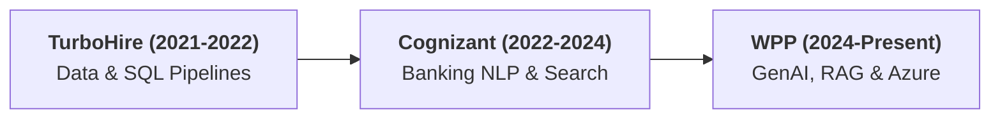

# Rahul Kumar Jha — Simple Background & Interview Speaking Guide

> **Simple • Conversational • Safe from Cross-Questioning**
> 
> The goal of this guide is to give you **easy-to-explain, bulletproof answers** about your background. 
> We have stripped away unnecessary complex jargon so that:
> 1. You feel comfortable and confident speaking naturally.
> 2. Interviewers understand you immediately.
> 3. You don't invite stressful, aggressive technical cross-questioning.

---

## 🧭 Companion Guides
- [README_V2.md](README_V2.md) — 8-Level Easy-Learn GenAI & ML Lead Study Guide
- [interview_explanations.md](interview_explanations.md) — 117 Interview Questions & Answers
- [interview_questions.md](interview_questions.md) — Question Bank
- [README.md](README.md) — Architecture Reference

---

## 🎙️ Section 1: The 60-Second "Tell Me About Yourself" Pitch

Memorize this simple script. It sounds natural, humble, and experienced:

> *"Hi, I'm Rahul. I have about 5 years of experience in software engineering, specializing in Generative AI, NLP, and backend data systems.
> 
> I started my career working on backend data pipelines and SQL databases at **TurboHire**, then moved to **Cognizant** where I spent two and a half years building NLP and GenAI tools for banking clients—mostly helping risk and compliance teams search and summarize complex transaction records.
> 
> Currently, I am a Senior Developer at **WPP**, where I build enterprise RAG systems and AI tools on Azure to help creative and marketing teams check brand compliance across thousands of marketing assets.
> 
> Along the way, I’ve also built a few open-source tools like **Numera**, a local data engine for querying large spreadsheets with natural language, and **Threadmark**, an insurance policy assistant.
> 
> My main strength is taking generative AI models and wrapping them in clean, fast, and secure Python and FastAPI services that solve real business problems."*

---

## 🗺️ Section 2: Your 3-Sentence Career Story (Quick Summary)

If an interviewer asks for a quick summary of your timeline:

1. **TurboHire (2021–2022):** *"I worked on data ingestion, resume parsing, and SQL database tuning for an HR-tech platform."*
2. **Cognizant (2022–2024):** *"I moved into NLP and Generative AI for banking clients, building search systems for transaction logs and compliance policies."*
3. **WPP (2024–Present):** *"I lead development of enterprise RAG search tools and computer vision checks on Azure for marketing compliance."*

---

## 🏢 Section 3: Company-by-Company Guide (Simple & Safe)

---

### 1. WPP Production (Aug 2024 – Present)
**Your Title:** Senior Developer – Agentic Systems & RAG  
**Location:** Gurugram, India  
**What the company does:** The world's largest advertising and marketing production network.

#### What you say you did (In 3 Simple Points):
1. **Brand Compliance Search (RAG):**
   - *The Problem:* Marketing teams had thousands of pages of brand guidelines (fonts, colors, legal rules) in PDFs, and finding the right rule took hours.
   - *What you built:* Built an internal search tool using **Azure OpenAI and Azure AI Search**. Users type a question in plain English, and the tool returns the exact answer with the page link.
   - *Result:* Cut search time by 45%.
2. **Automated Creative Checks:**
   - *What you built:* Combined basic computer vision (**OpenCV**) to check logos and image colors, with an LLM to check if the marketing text has required legal disclaimers.
   - *Result:* Helps the team validate over 10,000 creative assets daily without manual review.
3. **Fast, Reliable Backend APIs:**
   - *What you built:* Packaged everything into clean **FastAPI microservices in Docker** and used prompt caching so common questions return answers faster and cost less.

#### 🎙️ How to speak about WPP in 30 seconds:
> *"At WPP, marketing teams need to ensure every ad and banner strictly follows brand rules and legal guidelines. I built an internal search assistant on Azure that lets managers ask questions about brand guidelines and get immediate answers with page references. I also built a tool pairing OpenCV and GPT-4 to verify that creative assets have the right logos, colors, and legal text before going live."*

#### 🛡️ Safe Answers if they ask follow-ups on WPP:
- **Q: "Why did you use Azure?"**  
  *Safe Answer:* *"WPP already uses Microsoft and Azure across the enterprise, so using Azure OpenAI and Azure AI Search gave us enterprise security, private network endpoints, and single sign-on with company credentials."*
- **Q: "What did OpenCV do vs. the LLM?"**  
  *Safe Answer:* *"OpenCV does the simple, fast visual checks like finding the logo and checking background colors. The LLM does the text checks, like reading the disclaimer text to make sure required legal words are present."*

---

### 2. Cognizant (Feb 2023 – May 2024)
**Your Title:** Generative AI Engineer – LLM Applications & NLP  
**Location:** Bengaluru, India  
**Industry:** Banking & Financial Services

#### What you say you did (In 2 Simple Points):
1. **Transaction Search & Summaries:**
   - *The Problem:* Bank compliance officers had to review massive transaction logs and customer narratives to look for suspicious activities.
   - *What you built:* Built a semantic search and summarization pipeline using Python and vector embeddings so officers could quickly find similar suspicious descriptions.
2. **Preventing Financial Hallucinations:**
   - *What you built:* Ensured that any summary or alert generated by the model was cross-checked against the actual database records so the model never made up numbers or account details.

#### 🎙️ How to speak about Cognizant GenAI in 30 seconds:
> *"At Cognizant, I worked on projects for global banking clients. Compliance teams spent hours manually reading through transaction notes looking for fraud indicators. I built search and summarization tools using Python and vector search to help analysts surface relevant transaction history faster. Crucially, we always verified the model's outputs against SQL database records so the AI never hallucinated numbers."*

#### 🛡️ Safe Answers if they ask follow-ups on Cognizant:
- **Q: "How did you prevent the LLM from making up financial numbers?"**  
  *Safe Answer:* *"We had a strict rule: the LLM is only used to read and summarize the text description. We never allowed the model to calculate or state account balances. Any numbers displayed were pulled directly from the SQL database via standard queries."*

---

### 3. Cognizant (Jan 2022 – Jan 2023)
**Your Title:** Associate AI Developer – NLP & Intelligent Automation  
**Location:** Bengaluru, India

#### What you say you did:
- Built automated text-extraction pipelines in Python and AWS (S3, Lambda, ECS) to convert banking report documents into clean, structured data for risk teams, cutting report generation time by half.

#### 🎙️ How to speak about it:
> *"In my first year at Cognizant, I focused on backend data automation. I wrote Python scripts and AWS Lambda pipelines to extract text from banking PDFs and transaction files, turning messy reports into clean database tables for our analytics teams."*

---

### 4. TurboHire (Jul 2021 – Jan 2022)
**Your Title:** Software Engineer – Data & Platform  
**Location:** Hyderabad, India  
**Industry:** AI Talent Intelligence Platform

#### What you say you did:
- Handled resume parsing pipelines that extracted candidate skills, education, and job history.
- Optimized PostgreSQL database queries and indexes, speeding up candidate searches by 35%.

#### 🎙️ How to speak about TurboHire in 20 seconds:
> *"TurboHire is an AI recruitment platform. I worked on the backend data platform, writing Python parsers to extract skills from resumes and tuning our PostgreSQL database queries so recruiters could search candidates faster."*

---

## 🚀 Section 4: Your 3 Flagship Projects (Simple 2-Sentence Explanations)

When asked: *"Tell me about a project you built outside of work,"* pick one of these. Here is how to explain them without inviting tricky questions:

---

### 1. Numera — Tabular Intelligence Engine
- **What it is:** A tool that lets you ask questions about large spreadsheets (CSV files) in plain English.
- **The Simple Problem:** If you upload a 50,000-row spreadsheet to ChatGPT, it costs a lot of money and often gives wrong math.
- **Your Simple Solution:** Instead of sending the spreadsheet data to the LLM, you use a fast in-memory database called **DuckDB**. The LLM just writes the SQL query, and DuckDB runs it locally in under 20 milliseconds.
- **🎙️ Your 30-Second Speaking Script:**
  > *"I built Numera because LLMs are bad at math and uploading big CSVs to the cloud is slow and expensive. With Numera, the user asks a question in plain English, a local LLM converts it into an SQL query, and DuckDB executes it locally against the spreadsheet in milliseconds. It costs zero API tokens, runs 100% private, and the math is always exact because SQL does the calculation."*
- **🛡️ If they ask: "Why DuckDB?"**
  - *Answer:* *"DuckDB is designed for fast analytics on columnar data like CSVs and runs directly inside Python without needing a database server."*

---

### 2. Threadmark — AI Insurance Policy Assistant
- **What it is:** A search and Q&A assistant for complex insurance policies.
- **The Simple Problem:** Insurance policies have tricky rules, and an AI cannot make up coverage terms.
- **Your Simple Solution:** Used **hybrid search** (combining keyword search with vector search) to find the exact policy clause, and used Python code to calculate deductibles instead of asking the LLM to do the math.
- **🎙️ Your 30-Second Speaking Script:**
  > *"Threadmark is an assistant for insurance policy questions. I built it with hybrid search so it finds exact policy terms using keywords and general questions using vector embeddings. To prevent hallucinations, any claim calculations are handled by Python code, and the tool always shows the exact page and clause it got the answer from."*
- **🛡️ If they ask: "What is hybrid search?"**
  - *Answer:* *"Vector search finds meaning and synonyms, but keyword search finds exact policy numbers or codes. Combining both gives the best accuracy."*

---

### 3. RetailGuard AI — Retail Theft Vision Engine
- **What it is:** A computer vision system that monitors store camera feeds for suspicious theft actions.
- **The Simple Problem:** You cannot send high-resolution video to the cloud because it is too slow. It has to run in real time on the store's camera hardware.
- **Your Simple Solution:** Used **YOLO pose estimation** to track hand and body movements (e.g., reaching for an item and putting it directly into a jacket pocket) running at 30 frames per second.
- **🎙️ Your 30-Second Speaking Script:**
  > *"RetailGuard AI is a computer vision project that monitors video streams in real time. It uses YOLO pose estimation to track body keypoints and detect suspicious actions—like reaching for an item and concealing it in a pocket. Because it runs locally on edge hardware, it processes video smoothly at 30 frames per second without any cloud delay."*
- **🛡️ If they ask: "Why YOLO?"**
  - *Answer:* *"YOLO is the industry standard for fast, real-time object and pose detection with very low latency."*

---

## 🛡️ Section 5: Deflecting Tough Questions Gracefully

Here are clean, sensible answers to questions that usually trip candidates up:

### Q1: "Why did you leave Cognizant to join WPP?"
**Safe Answer:**
> *"At Cognizant, I gained great experience in enterprise banking NLP and financial data. But WPP offered me the chance to lead and architect modern Generative AI and multi-modal systems on Azure from the ground up, working directly on creative and marketing use cases at a very high scale."*

### Q2: "What is your main cloud experience?"
**Safe Answer:**
> *"My primary cloud today is **Azure**—specifically Azure OpenAI, Azure AI Search, Azure Container Apps, and Blob Storage, which I use daily at WPP. Earlier in my career at Cognizant, I also worked with **AWS** services like S3, ECS, and Lambda."*

### Q3: "What do you think is the biggest mistake people make with GenAI?"
**Safe Answer:**
> *"Expecting the LLM to do everything. LLMs are great for understanding questions and writing clear summaries, but they shouldn't be doing database lookups, math calculations, or security checks. Those should always be handled by standard code, databases, and APIs."*

### Q4: "Do you have experience managing or mentoring people?"
**Safe Answer:**
> *"Yes, as a Senior Developer at WPP, I guide junior developers on writing modular Python code, setting up proper unit tests and Pydantic schemas, and moving code cleanly from Jupyter notebooks into Dockerized FastAPI microservices."*

---

## 🎯 Quick 3-Point Mental Checklist Before Your Call

Before your interview starts, take a breath and remember these 3 anchors:
1. **Keep it simple:** Talk about real business problems (saving time, checking documents, preventing errors), not academic theory.
2. **Your tech stack:** Python, FastAPI, Azure OpenAI, Azure AI Search, Docker, SQL.
3. **Your rule of thumb:** *"Use the LLM for language; use code and databases for facts and math."*
