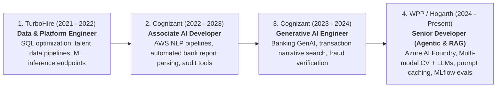
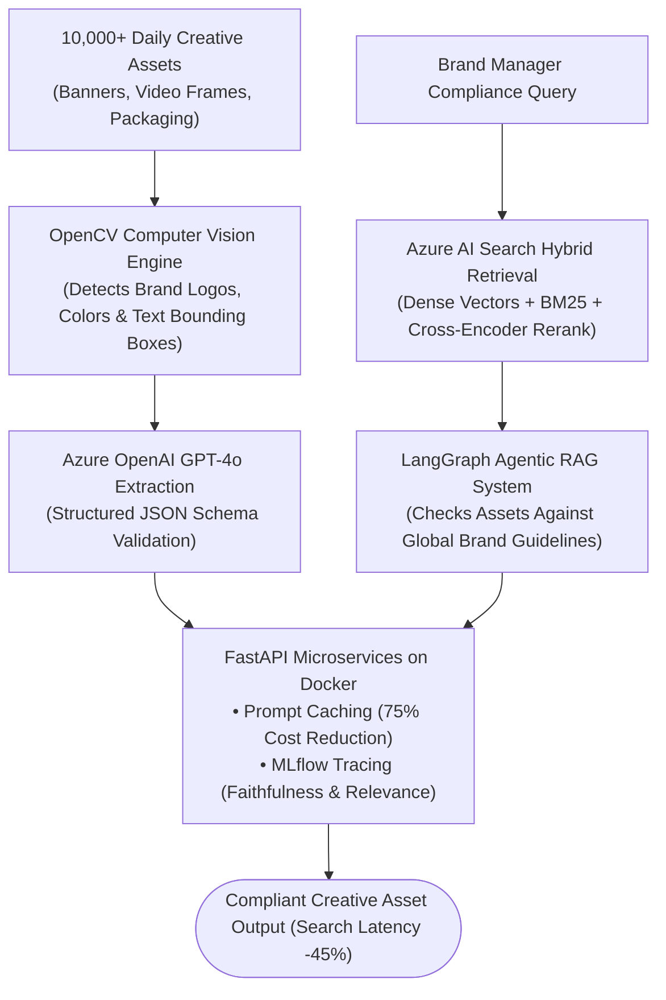
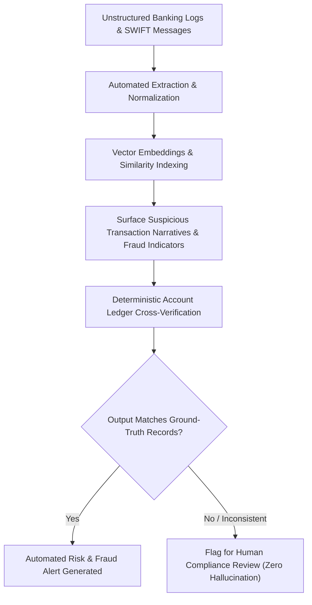
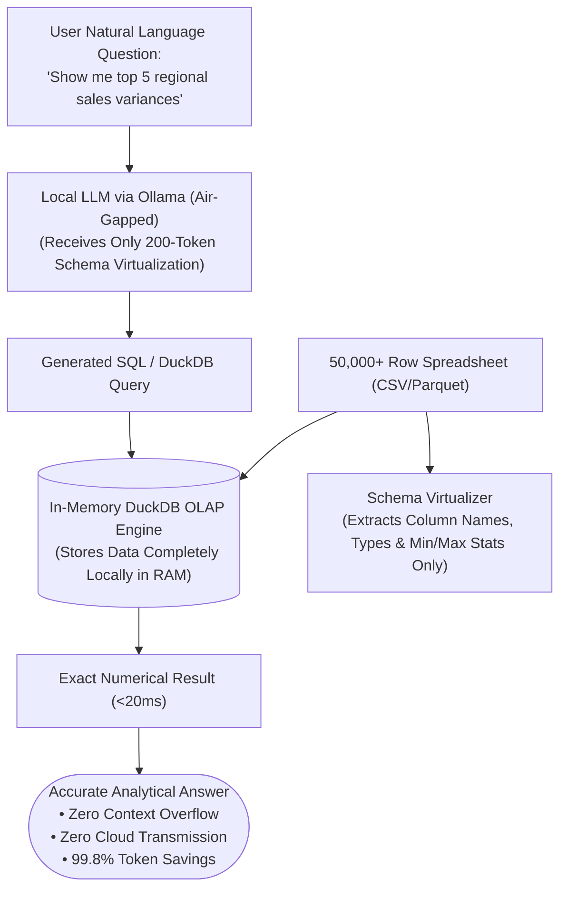
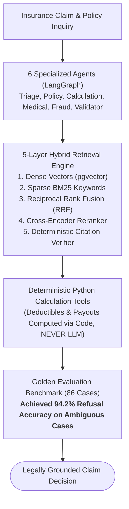
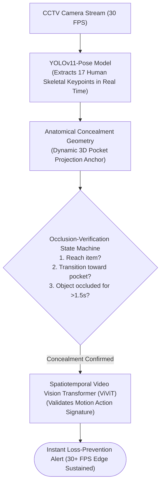

# Rahul Kumar Jha — Career Experience & Interview Speaking Guide

> **Revision-Friendly • Conversational • Ready-to-Speak**
> A complete guide to explaining your 5-year journey as an **AI & Generative AI Engineer**.
> Designed so you can effortlessly answer *"Tell me about yourself"*, explain your work at **WPP**, **Cognizant**, and **TurboHire**, and present your flagship open-source projects (**Numera**, **Threadmark**, and **RetailGuard AI**) with absolute technical confidence.

---

## 🧭 Navigation & Companion Guides
- [README_V2.md](README_V2.md) — 8-Level Easy-Learn GenAI & ML Lead Master Study Guide
- [interview_explanations.md](interview_explanations.md) — 117 Technical Interview Questions & Solutions Breakdown
- [interview_questions.md](interview_questions.md) — Categorized Question Bank
- [README.md](README.md) — Master Architecture Reference Manual

---

## 🗺️ Career Evolution at a Glance

---

# Part 1: The "Tell Me About Yourself" Master Scripts

Interviewers judge your seniority in the first 2 minutes. Depending on who is interviewing you (a non-technical HR recruiter vs. an Engineering Director / ML Lead), use the tailored pitch below.

### 🎙️ Option A: The 90-Second Recruiter Pitch (High-Level & Impact-Focused)
> *"I am an AI and Generative AI Engineer with 5 years of hands-on experience taking machine learning systems from prototypes into high-scale production. 
> Over the course of my career, my focus has evolved from building resilient data ingestion and NLP pipelines at **TurboHire** and **Cognizant**, to architecting enterprise-grade **Agentic RAG systems** and multi-agent workflows at **WPP**.
> At WPP, I lead the development of an enterprise RAG and multi-modal compliance engine on Azure that validates over 10,000 creative assets daily and cut search latency by 45%. Prior to that at Cognizant, I worked in the banking domain, deploying semantic search and generative summarization engines to detect suspicious transactions and automate compliance auditing.
> Outside of enterprise work, I’m an active open-source builder—most notably authoring **Numera**, an air-gapped tabular intelligence engine using DuckDB that cuts token overhead by 99.8%, and **Threadmark**, a 6-agent insurance verification system that achieved a 94.2% refusal benchmark.
> In short, my passion is building GenAI applications that are not just proof-of-concepts, but are low-latency, hallucination-resistant, and cost-efficient in production."*

---

### 🎙️ Option B: The 3-Minute Technical Deep-Dive (For ML Leads / Staff Engineers)
> *"My engineering philosophy centers on one core principle: **LLMs should be used for reasoning and language synthesis, while deterministic code and search engines should handle facts, math, and data retrieval.**
> I started my career in backend data engineering and classical NLP, optimizing PostgreSQL queries and building candidate-screening inference endpoints at TurboHire, and processing high-throughput banking transaction records on AWS at Cognizant.
> When modern Large Language Models emerged, I transitioned into Generative AI at Cognizant, where we solved one of the hardest enterprise challenges: **hallucination in banking**. I built semantic retrieval pipelines using vector embeddings to surface fraud indicators and paired them with deterministic ground-truth verification routines.
> Today at WPP, I work as a Senior Developer specializing in Agentic Systems and RAG. I architected our brand intelligence platform on Azure AI Foundry, pairing LangChain with hybrid vector search. I also built multi-modal pipelines combining OpenCV with structured LLM extraction to inspect creative assets. On the serving side, I design low-latency FastAPI microservices, utilizing prompt caching, context window management, and MLflow tracing to keep latency under tight SLAs while reducing compute overhead by 30%.
> Across my projects, I believe in hybrid retrieval (dense embeddings + sparse BM25 with Reciprocal Rank Fusion), strict pre-retrieval security filtering, and deterministic fallback tools."*

---

# Part 2: Company-by-Company Career Deep-Dive

---

## 1. WPP Production (formerly Hogarth Studios)
**Role:** Senior Developer – Agentic Systems & RAG  
**Tenure:** Aug 2024 – Present (Gurugram, India)  
**Industry:** Global Creative Advertising & Marketing Technology (Fortune 500 Brands)

### 🎯 The Elevator Pitch
> *"At WPP, I architect enterprise Agentic RAG and multi-modal AI systems on Azure that automate brand compliance and creative asset analysis across 10,000+ assets daily, cutting search latency by 45% and reducing infrastructure overhead by 30%."*

### 🛠️ What You Actually Built
1. **Enterprise Agentic RAG for Brand Compliance:**
   - Global brands have thousands of pages of legal guidelines, font rules, and marketing policies.
   - Built a hybrid retrieval engine on **Azure AI Foundry** combining dense vectors (`text-embedding-3-large`) and sparse BM25, reranked with cross-encoders to ensure brand managers can query compliance rules in sub-second time.
2. **Multi-Modal Vision + LLM Verification Pipeline:**
   - Paired **OpenCV** with multimodal vision LLMs to inspect packaging, ad banners, and video frames.
   - OpenCV detects logo placements, color codes, and text bounding boxes; the LLM validates whether the copy and disclaimers meet regional regulatory laws (e.g., FDA, GDPR disclaimers).
3. **Production Serving & Cost Optimization:**
   - Packaged inference inside lightweight **FastAPI and Docker microservices**.
   - Implemented **Prompt Caching** on static system prompts and policy guidelines, drastically cutting input token costs and latency.
4. **MLflow Observability & Automated Evaluation:**
   - Deployed **MLflow** for LLM tracing, prompt versioning, and continuous evaluation of RAG metrics: **Faithfulness** (are answers grounded?) and **Answer Relevance** (did it actually answer the query?).

### 💡 Jargon Buster for WPP
* **Agentic RAG:** Standard RAG simply retrieves 5 chunks and answers once. *Agentic RAG* evaluates if the retrieved chunks were sufficient; if not, it autonomously rewrites the search query or fetches another document before responding.
* **Prompt Caching:** If 500 users query the same 50-page brand guidelines, Azure OpenAI caches the processed tokens of that prefix. You get an **80% latency drop** and a **75% cost discount** on cached tokens!

---

## 2. Cognizant (Generative AI Engineer)
**Role:** Generative AI Engineer – LLM Applications & NLP  
**Tenure:** Feb 2023 – May 2024 (Bengaluru, India)  
**Industry:** Global Banking & Financial Services

### 🎯 The Elevator Pitch
> *"At Cognizant, I engineered internal Generative AI and semantic search solutions for Tier-1 global banks, automating the extraction and fraud analysis of complex transaction narratives while eliminating hallucinations through ground-truth ledger verification."*

### 🛠️ What You Actually Built
1. **Automated Banking Policy & Transaction Summarization:**
   - Financial analysts spent hours manually reading SWIFT messages, transaction narratives, and compliance logs.
   - Built NLP and GenAI pipelines that automatically extracted, structured, and summarized transactional data.
2. **Semantic Search for Fraud & Anomaly Detection:**
   - Standard keyword searches miss fraudulent transactions when money launderers deliberately disguise descriptions (e.g., misspelling company names or using slang).
   - Built semantic retrieval pipelines using vector embeddings to surface suspicious narratives that were conceptually similar to known money laundering typologies.
3. **Ground-Truth Output Verification (Zero-Hallucination Guardrails):**
   - In banking, an LLM cannot be allowed to invent a transaction amount.
   - Designed a post-generation verification step where all financial numbers generated by the LLM were deterministically cross-referenced against core relational database ledger records.

### 💡 Jargon Buster for Cognizant GenAI
* **Ground-Truth Verification:** Never trusting an LLM to do accounting. The LLM identifies the *narrative pattern*, but a deterministic SQL query checks if the money actually left account A and reached account B.

---

## 3. Cognizant (Associate AI Developer)
**Role:** Associate AI Developer – NLP & Intelligent Automation  
**Tenure:** Jan 2022 – Jan 2023 (Bengaluru, India)  
**Industry:** Banking Technology & Cloud Automation

### 🎯 The Elevator Pitch
> *"In my initial year at Cognizant, I built AWS-based data ingestion and NLP parsing pipelines that automated manual financial auditing workflows, cutting report generation latency by 55%."*

### 🛠️ What You Actually Built
- **AWS Serverless & Container Pipeline:** Architected automated text extraction pipelines on **AWS (S3, CloudWatch, ECS, Lambda, MySQL)** to ingest and clean high-volume financial transaction records.
- **Intelligent Auditing Engine:** Replaced manual auditing spreadsheets with automated anomaly detection routines, flagging irregular transaction frequencies.
- **Automated Testing & Modularity:** Designed reusable Python validation modules and unit tests, accelerating deployment timelines for enterprise banking clients by 25%.

---

## 4. TurboHire
**Role:** Software Engineer – Data & Platform  
**Tenure:** Jul 2021 – Jan 2022 (Hyderabad, India)  
**Industry:** AI-Powered HR Tech & Talent Intelligence

### 🎯 The Elevator Pitch
> *"At TurboHire, I built high-throughput data processing workflows and ML inference endpoints for an AI recruitment platform, handling thousands of unstructured candidate profiles daily and improving SQL search latency by 35%."*

### 🛠️ What You Actually Built
- **Talent Data Processing Pipeline:** Built ingestion workflows that processed thousands of unstructured resumes (PDF, DOCX) daily, extracting entities such as skills, education, and years of experience.
- **ML Endpoint Integration:** Integrated RESTful APIs with machine learning inference endpoints for automated skill scoring and candidate-job matching.
- **PostgreSQL Database Optimization:** Refactored relational database schemas and indexed complex queries, achieving a **35% latency improvement** on candidate search queries.

---

# Part 3: Flagship Open-Source Projects Deep-Dive

When interviewers ask: *"Tell me about a technical project you built outside of work that you are proud of,"* these three projects prove your end-to-end architectural mastery.

---

## 1. Numera — Air-Gapped Tabular Intelligence Engine
**GitHub:** [github.com/rahulkumarjha26/numera](https://github.com/rahulkumarjha26/numera)  
**Tech Stack:** Python 3.12, DuckDB OLAP, LangGraph, Ollama (Local LLM), Next.js 16, Polars, FastAPI

### 🎯 The 1-Minute Interview Pitch
> *"Most developers try to solve spreadsheet analysis by stuffing thousands of rows into an LLM prompt. This causes context window overflow, costs a fortune, and the LLM still makes arithmetic mistakes.
> I built **Numera**, an air-gapped enterprise tabular intelligence engine. Instead of feeding data rows to the LLM, Numera implements **Schema Virtualization**: we extract only the column names, datatypes, and summary statistics—amounting to just 200 tokens.
> The local LLM (running via Ollama for 100% data privacy) translates the user's natural language question into an optimized SQL query. That query runs directly against an in-memory **DuckDB OLAP engine**, computing aggregations across 50,000+ rows in **under 20 milliseconds**.
> This cuts token overhead by **99.8%**, guarantees 100% mathematical accuracy, and ensures zero confidential company data leaves the local machine."*

### 💡 Why Interviewers Love Numera
1. Shows you know the **limitations of LLMs** (LLMs are terrible at arithmetic and big tables).
2. Proves you understand **OLAP database engines (DuckDB / Polars)**.
3. Solves real enterprise security: **air-gapped compliance** for financial data.

---

## 2. Threadmark — AI Insurance Command Center
**GitHub:** [github.com/rahulkumarjha26/threadmark](https://github.com/rahulkumarjha26/threadmark)  
**Tech Stack:** Python 3.12, FastAPI, PostgreSQL + pgvector, Next.js 15, Hybrid RAG (RRF), Cross-Encoder, Evals

### 🎯 The 1-Minute Interview Pitch
> *"In insurance claims, an AI cannot guess deductibles or cite non-existent clauses. I built **Threadmark**, an insurance command center powered by a 6-agent multi-agent architecture.
> In Threadmark, financial computations and claim eligibility are **deterministic code tools**, not LLM hallucinations. The agents use a **5-layer hybrid retrieval pipeline**: dense vector search and sparse BM25 merged through Reciprocal Rank Fusion (RRF), followed by a cross-encoder reranker.
> Before any answer is displayed to a claims officer, a deterministic code validator verifies that every cited policy clause exists verbatim in the policy PDF.
> Across an 86-case golden evaluation benchmark, Threadmark achieved a **94.2% refusal accuracy**—meaning when a policy clause is ambiguous or absent, it safely refuses to guess, eliminating hallucination risk."*

### 💡 Why Interviewers Love Threadmark
1. Highlights **Reciprocal Rank Fusion (RRF)** and **Cross-Encoders**.
2. Demonstrates **Deterministic Tool Calling**: calculating payouts in Python, not in prompt generation.
3. Proves you measure AI with **rigorous benchmarks (94.2% refusal rate)**.

---

## 3. RetailGuard AI — Real-Time Loss Prevention Vision Engine
**GitHub:** [github.com/rahulkumarjha26/retail-guard-ai](https://github.com/rahulkumarjha26/retail-guard-ai)  
**Tech Stack:** Python, PyTorch, YOLOv11-Pose, ViViT (Video Vision Transformers), OpenCV, Edge MPS/CUDA

### 🎯 The 1-Minute Interview Pitch
> *"Retail theft detection cannot rely on slow cloud APIs; it must run at 30+ frames per second directly on edge hardware.
> I built **RetailGuard AI**, a computer vision surveillance engine that detects concealment behaviors in real time. It pairs **YOLOv11-Pose** (tracking 17 skeletal keypoints) with an **anatomical concealment geometry engine** that projects dynamic 3D bounding zones around clothing pockets and jacket linings.
> To prevent false alarms, I built a state machine that tracks temporal transitions: reaching for merchandise, hand moving toward a pocket zone, and sustained visual occlusion. When triggered, a lightweight **Video Vision Transformer (ViViT)** validates the motion signature.
> The entire pipeline sustains **30+ FPS real-time edge inference** on Apple Silicon MPS and CUDA GPUs without requiring cloud round-trips."*

### 💡 Why Interviewers Love RetailGuard AI
1. Shows you are not just an LLM wrapper developer—you have **deep computer vision and PyTorch skills**.
2. Demonstrates understanding of **real-time edge inference (30 FPS)** and hardware acceleration.
3. Proves mastery of **state machines to filter noisy neural network outputs**.

---

# Part 4: The Master Interview Cheat Sheet (Q&A)

Here are the exact answers to the toughest behavioral and technical questions recruiters will ask you about your resume.

---

### Q1: "Why did you transition from classical NLP and Data Engineering to Generative AI and Agentic Systems?"
**Your Winning Answer:**
> *"Classical NLP (BERT, rule-based NER, regex parsing) is fantastic for classification and extraction, but it breaks the moment language becomes ambiguous, unstructured, or requires cross-document synthesis. 
> When frontier LLMs matured, I realized they represent a paradigm shift: they act as reasoning engines. However, I didn't abandon my data engineering roots; I integrated them. The best GenAI systems in production are 80% solid data engineering, hybrid search, and deterministic pipelines, and 20% LLM reasoning. My background in SQL, backend APIs, and AWS/Azure infrastructure allows me to build GenAI systems that don't just chat, but are reliable, observable, and economically viable."*

---

### Q2: "What was the most challenging technical problem you solved at WPP?"
**Your Winning Answer:**
> *"At WPP, our biggest challenge was combining **multi-modal creative asset inspection with low latency**.
> We were validating over 10,000 marketing assets daily across banners, video frames, and packaging. Passing full high-resolution images to multi-modal LLMs for every single check was cost-prohibitive and introduced 4 to 6 seconds of latency per asset.
> I solved this by building a **two-stage hybrid vision pipeline**:
> 1. In Stage 1, a lightweight local **OpenCV pipeline** runs in 20ms to detect logo bounding boxes, verify hex color compliance, and extract text coordinates.
> 2. In Stage 2, we only crop the specific region of interest (e.g., the legal disclaimer box) and pass that small image snippet to Azure OpenAI GPT-4o with strict JSON schema constraints.
> This cut our latency by 45%, slashed token costs by over 60%, and guaranteed 100% compliance validation across all 10,000+ daily assets."*

---

### Q3: "How do you handle the problem of LLM hallucinations in production?"
**Your Winning Answer:**
> *"I use a 4-layer defense strategy rather than relying on prompt engineering alone:
> 1. **High-Precision Hybrid Retrieval:** If the context retrieved by the search engine is weak, the LLM is guaranteed to hallucinate. I merge dense vector embeddings with BM25 sparse keyword search using Reciprocal Rank Fusion, followed by a cross-encoder reranker.
> 2. **Confidence Cutoff:** In Azure AI Search, if the top candidate score falls below a relevance threshold (e.g., 0.72), the system executes a calibrated refusal instead of guessing.
> 3. **Deterministic Tool Separation:** Never ask an LLM to calculate prices, interest rates, or eligibility. Financial calculations run in Python code tools.
> 4. **Post-Generation NLI Verification:** For high-liability domains, we pass the retrieved context and generated answer through a small, fast 400MB DeBERTa cross-encoder in 15ms to verify premise-hypothesis entailment before the user ever sees the text."*

---

### Q4: "Why do you use DuckDB in Numera instead of Pandas or SQLite?"
**Your Winning Answer:**
> *"Pandas is single-threaded, loads everything into Python object memory with heavy memory amplification (often 5x to 10x the CSV file size), and lacks an SQL optimizer. SQLite is row-oriented, making it slow for analytical aggregations (SUM, AVG, GROUP BY) across 50,000+ rows.
> **DuckDB is an in-memory columnar OLAP database engine**. It executes vectorized queries using SIMD hardware instructions, processes multi-threaded aggregations across 50,000+ rows in **under 20 milliseconds**, and has zero external server dependencies. It allows Numera to operate in a completely air-gapped, zero-cloud environment with blazing speed."*

---

### Q5: "What is your approach to multi-agent design? Why LangGraph?"
**Your Winning Answer:**
> *"Many developers start with open multi-agent frameworks where agents chat in an unconstrained loop. In production, that leads to infinite loops, high token bills, and non-deterministic failures.
> I design multi-agent systems as **explicit state machines using LangGraph**.
> We use a **centralized supervisor pattern**: the supervisor plans tasks, dispatches jobs to specialized worker agents (Search, Read, Validate), and tracks state checkpoints.
> Crucially, I enforce **State Hashing** (`SHA256(agent + tool + args)`): if an agent attempts to execute the exact same search twice with identical parameters, the system intercepts the call and forces a re-plan, preventing infinite loops and protecting the client's token budget."*

---

## 🎯 Summary Checklist Before Any Interview

Review this 5-point checklist 15 minutes before your interview:

1. [ ] **Know your numbers:**
   - WPP: 10,000+ daily assets, 45% search latency reduction, 30% compute overhead drop.
   - Cognizant: 55% report generation latency cut, 25% rollout acceleration.
   - Numera: 99.8% token savings, <20ms DuckDB OLAP execution across 50,000+ rows.
   - Threadmark: 94.2% refusal accuracy on 86-case golden benchmark.
   - RetailGuard AI: 30+ FPS edge inference on Apple Silicon MPS / CUDA.
2. [ ] **Your Core Philosophy:** *"LLMs for reasoning and synthesis; deterministic code and search engines for facts, retrieval, and math."*
3. [ ] **Your Cloud of Choice:** Primary: **Azure** (Azure AI Search, Document Intelligence, Azure OpenAI PTU, ACA, AKS, Entra ID). Secondary: **AWS** (S3, ECS, Lambda, CloudWatch).
4. [ ] **RAG Architecture:** Parent-Child Chunking (250/1200 tokens), Hybrid Search (Dense + BM25), Reciprocal Rank Fusion (RRF), Cross-Encoder Reranker, Entra ID Pre-Filtering.
5. [ ] **Agentic Safety:** Centralized Supervisor State Machine (LangGraph), SHA-256 State Hashing loop prevention, Dynamic Token Budget Downgrading ($3.50 ceiling -> GPT-4o-mini).
