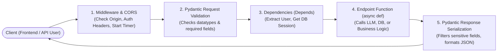

# FastAPI Master Guide: Core Concepts & Interview Q&A

> **Simple • Practical • Interview-Focused**
> Everything an AI/GenAI engineer needs to know about **FastAPI** to clear technical interviews with 100% confidence.
> Stripped of academic fluff; packed with clear explanations, simple code snippets, and direct answers to the top interview questions.

---

## 🧭 Companion Guides
- [ML_CORE_CONCEPTS.md](ML_CORE_CONCEPTS.md) — 🧠 Machine Learning Core Concepts & Top 10 Interview Q&A
- [EXPERIENCE_AND_BACKGROUND.md](EXPERIENCE_AND_BACKGROUND.md) — 🎙️ Rahul's Interview Speaking Guide (WPP, Cognizant, Projects)
- [README_V2.md](README_V2.md) — 8-Level Easy-Learn GenAI & ML Lead Study Guide
- [interview_explanations.md](interview_explanations.md) — 117 Question & Answer Breakdown
- [interview_questions.md](interview_questions.md) — Raw Question Bank

---

## 🗺️ How a Request Flows Through FastAPI



---

# Part 1: The 8 Core Concepts Every Engineer Must Know

---

### 1. What is FastAPI & Why is it Preferred Over Flask / Django?
* **In Simple Words:** FastAPI is a modern, high-performance web framework for building APIs in Python 3.8+.
* **The 4 Key Advantages:**
  1. **Speed:** Runs on **ASGI (Asynchronous Server Gateway Interface)** via Uvicorn, making it as fast as NodeJS and Go.
  2. **Automatic Data Validation:** Uses **Pydantic** to validate incoming JSON payloads automatically. If a user sends a string instead of an integer, FastAPI returns a clean `422 Unprocessable Entity` error automatically.
  3. **Auto-Generated Interactive Documentation:** Automatically creates interactive Swagger UI docs at `/docs` and ReDoc at `/redoc` with zero extra code.
  4. **Native Async Support:** Built from the ground up for `async` and `await`, which is ideal for AI applications waiting on OpenAI API calls or database responses.
* **When to choose what:**
  - **FastAPI:** Best for microservices, REST APIs, and AI/LLM model serving.
  - **Flask:** Good for simple, small legacy projects, but lacks native async and automatic validation.
  - **Django:** Best for full-stack monolithic web apps that need a built-in admin panel, ORM, and user authentication system out-of-the-box.

---

### 2. The #1 Interview Question: `async def` vs. `sync def`
*This is asked in 9 out of 10 FastAPI interviews!*

```python
# 1. ASYNC DEF: Use for I/O-bound operations (Waiting on external services)
@app.post("/ask-llm")
async def ask_llm(query: str):
    # 'await' lets the server handle 500 other users while waiting for Azure OpenAI!
    response = await openai_client.chat.completions.create(...)
    return response

# 2. NORMAL DEF: Use for CPU-bound operations (Heavy in-memory computation)
@app.post("/process-image")
def process_image(image_bytes: bytes):
    # Heavy image matrix manipulation in OpenCV
    result = cv2.GaussianBlur(image_bytes, (5, 5), 0)
    return {"status": "done"}
```

* **The Core Rule:**
  - **Use `async def`** when your code **waits** for external things (calling Azure OpenAI API, querying a database, reading a file from S3).
  - **Use normal `def`** when your code does **heavy CPU work** (image processing in OpenCV, calculating vectors in NumPy/Pandas).
* **The Magic Behind Normal `def` in FastAPI:**
  - If you define an endpoint with normal `def`, **FastAPI automatically runs it inside an external background threadpool**. This prevents your heavy function from freezing the main event loop!
* **The Fatal Production Mistake to Mention in Interviews:**
  - *"If you write a blocking, synchronous function inside `async def` (like `time.sleep(5)` or standard `requests.get()`), you **freeze the entire event loop**, and no other user can get a response until that function finishes!"*

---

### 3. Pydantic Validation & Data Modeling
FastAPI uses Pydantic to ensure all incoming and outgoing data conforms to strict data types.

```python
from pydantic import BaseModel, Field
from typing import Optional

class ChatRequest(BaseModel):
    query: str = Field(..., min_length=3, max_length=500, description="The user prompt")
    temperature: float = Field(default=0.7, ge=0.0, le=2.0)
    user_id: Optional[str] = None

class ChatResponse(BaseModel):
    answer: str
    tokens_used: int

@app.post("/chat", response_model=ChatResponse)
async def chat_endpoint(request: ChatRequest):
    # 'request' is automatically parsed and validated!
    # If query is missing or temperature is 3.5, FastAPI rejects it before your code runs.
    return ChatResponse(answer="Processed query", tokens_used=42)
```

* **Why this matters in interviews:**
  - **Security:** Prevents malformed payloads and injection attacks.
  - **Documentation:** The Pydantic model automatically generates the schema and examples in Swagger `/docs`.
  - **`response_model`:** Guarantees that internal secret fields (like passwords or database IDs) are stripped out before sending JSON back to the client.

---

### 4. Dependency Injection (`Depends`)
* **What is it?** A way to declare shared logic that an endpoint needs before running.
* **Real-World Analogy:** A security guard at a building door checking your badge and handing you your office keys before you enter your desk.

```python
from fastapi import Depends, HTTPException, Header

# Reusable dependency function
async def verify_api_key(x_api_key: str = Header(...)):
    if x_api_key != "secret-enterprise-key":
        raise HTTPException(status_code=401, detail="Invalid API Key")
    return x_api_key

# Endpoints declare what they depend on:
@app.get("/confidential-data")
async def get_data(api_key: str = Depends(verify_api_key)):
    return {"data": "Protected internal bank policies"}
```

* **Top 3 Use Cases for `Depends`:**
  1. **Authentication & Security:** Checking JWT tokens or API keys.
  2. **Database Sessions:** Opening a SQL/Redis connection at the start of a request and automatically closing it when the request finishes.
  3. **Shared Services:** Injecting an initialized Azure OpenAI client or rate limiter.

---

### 5. Streaming LLM Responses (Server-Sent Events / SSE)
*Crucial for GenAI and RAG interviews!*

```python
from fastapi.responses import StreamingResponse
import asyncio

async def generate_llm_stream(prompt: str):
    # Simulating Azure OpenAI streaming chunks
    for word in ["This", "is", "a", "streaming", "LLM", "response."]:
        yield f"data: {word} \n\n"
        await asyncio.sleep(0.1)

@app.get("/stream-chat")
async def stream_chat(prompt: str):
    return StreamingResponse(generate_llm_stream(prompt), media_type="text/event-stream")
```

* **Why Interviewers Ask This:**
  - If you generate 500 words with GPT-4, waiting for the whole response takes 4 seconds (poor user experience).
  - Using `StreamingResponse` with `media_type="text/event-stream"`, the user sees the first token in **<300ms (Time-To-First-Token)**.

---

### 6. Background Tasks (`BackgroundTasks`)
* **What is it?** A way to trigger a task to run **after** the HTTP response has already been sent to the user.

```python
from fastapi import BackgroundTasks

def log_audit_to_database(query: str, user_id: str):
    # Save search query into database for compliance auditing (takes 200ms)
    db.save(query, user_id)

@app.post("/search")
async def search(query: str, background_tasks: BackgroundTasks):
    results = perform_fast_search(query)
    
    # Schedule the slow database logging task to run in the background
    background_tasks.add_task(log_audit_to_database, query, "user-123")
    
    # User gets results immediately without waiting for the database log!
    return {"results": results}
```

* **Interview Trap:** *"When should you use FastAPI `BackgroundTasks` vs. Celery?"*
  - **Use FastAPI `BackgroundTasks`:** For light, in-process tasks (sending a welcome email, writing an audit log). If the server restarts, unfinished tasks are lost.
  - **Use Celery + Redis:** For heavy, mission-critical tasks (training a model, video rendering, tasks that must survive a server crash and need automatic retries).

---

### 7. Middleware & CORS
* **What is Middleware?** Code that intercepts every single incoming request *before* it hits an endpoint, and every outgoing response *before* it leaves the server.
* **CORS (Cross-Origin Resource Sharing):** Allows a React/Next.js frontend running on `http://localhost:3000` to talk to your FastAPI backend on `http://localhost:8000`.

```python
from fastapi.middleware.cors import CORSMiddleware
import time

# 1. Enable CORS for frontend clients
app.add_middleware(
    CORSMiddleware,
    allow_origins=["https://mycompany.com", "http://localhost:3000"],
    allow_credentials=True,
    allow_methods=["*"],
    allow_headers=["*"],
)

# 2. Custom Timing Middleware: Logs how long each request took
@app.middleware("http")
async def add_process_time_header(request, call_next):
    start_time = time.time()
    response = await call_next(request)
    process_time = time.time() - start_time
    response.headers["X-Process-Time"] = f"{process_time:.4f}s"
    return response
```

---

### 8. Lifespan Events (Startup & Shutdown)
* Modern FastAPI uses the **`lifespan`** context manager to load heavy machine learning models or connect to databases once when the server starts, and cleanly close them when the server stops.

```python
from contextlib import asynccontextmanager

ml_models = {}

@asynccontextmanager
async def lifespan(app: FastAPI):
    # STARTUP: Load heavy model into GPU memory once
    print("Loading embedding model into VRAM...")
    ml_models["embedder"] = load_heavy_model()
    yield
    # SHUTDOWN: Clean up GPU memory and close database connections
    print("Closing model resources...")
    ml_models.clear()

app = FastAPI(lifespan=lifespan)
```

---

# Part 2: Top 10 FastAPI Interview Questions & Winning Answers

---

### Q1: "What is ASGI, and how does it differ from WSGI?"
**Your Winning Answer:**
> *"WSGI (used by Django and Flask) is synchronous. It handles requests in a one-request-per-worker thread model; if an API call takes 3 seconds waiting on an external database, that worker thread is completely blocked. 
> ASGI (Asynchronous Server Gateway Interface, used by FastAPI and Uvicorn) natively supports `async` and `await`. A single worker can handle thousands of concurrent requests by switching to other tasks while waiting on I/O operations."*

---

### Q2: "What is Uvicorn, and why do we need it with FastAPI?"
**Your Winning Answer:**
> *"FastAPI is the web framework that defines your routes, validation, and logic. But FastAPI cannot listen on a network socket directly. 
> **Uvicorn is the lightning-fast ASGI web server** that actually binds to the network port, listens for incoming HTTP requests, and passes them to FastAPI to handle."*

---

### Q3: "How do you run FastAPI in a production Docker container?"
**Your Winning Answer:**
> *"In production, we package FastAPI inside a Docker container using a multi-stage build. We run it with Uvicorn or Gunicorn with Uvicorn workers. 
> The standard entrypoint command is:
> `uvicorn main:app --host 0.0.0.0 --port 8000 --workers 4`
> A good rule of thumb is setting the number of workers to `(2 x CPU cores) + 1` to maximize throughput across available processor cores."*

---

### Q4: "What happens if a user sends invalid data to a FastAPI endpoint?"
**Your Winning Answer:**
> *"FastAPI automatically intercepts the request via Pydantic before our route function ever runs. It returns an `HTTP 422 Unprocessable Entity` response with a structured JSON error body highlighting the exact field that failed, what was received, and what was expected. We don't need to write manual validation boilerplate."*

---

### Q5: "How does FastAPI handle file uploads (e.g., PDFs for RAG)?"
**Your Winning Answer:**
> *"FastAPI provides two ways: `UploadFile` and `bytes`. 
> We always use **`UploadFile`** for documents and PDFs because it uses a temporary file on disk (spooled file). Unlike raw `bytes` which loads the entire file into memory at once, `UploadFile` prevents memory overflow when users upload large 50MB PDFs."*

```python
from fastapi import UploadFile, File

@app.post("/upload-pdf")
async def upload_pdf(file: UploadFile = File(...)):
    contents = await file.read()
    return {"filename": file.filename, "size_bytes": len(contents)}
```

---

### Q6: "How do you handle errors and custom error responses in FastAPI?"
**Your Winning Answer:**
> *"We raise FastAPI's built-in `HTTPException` with an appropriate HTTP status code (like 404 for not found, or 401 for unauthorized). 
> For enterprise APIs, we also define custom exception handlers using `@app.exception_handler` to catch global errors and return a standardized JSON error format across all endpoints."*

```python
from fastapi import HTTPException

@app.get("/document/{doc_id}")
async def get_doc(doc_id: str):
    doc = database.find(doc_id)
    if not doc:
        raise HTTPException(status_code=404, detail=f"Document {doc_id} not found")
    return doc
```

---

### Q7: "How do you implement API authentication in FastAPI?"
**Your Winning Answer:**
> *"We use FastAPI's `Depends` system with security utilities like `OAuth2PasswordBearer` or HTTP Bearer tokens. 
> The dependency extracts the JWT token from the `Authorization: Bearer <token>` header, decodes and verifies the cryptographic signature, checks user permissions, and passes the authenticated user object directly into the route function. If the token is invalid, it raises an HTTP 401 error automatically."*

---

### Q8: "Can you run long-running AI tasks directly inside a FastAPI route?"
**Your Winning Answer:**
> *"No, you should never run long multi-minute tasks (like fine-tuning a model or batch embedding 10,000 files) inside an HTTP request, because the client connection will time out (HTTP 504).
> Instead, the FastAPI endpoint immediately returns an `HTTP 202 Accepted` response with a `job_id`. The heavy task is pushed to an asynchronous task queue like **Celery with Redis** or an Azure Service Bus queue, and the client polls a `/status/{job_id}` endpoint to check progress."*

---

### Q9: "How do you optimize FastAPI latency for LLM serving?"
**Your Winning Answer:**
> *"Three key production techniques:
> 1. **Streaming with Server-Sent Events (`StreamingResponse`):** Delivers the first token to the user in <300ms.
> 2. **Async HTTP Clients (`httpx.AsyncClient`):** Using an async client rather than synchronous `requests` ensures the server can handle other requests while waiting for OpenAI API calls.
> 3. **Prompt and Embedding Caching:** Storing common query results and embeddings in an in-memory Redis cache to bypass model inference completely for repeated queries."*

---

### Q10: "How do you test FastAPI endpoints?"
**Your Winning Answer:**
> *"FastAPI integrates seamlessly with `pytest` using Starlette's **`TestClient`** (which is built on `httpx`). It allows you to send simulated HTTP GET, POST, and PUT requests to your app without needing to start a live network server."*

```python
from fastapi.testclient import TestClient
from main import app

client = TestClient(app)

def test_read_root():
    response = client.get("/health")
    assert response.status_code == 200
    assert response.json() == {"status": "healthy"}
```

---

## 🎯 3-Point Summary to Remember for Your Interview

1. **Async for I/O, Sync for CPU:** Use `async def` when calling APIs or databases; use normal `def` for heavy in-memory math or image processing.
2. **Pydantic handles the data:** It validates types, parses JSON, and generates the OpenAPI documentation automatically.
3. **`Depends` handles the plumbing:** Use it for database connections, authentication, and shared service injection.
