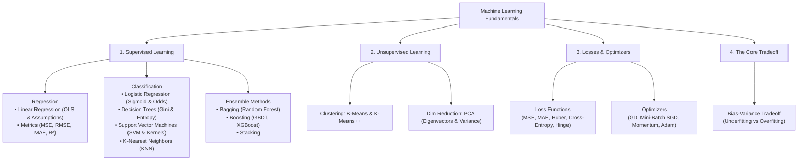
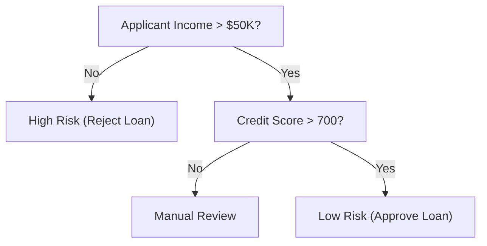
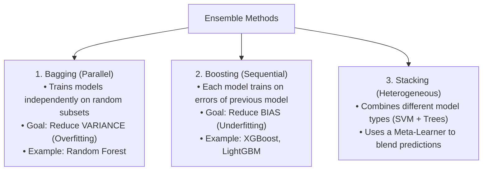
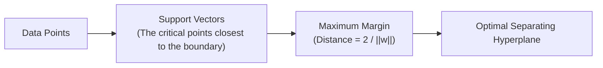
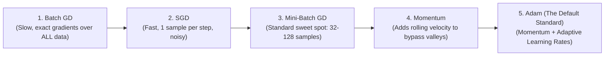

# Machine Learning Core Concepts & Interview Master Guide

> **Simple • Intuitive • Interview-Focused • Math Made Clear**
> 
> Everything you need to master classical and applied machine learning concepts for technical interviews.
> Stripped of dry academic theory; packed with plain-English explanations, real-world analogies, clean formulas, and direct answers to the exact questions interviewers ask.

---

## 🧭 Companion Guides
- [EXPERIENCE_AND_BACKGROUND.md](EXPERIENCE_AND_BACKGROUND.md) — 🎙️ Rahul's Interview Speaking Guide (WPP, Cognizant, Projects)
- [FASTAPI_MASTER_GUIDE.md](FASTAPI_MASTER_GUIDE.md) — ⚡ FastAPI Concepts & Serving Architecture
- [README_V2.md](README_V2.md) — 8-Level Easy-Learn GenAI & ML Lead Study Guide
- [interview_explanations.md](interview_explanations.md) — 117 Interview Questions & Answers
- [interview_questions.md](interview_questions.md) — Raw Question Bank

---

## 🗺️ Visual Concept Map



---

# Section 1: The Bias-Variance Tradeoff (The #1 ML Concept)

### 🎯 The 10-Second Concept Hook
Every machine learning model makes errors. The total error comes from two opposing forces: **Bias** (being too simple and missing the pattern) and **Variance** (being too sensitive and memorizing the noise).

### 💡 The Archery Target Analogy
Imagine shooting arrows at a bullseye:
* **High Bias, Low Variance (Underfitting):** All arrows hit tightly together, but far off in the top-right corner. The bow is consistently aiming at the wrong spot.
* **Low Bias, High Variance (Overfitting):** Arrows are scattered all across the board. On average they center around the target, but they are wildly unstable and inconsistent.
* **High Bias, High Variance (Worst Case):** Arrows are both scattered and far from the bullseye.
* **Low Bias, Low Variance (The Sweet Spot):** All arrows hit tightly inside the bullseye.

### ⚙️ The Mathematical Breakdown
```text
Total Error = (Bias)^2 + Variance + Irreducible Error

• Bias: Error from incorrect model assumptions (e.g., trying to fit a curved relationship with a straight line).
• Variance: Error from sensitivity to small fluctuations in training data (fitting noise instead of signal).
• Irreducible Error: Random noise inherent in the data collection itself (cannot be removed by any model).
```

### 🛠️ How to Fix Each in Production (Interview Cheat Sheet)

| Problem | Symptoms | What It Means | How to Fix It in Code / Data |
| :--- | :--- | :--- | :--- |
| **High Bias (Underfitting)** | High training error & High validation error | Model is too simple; cannot capture underlying trends. | 1. Add more features or polynomial terms.<br/>2. Use a more complex model (e.g., Tree/Ensemble instead of Linear).<br/>3. Decrease regularization penalty (reduce L1/L2 $\lambda$). |
| **High Variance (Overfitting)** | Very low training error, but High validation error | Model memorized training noise; fails on unseen data. | 1. Collect more training data.<br/>2. Feature selection (remove noisy/redundant columns).<br/>3. Add regularization (L1 Lasso, L2 Ridge).<br/>4. Prune decision trees (`max_depth`).<br/>5. Use bagging ensembles (Random Forest). |

---

# Section 2: Linear Regression

### 🎯 The 10-Second Concept Hook
Finds the single best-fitting straight line (or hyperplane) through data points by minimizing the squared vertical distance between predicted values and actual values.

```text
Linear Model Equation:
y = w1*x1 + w2*x2 + ... + wn*xn + b   (or y = wX + b)

Loss Function (Mean Squared Error):
MSE = (1 / N) * sum( (y_actual - y_predicted)^2 )
```

### 💡 How Weights are Found: OLS vs. Gradient Descent
1. **Ordinary Least Squares (OLS):** An exact closed-form analytical mathematical formula:
   ```text
   w = (X^T * X)^(-1) * X^T * y
   ```
   - *Advantage:* Gives the exact mathematical minimum in one step.
   - *Limitation:* Computing matrix inverse `(X^T * X)^(-1)` takes $O(d^3)$ time. If you have 100,000 features, inverting the matrix crashes memory!
2. **Gradient Descent:** An iterative optimizer. Takes small steps in the direction of steepest descent. Scales efficiently to millions of rows and features.

### ⚠️ The 5 Core Assumptions of Linear Regression (Remember: L.I.N.E.)
Interviewers *love* asking: *"What are the assumptions of linear regression?"*
1. **L — Linearity:** The relationship between features $X$ and target $y$ is linear.
2. **I — Independence:** Observations and residual errors are independent (no autocorrelation, common in time-series).
3. **N — Normality:** Residual errors are normally distributed around zero.
4. **E — Equal Variance (Homoscedasticity):** The variance of residual errors is constant across all values of $X$. (If residuals fan out like a cone, it is *Heteroscedasticity*).
5. **No Multicollinearity:** Independent features $X$ should not be strongly correlated with each other. (Checked using **VIF — Variance Inflation Factor**; VIF > 5 indicates problematic collinearity).

### 📊 Evaluation Metrics: MAE vs. MSE vs. RMSE vs. R²
* **MAE (Mean Absolute Error):** Average of absolute errors $|y - \hat{y}|$. *Intuitive, same units as target, robust to outliers.*
* **MSE (Mean Squared Error):** Average of squared errors $(y - \hat{y})^2$. *Penalizes large errors heavily; useful when large mistakes are disastrous.*
* **RMSE (Root Mean Squared Error):** $\sqrt{\text{MSE}}$. *Penalizes large errors like MSE, but brings units back to original scale (e.g., dollars).*
* **R² (Coefficient of Determination):** Percentage of variance in $y$ explained by the model (0 to 1). $R^2 = 1 - \frac{\text{SS}_{\text{res}}}{\text{SS}_{\text{tot}}}$.
* **Adjusted R²:** Adds a penalty for every extra feature added to prevent artificially inflating $R^2$ with useless columns.

---

# Section 3: Logistic Regression

### 🎯 The 10-Second Concept Hook
Despite its name, Logistic Regression is a **classification algorithm**, not a regression algorithm. It estimates the probability that an input belongs to a particular class (e.g., Spam vs. Not Spam).

### 💡 The Core Mechanism: Odds, Log-Odds & Sigmoid
Linear regression outputs values from $-\infty$ to $+\infty$. Probabilities must strictly be between $0$ and $1$.
To fix this, Logistic Regression wraps the linear equation inside the **Sigmoid (Logistic) Function**:

```text
Linear Output (z):
z = wX + b

Sigmoid Function:
P(y = 1) = 1 / (1 + e^(-z))

Properties:
• When z = 0, P = 0.5 (Standard decision boundary)
• When z -> +infinity, P -> 1.0
• When z -> -infinity, P -> 0.0
```

```text
Odds & Log-Odds:
• Probability p: Chance of event happening (e.g., 0.8)
• Odds: p / (1 - p) = 0.8 / 0.2 = 4 to 1
• Log-Odds (Logit): ln( p / (1 - p) ) = wX + b  (Linear!)
```

### ⚠️ The Fatal Interview Trap: Why Not Use MSE for Logistic Regression?
* *Interviewer:* *"Why do we use Binary Cross-Entropy (Log Loss) instead of Mean Squared Error (MSE) in Logistic Regression?"*
* *Winning Answer:*
  > *"If you plug the non-linear Sigmoid function into Mean Squared Error, the resulting loss surface becomes **non-convex with many local minima and flat saddle points**, causing Gradient Descent to get stuck. **Binary Cross-Entropy produces a guaranteed convex loss function** with a single global minimum that Gradient Descent can reach reliably."*

---

# Section 4: Decision Trees

### 🎯 The 10-Second Concept Hook
A Decision Tree makes predictions by breaking down data through a series of sequential if/else questions, creating rectangular decision boundaries.



### 💡 How a Tree Chooses Where to Split: Gini vs. Entropy
At each step, the tree picks the feature and threshold that produces the purest child nodes.
1. **Gini Impurity (Default in scikit-learn):**
   ```text
   Gini = 1 - sum( (p_i)^2 )
   • Pure node (all one class): Gini = 0.0
   • Completely impure (50/50 split): Gini = 0.5
   ```
2. **Entropy & Information Gain:**
   ```text
   Entropy = - sum( p_i * log2(p_i) )
   Information Gain = Entropy(Parent) - Weighted_Average_Entropy(Children)
   • Pure node: Entropy = 0.0
   • Completely impure: Entropy = 1.0
   ```
* **Gini vs. Entropy:** Gini is computationally faster because it doesn't compute logarithms. Both yield nearly identical trees in 98% of practical use cases.

### ⚠️ Decision Tree Strengths & Weaknesses
* **Strengths:** Highly interpretable, handles non-linear relationships, requires zero feature scaling (normalization/standardization is unnecessary), handles categorical variables naturally.
* **Weaknesses:** Highly prone to **overfitting (high variance)**. A small change in training data produces a completely different tree.
* **How to Prevent Overfitting (Pruning):**
  - Set `max_depth` (e.g., limit tree to 5 levels).
  - Set `min_samples_split` and `min_samples_leaf`.
  - Use Cost Complexity Pruning (`ccp_alpha`).

---

# Section 5: Ensemble Methods & Random Forest

### 🎯 The 10-Second Concept Hook
Instead of relying on a single model, ensemble methods combine predictions from multiple models to achieve higher accuracy and lower variance.



---

### 🌲 Random Forest: The King of Tabular ML
* **What it is:** An ensemble of hundreds of decision trees trained in parallel using **Bagging + Feature Subsampling**.
* **The Two Random Steps:**
  1. **Bootstrap Aggregating (Data Subsampling):** Each tree is trained on a random sample of the training data drawn *with replacement* (usually ~63% of rows; the remaining 37% are **Out-Of-Bag (OOB)** samples used for validation).
  2. **Feature Subsampling (Random Feature Selection):** At *every single split* in every tree, the model only considers a random subset of features (typically $\sqrt{d}$ features).
* **Why Feature Subsampling is Pure Genius:**
  - If one feature is extremely predictive (e.g., `income`), every standard decision tree would pick `income` as the root split, making all trees correlated!
  - By forcing trees to pick from random feature subsets, Random Forest **de-correlates the trees**. When you average their independent predictions, the variance drops dramatically!

---

### 🚀 Bagging vs. Boosting Comparison

| Attribute | Bagging (Random Forest) | Boosting (XGBoost / LightGBM) |
| :--- | :--- | :--- |
| **Training Style** | **Parallel** (Trees built independently) | **Sequential** (Each tree fixes mistakes of previous tree) |
| **Primary Goal** | **Reduce Variance** (Stops overfitting) | **Reduce Bias** (Increases learning capacity) |
| **Base Models** | Deep, unpruned, complex trees | Shallow, weak trees (stumps, depth 3–6) |
| **Outlier Sensitivity** | Low (Averaging dampens noisy outliers) | High (Iteratively focuses heavily on hard outliers) |
| **Tuning Sensitivity** | Hard to break; works well with default parameters | Needs careful hyperparameter tuning (learning rate, early stopping) |

---

# Section 6: Support Vector Machines (SVM)

### 🎯 The 10-Second Concept Hook
SVM finds the single optimal decision boundary (hyperplane) that separates classes with the **maximum possible margin** (distance between the line and the closest data points).



### 💡 Support Vectors & The Margin
* **Support Vectors:** The specific data points that lie directly on the edge of the margin. If you delete all other 10,000 data points from the dataset, the decision boundary **does not change at all**! Only the support vectors determine the boundary.
* **The Soft Margin Parameter ($C$):** Controls the tradeoff between a wide margin and misclassifications:
  - **Large $C$ (Strict):** Penalizes misclassifications heavily. Creates a narrow margin. Can **overfit**.
  - **Small $C$ (Tolerant):** Allows some points to cross the margin in exchange for a wider, smoother margin. Can **underfit**, but generalizes better on noisy data.

### 🪄 The Kernel Trick: Solving Non-Linear Data
* **The Problem:** Many datasets cannot be separated by a straight line in 2D space (e.g., concentric circles).
* **The Magic:** What if we project the points into 3D space by adding $z = x^2 + y^2$? In 3D space, a flat plane can easily slice between the classes!
* **Why it's a "Trick":** Computing high-dimensional coordinates directly is computationally slow. The Kernel Trick computes the **dot product between points in high-dimensional space without ever actually transforming the data points into that space!**
* **Common Kernels:**
  - **Linear Kernel:** Best when data is linearly separable or when feature count is huge ($d > n$, e.g., text classification).
  - **RBF (Radial Basis Function / Gaussian):** Most popular non-linear kernel. Parameter **$\gamma$ (gamma)** controls the radius of influence of a single training point:
    - *High $\gamma$:* Tight, complex decision boundary around individual points (risks overfitting).
    - *Low $\gamma$:* Broad, smooth decision boundary (risks underfitting).

---

# Section 7: Principal Component Analysis (PCA)

### 🎯 The 10-Second Concept Hook
An **unsupervised dimensionality reduction technique** that compresses a dataset with 100 correlated features down to 5 uncorrelated features, while retaining 95% of the original information (variance).

### 💡 How PCA Works in 4 Simple Steps
1. **Standardize the Data:** Features must have mean = 0 and variance = 1. (If one feature is measured in millions of dollars and another in centimeters, PCA will mistakenly think the dollar feature has all the variance!).
2. **Compute the Covariance Matrix:** Measures how every feature varies with every other feature.
3. **Compute Eigenvectors and Eigenvalues:**
   - **Eigenvectors:** The *directions* of the new principal axes. (The 1st Principal Component points along the direction of maximum spread).
   - **Eigenvalues:** The *magnitude* of variance explained by that axis.
4. **Project Data onto Top $k$ Components:** Discard components with tiny eigenvalues.

### ⚠️ Key Properties of PCA to Quote in Interviews
* **Orthogonality:** Every principal component is perpendicular (orthogonal, 90 degrees) to every other component. This means **all principal components have ZERO correlation with each other**, eliminating multicollinearity!
* **Unsupervised:** PCA ignores target labels $y$. It only looks at the spread of features $X$.

---

# Section 8: K-Nearest Neighbors (KNN)

### 🎯 The 10-Second Concept Hook
A simple, intuitive classification and regression algorithm: *"Tell me who your neighbors are, and I will tell you who you are."*

```text
Classification: Majority vote among the K closest neighbors.
Regression: Average value among the K closest neighbors.
```

### 💡 Core Properties
* **Lazy Learner (Instance-Based):** KNN has **zero training time**. It simply memorizes the training data points in memory. All computational work happens during inference (calculating distances to all stored points).
* **Distance Metrics:**
  - **Euclidean Distance ($L_2$ norm):** Straight-line distance $\sqrt{\sum (x_i - y_i)^2}$.
  - **Manhattan Distance ($L_1$ norm):** Grid distance $\sum |x_i - y_i|$.

### ⚠️ How to Choose $K$ & The Curse of Dimensionality
* **Choosing $K$:**
  - $K = 1$: Overfitting (high variance). Model is sensitive to every single noisy outlier.
  - $K = \text{Large}$ (e.g., 200): Underfitting (high bias). Model predicts the majority class everywhere.
  - *Standard Practice:* Set $K = \sqrt{N}$ (odd number to prevent voting ties in binary classification).
* **The Curse of Dimensionality:**
  - In 2D or 3D, neighbors are close together.
  - In 100D space, the volume of space explodes exponentially. All data points become roughly equidistant from one another! Distance metrics lose all distinguishing power.
  - *Fix:* Always run **PCA or feature selection** before applying KNN to high-dimensional data, and **always scale features**.

---

# Section 9: K-Means Clustering

### 🎯 The 10-Second Concept Hook
An **unsupervised clustering algorithm** that groups unlabeled data into $K$ distinct, non-overlapping clusters based on geometric distance.

### 💡 The K-Means Algorithm (Lloyd's Algorithm)
1. **Initialize:** Randomly pick $K$ points as starting cluster centers (centroids).
2. **Assign:** Assign every data point to its nearest centroid.
3. **Update:** Recompute each centroid as the mathematical mean of all points assigned to it.
4. **Repeat:** Alternate steps 2 and 3 until centroids stop moving (convergence).

### ⚠️ K-Means++: Why Standard Initialization Fails
* *The Problem with Random Start:* If two initial centroids accidentally start right next to each other, K-Means converges to a terrible local minimum.
* *The Solution (K-Means++):* Picks the 1st centroid randomly. Each subsequent centroid is chosen from remaining points with a probability proportional to its squared distance from the nearest existing centroid ($D(x)^2$). This **guarantees initial centroids start spread far apart across the data space**.

### 📏 How to Choose $K$: Elbow Method & Silhouette Score
1. **The Elbow Method (WCSS / Inertia):**
   - Plots Within-Cluster Sum of Squares (WCSS) against $K$.
   - As $K$ increases, WCSS decreases. Look for the "elbow" point where adding more clusters yields diminishing returns.
2. **Silhouette Score (Ranges from -1.0 to +1.0):**
   - Measures how similar a point is to its own cluster compared to other clusters:
     ```text
     s = (b - a) / max(a, b)
     • a: Average distance to points in the SAME cluster.
     • b: Average distance to points in the NEAREST NEIGHBORING cluster.
     ```
   - Score near $+1$: Points are tightly clustered and far from other clusters.
   - Score near $0$: Clusters are overlapping.
   - Score near $-1$: Points are assigned to the wrong cluster.

---

# Section 10: Loss Functions Master Cheat Sheet

| Loss Function | Problem Type | Mathematical Formula | Key Characteristics & When to Use |
| :--- | :--- | :--- | :--- |
| **MSE ($L_2$ Loss)** | Regression | `(1/N) * sum((y - y_hat)^2)` | Heavily penalizes large errors. Sensitive to outliers. Smooth, differentiable everywhere. |
| **MAE ($L_1$ Loss)** | Regression | `(1/N) * sum(abs(y - y_hat))` | Robust to outliers. Gradient is constant ($\pm 1$), making optimization near zero tricky. |
| **Huber Loss** | Regression | Quadratic for small error; Linear for large error | Best of both worlds: smooth near zero like MSE, but robust to large outliers like MAE. |
| **Binary Cross-Entropy (Log Loss)** | Binary Classification | `-[y*log(p) + (1-y)*log(1-p)]` | Measures divergence between true binary labels and predicted probabilities. Strictly convex. |
| **Categorical Cross-Entropy** | Multi-Class Classification | `- sum( y_c * log(p_c) )` | Standard loss for multi-class classification paired with **Softmax** output activation. |
| **Hinge Loss** | Classification (SVM) | `max(0, 1 - y * y_hat)` | Penalizes points that are on the wrong side of the margin or inside the margin. |

---

# Section 11: Optimizers & Gradient Descent

### 🎯 The 10-Second Concept Hook
An optimizer adjusts model parameters (weights $w$ and bias $b$) to minimize the loss function.



### 💡 Quick Breakdown of Optimizers
* **Batch Gradient Descent:** Uses 100% of training data to compute 1 gradient step. Guaranteed smooth convergence, but impossible to fit in RAM for big datasets.
* **Stochastic Gradient Descent (SGD):** Uses 1 single random data point per step. Extremely fast, but oscillates wildly and can bounce out of good minima.
* **Mini-Batch SGD:** Uses small batches (32, 64, 128 samples). Vectorized on GPUs; the universal standard foundation for deep learning.
* **SGD with Momentum:**
  - *Analogy:* A heavy bowling ball rolling down a bumpy hill. It builds up momentum in consistent directions and powers right through small bumps and flat saddle points.
* **RMSprop:** Automatically divides the learning rate by the moving average of recent squared gradients. Steps smaller in steep directions and larger in flat directions.
* **Adam (Adaptive Moment Estimation):** Combines **Momentum** (1st moment: running average of gradients) with **RMSprop** (2nd moment: running average of squared gradients).
  - *Why Adam is the industry default:* Adapts learning rates per parameter automatically and converges rapidly with minimal hyperparameter tuning.

---

# Section 12: Top 10 Rapid-Fire ML Interview Questions & Winning Answers

---

### Q1: "What is the difference between L1 (Lasso) and L2 (Ridge) Regularization?"
**Winning Answer:**
> *"L1 Regularization (Lasso) adds the absolute values of weights to the loss function ($\lambda \sum |w|$), driving less important feature weights completely to **zero**, acting as built-in feature selection. 
> L2 Regularization (Ridge) adds the squared values of weights ($\lambda \sum w^2$), shrinking weights smoothly towards zero but **never setting them strictly to zero**, which is ideal when all features have small, shared predictive value."*

---

### Q2: "Why do we scale features before running PCA, KNN, or SVM, but not for Decision Trees?"
**Winning Answer:**
> *"Algorithms like PCA, KNN, and SVM rely directly on **Euclidean distance or variance calculations**. If one feature is measured in kilograms (0 to 100) and another in annual salary ($20,000 to $200,000), the salary feature will completely dominate the distance math. 
> Decision Trees do not use distance; they evaluate **monotonic order splits on one feature at a time** (e.g., $X_1 > 50$), so the scale of other features has zero effect on split purity."*

---

### Q3: "What is the difference between Bagging and Boosting?"
**Winning Answer:**
> *"Bagging builds multiple independent models in parallel on random data subsets and averages their outputs to **reduce variance (overfitting)**, as seen in Random Forest. 
> Boosting builds models sequentially where each new model learns specifically from the residual errors of prior models to **reduce bias (underfitting)**, as seen in XGBoost."*

---

### Q4: "Why can't we use standard accuracy to evaluate an anomaly detection model?"
**Winning Answer:**
> *"Because of the **Class Imbalance Problem**. In fraud or anomaly detection, 99.9% of transactions are legitimate and only 0.1% are fraudulent. A naive model that predicts 'Not Fraud' 100% of the time achieves 99.9% accuracy while catching zero fraud. 
> Instead, we evaluate with **Precision, Recall, F1-Score, or PR-AUC**, which directly measure performance on the rare positive class."*

---

### Q5: "What is the difference between Precision and Recall?"
**Winning Answer:**
> *"**Precision** measures: *Of all items the model predicted as positive, how many were actually positive?* (Critical in spam detection where false positives annoy users). 
> **Recall** measures: *Of all actual positive cases in reality, how many did the model capture?* (Critical in cancer detection and fraud where a false negative is lethal)."*

---

### Q6: "What is Out-Of-Bag (OOB) Error in Random Forest?"
**Winning Answer:**
> *"When Random Forest bootstraps training data with replacement, roughly **36.8% of training samples are never selected** for that specific tree. These unselected samples form the Out-Of-Bag (OOB) dataset, which acts as a free, built-in validation test set without needing a separate train/validation split."*

---

### Q7: "What is the curse of dimensionality, and how do you combat it?"
**Winning Answer:**
> *"As the number of feature dimensions grows, the volume of the feature space increases exponentially, making data points extremely sparse and equidistant from each other. This renders distance-based algorithms like KNN and K-Means ineffective. 
> We combat it using **dimensionality reduction techniques like PCA**, feature selection, or L1 Lasso regularization."*

---

### Q8: "How does Gradient Boosting work in simple terms?"
**Winning Answer:**
> *"Gradient Boosting starts by making a simple baseline prediction (like the average value). Then, it calculates the **residuals (errors)** between the actual values and predictions. A shallow decision tree is trained to predict those residuals. The new tree's predictions are multiplied by a small learning rate and added to the ensemble, iteratively shrinking errors step-by-step."*

---

### Q9: "What is the difference between Parametric and Non-Parametric models?"
**Winning Answer:**
> *"**Parametric models** (like Linear Regression, Logistic Regression) assume a fixed mathematical form with a predetermined number of parameters that do not grow with data size. 
> **Non-parametric models** (like KNN, Decision Trees, SVM with RBF) make no rigid assumptions about the data distribution; their complexity and parameters can grow dynamically as more training data is added."*

---

### Q10: "How do you detect and fix multicollinearity in a dataset?"
**Winning Answer:**
> *"We detect multicollinearity using a correlation matrix heatmap and the **Variance Inflation Factor (VIF)**, where a VIF score above 5 to 10 indicates high collinearity. 
> We fix it by **dropping one of the correlated features**, combining correlated features using **PCA**, or applying **L2 Ridge Regularization**, which stabilizes weight estimation when features are correlated."*

---

## 🎯 3-Point Mental Checklist Before Any ML Interview

1. **Know the trade-off:** Underfitting = High Bias (fix with complexity); Overfitting = High Variance (fix with data, regularization, and bagging).
2. **Know when to scale:** Distance-based models (KNN, K-Means, SVM, PCA) MUST be scaled; Tree-based models (Decision Tree, Random Forest, XGBoost) do NOT need scaling.
3. **Know your metrics:** Never quote accuracy on imbalanced data; always discuss Precision, Recall, F1-Score, and ROC-AUC.
