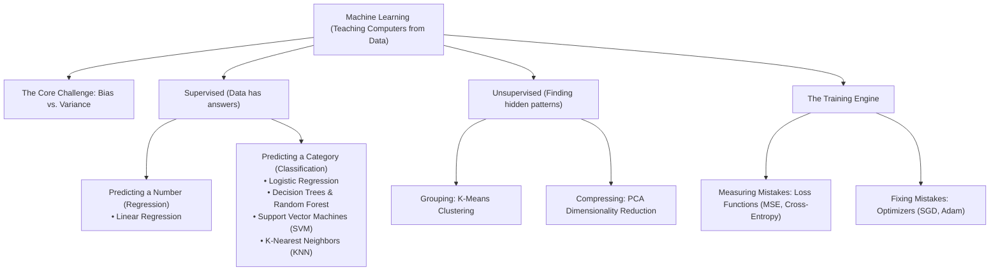
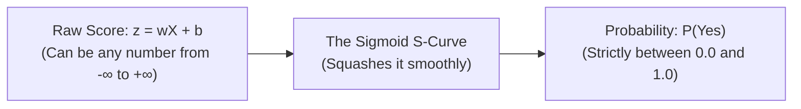
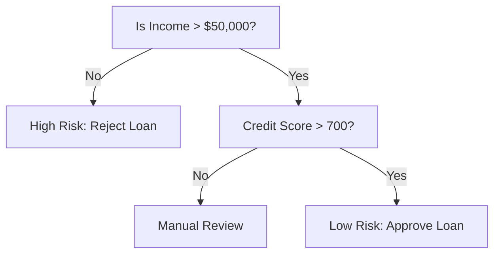
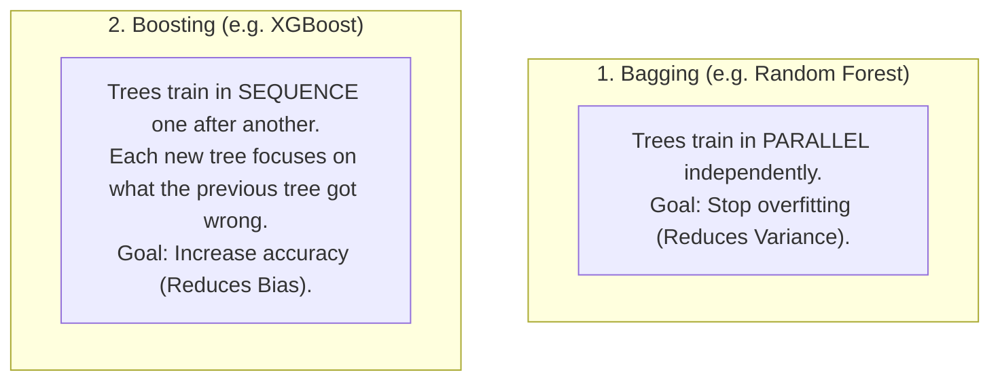
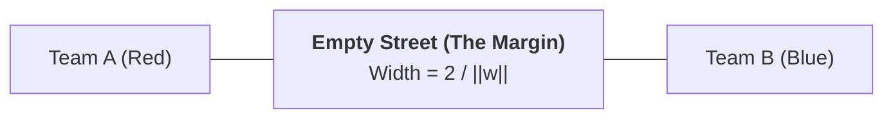

# Machine Learning Core Concepts (Beginner-Friendly Study Guide)

> **Simple • Intuitive • Jargon-Free • Interview-Ready**
> 
> A guide to understanding classical and applied Machine Learning concepts without academic headache.
> Every concept is explained using:
> 1. **The 10-Second Plain-English Idea** (No buzzwords)
> 2. **A Memorable Real-World Analogy** (How to picture it in your head)
> 3. **The Simple Math & Clean Formula** (Visual and easy on the eyes)
> 4. **How to Explain It in an Interview** (A short, simple 30-second answer)

---

## 🧭 Companion Guides
- [EXPERIENCE_AND_BACKGROUND.md](EXPERIENCE_AND_BACKGROUND.md) — 🎙️ Rahul's Interview Speaking Guide (WPP, Cognizant, Projects)
- [FASTAPI_MASTER_GUIDE.md](FASTAPI_MASTER_GUIDE.md) — ⚡ FastAPI Concepts & Serving Architecture
- [README_V2.md](README_V2.md) — 8-Level Easy-Learn GenAI & ML Lead Study Guide
- [interview_explanations.md](interview_explanations.md) — 117 Interview Questions & Answers
- [interview_questions.md](interview_questions.md) — Raw Question Bank

---

## 🗺️ Machine Learning at a Glance

---

# Section 1: The Bias-Variance Tradeoff (The #1 ML Concept)

### 🎯 Plain-English Meaning
Every machine learning model makes errors. Total error comes from two opposing problems:
* **Bias (Being too stubborn / underfitting):** The model is too simple. It makes rigid assumptions and ignores the data.
* **Variance (Being too jumpy / overfitting):** The model is too sensitive. It memorizes every tiny bump and random noise in the training data, so it fails on new data.

---

### 💡 The Student Exam Analogy
* **High Bias (The Lazy Student):** Didn't study enough. Assumes every answer on the multiple-choice exam is "C". Simple strategy, but wrong on both practice tests and the final exam (**Underfitting**).
* **High Variance (The Memorizer):** Memorized the exact questions and answers from last year's practice test word-for-word. Gets 100% on the practice test, but gets a 40% on the real exam because the questions changed slightly (**Overfitting**).
* **Good Balance (The Smart Student):** Learned the underlying concepts. Might make a couple of small mistakes, but performs reliably on any new exam!

---

### 📐 The Mathematical Formula

$$
\text{Total Error} = (\text{Bias})^2 + \text{Variance} + \text{Irreducible Noise}
$$

| Term | What It Means in Simple Words | Example |
| :---: | :--- | :--- |
| **$(\text{Bias})^2$** | Error from being too simple. | Trying to draw a straight line through a curved U-shape. |
| **$\text{Variance}$** | Error from being too sensitive to noise. | A model that draws a wiggly line connecting every single training dot. |
| **$\text{Irreducible Noise}$** | Random real-world chaos you can't predict. | A typo in the data or someone buying a house for $100K above market value just because they liked the garden. |

---

### 🛠️ How to Fix Each (Cheat Sheet)

* **If your model is Underfitting (High Bias):**
  - Make the model more powerful (use a Decision Tree or Neural Net instead of a straight line).
  - Add more useful features.
  - Reduce regularization (give the model more freedom to learn).
* **If your model is Overfitting (High Variance):**
  - Get more training data.
  - Remove noisy or useless columns (feature selection).
  - Add regularization (L1/L2 penalties to stop weights from blowing up).
  - Prune trees (limit `max_depth`) or use a **Random Forest**.

---

### 🎙️ How to Answer in an Interview (30 Seconds):
> *"The Bias-Variance tradeoff is the balance between underfitting and overfitting. Bias happens when a model is too simple and misses the true pattern in the data. Variance happens when a model is too complex and memorizes the random noise in the training data. Our goal is to find the sweet spot in the middle that minimizes total test error."*

---

# Section 2: Linear Regression

### 🎯 Plain-English Meaning
Linear Regression predicts a continuous number (like house prices or stock prices) by drawing the single best-fitting straight line through your data points.

---

### 💡 The Rubber Band Analogy
Imagine your data points are nails hammered into a wooden board. You drop a straight metal rod between them and attach a tiny rubber band from every nail to the rod.
* The rubber bands will pull on the rod from all sides.
* The rod will naturally tilt and settle where the total pulling tension is at its lowest.
* That resting position is your **Linear Regression Line**!

---

### 📐 The Equation

$$
\hat{y} = w \cdot x + b
$$

| Symbol | Everyday Meaning | House Price Example |
| :---: | :--- | :--- |
| $\hat{y}$ | What we want to predict | The estimated house price ($450,000) |
| $x$ | The input feature | House size (2,000 sq ft) |
| $w$ | The weight (slope) | Value per sq ft ($200 per sq ft) |
| $b$ | The bias (intercept) | Base land price even if size is 0 ($50,000) |

---

### 📐 Measuring Mistakes: Mean Squared Error (MSE)

$$
\text{MSE} = \frac{1}{N} \sum_{i=1}^{N} (y_{\text{actual}} - \hat{y}_{\text{predicted}})^2
$$

* **Why square the difference?**
  1. It turns negative mistakes into positive numbers (so $+10$ and $-10$ don't cancel to zero).
  2. It punishes big mistakes much more than small mistakes (a $20 error is penalized 4x more than a $10 error).

---

### ⚠️ The 5 Simple Rules (Assumptions) of Linear Regression
If an interviewer asks: *"What are the assumptions of linear regression?"*, just remember **L.I.N.E.**:
1. **L — Linearity:** The relationship really is a straight line, not a curve.
2. **I — Independence:** One data row doesn't influence another (e.g., today's house sale didn't copy yesterday's).
3. **N — Normal Errors:** Most prediction errors are small, centered around zero in a bell curve.
4. **E — Equal Spread (Homoscedasticity):** The model makes similar-sized errors on cheap houses and expensive houses (the errors don't fan out like a megaphone).
5. **No Copycat Features (No Multicollinearity):** You don't have two columns saying the exact same thing (like "Size in Sq Feet" and "Size in Sq Meters").

---

# Section 3: Logistic Regression

### 🎯 Plain-English Meaning
Don't be fooled by the name: **Logistic Regression is used for Classification (Yes or No)**, not predicting numbers!
* Examples: Is this email Spam? (Yes/No). Is this transaction Fraud? (Yes/No).

---

### 💡 Why We Can't Use a Normal Straight Line
A straight line can output numbers like $-50$ or $+1,200$. But a probability must be between **0% and 100% (0.0 to 1.0)**.
To fix this, Logistic Regression takes the straight line and passes it through an **S-shaped curve called the Sigmoid function**.

---

### 📐 The Sigmoid Curve (Squashing Numbers into Probabilities)

$$
P(\text{Yes}) = \frac{1}{1 + e^{-z}} \quad \text{where} \quad z = w \cdot x + b
$$

* If the probability is **above 0.5 (50%)**, we predict **Yes (Class 1)**.
* If the probability is **below 0.5 (50%)**, we predict **No (Class 0)**.

---

### 🎙️ Common Interview Question: *"Why not use Mean Squared Error for Logistic Regression?"*
> *"Because if you plug the S-shaped sigmoid curve into Mean Squared Error, the error graph becomes bumpy with lots of false valleys (local minima) where gradient descent gets stuck. Instead, we use **Binary Cross-Entropy (Log Loss)**, which creates a smooth bowl shape with only one true bottom (global minimum)."*

---

# Section 4: Decision Trees

### 🎯 Plain-English Meaning
A Decision Tree makes predictions by playing a game of **"20 Questions"**. It asks simple yes/no questions one after another until it reaches an answer.

---

### 💡 How Does the Tree Pick Which Question to Ask First?
It uses a **"Messiness Score"** called **Gini Impurity** or **Entropy**:
* **Pure group (Clean):** A group where everyone has the same label (e.g., 100% approved). Messiness = 0.
* **Mixed group (Messy):** A 50/50 mix of approved and rejected. Messiness is high.
* **The Tree's Goal:** Pick the question that cleans up the mess the fastest (**Information Gain**).

---

### ⚠️ The Big Problem with Decision Trees: Overfitting
* If you let a tree grow without rules, it will keep asking questions until every single person has their own private leaf node. It gets 100% on training, but fails completely on new data.
* **The Fix (Pruning):** Like trimming a hedge. We set a rule like `max_depth = 4` so the tree can only ask 4 questions deep.

---

# Section 5: Ensemble Methods & Random Forest

### 🎯 Plain-English Meaning (The Wisdom of the Crowd)
If you ask 1 doctor for a diagnosis, they might make a mistake. If you ask **100 independent doctors** and take the majority vote, you get a much safer, more accurate answer.

---

### 🌲 Random Forest in 3 Simple Steps
1. **Grow 100 different trees.**
2. **Give each tree a slightly different slice of data** (called *Bagging / Bootstrapping*).
3. **Give each tree a random subset of questions to pick from** (called *Feature Subsampling*).
4. Combine their votes: Majority wins!

* **Why random features?** If one question is super obvious (like "Did income > $1M?"), *every single tree* would ask it first, making all 100 trees identical. Forcing them to pick from random subsets makes the trees **diverse**, which makes their combined vote much more powerful.

---

### 🚀 Bagging vs. Boosting (The Quick Difference)

* **Bagging (Random Forest):** A team of 100 experts taking a test independently and averaging their scores.
* **Boosting (XGBoost):** A student takes a test, gets 70%. A second student studies *only the 30% that was answered wrong*. A third student studies what is still left. Together, they get a 99%!

---

# Section 6: Support Vector Machines (SVM)

### 🎯 Plain-English Meaning (The Wide Street)
Imagine two rival sports teams standing in a park. An SVM draws a dividing boundary between them, but with one special rule: **it makes the empty street between them as wide as possible**.

* **The Margin:** The width of the street.
* **Support Vectors:** The players standing right on the edge of the curb. If any players standing further back move, the street doesn't care. **Only the players touching the curb decide where the street goes!**

---

### 🪄 The Kernel Trick (The Magic Tablecloth)
* What if Red dots are clustered in the center and Blue dots form a ring all around them? You can't separate them with a straight road!
* **The Trick:** Imagine the dots are on a tablecloth. You reach your hand under the center and lift it up into 3D. The Red dots rise into the air!
* Now you can slide a flat sheet of cardboard right between the high Red dots and the low Blue dots.
* SVM does this mathematically using **Kernels** (like the popular **RBF Kernel**) without needing expensive 3D calculations.

---

# Section 7: Principal Component Analysis (PCA)

### 🎯 Plain-English Meaning (The 3D Shadow)
PCA is a tool to **compress data with too many columns down to just a few columns**, without losing the important information.

---

### 💡 The Teapot Shadow Analogy
Imagine you have a complex 3D teapot. If you shine a flashlight on it from the right angle, its **2D shadow on the wall clearly shows the body, the handle, and the spout!**
* You lost 1 dimension (went from 3D to 2D).
* But your shadow captured 95% of what makes a teapot recognizable.
* That's **PCA**! It finds the best angle to project high-dimensional data so the shadow spreads out as wide as possible (**Maximum Variance**).

---

### ⚠️ Two Golden Rules of PCA:
1. **Always scale your features first:** If one column is "Salary in Dollars" ($50,000) and another is "Age" (30), PCA will mistakenly think Salary is 1,000x more important just because the numbers are bigger.
2. **Components are completely independent (Orthogonal):** Each new principal component is at a 90-degree angle to the others, meaning they have **zero correlation** with one another.

---

# Section 8: K-Nearest Neighbors (KNN)

### 🎯 Plain-English Meaning
*"Show me your 5 closest neighbors, and I will tell you who you are."*

* If you want to predict whether a customer will buy a product, find the **5 most similar customers** in your database. If 4 of them bought it, predict **Yes**!

---

### 💡 Things to Know About KNN:
* **The Lazy Learner:** KNN has zero training time. It literally just saves the data points in memory. When a new question comes in, it calculates the distance to all points.
* **Choosing $K$:**
  - If $K = 1$: Too sensitive. If one single neighbor is weird or an outlier, your prediction is ruined (**Overfitting**).
  - If $K = 200$: Too blurry. It just predicts whatever the majority class is in the entire database (**Underfitting**).
  - *Standard rule:* Choose an odd number around $\sqrt{N}$ so you never get a 50/50 tie vote!

---

# Section 9: K-Means Clustering

### 🎯 Plain-English Meaning (Sorting Without Labels)
K-Means is an **unsupervised** algorithm. You give it a messy pile of unlabeled data, and tell it: *"Organize this into $K$ neat piles."*

---

### 💡 How K-Means Works in 4 Steps:
1. **Drop $K$ random pins** on the board (these are called *Centroids*).
2. **Assign** every dot to whichever pin is closest.
3. **Move each pin** to the exact center of its group of dots.
4. **Repeat** until the pins stop moving!

---

### 📏 How Do You Know How Many Clusters ($K$) to Pick?
1. **The Elbow Method:** Run K-Means with $K=1, 2, 3, 4, 5...$ and plot the error. As $K$ increases, the error drops. Look for the sharp bend ("the elbow") where adding more clusters stops helping much.
2. **Silhouette Score:** Measures how tight your clusters are and how far apart they are from other clusters (Score ranges from $-1$ to $+1$; near $+1$ is great).

---

# Section 10: Loss Functions (How Models Measure Mistakes)

Think of a Loss Function as a strict teacher grading an exam. Different loss functions punish mistakes differently:

| Loss Function | What It's Used For | How It Becomes Strict | Best When... |
| :--- | :--- | :--- | :--- |
| **MSE (Mean Squared Error)** | Predicting numbers (Regression) | Squares every mistake ($10^2 = 100$). | Big mistakes are dangerous and must be heavily punished. |
| **MAE (Mean Absolute Error)** | Predicting numbers (Regression) | Treats every mistake fairly ($10$ error = $10$ penalty). | Your data has crazy outliers that you don't want messing up the line. |
| **Huber Loss** | Predicting numbers (Regression) | Acts like MSE for small errors, but like MAE for big errors. | You want the best of both worlds! |
| **Binary Cross-Entropy** | Yes/No decisions (Classification) | Heavily punishes overconfident wrong guesses. | If the model says *"I am 99% confident this is safe"* and it's fraud, it gets a massive penalty. |

---

# Section 11: Optimizers (How Models Learn from Mistakes)

If the Loss Function tells the model how bad its mistake was, the **Optimizer** tells it **how to turn the dials (weights) to fix the mistake**.

---

### 💡 The Misty Mountain Analogy
Imagine you are blindfolded on a foggy mountain and want to reach the bottom of the valley:
* **Gradient Descent:** You feel the slope under your feet and take one step in whichever direction slopes downward.
* **Momentum (The Bowling Ball):** If you keep moving down the same direction, you pick up speed. A heavy bowling ball powers right through small bumps and puddles without stopping.
* **Adam (The Smart Hiker):** The industry standard optimizer. It combines Momentum with adaptive speed: it takes big steps on smooth slopes, and careful small steps on rocky, steep ground.

---

# Section 12: Top 10 Rapid-Fire ML Interview Questions (Clear & Simple)

---

### Q1: "What is the difference between L1 (Lasso) and L2 (Ridge) Regularization?"
**Simple Answer:**
> *"Both prevent overfitting by penalizing large weights. 
> **L1 (Lasso)** shrinks useless weights all the way to **zero**, which automatically removes bad features. 
> **L2 (Ridge)** shrinks weights close to zero but **never completely eliminates them**, keeping small contributions from all features."*

---

### Q2: "Why do we scale features for KNN and SVM, but not for Decision Trees?"
**Simple Answer:**
> *"KNN and SVM calculate physical distances between points. If salary is $100,000 and age is 30, the salary number will completely overpower the age number unless you scale them. 
> Decision Trees only ask one question about one feature at a time (e.g. 'Is Age > 30?'), so the scale of other features doesn't matter at all."*

---

### Q3: "What is the difference between Precision and Recall?"
**Simple Answer:**
> *"**Precision** is about being careful: *Of all the emails we flagged as spam, how many were actually spam?* (High precision prevents annoying false alarms). 
> **Recall** is about catching everything: *Of all the actual spam emails out there, how many did we catch?* (High recall is critical in cancer detection where missing a sick patient is dangerous)."*

---

### Q4: "Why shouldn't you use standard accuracy for fraud detection?"
**Simple Answer:**
> *"Because fraud is rare. If 99.9% of transactions are legitimate, a dumb model that guesses 'No Fraud' every single time gets 99.9% accuracy, but it catches zero fraud! In imbalanced problems, we evaluate using **Precision, Recall, or F1-score** instead."*

---

### Q5: "What is the difference between Bagging and Boosting?"
**Simple Answer:**
> *"**Bagging** trains models in parallel on random data slices to reduce variance (like Random Forest). 
> **Boosting** trains models in a sequence, where each new model focuses on fixing the mistakes of the previous model to reduce bias (like XGBoost)."*

---

### Q6: "What is the Curse of Dimensionality?"
**Simple Answer:**
> *"As you add more and more columns (dimensions), the space becomes so huge and empty that all data points end up roughly equal distances from one another. This ruins distance-based algorithms like KNN. We fix it by reducing columns with PCA or feature selection."*

---

### Q7: "What is Out-Of-Bag (OOB) error in Random Forest?"
**Simple Answer:**
> *"When Random Forest picks random rows to build each tree, about one-third of the data is left out. We can test the tree on those leftover rows. It gives us a free built-in validation score without needing a separate test dataset."*

---

### Q8: "How does Gradient Boosting work simply?"
**Simple Answer:**
> *"It starts with a simple average guess. Then it calculates the mistakes (residuals). A new small decision tree is trained to predict those mistakes. We add that tree to our prediction, and repeat the process step-by-step until the errors shrink."*

---

### Q9: "What is the difference between Parametric and Non-Parametric models?"
**Simple Answer:**
> *"**Parametric models** (like Linear and Logistic Regression) have a fixed formula with a fixed number of weights that doesn't change when data grows. 
> **Non-parametric models** (like Decision Trees and KNN) have no rigid formula; their structure grows and gets more complex as you feed them more data."*

---

### Q10: "How do you detect and fix multicollinearity?"
**Simple Answer:**
> *"Multicollinearity means two or more features are heavily correlated (like height in inches and height in centimeters). We detect it using a correlation matrix or VIF score above 5. We fix it simply by **dropping one of the duplicate features** or combining them with PCA."*

---

## 🎯 3 Golden Takeaways for Your Interview

1. **Know the trade-off:** Underfitting = High Bias (model is too simple); Overfitting = High Variance (model memorized noise).
2. **Know your model types:** Linear/Logistic = simple lines; Trees = if/else splits; Ensembles = combining multiple models.
3. **Know your metrics:** Never quote basic accuracy on imbalanced data; use Precision, Recall, and F1-score.
