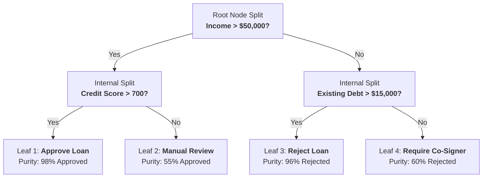
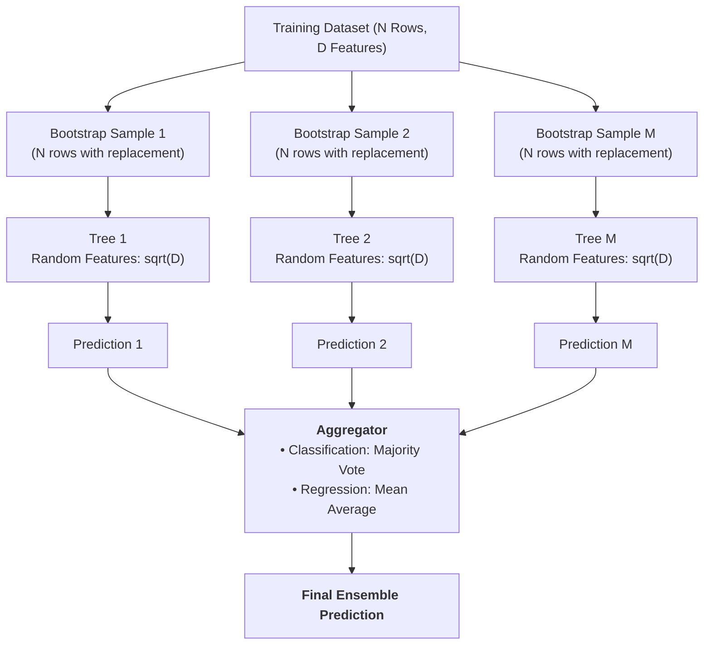

# Machine Learning Core Concepts (Interview-Ready Visual Guide)

> **Professional • Visual Graphs & Architecture • Direct Definitions • Spoken-Math Ready**
> 
> A complete, interview-tested study guide covering all fundamental classical and applied Machine Learning concepts.
> Every concept is structured with:
> 1. 🎙️ **The Definition to Recite** (1–2 crisp, authoritative sentences ready to say out loud)
> 2. 📊 **Visual Graph / Architecture Representation** (Clear visual diagrams that explain the concept at a glance)
> 3. 📐 **Clean Mathematical Formulation** (Readable code blocks with labeled variables + centered display equations)
> 4. ⚙️ **Operational Mechanics & Variants** (Step-by-step functionality under the hood)
> 5. ⚠️ **Interview Trap Questions & Assumptions** (What senior interviewers specifically probe)
> 6. 🎙️ **Direct 30-Second Interview Answers**

---

## 🧭 Companion Guides
- [EXPERIENCE_AND_BACKGROUND.md](EXPERIENCE_AND_BACKGROUND.md) — 🎙️ Rahul's Career Speaking Guide (WPP, Cognizant, Flagship Projects)
- [FASTAPI_MASTER_GUIDE.md](FASTAPI_MASTER_GUIDE.md) — ⚡ FastAPI Concepts, Async Lifecycles & Serving Architecture
- [README_V2.md](README_V2.md) — 8-Level Easy-Learn GenAI & ML Lead Study Guide
- [interview_explanations.md](interview_explanations.md) — 117 Recruiter Questions & Deep Technical Explanations
- [interview_questions.md](interview_questions.md) — Raw Question Bank

---

## 🗺️ Machine Learning Curriculum Map

```mermaid
flowchart TD
    ML["Applied Machine Learning"] --> Core["1. Fundamental Tradeoffs"]
    ML --> Supervised["2. Supervised Learning"]
    ML --> Unsupervised["3. Unsupervised Learning"]
    ML --> Optimization["4. Losses & Optimization"]
    ML --> Pipeline["5. Evaluation & Pipeline"]

    Core --> BV["Bias-Variance Tradeoff<br/>(Underfitting vs Overfitting)"]

    Supervised --> Reg["Regression<br/>• Linear Regression (OLS & LINE Assumptions)<br/>• Metrics (MSE, RMSE, MAE, R²)"]
    Supervised --> Class["Classification<br/>• Logistic Regression (Sigmoid & Log-Odds)<br/>• Naive Bayes (Gaussian, Multinomial, Laplace)<br/>• Decision Trees (Gini & Entropy)<br/>• Support Vector Machines (SVM & Kernels)<br/>• K-Nearest Neighbors (KNN)"]
    Supervised --> Ensemble["Ensemble Methods<br/>• Bagging (Random Forest & OOB Error)<br/>• Boosting (GBDT, XGBoost, LightGBM)"]

    Unsupervised --> Cluster["Clustering<br/>• Partition: K-Means & K-Means++<br/>• Density: DBSCAN (Epsilon, MinPts)<br/>• Hierarchical: Agglomerative Dendrograms"]
    Unsupervised --> DimRed["Dimensionality Reduction<br/>• Linear: PCA (Eigenvectors & Variance)<br/>• Non-Linear: t-SNE & UMAP (Manifold Embeddings)"]

    Optimization --> Loss["Loss Functions<br/>(MSE, MAE, Huber, BCE, CCE, Hinge)"]
    Optimization --> Opt["Optimizers<br/>(GD, Mini-Batch SGD, Momentum, Adam)"]

    Pipeline --> Eval["Model Evaluation<br/>(Confusion Matrix, ROC-AUC, PR-AUC, F1)"]
    Pipeline --> Leakage["Validation & Leakage Prevention<br/>(K-Fold, Stratified, TimeSeriesSplit)"]
    Pipeline --> Preprocessing["Feature Engineering<br/>(Encoding & Scaling Strategies)"]
```



---

# Section 1: The Bias-Variance Tradeoff

### 🎙️ The Definition to Recite:
> *"The Bias-Variance tradeoff is the fundamental tension in supervised machine learning between a model's complexity and its ability to generalize to unseen data. Total expected prediction error decomposes into three additive components: Bias squared, Variance, and Irreducible error."*

---

### 📊 Visual Graph Representation

```text
Prediction
  Error |
        |   \                                 /  Total Test Error
        |    \                               /
        |     \                             /
        |      \         Optimal           /
        |       \        Capacity         /
        |        \          v            /
        |         \_________•___________/    <-- Sweet Spot (Minimum Test Error)
        |          \                   /
        |   Bias²   \                 /   Variance (Overfitting)
        |   (High)   \               /    (High)
        |             \             /
        |              \___________/
        |               Training Error (Always decreases)
        +----------------------------------------------------> Model Complexity
           Zone 1: Underfitting        Zone 2: Optimal        Zone 3: Overfitting
           - High Bias                 - Best Generalization   - High Variance
           - Model too simplistic      - Minimal Test Error    - Memorized training noise
```

---

### 📐 Clean Mathematical Formulation

```text
Expected Total Error = (Bias)^2 + Variance + Irreducible Noise
```

$$
\text{Total Error} = \text{Bias}^2 + \text{Variance} + \sigma^2
$$

| Term | Spoken Interview Explanation | What It Indicates In Production |
| :--- | :--- | :--- |
| **Bias Squared** | Error caused by wrong or overly rigid assumptions in the learning algorithm. | **Underfitting**: Both training error and validation error remain unacceptably high. |
| **Variance** | Error caused by extreme sensitivity to small fluctuations in the training data. | **Overfitting**: Very low training error, but high validation error. |
| **Irreducible Noise** | Natural variance, measurement errors, or missing features in the dataset. | Theoretical minimum error ceiling that no model can overcome. |

---

### 🛠️ Practical Solutions (Interview Action Checklist)

* **How to Fix High Bias (Underfitting):**
  1. Increase model capacity (e.g., transition from linear models to tree ensembles or neural networks).
  2. Engineer new features, interaction terms, or polynomial features.
  3. Decrease regularization penalties (reduce L1 or L2 regularization strength).

* **How to Fix High Variance (Overfitting):**
  1. Collect more training data or apply data augmentation.
  2. Apply feature selection to eliminate noisy, irrelevant, or collinear predictors.
  3. Introduce regularization (L1 Lasso or L2 Ridge).
  4. Restrict model complexity (e.g., set `max_depth` and `min_samples_leaf` in trees).
  5. Use ensemble bagging techniques (**Random Forest**).

---

# Section 2: Linear Regression

### 🎙️ The Definition to Recite:
> *"Linear Regression is a supervised learning algorithm that models the linear relationship between a continuous scalar dependent variable and one or more independent predictor features by fitting a linear equation to observed data to minimize Mean Squared Error."*

---

### 📊 Visual Graph Representation

```text
 Target (y) |
            |                              • (Data point: actual y)
            |                             /
            |                       •    /
            |                           /|  <-- Residual error: e = y - y_hat
            |                          / |
            |                    •    /  • (Predicted: y_hat)
            |                        /
            |                  •    /
            |                      /
            |            •        /   Fitted Regression Line:
            |                    /    y_hat = (weight * x) + bias
            |        •          /
            |                  /
            +---------------------------------------------> Feature (x)
```

---

### 📐 Clean Mathematical Formulation

```text
Prediction Formula:   y_hat = (w1 * x1) + (w2 * x2) + ... + (wd * xd) + b
                      y_hat = w^T * x + b

Objective (MSE Loss): Loss  = (1 / N) * Sum( (y_actual - y_predicted)^2 )
```

$$
\hat{y} = \mathbf{w}^T \mathbf{x} + b
$$

$$
\mathcal{L}_{\text{MSE}} = \frac{1}{N} \sum_{i=1}^{N} (y_i - \hat{y}_i)^2
$$

---

### ⚙️ Weight Estimation: Closed-Form OLS vs. Gradient Descent

1. **Ordinary Least Squares (OLS) Closed-Form:**
   ```text
   Weights = (X^T * X)^(-1) * X^T * y
   ```
   - Computes the exact global minimum in a single matrix calculation.
   - Computational cost is `O(d^3)` due to matrix inversion; becomes impractical when feature count `d > 10,000`.

2. **Gradient Descent:**
   ```text
   Weights_new = Weights_old - (Learning_Rate * Gradient_of_Loss)
   ```
   - Iteratively updates weights step-by-step; scales efficiently to millions of rows and features.

---

### ⚠️ The 5 Core Assumptions (Remember: L.I.N.E.)

1. **L — Linearity:** The relationship between predictors and the target variable is linear.
2. **I — Independence:** Residual errors are independent of one another (no autocorrelation in time series).
3. **N — Normality:** Residual errors are normally distributed with a mean of zero.
4. **E — Equal Variance (Homoscedasticity):** Residual error variance remains constant across all predicted values.
5. **No Multicollinearity:** Predictor features are not strongly correlated with each other (Variance Inflation Factor `VIF < 5`).

---

### 📊 Evaluation Metrics

* **MAE (Mean Absolute Error):** `(1 / N) * Sum( |y - y_hat| )`
  - Unit matches target variable; robust to extreme outliers.
* **MSE (Mean Squared Error):** `(1 / N) * Sum( (y - y_hat)^2 )`
  - Penalizes large errors quadratically; sensitive to outliers.
* **RMSE (Root Mean Squared Error):** `SquareRoot( MSE )`
  - Heavily penalizes large errors while converting units back to the target scale.
* **R-squared ($R^2$):** `1 - (Residual_Sum_of_Squares / Total_Sum_of_Squares)`
  - Measures the percentage of variance in $y$ explained by the model (ranges from 0.0 to 1.0).
* **Adjusted R-squared:** Penalizes the addition of useless features that do not improve explanatory power:
  ```text
  Adjusted_R2 = 1 - [ ((1 - R2) * (N - 1)) / (N - p - 1) ]
  ```
  *(where N = sample count, p = feature count)*

---

# Section 3: Logistic Regression

### 🎙️ The Definition to Recite:
> *"Logistic Regression is a supervised classification algorithm used to estimate the probability of a categorical outcome. It applies the Sigmoid function to a linear combination of input features, mapping any real-valued number into a valid probability between 0 and 1."*

---

### 📊 Visual Graph Representation

```text
 Probability
   P(y = 1) |
       1.0  |                                    ----------------- (Class 1)
            |                                  /
            |                                 /
       0.75 |                               /
            |                              /
       0.50 | - - - - - - - - - - - - - - •  <-- Decision Boundary (z = 0, P = 0.5)
            |                            /
       0.25 |                           /
            |                          /
        0.0 | ------------------------        (Class 0)
            +-----------------------------•----------------------->
                    z < 0 (Predict 0)    z = 0      z > 0 (Predict 1)
                                      Score: z = w^T * x + b
```

---

### 📐 Clean Mathematical Formulation

```text
1. Linear Combination:   z = (w1 * x1) + (w2 * x2) + ... + b
2. Sigmoid Activation:   Probability = 1 / ( 1 + e^(-z) )
3. Odds Ratio:           Odds = Probability / (1 - Probability)
4. Log-Odds (Logit):     ln( Odds ) = z = w^T * x + b
```

$$
P(y = 1 \mid \mathbf{x}) = \sigma(z) = \frac{1}{1 + e^{-z}} \quad \text{where} \quad z = \mathbf{w}^T \mathbf{x} + b
$$

$$
\ln\left( \frac{p}{1 - p} \right) = \mathbf{w}^T \mathbf{x} + b
$$

#### Binary Cross-Entropy Loss (Log Loss):
```text
BCE Loss = - (1 / N) * Sum[ y * ln(p_hat) + (1 - y) * ln(1 - p_hat) ]
```

$$
\mathcal{L}_{\text{BCE}} = -\frac{1}{N} \sum_{i=1}^{N} \Big[ y_i \ln(\hat{p}_i) + (1 - y_i) \ln(1 - \hat{p}_i) \Big]
$$

---

### 🎙️ Direct Interview Question: *"Why not use MSE for Logistic Regression?"*
> *"Applying Mean Squared Error to a non-linear Sigmoid output produces a **non-convex loss surface filled with local minima and saddle points**, where gradient descent can easily get stuck. **Binary Cross-Entropy yields a strictly convex loss surface**, guaranteeing that gradient descent reliably converges to the global minimum."*

---

# Section 4: Naive Bayes Classifier

### 🎙️ The Definition to Recite:
> *"Naive Bayes is a family of probabilistic supervised classification algorithms based on Bayes' Theorem. It is called 'naive' because it makes the strong assumption that all predictor features are mutually independent given the class label."*

---

### 📊 Visual Architecture Representation

```text
   Prior Knowledge                        Likelihood of Features Given Class
   P(Class = Spam)    x    P(Word1 = "Free" | Spam) * P(Word2 = "Offer" | Spam)
 --------------------------------------------------------------------------------
                         Evidence: P(Word1 = "Free", Word2 = "Offer")
                                                ||
                                                vv
                               Posterior Probability: P(Spam | Words)
                               (Assign class with maximum posterior probability)
```

---

### 📐 Clean Mathematical Formulation

```text
Bayes' Theorem:    Posterior = ( Likelihood * Prior ) / Evidence
Spoken Equation:   P(Class | Features) = [ P(Features | Class) * P(Class) ] / P(Features)
Naive Assumption:  P(x1, x2, ..., xd | Class) = P(x1|Class) * P(x2|Class) * ... * P(xd|Class)
Classification:    Predicted_Class = argmax_c [ P(Class_c) * Product_{j=1..d} P(x_j | Class_c) ]
```

$$
P(C_k \mid \mathbf{x}) = \frac{P(C_k) \prod_{j=1}^{d} P(x_j \mid C_k)}{P(\mathbf{x})}
$$

---

### ⚙️ The 3 Core Variants to Know in Interviews

1. **Gaussian Naive Bayes:**
   - Used for continuous numerical features. Assumes features follow a normal distribution $\mathcal{N}(\mu_c, \sigma_c^2)$ within each class.
2. **Multinomial Naive Bayes:**
   - Used for discrete count data (e.g., word frequency counts in text documents and NLP spam filtering).
3. **Bernoulli Naive Bayes:**
   - Used for binary indicator features (e.g., whether a word appears or does not appear in a text).

---

### ⚠️ Critical Interview Concept: Laplace Smoothing (Zero Frequency Problem)
* **The Problem:** If a feature/word never appeared with a specific class in the training dataset, its probability $P(x_j \mid \text{Class}) = 0$. Since all probabilities are multiplied together, a single zero cancels out the entire product, resulting in a zero posterior probability!
* **The Solution (Laplace Smoothing):** Add a pseudo-count $\alpha = 1$ to the numerator and total vocabulary size $V$ to the denominator:
  ```text
  Smoothed Probability = ( Count_of_Word_in_Class + 1 ) / ( Total_Words_in_Class + Vocabulary_Size )
  ```
  This guarantees that no unseen feature ever forces a total probability of zero.

---

# Section 5: Decision Trees

### 🎙️ The Definition to Recite:
> *"A Decision Tree is a non-parametric supervised learning algorithm that makes predictions by recursively partitioning the feature space into orthogonal sub-regions based on feature split criteria, forming a hierarchical tree of decisions."*

---

### 📊 Visual Graph Representation



---

### 📐 Splitting Criteria: Gini Impurity vs. Entropy

#### 1. Gini Impurity (Default in scikit-learn CART):
```text
Gini Impurity = 1 - Sum( (Probability of Class i)^2 )
```

$$
I_G(t) = 1 - \sum_{i=1}^{C} p_i^2
$$

* Measures the probability that a randomly chosen element would be incorrectly labeled.
* **Pure Node (all one class):** `Gini = 0.0`.
* **Worst Split (50/50 binary):** `Gini = 0.5`.

#### 2. Shannon Entropy & Information Gain:
```text
Entropy = - Sum( p_i * log2(p_i) )
Information Gain = Parent_Entropy - Weighted_Child_Entropy
```

$$
H(t) = -\sum_{i=1}^{C} p_i \log_2(p_i)
$$

* **Gini vs. Entropy:** Gini is computationally faster because it does not require calculating logarithms. In practice, both yield virtually identical decision trees.

---

### 🛡️ Tree Regularization (Preventing Overfitting)
* Unpruned decision trees have **high variance** and will split until every single training observation sits in its own leaf node (100% memorization).
* **Key Hyperparameters to State in Interviews:**
  - `max_depth`: Hard limit on tree depth.
  - `min_samples_split`: Minimum number of samples required to attempt a split.
  - `min_samples_leaf`: Minimum number of samples required in a terminal leaf node.
  - `ccp_alpha`: Cost-Complexity Pruning parameter to trim redundant branches post-training.

---

# Section 6: Ensemble Methods (Random Forest, GBDT, XGBoost, LightGBM)

### 🎙️ The Definition to Recite:
> *"Ensemble methods combine predictions from multiple individual base models to achieve superior predictive accuracy, stability, and generalization. The two primary paradigms are Bagging (parallel variance reduction) and Boosting (sequential bias reduction)."*

---

### 📊 Random Forest Architecture (Bagging + Feature Subsampling)



---

### 🌲 Why Feature Subsampling is Critical
* Standard bagging on decision trees produces correlated trees if one or two features are overwhelmingly predictive (all trees split on that feature first).
* Random Forest forces each split to choose from only a random subset of features:
  ```text
  Feature Subset Size for Classification = SquareRoot( Total_Features )
  Feature Subset Size for Regression     = Total_Features / 3
  ```
* **Interview Point:** Random feature subsampling **de-correlates the individual trees**. When independent errors are averaged, ensemble variance decreases dramatically.

---

### 📐 Out-Of-Bag (OOB) Error: Built-In Cross-Validation
* When drawing $N$ samples with replacement, the probability of any given row being left out is:
  ```text
  Probability row omitted = (1 - 1/N)^N  -->  1/e  ≈  36.8%
  ```
* **Interview Talking Point:** Each tree leaves out approximately **36.8% of the training data**. We evaluate each tree on its unselected rows to calculate an unbiased validation score without needing a separate validation set.

---

### 🚀 Boosting Family: GBDT vs. XGBoost vs. LightGBM

```text
Sequential Boosting Logic:
Step 0: Baseline Prediction (Mean of y)  --> Residual Errors
Step 1: Train Shallow Tree 1 on Residuals --> Multiply by Learning Rate (eta) --> Update Residuals
Step 2: Train Shallow Tree 2 on New Residuals --> Repeat M times until loss minimizes
```

| Model | Core Optimization Mechanics | Key Production Advantage |
| :--- | :--- | :--- |
| **Standard GBDT** | First-order gradient descent on residuals; level-wise greedy tree growth. | Baseline algorithm; slow on large tabular datasets. |
| **XGBoost** | Uses **second-order Taylor expansion** (Gradients + Hessians); built-in L1/L2 regularization on leaf weights; handles missing values automatically. | Extremely robust against overfitting; dominant in tabular ML competitions. |
| **LightGBM** | Uses **Histogram-based split finding** (bins continuous values into 256 discrete bins) and **Leaf-wise tree growth** with depth limits. | **10x to 15x faster training** and significantly lower RAM usage than XGBoost. |

---

# Section 7: Support Vector Machines (SVM)

### 🎙️ The Definition to Recite:
> *"Support Vector Machines are supervised models that construct an optimal separating hyperplane in a multidimensional space to segregate classes with the maximum geometric margin—the perpendicular distance between the hyperplane and the closest data points, known as Support Vectors."*

---

### 📊 Visual Graph Representation

```text
 Feature 2 |
           |          (+) Class (+1)
           |             (+)     (+)
           |           (+)    [+]  <-- Support Vector
           |  - - - - - - - - -•- - - - - - - - - -  Positive Margin: w^T * x + b = +1
           |                  /
           |                 /   <-- Optimal Hyperplane: w^T * x + b = 0
           |  <--- Margin --/--->   Margin Width = 2 / ||w||
           |               /
           |  - - - - - - • - - - - - - - - - - - -  Negative Margin: w^T * x + b = -1
           |           [-]  <-- Support Vector
           |        (-)    (-)
           |     (-)   (-)     (-) Class (-1)
           +---------------------------------------------> Feature 1
```

---

### 📐 Clean Mathematical Formulation

```text
Hyperplane Equation:          w^T * x + b = 0
Margin Width:                 Margin = 2 / ||w||
Optimization Objective:       Minimize: (1/2) * ||w||^2 + C * Sum( Slack_Variables )
```

$$
\min_{\mathbf{w}, b, \xi} \frac{1}{2} \|\mathbf{w}\|^2 + C \sum_{i=1}^{N} \xi_i \quad \text{subject to} \quad y_i(\mathbf{w}^T \mathbf{x}_i + b) \ge 1 - \xi_i
$$

* **Hyperparameter $C$ (Regularization):**
  - **High $C$:** Strictly penalizes margin violations. Creates a narrow margin. Risk of **overfitting**.
  - **Low $C$:** Tolerates misclassifications and margin violations in exchange for a wider margin. Generalizes better on noisy data (**higher bias**).

---

### 🪄 The Kernel Trick (Non-Linear Classification)
* **Definition:** A mathematical shortcut that maps non-linearly separable points into a higher-dimensional space where they become linearly separable, **without ever computing the explicit high-dimensional coordinates**.
* **Radial Basis Function (RBF / Gaussian) Kernel:**
  ```text
  Kernel_Similarity = exp( -gamma * Squared_Euclidean_Distance )
  ```
  - **High $\gamma$ (gamma):** Points must be very close to be considered similar. Produces tight, intricate decision boundaries (**overfitting**).
  - **Low $\gamma$:** Points far away are considered similar. Produces smooth, sweeping decision boundaries (**underfitting**).

---

# Section 8: K-Nearest Neighbors (KNN)

### 🎙️ The Definition to Recite:
> *"K-Nearest Neighbors is a non-parametric, instance-based supervised learning algorithm. As a lazy learner, it performs no explicit training phase; it stores the training dataset and predicts new queries by computing distance metrics to all stored instances and taking a majority vote or average across the $K$ closest points."*

---

### 📊 Visual Graph Representation

```text
 Feature 2 |
           |          ▲ (Class: Triangle)
           |        ▲   ▲
           |           /-----\
           |          /  ▲    \
           |         /   ▲     \
           |        |  ( ? )    |   <-- Query Point to Classify
           |        |   ■   ■   |
           |         \         /
           |          \---■---/     ■ (Class: Square)
           |
           |      Inner Circle (K = 3): 2 Squares, 1 Triangle  --> Predicts: SQUARE
           |      Outer Circle (K = 5): 2 Squares, 3 Triangles --> Predicts: TRIANGLE
           +----------------------------------------------------> Feature 1
```

---

### 📐 Distance Metrics & The Choice of $K$

1. **Euclidean Distance ($L_2$):**
   ```text
   Distance = SquareRoot( (x1 - x2)^2 + (y1 - y2)^2 )
   ```
2. **Manhattan Distance ($L_1$):**
   ```text
   Distance = |x1 - x2| + |y1 - y2|
   ```
3. **Choosing $K$:**
   - **Small $K$ ($K = 1$):** Extremely sensitive to noise and outliers (**high variance, overfitting**).
   - **Large $K$ ($K = 50$):** Blurs neighborhood boundaries; biased toward the majority class (**high bias, underfitting**).
   - *Rule of thumb:* Choose $K \approx \sqrt{N}$, and pick an **odd number** for binary classification to avoid tie votes.

---

### ⚠️ The Curse of Dimensionality
* In 100-dimensional space, the volume expands exponentially. All points become sparse and roughly equidistant from each other, destroying distance metrics.
* **Interview Answer:** Always apply **feature scaling** (StandardScaler) and perform **dimensionality reduction (PCA)** before using KNN.

---

# Section 9: Clustering: K-Means vs. DBSCAN vs. Hierarchical

### 🎙️ The Definition to Recite:
> *"Clustering is an unsupervised learning technique that groups unlabeled observations into natural subsets based on similarity. Partition-based methods (K-Means) optimize spherical cluster distances, while density-based methods (DBSCAN) discover arbitrary cluster shapes and isolate noise."*

---

### 📊 K-Means vs. DBSCAN Visual Comparison

```text
 K-Means (Assumes Spherical Clusters)     DBSCAN (Density-Based Arbitrary Shapes)
             •••••                                     •••••••••••
           ••  C1 ••                                 ••           ••  <-- Outer Ring
             •••••                                  •   •••••••     •
                                                   •   •  Core •     •
             •••••                                  •   •••••••     •
           ••  C2 ••                                 ••           ••
             •••••                                     •••••••••••       x  <-- Noise (Outlier)
```

---

### ⚙️ The 3 Core Clustering Algorithms

#### 1. K-Means & K-Means++
- **Mechanics:** Initializes $K$ centroids, assigns points to the nearest centroid via Euclidean distance, re-centers centroids at the cluster mean, and iterates until convergence.
- **Inertia (WCSS):** Sum of squared distances from points to their assigned cluster centroid.
- **K-Means++:** Initializes centroids with probabilities proportional to squared distance from existing centroids, preventing bad local minima.
- **Limitation:** Fails on non-spherical shapes; requires specifying $K$ upfront.

#### 2. DBSCAN (Density-Based Spatial Clustering of Applications with Noise)
- **Mechanics:** Groups points that have at least `MinPts` neighbors within an `Epsilon` radius ($\epsilon$).
  - **Core Point:** Has $\ge \text{MinPts}$ neighbors within radius $\epsilon$.
  - **Border Point:** Within radius $\epsilon$ of a Core Point, but has $< \text{MinPts}$ neighbors.
  - **Noise Point:** Isolated point with no Core Points nearby (labeled as `-1`).
- **Production Advantage:** Discovers non-spherical clusters (rings, spirals); does not require setting $K$; automatically identifies outliers.

#### 3. Hierarchical Agglomerative Clustering
- **Mechanics:** Bottom-up approach where every point starts as its own cluster. At each step, the two closest clusters are merged until only one remains.
- **Dendrogram:** Tree diagram visualizing cluster merges across distance thresholds, allowing the user to select the optimal cluster cutoff visually.

---

# Section 10: Dimensionality Reduction: PCA, t-SNE & UMAP

### 🎙️ The Definition to Recite:
> *"Dimensionality reduction techniques compress high-dimensional feature spaces into lower-dimensional representations. Linear methods (PCA) maximize retained feature variance, while non-linear manifold methods (t-SNE and UMAP) preserve local neighbor relationships for embedding visualization."*

---

### 📊 Visual Comparison: PCA vs. t-SNE / UMAP

```text
 PCA: Linear Projection (Preserves Variance)     t-SNE / UMAP: Non-Linear Manifold
                ^ PC1 (Max Variance)                           Cluster B
               /                                              •••••
           •• / ••                                           ••   ••
          •• / ••                                              •••••
            /                                          Cluster A
           /  PC2 (Orthogonal)                          •••••
          +-------->                                   ••   ••
                                                         •••••
```

---

### ⚙️ Master Comparison Table for Interviews

| Method | Type | Primary Objective | When to Use in Production |
| :--- | :--- | :--- | :--- |
| **PCA** | **Linear** | Projects data onto orthogonal axes of maximum variance via Eigen-decomposition. | Reducing tabular feature counts, removing multicollinearity, preprocessing before KNN/Linear models. |
| **t-SNE** | **Non-Linear** | Minimizes Kullback-Leibler (KL) divergence between high-dim and low-dim probability distributions. | **Visualization only** in 2D/3D (e.g. visualizing image or text embeddings). Does NOT preserve global distances; slow $\mathcal{O}(N^2)$. |
| **UMAP** | **Non-Linear** | Models data as a Riemannian manifold with fuzzy simplicial sets. | Visualizing and clustering high-dimensional embeddings (Word2Vec, OpenAI embeddings). **Preserves both local and global structure**, and scales $\mathcal{O}(N \log N)$. |

---

# Section 11: Loss Functions Master Summary

### 📊 Visual Comparison of Regression Losses

```text
 Loss Value |
            |      \      MSE: Error^2 (Explodes on large outliers)      /
            |       \                                                  /
            |        \         MAE: |Error| (Linear penalty)          /
            |         \       /                               \      /
            |          \     /                                 \    /
            |           \___/   <-- Huber: Smooth curve near 0  \__/
            |                   Linear slopes past delta threshold
            +--------------------------------------------------------> Prediction Error (y - y_hat)
                       Negative Error           0           Positive Error
```

---

### 📐 Master Loss Comparison Table

| Loss Function | Primary Task | Spoken Mathematical Formulation | Operational Properties |
| :--- | :--- | :--- | :--- |
| **Mean Squared Error (MSE)** | Regression | `(1 / N) * Sum( (y - y_hat)^2 )` | Smooth and differentiable everywhere. Penalizes large errors quadratically. Extremely sensitive to outliers. |
| **Mean Absolute Error (MAE)** | Regression | `(1 / N) * Sum( \|y - y_hat\| )` | Robust to extreme outliers. Gradient is constant ($\pm 1$), which can overshoot near the minimum. |
| **Huber Loss** | Regression | Quadratic if `\|e\| <= delta`, Linear if `\|e\| > delta` | The best of both worlds: quadratic near zero for smooth convergence, linear for large errors to resist outliers. |
| **Binary Cross-Entropy** | Binary Classification | `- (1 / N) * Sum[ y*ln(p) + (1-y)*ln(1-p) ]` | Strictly convex loss surface for Sigmoid probabilities. Penalizes confident wrong predictions exponentially. |
| **Categorical Cross-Entropy** | Multi-Class Classification | `- Sum over classes [ y_c * ln(p_c) ]` | Standard multi-class loss function paired with Softmax output layers. |
| **Hinge Loss** | Maximum Margin (SVM) | `Max( 0, 1 - (y_actual * y_pred) )` | Penalizes predictions that violate the margin boundary. Produces sparse support vector solutions. |

---

# Section 12: Optimizers & Gradient Descent

### 🎙️ The Definition to Recite:
> *"An optimization algorithm iteratively adjusts model parameters (weights and biases) in the direction of the negative gradient of the loss function to minimize objective prediction error."*

---

### 📊 Visual Optimization Trajectories

```text
 Loss Contour Surface |
                      |       /-----------------------\
                      |      /   /-----------------\   \
                      |     /   /   /-----------\   \   \
                      |    /   /   /    /----\   \   \   \
                      |   |   |   |    |  ★   |   |   |   |  <-- Global Minimum (★)
                      |    \   \   \    \----/   /   /   /
                      |     \   \   \-----------/   /   /
                      |      \   \-----------------/   /
                      |       \-----------------------/
                      |
                      |  Trajectory Styles:
                      |  1. SGD:      \/\/\/\/\/\/\/\   (High-variance zig-zag bouncing)
                      |  2. Momentum: ~~~~~~~~~~~~~~>   (Accelerating arc, dampens bounce)
                      |  3. Adam:     -------------->   (Direct, adaptive vector scaling)
```

---

### ⚙️ The 4 Core Optimizers

#### 1. Stochastic Gradient Descent (SGD):
```text
Weight_New = Weight_Old - (Learning_Rate * Gradient)
```
* Updates weights using 1 sample per step. Fast and computationally cheap, but bounces erratically across steep ravines.

#### 2. SGD with Momentum:
```text
Velocity = (Beta * Velocity_Previous) + (Learning_Rate * Gradient)
Weight_New = Weight_Old - Velocity
```
* Accumulates a moving average of past gradients. Acts like a heavy ball rolling downhill, accelerating through consistent directions while smoothing out oscillations.

#### 3. RMSprop:
```text
Moving_Squared_Grad = (Gamma * Moving_Squared_Grad) + (1 - Gamma) * (Gradient^2)
Weight_New = Weight_Old - [ Learning_Rate / (SquareRoot(Moving_Squared_Grad) + Epsilon) ] * Gradient
```
* Dynamically scales learning rate inversely proportional to the root of squared gradients. Dampens volatile parameters.

#### 4. Adam (Adaptive Moment Estimation):
```text
First_Moment  = Beta1 * Past_Moment  + (1 - Beta1) * Gradient           (Direction/Momentum)
Second_Moment = Beta2 * Past_Variance + (1 - Beta2) * (Gradient^2)       (Scale/RMSprop)
Weight_New    = Weight_Old - [ Learning_Rate / (SquareRoot(Second_Moment) + Epsilon) ] * First_Moment
```
* **Why Adam is the universal industry default:** It combines the directional speed of **Momentum** with the coordinate-wise step sizing of **RMSprop**.

---

# Section 13: Model Evaluation & Classification Metrics

### 🎙️ The Definition to Recite:
> *"Classification metrics evaluate model predictions against actual ground truth to reflect specific business trade-offs. Overall accuracy is often deceptive, requiring precision, recall, F1-score, and area under ROC/PR curves to assess true discriminative performance."*

---

### 📊 The Confusion Matrix Visual Breakdown

```text
                      PREDICTED POSITIVE          PREDICTED NEGATIVE
 ACTUAL POSITIVE | True Positive (TP)      |  False Negative (FN)     |  <-- Recall = TP / (TP + FN)
                 | (Caught fraud correctly) |  (Missed fraud! Danger!) |
 ----------------+--------------------------+--------------------------+
 ACTUAL NEGATIVE | False Positive (FP)     |  True Negative (TN)      |  <-- Specificity = TN / (TN + FP)
                 | (False alarm! Annoying)  |  (Correctly ignored)     |
                 +--------------------------+--------------------------+
                   v Precision = TP / (TP + FP)
```

---

### 📐 Spoken Metric Formulations

* **Accuracy:** `(TP + TN) / (TP + TN + FP + FN)`
  - Measures total percentage of correct guesses. **Fails on imbalanced data.**
* **Precision:** `TP / (TP + FP)`
  - *Question answered:* Of all instances we flagged as positive, how many were actually positive?
  - *High priority in:* Spam filters, search recommendation systems (minimize false alarms).
* **Recall (Sensitivity):** `TP / (TP + FN)`
  - *Question answered:* Of all actual positive instances out there, how many did we catch?
  - *High priority in:* Fraud detection, cancer diagnosis (missing a positive is catastrophic).
* **F1-Score:** `2 * [ (Precision * Recall) / (Precision + Recall) ]`
  - Harmonic mean of Precision and Recall. Gives a balanced evaluation metric for imbalanced data.
* **ROC-AUC vs. PR-AUC:**
  - **ROC-AUC (Receiver Operating Characteristic):** Plots True Positive Rate vs. False Positive Rate across all classification thresholds. Evaluates general ranking quality across balanced datasets.
  - **PR-AUC (Precision-Recall AUC):** Plots Precision vs. Recall. **Mandatory for heavily skewed datasets** (e.g. 0.1% fraud), as it focuses exclusively on the minority class without being inflated by true negatives.

---

# Section 14: Validation Strategies & Preventing Data Leakage

### 🎙️ The Definition to Recite:
> *"Validation strategies partition available data to simulate real-world generalization performance on unseen production distributions. Data leakage occurs when test-set information inadvertently influences the training phase, creating falsely optimistic validation metrics that collapse in production."*

---

### 📊 Cross-Validation Strategies Visual Map

```text
 1. Standard K-Fold:      [ Fold 1 (Test) ][ Fold 2 ][ Fold 3 ][ Fold 4 ][ Fold 5 ]
                          [ Fold 1 ][ Fold 2 (Test) ][ Fold 3 ][ Fold 4 ][ Fold 5 ]

 2. Stratified K-Fold:    Preserves exact target class ratio (e.g. 95% Neg / 5% Pos) in every fold.

 3. Time-Series Split:    Train: [Day 1 - 10]  --> Test: [Day 11 - 15]
                          Train: [Day 1 - 15]  --> Test: [Day 16 - 20]  (Never train on future!)
```

---

### ⚠️ Top 3 Causes of Data Leakage (Interview Warning)

1. **Preprocessing Before Splitting:**
   - Fitting a scaler (`StandardScaler.fit()`) or imputer on the entire dataset *before* the train-test split leaks test mean/variance into the training data.
   - *Remedy:* Always fit transformers **only on the training split**, then `transform()` the test set.
2. **Target Leakage in Feature Engineering:**
   - Calculating target-encoded features using the target values of the current row or entire fold without out-of-fold cross-validation.
3. **Temporal Leakage in Time-Series:**
   - Shuffling time-series observations randomly. Using tomorrow's stock price or transaction frequency to predict yesterday's event.

---

# Section 15: Feature Engineering & Preprocessing

### 🎙️ The Definition to Recite:
> *"Feature engineering and preprocessing transform raw, messy inputs into mathematically optimal representations that expose the underlying patterns to learning algorithms without introducing distortion or dimensional explosion."*

---

### 📊 Encoding Categorical Variables

| Encoding Strategy | Mechanism | When to Use | Risk / Consideration |
| :--- | :--- | :--- | :--- |
| **One-Hot Encoding** | Creates a new binary column (0/1) for every distinct category. | Low-cardinality nominal categories (e.g. Gender, Country < 10). | Causes the Curse of Dimensionality if cardinality $> 50$. |
| **Ordinal Encoding** | Maps categories to integers (1, 2, 3...) based on rank. | Variables with clear natural ordering (e.g. Low, Medium, High). | Imposes artificial mathematical distance if used on nominal data. |
| **Target Encoding** | Replaces each category with the average target value for that category. | High-cardinality nominal variables (e.g. Zip code, Product ID). | High risk of data leakage and overfitting; requires smoothing. |

---

### 📊 Feature Scaling Strategies

* **StandardScaler (Z-Score):**
  ```text
  z = (x - mean) / standard_deviation
  ```
  - Centers features at 0 with a unit variance of 1. Best for algorithms assuming Gaussian distributions (Linear/Logistic Regression, PCA, Neural Networks).
* **MinMaxScaler:**
  ```text
  x_scaled = (x - min) / (max - min)
  ```
  - Compresses features into a rigid `[0, 1]` bounding box. Highly sensitive to extreme outliers.
* **RobustScaler:**
  ```text
  x_scaled = (x - median) / Interquartile_Range (Q3 - Q1)
  ```
  - Uses median and IQR; immune to extreme outlier distortion.

---

# Section 16: Top 15 Rapid-Fire ML Interview Q&A (Direct Recital)

---

### Q1: "What is the difference between L1 (Lasso) and L2 (Ridge) Regularization?"
**Direct Spoken Recital:**
> *"L1 Regularization adds a penalty proportional to the **sum of absolute weights** (`Penalty = Lambda * Sum(|Weights|)`). It drives non-informative weights to **strictly zero**, acting as automated feature selection. 
> L2 Regularization adds a penalty proportional to the **sum of squared weights** (`Penalty = Lambda * Sum(Weights^2)`). It shrinks weights asymptotically toward zero without eliminating them, which is ideal for handling multicollinearity."*

---

### Q2: "Why is feature scaling mandatory for KNN, SVM, and PCA, but not for Decision Trees?"
**Direct Spoken Recital:**
> *"KNN, SVM, and PCA rely directly on **Euclidean distance or variance calculations**, where unscaled features with large numerical ranges (like salary) dominate features with smaller scales (like age). 
> Decision Trees evaluate **isolated monotonic splits on one feature at a time** (e.g., `Age > 30`), meaning a feature's split point is completely invariant to linear scale transformations."*

---

### Q3: "What is the difference between Precision and Recall?"
**Direct Spoken Recital:**
> *"**Precision** measures how many of our positive predictions were actually correct:
> `Precision = True Positives / (True Positives + False Positives)`
> It is critical when false alarms carry a high cost, like spam detection. 
> **Recall** measures how many of the actual positive cases we successfully identified:
> `Recall = True Positives / (True Positives + False Negatives)`
> It is critical when missing a positive case is catastrophic, like cancer screening or fraud detection."*

---

### Q4: "Why is accuracy an inappropriate metric for imbalanced classification?"
**Direct Spoken Recital:**
> *"In severe class imbalance (e.g., 99.9% legitimate transactions and 0.1% fraud), a trivial baseline model that blindly predicts 'No Fraud' every single time achieves 99.9% accuracy while detecting zero fraud. Imbalanced problems must be evaluated using **Precision, Recall, F1-Score, or PR-AUC**."*

---

### Q5: "What is the difference between Bagging and Boosting?"
**Direct Spoken Recital:**
> *"**Bagging** fits independent base models in parallel on bootstrapped samples and averages their outputs to **reduce variance (prevent overfitting)**, as in Random Forest. 
> **Boosting** trains models sequentially, where each new weak learner focuses on the residual errors of the previous models to **reduce bias (prevent underfitting)**, as in XGBoost."*

---

### Q6: "What is the 'Naive' assumption in Naive Bayes, and why does it still perform well?"
**Direct Spoken Recital:**
> *"It naively assumes all predictor features are conditionally independent given the class label. While this assumption is almost always violated in real-world data, Naive Bayes still performs well because classification only requires getting the **ranking of probabilities** right, not their exact numerical values."*

---

### Q7: "What is the Zero-Frequency problem in Naive Bayes and how do you fix it?"
**Direct Spoken Recital:**
> *"If a categorical value or word was never seen with a particular class during training, its likelihood probability is zero, which zeroes out the entire class probability. We fix it using **Laplace Smoothing**, adding a pseudo-count of 1 to the numerator and total vocabulary size to the denominator."*

---

### Q8: "When would you choose DBSCAN over K-Means?"
**Direct Spoken Recital:**
> *"I choose DBSCAN when the data has **arbitrary, non-spherical cluster geometries** (such as concentric circles or winding paths) and when the dataset contains significant noise and outliers that should be flagged and ignored rather than forced into clusters."*

---

### Q9: "Why can't PCA be used for visualizing high-dimensional embeddings like t-SNE or UMAP?"
**Direct Spoken Recital:**
> *"PCA is a linear projection technique that preserves global variance across orthogonal axes; it forces non-linear manifold structures to collapse, causing distinct embedding clusters to overlap. t-SNE and UMAP preserve non-linear local neighborhood probabilities, cleanly untangling cluster embeddings in 2D."*

---

### Q10: "What is Out-Of-Bag (OOB) error in Random Forest?"
**Direct Spoken Recital:**
> *"When bootstrapping with replacement, approximately **36.8% of training observations are left out** of each individual tree's training set. The Out-Of-Bag error evaluates each tree on its unselected observations, providing a built-in cross-validation score without needing a separate held-out validation set."*

---

### Q11: "What is the Curse of Dimensionality?"
**Direct Spoken Recital:**
> *"As the number of features increases, the volume of the feature space grows exponentially, causing data points to become extremely sparse and roughly equidistant from one another. This erodes the discriminative utility of distance metrics in algorithms like KNN and K-Means. We solve it using **PCA** or feature selection."*

---

### Q12: "How does Gradient Boosting work in simple terms?"
**Direct Spoken Recital:**
> *"Gradient Boosting builds an ensemble step-by-step. It starts with an initial baseline prediction, calculates the residual errors of the loss function, trains a shallow decision tree to predict those errors, scales the tree's contribution by a learning rate, and iteratively adds new trees until the overall loss is minimized."*

---

### Q13: "What causes Data Leakage and how do you prevent it?"
**Direct Spoken Recital:**
> *"Data leakage happens when information from the test or validation set contaminates model training. The most common causes are fitting scalers or imputers across the entire dataset before splitting, and random shuffling of time-series data. It is prevented by strictly performing all transformations inside training folds only."*

---

### Q14: "What is the difference between Parametric and Non-Parametric models?"
**Direct Spoken Recital:**
> *"**Parametric models** (like Linear and Logistic Regression) assume a fixed mathematical structure with a static set of weights that does not change as data grows. 
> **Non-parametric models** (like Decision Trees and KNN) make no rigid structural assumptions; their complexity and parameters grow dynamically with the volume of training data."*

---

### Q15: "How do you detect and resolve multicollinearity?"
**Direct Spoken Recital:**
> *"Multicollinearity is diagnosed using correlation matrices and the **Variance Inflation Factor (VIF)**, where a VIF value greater than 5 indicates severe correlation. 
> It is resolved by **dropping one of the redundant features**, applying **PCA** to produce orthogonal components, or utilizing **L2 Ridge Regularization**, which stabilizes weight calculations."*

---

## 🎯 3 Golden Rules for Your Technical Interview

1. **Bias vs. Variance:** Underfitting = High Bias (increase capacity); Overfitting = High Variance (regularize, prune, or bag).
2. **Feature Scale:** Always state whether an algorithm is scale-sensitive (distance/variance based) or scale-invariant (rule/tree based).
3. **Imbalanced Targets:** Never report raw accuracy for fraud or anomaly detection; always report Precision, Recall, F1-Score, and PR-AUC.
