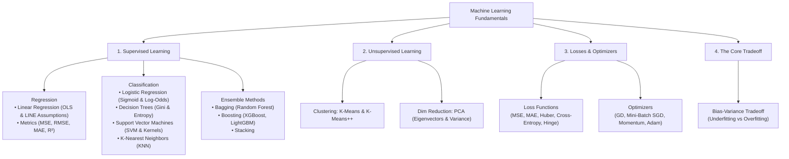
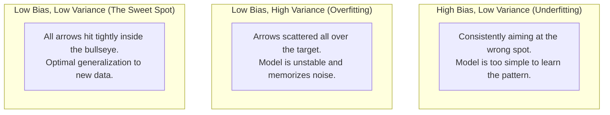
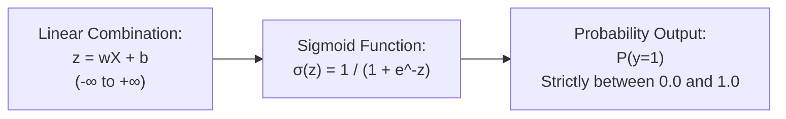
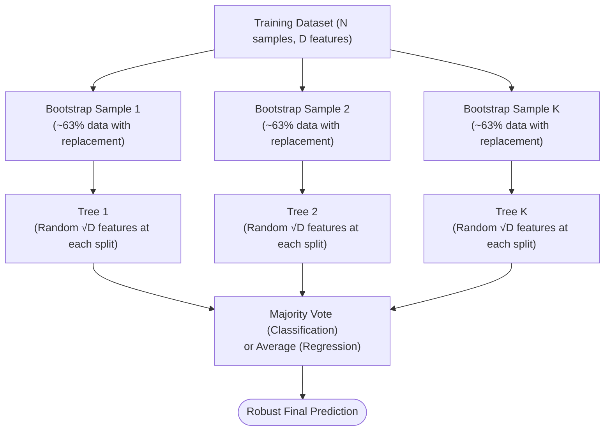
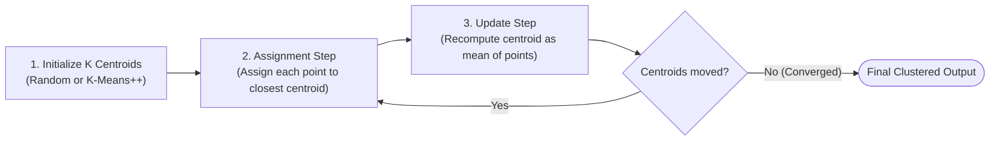

# Machine Learning Core Concepts & Interview Master Guide

> **Simple • Visually Elegant • Interview-Focused • Math Made Intuitive**
> 
> Everything you need to master classical and applied machine learning concepts for technical interviews.
> Every mathematical concept is presented with:
> 1. **Publication-Quality Centered Formulas** (clean LaTeX display equations)
> 2. **Visual Breakdown Tables** (what every symbol means in plain English)
> 3. **Intuitive Real-World Analogies**
> 4. **Direct, Winning Answers to Tough Interview Questions**

---

## 🧭 Companion Guides
- [EXPERIENCE_AND_BACKGROUND.md](EXPERIENCE_AND_BACKGROUND.md) — 🎙️ Rahul's Interview Speaking Guide (WPP, Cognizant, Projects)
- [FASTAPI_MASTER_GUIDE.md](FASTAPI_MASTER_GUIDE.md) — ⚡ FastAPI Concepts & Serving Architecture
- [README_V2.md](README_V2.md) — 8-Level Easy-Learn GenAI & ML Lead Study Guide
- [interview_explanations.md](interview_explanations.md) — 117 Interview Questions & Answers
- [interview_questions.md](interview_questions.md) — Raw Question Bank

---

## 🗺️ Visual Machine Learning Roadmap

---

# Section 1: The Bias-Variance Tradeoff (The Mother of All ML Concepts)

### 🎯 The 10-Second Concept Hook
Every machine learning model makes errors. The total test error comes from two opposing forces: **Bias** (being too simplistic and missing the true pattern) and **Variance** (being too sensitive and memorizing the noise).

---

### 📐 The Mathematical Formulation

$$
\text{Total Expected Error} = \text{Bias}^2 + \text{Variance} + \sigma^2
$$

#### 🔍 Deconstructing the Formula (Visual Legend)

| Symbol | Component Name | Plain-English Meaning | Real-World Target Analogy |
| :---: | :--- | :--- | :--- |
| $\text{Bias}^2$ | **Underfitting Error** | Error from simplistic assumptions (e.g. fitting a straight line to curved data). | Arrows tightly grouped, but far from the bullseye. |
| $\text{Variance}$ | **Overfitting Error** | Sensitivity to small fluctuations in training data (fitting random noise). | Arrows scattered randomly all over the target board. |
| $\sigma^2$ | **Irreducible Error** | Unavoidable noise inherent in measurement tools or data collection. | A gust of wind blowing during the arrow shot. |

---

### 💡 The Archery Target Analogy

---

### 🛠️ How to Fix Each in Production (Interview Cheat Sheet)

| Problem | Symptoms | What It Means | Production Solutions |
| :--- | :--- | :--- | :--- |
| **High Bias** *(Underfitting)* | High Training Error & High Test Error | Model is too simple; unable to learn underlying trends. | 1. Add more features or polynomial terms. 2. Use a more complex model (Tree/Ensemble instead of Linear). 3. Decrease regularization penalty (reduce L1/L2 $\lambda$). |
| **High Variance** *(Overfitting)* | Low Training Error, but High Test Error | Model memorized training noise; fails on unseen data. | 1. Collect more training data. 2. Feature selection (remove noisy/redundant columns). 3. Add regularization (L1 Lasso, L2 Ridge). 4. Prune decision trees (`max_depth`, `min_samples_leaf`). 5. Use bagging ensembles (**Random Forest**). |

---

# Section 2: Linear Regression

### 🎯 The 10-Second Concept Hook
Finds the single best-fitting straight line (or hyperplane) through data points by minimizing the sum of squared vertical distances between predicted and actual values.

---

### 📐 The Mathematical Formulation

#### 1. The Model Equation:

$$
\hat{y} = w_1 x_1 + w_2 x_2 + \dots + w_n x_n + b = \mathbf{w}^T \mathbf{x} + b
$$

#### 2. The Mean Squared Error (Loss Function):

$$
\mathcal{L}_{\text{MSE}} = \frac{1}{N} \sum_{i=1}^{N} \left( y_i - \hat{y}_i \right)^2
$$

#### 🔍 Deconstructing the Formula (Visual Legend)

| Symbol | Mathematical Term | Plain-English Meaning | Real-World Example |
| :---: | :--- | :--- | :--- |
| $\hat{y}$ | Predicted Value | What the model guesses. | Estimated house price: **$480,000** |
| $y_i$ | Ground Truth | The actual real-world value. | Actual selling price: **$500,000** |
| $y_i - \hat{y}_i$ | Residual Error | The vertical gap between reality and prediction. | Error gap: $500,000 - 480,000 =$ **$20,000** |
| $\left(y_i - \hat{y}_i\right)^2$ | Squared Residual | Squares error to make all terms positive and punish large misses. | $20,000^2$ (a $20K error is punished 4x more than a $10K error) |
| $\frac{1}{N} \sum$ | Mean (Average) | The average squared error across all $N$ data points. | Average mistake across all 1,000 houses |

---

### 💡 How Weights are Found: OLS vs. Gradient Descent

#### 1. Ordinary Least Squares (OLS) Closed-Form Formula:

$$
\hat{\mathbf{w}} = \left( \mathbf{X}^T \mathbf{X} \right)^{-1} \mathbf{X}^T \mathbf{y}
$$

#### 🔍 Deconstructing OLS:
| Operation | Expression | Why It's Done |
| :--- | :---: | :--- |
| **Feature Covariance** | $\mathbf{X}^T \mathbf{X}$ | Computes how all features correlate with one another ($d \times d$ matrix). |
| **Matrix Inversion** | $\left( \mathbf{X}^T \mathbf{X} \right)^{-1}$ | The mathematical "division" that finds optimal weights in a single calculation. |
| **Target Projection** | $\mathbf{X}^T \mathbf{y}$ | Projects the target values onto the feature space. |

* **The OLS Tradeoff:** OLS gives the exact mathematical minimum in one step. But matrix inversion takes $\mathcal{O}(d^3)$ compute time. If you have 100,000 features, inverting the matrix crashes memory!
* **When to use Gradient Descent instead:** Use Gradient Descent when you have large datasets ($N > 100,000$ or $d > 10,000$) where matrix inversion is computationally impossible.

---

### ⚠️ The 5 Core Assumptions of Linear Regression (Remember: L.I.N.E.)
Interviewers *always* test these:
1. **L — Linearity:** The relationship between features $X$ and target $y$ is strictly linear.
2. **I — Independence:** Observations and residual errors are independent (no autocorrelation, common in time-series).
3. **N — Normality:** The residual errors $(y - \hat{y})$ are normally distributed around zero.
4. **E — Equal Variance (Homoscedasticity):** Residual error variance is constant across all values of $X$. (If residuals fan out like a megaphone, it is *Heteroscedasticity*).
5. **No Multicollinearity:** Independent features $X$ must not be heavily correlated with each other (checked via Variance Inflation Factor: $\text{VIF} > 5$ indicates high collinearity).

---

### 📊 Evaluation Metrics: MAE vs. MSE vs. RMSE vs. R²

#### 1. Mean Absolute Error (MAE):
$$
\text{MAE} = \frac{1}{N} \sum_{i=1}^{N} \left| y_i - \hat{y}_i \right|
$$
* *Characteristics:* Intuitive, same units as target, highly robust to extreme outliers.

#### 2. Root Mean Squared Error (RMSE):
$$
\text{RMSE} = \sqrt{\frac{1}{N} \sum_{i=1}^{N} \left( y_i - \hat{y}_i \right)^2}
$$
* *Characteristics:* Same units as target, but penalizes large errors heavily. Standard benchmark for regression.

#### 3. R² Score (Coefficient of Determination):
$$
R^2 = 1 - \frac{\sum (y_i - \hat{y}_i)^2}{\sum (y_i - \bar{y})^2} = 1 - \frac{\text{SS}_{\text{residual}}}{\text{SS}_{\text{total}}}
$$
* *Characteristics:* Measures the percentage of variance in $y$ explained by the model (0.0 to 1.0).

#### 4. Adjusted R²:
$$
R^2_{\text{adj}} = 1 - \left[ \frac{(1 - R^2)(N - 1)}{N - p - 1} \right]
$$
* *Characteristics:* Adds an automatic penalty for every additional feature $p$ added to the model, preventing artificial inflation of $R^2$ with useless columns.

---

# Section 3: Logistic Regression

### 🎯 The 10-Second Concept Hook
Despite the word "regression", Logistic Regression is a **classification algorithm**. It models the probability that an input belongs to a particular binary category (e.g., Fraud vs. Normal, Spam vs. Ham).

---

### 📐 The Mathematical Formulation

#### 1. The Sigmoid (Logistic) Function:

$$
P(y = 1 \mid \mathbf{x}) = \sigma(z) = \frac{1}{1 + e^{-z}} \quad \text{where} \quad z = \mathbf{w}^T \mathbf{x} + b
$$

#### 🔍 Deconstructing Sigmoid:

| Value of $z = \mathbf{w}^T \mathbf{x} + b$ | Value of $\sigma(z)$ | Interpretation |
| :---: | :---: | :--- |
| $z \to +\infty$ | $\sigma(z) \to 1.0$ | High certainty of Positive Class |
| $z = 0$ | $\sigma(z) = 0.5$ | Decision Boundary (Standard 50/50 Threshold) |
| $z \to -\infty$ | $\sigma(z) \to 0.0$ | High certainty of Negative Class |

---

#### 2. Odds and Log-Odds (Logit):

$$
\text{Odds} = \frac{p}{1 - p} \qquad \implies \qquad \ln\left( \frac{p}{1 - p} \right) = \mathbf{w}^T \mathbf{x} + b
$$

* *Why this is elegant:* While probability $p$ is constrained between $0$ and $1$, the **log-odds (logit)** is completely linear from $-\infty$ to $+\infty$!

---

#### 3. Binary Cross-Entropy Loss (Log Loss):

$$
\mathcal{L}_{\text{BCE}} = -\frac{1}{N} \sum_{i=1}^{N} \Big[ y_i \ln(\hat{p}_i) + (1 - y_i) \ln(1 - \hat{p}_i) \Big]
$$

#### 🔍 Deconstructing Binary Cross-Entropy:
* **When actual $y = 1$:** The second term $(1 - y)$ cancels to 0. Loss becomes $-\ln(\hat{p})$. If predicted $\hat{p} = 0.99$, loss is near zero; if predicted $\hat{p} = 0.01$, loss explodes toward $+\infty$!
* **When actual $y = 0$:** The first term cancels to 0. Loss becomes $-\ln(1 - \hat{p})$.
* **⚠️ Why NOT use MSE for Logistic Regression?**
  > *"Plugging the non-linear Sigmoid function into MSE creates a **non-convex loss surface with multiple local minima**, causing gradient descent to get stuck. **Binary Cross-Entropy creates a guaranteed convex loss function** with a single global minimum."*

---

# Section 4: Decision Trees

### 🎯 The 10-Second Concept Hook
A Decision Tree makes predictions by recursively partitioning the feature space into orthogonal rectangles using simple sequential if/else questions.

---

### 📐 The Mathematical Formulation: Gini vs. Entropy

#### 1. Gini Impurity (Default in scikit-learn):

$$
I_G(t) = 1 - \sum_{i=1}^{C} p_i^2
$$

* *Pure Node (all samples belong to one class):* $I_G = 1 - (1.0)^2 = \mathbf{0.0}$
* *Maximum Impurity (50/50 split in binary classification):* $I_G = 1 - (0.5^2 + 0.5^2) = \mathbf{0.5}$

#### 2. Shannon Entropy & Information Gain:

$$
H(t) = -\sum_{i=1}^{C} p_i \log_2(p_i)
$$

$$
\text{Information Gain} = H(\text{Parent}) - \sum_{k \in \text{Children}} \frac{N_k}{N_{\text{Parent}}} H(k)
$$

#### 🔍 Gini vs. Entropy Comparison:
| Metric | Computational Cost | Characteristics | Practical Difference |
| :---: | :---: | :--- | :--- |
| **Gini Impurity** | **Fast** (Simple multiplications) | Default in `scikit-learn` CART trees. | In 98% of cases, both produce identical trees. Gini is preferred for speed. |
| **Entropy** | **Slower** (Computes logarithms) | Derived from Information Theory (Claude Shannon). | Slightly favors balanced splits; computationally heavier. |

---

### 🛡️ Decision Tree Overfitting & Pruning
* **Why Trees Overfit:** If unconstrained, a tree will continue splitting until every single training point is isolated in its own leaf node (100% training accuracy, zero generalization).
* **How to Prune (Regularize) in Practice:**
  1. `max_depth`: Limits the maximum number of decision levels (e.g., `max_depth=5`).
  2. `min_samples_split`: Minimum number of samples required to split an internal node.
  3. `min_samples_leaf`: Minimum number of samples required to be at a leaf node.
  4. `ccp_alpha`: Cost-Complexity Pruning penalty parameter.

---

# Section 5: Ensemble Methods & Random Forest

### 🎯 The 10-Second Concept Hook
Instead of relying on a single fallible model, ensemble methods combine predictions from multiple models to achieve superior accuracy and stability.

---

### 🌲 Random Forest: The King of Tabular Machine Learning
Random Forest is an ensemble of hundreds of decision trees trained using **Bagging (Bootstrap Aggregating)** and **Feature Subsampling**.

---

### 📐 The Mathematical Formulation

#### 1. Feature Subsampling Rule:
At each split, trees are only allowed to consider a random subset of $m$ features:

$$
m = \sqrt{D} \quad \text{(for classification)}, \qquad m = \frac{D}{3} \quad \text{(for regression)}
$$

* **Why Feature Subsampling is Genius:** If one feature is overwhelmingly predictive (e.g., `account_balance`), every standard decision tree would pick that feature as the root, making all trees correlated. By forcing trees to pick from random feature subsets, Random Forest **de-correlates the trees**. When independent predictions are averaged, variance drops dramatically.

#### 2. Out-Of-Bag (OOB) Mathematical Proof:
When sampling $N$ rows *with replacement*, the probability of a specific row **never** being picked in $N$ draws is:

$$
P(\text{Not Picked}) = \left( 1 - \frac{1}{N} \right)^N \implies \lim_{N \to \infty} \left( 1 - \frac{1}{N} \right)^N = \frac{1}{e} \approx 0.368 \quad (\mathbf{36.8\%})
$$

* *Why Interviewers Love This:* Roughly **36.8% of the data is never seen by any given tree**. This unselected "Out-Of-Bag" (OOB) data serves as a **free built-in validation test set** without needing a separate train/test split.

---

### 🚀 Bagging vs. Boosting Comparison

| Attribute | Bagging (Random Forest) | Boosting (XGBoost, LightGBM) |
| :--- | :--- | :--- |
| **Architecture** | **Parallel** (Trees built independently) | **Sequential** (Each tree fixes mistakes of previous tree) |
| **Primary Goal** | **Reduces Variance** (Stops overfitting) | **Reduces Bias** (Increases learning power) |
| **Base Estimator** | Deep, complex, unpruned trees | Shallow, weak learners (stumps, depth 3–6) |
| **Outlier Robustness** | High (Averaging cancels out noise) | Low (Iteratively focuses heavily on hard outliers) |
| **Tuning Sensitivity** | Low (Works well out-of-the-box) | High (Requires tuning learning rate, shrinkage, depth) |

---

# Section 6: Support Vector Machines (SVM)

### 🎯 The 10-Second Concept Hook
SVM finds the single optimal decision boundary (hyperplane) that separates classes with the **maximum possible geometric margin** (distance between the line and the closest data points).

---

### 📐 The Mathematical Formulation

#### 1. The Geometric Margin Equation:

$$
\text{Margin} = \frac{2}{\|\mathbf{w}\|}
$$

* To maximize the margin, we minimize $\frac{1}{2} \|\mathbf{w}\|^2$.

#### 2. Soft Margin Optimization Objective with Slack Variables ($\xi_i$):

$$
\min_{\mathbf{w}, b, \xi} \frac{1}{2} \|\mathbf{w}\|^2 + C \sum_{i=1}^{N} \xi_i \quad \text{subject to} \quad y_i(\mathbf{w}^T \mathbf{x}_i + b) \ge 1 - \xi_i
$$

#### 🔍 Deconstructing the Soft Margin Parameter ($C$):

| Value of $C$ | Penalty for Errors | Margin Width | Behavior & Risk |
| :---: | :--- | :---: | :--- |
| **Large $C$** | Strict penalty for misclassifications | Narrow margin | Tries to classify every training point correctly. **Risks Overfitting.** |
| **Small $C$** | Tolerates some margin violations | Wide margin | Allows some misclassifications in exchange for smoother generalization. **Risks Underfitting.** |

---

### 🪄 The Kernel Trick: Solving Non-Linear Data
* **The Concept:** When data is not linearly separable in 2D (e.g. concentric circles), SVM projects points into higher-dimensional space where a flat plane can separate them.
* **The Magic:** Calculating high-dimensional coordinates is computationally expensive. The Kernel Trick computes the **inner dot product in high-dimensional space without ever actually transforming the data points into that space!**

#### The Radial Basis Function (RBF / Gaussian) Kernel:

$$
K(\mathbf{x}_i, \mathbf{x}_j) = \exp\left( -\gamma \|\mathbf{x}_i - \mathbf{x}_j\|^2 \right)
$$

* *Parameter $\gamma$ (gamma):* Controls the radius of influence of a single training point:
  - **High $\gamma$:** Tight, wiggly decision boundary around individual points (**Overfitting**).
  - **Low $\gamma$:** Broad, smooth decision boundary (**Underfitting**).

---

# Section 7: Principal Component Analysis (PCA)

### 🎯 The 10-Second Concept Hook
An **unsupervised linear dimensionality reduction technique** that compresses 100 correlated features into 5 uncorrelated features, while retaining 95% of the original variance (information).

---

### 📐 The Mathematical Formulation in 4 Steps

#### Step 1: Standardize Features (Zero Mean, Unit Variance):
$$
z_j = \frac{x_j - \mu_j}{\sigma_j}
$$

#### Step 2: Compute the Covariance Matrix:
$$
\mathbf{\Sigma} = \frac{1}{N - 1} \mathbf{X}^T \mathbf{X}
$$

#### Step 3: Compute Eigenvectors ($\mathbf{v}$) and Eigenvalues ($\lambda$):
$$
\mathbf{\Sigma} \mathbf{v} = \lambda \mathbf{v}
$$

#### 🔍 Deconstructing Eigenvectors & Eigenvalues:
| Component | Mathematical Role | Plain-English Meaning |
| :---: | :---: | :--- |
| **Eigenvector ($\mathbf{v}$)** | Direction Vector | The *spatial orientation* of the new axis of maximum spread. |
| **Eigenvalue ($\lambda$)** | Scalar Magnitude | The *amount of variance* captured along that axis. |

#### Step 4: Explained Variance Ratio:
$$
\text{Explained Variance Ratio}_k = \frac{\lambda_k}{\sum_{j=1}^{D} \lambda_j}
$$

---

### ⚠️ Two Fundamental Properties of PCA to Quote in Interviews
1. **Orthogonality:** All principal components are strictly perpendicular (orthogonal, 90 degrees) to one another. This means **every principal component has a correlation of exactly 0.0 with every other component**, completely eliminating multicollinearity!
2. **Unsupervised:** PCA ignores target labels $y$. It only analyzes the geometric spread of features $X$.

---

# Section 8: K-Nearest Neighbors (KNN)

### 🎯 The 10-Second Concept Hook
A simple, non-parametric algorithm based on proximity: *"Tell me who your $K$ closest neighbors are, and I will tell you who you are."*

---

### 📐 Distance Formulas

#### 1. Euclidean Distance ($L_2$ Norm):
$$
d(\mathbf{p}, \mathbf{q}) = \sqrt{\sum_{i=1}^{n} (p_i - q_i)^2}
$$

#### 2. Manhattan Distance ($L_1$ Norm):
$$
d(\mathbf{p}, \mathbf{q}) = \sum_{i=1}^{n} |p_i - q_i|
$$

---

### ⚠️ How to Choose $K$ & The Curse of Dimensionality

| Choice of $K$ | Model Complexity | Behavior & Risk |
| :---: | :---: | :--- |
| **$K = 1$** | Maximum Complexity | Overfitting (high variance). Model is sensitive to every single noisy outlier. |
| **$K = \text{Large}$ (e.g. 200)** | Overly Simple | Underfitting (high bias). Model predicts the majority class everywhere. |
| **Rule of Thumb** | Balanced | Set $K = \sqrt{N}$ (choose an odd number to prevent 50/50 voting ties). |

* **The Curse of Dimensionality:** In 100D space, the volume grows exponentially. All data points become roughly equidistant from one another! Distance metrics lose all distinguishing power.
* *Production Fix:* Always run **PCA or feature selection** before applying KNN, and **always scale features**.

---

# Section 9: K-Means Clustering

### 🎯 The 10-Second Concept Hook
An **unsupervised partitioning algorithm** that groups unlabeled data points into $K$ distinct clusters by minimizing the distance from points to their cluster center (centroid).

---

### 📐 The Mathematical Objective (Inertia / WCSS)

$$
\mathcal{J}_{\text{WCSS}} = \sum_{k=1}^{K} \sum_{\mathbf{x} \in S_k} \|\mathbf{x} - \boldsymbol{\mu}_k\|^2
$$

#### 🔍 Deconstructing the Formula:
* $S_k$: The set of points assigned to cluster $k$.
* $\boldsymbol{\mu}_k$: The mean coordinate (centroid) of cluster $k$.
* $\mathcal{J}_{\text{WCSS}}$: Within-Cluster Sum of Squares. K-Means iteratively minimizes this value.

---

### 💡 The K-Means Iteration (Lloyd's Algorithm)

---

### ⚠️ K-Means++: Why Standard Initialization Fails
* **The Problem:** If two initial centroids accidentally start right next to each other, K-Means converges to a terrible local minimum.
* **The Solution (K-Means++):** Picks the 1st centroid randomly. Each subsequent centroid is chosen from remaining points with a probability proportional to its squared distance from the nearest existing centroid:

$$
P(x) = \frac{D(x)^2}{\sum_{x'} D(x')^2}
$$

* This guarantees initial centroids start spread far apart across the data space!

---

### 📏 How to Choose $K$: Elbow Method vs. Silhouette Score

#### 1. The Elbow Method:
Plots WCSS against $K$. Look for the bend ("elbow") where adding more clusters yields diminishing returns.

#### 2. The Silhouette Score (Ranges from -1.0 to +1.0):

$$
s(i) = \frac{b(i) - a(i)}{\max(a(i), b(i))}
$$

| Metric | Definition | Interpretation |
| :---: | :--- | :--- |
| $a(i)$ | Mean intra-cluster distance | How close point $i$ is to other points in its **own** cluster. |
| $b(i)$ | Mean nearest-cluster distance | Distance from point $i$ to points in the **closest neighboring** cluster. |
| **Score $\approx +1.0$** | $b(i) \gg a(i)$ | Excellent! Point is compact inside its cluster and far from neighbors. |
| **Score $\approx 0.0$** | $b(i) \approx a(i)$ | Overlapping clusters; point is on the decision boundary. |
| **Score $< 0.0$** | $b(i) < a(i)$ | Point has been assigned to the wrong cluster. |

---

# Section 10: Loss Functions Master Cheat Sheet

---

### 1. Regression Losses

#### Mean Squared Error (MSE / $L_2$ Loss):
$$
\mathcal{L}_{\text{MSE}} = \frac{1}{N} \sum_{i=1}^{N} (y_i - \hat{y}_i)^2
$$
* *When to use:* Differentiable everywhere. Penalizes large errors heavily; use when big errors are catastrophic.

#### Mean Absolute Error (MAE / $L_1$ Loss):
$$
\mathcal{L}_{\text{MAE}} = \frac{1}{N} \sum_{i=1}^{N} |y_i - \hat{y}_i|
$$
* *When to use:* Robust to extreme outliers. Gradient is constant ($\pm 1$).

#### Huber Loss (Smooth $L_1$ Loss):
$$
\mathcal{L}_\delta(y, \hat{y}) = \begin{cases} \frac{1}{2}(y - \hat{y})^2 & \text{for } |y - \hat{y}| \le \delta \\ \delta |y - \hat{y}| - \frac{1}{2}\delta^2 & \text{otherwise} \end{cases}
$$
* *When to use:* **The best of both worlds**: quadratic like MSE for small errors, but linear like MAE for large errors.

---

### 2. Classification Losses

#### Binary Cross-Entropy (Log Loss):
$$
\mathcal{L}_{\text{BCE}} = -\frac{1}{N} \sum_{i=1}^{N} \Big[ y_i \ln(\hat{p}_i) + (1 - y_i) \ln(1 - \hat{p}_i) \Big]
$$

#### Multi-Class Categorical Cross-Entropy (Paired with Softmax):
$$
\mathcal{L}_{\text{CCE}} = -\sum_{c=1}^{C} y_c \ln(\hat{p}_c)
$$

#### Hinge Loss (Used in Support Vector Machines):
$$
\mathcal{L}_{\text{Hinge}} = \max\left( 0, 1 - y \cdot \hat{y} \right) \quad \text{where } y \in \{-1, +1\}
$$
* *When to use:* Maximizes margins. Penalizes predictions that violate the margin boundary.

---

# Section 11: Optimizers & Gradient Descent

---

### 🎯 The 10-Second Concept Hook
An optimizer updates model weights $\mathbf{w}$ in the opposite direction of the gradient $\nabla \mathcal{L}$ to reach the lowest point of the loss landscape.

---

### 📐 Mathematical Evolution of Optimizers

#### 1. Standard Gradient Descent (SGD):
$$
\mathbf{w}_{t+1} = \mathbf{w}_t - \eta \nabla \mathcal{L}(\mathbf{w}_t)
$$
* $\eta$ is the learning rate. Oscillates wildly across steep ravines.

#### 2. SGD with Momentum (The Bowling Ball Analogy):
$$
\mathbf{v}_{t+1} = \beta \mathbf{v}_t + (1 - \beta) \nabla \mathcal{L}(\mathbf{w}_t), \qquad \mathbf{w}_{t+1} = \mathbf{w}_t - \eta \mathbf{v}_{t+1}
$$
* *Analogy:* Like a heavy bowling ball rolling downhill. It builds momentum along consistent directions and rolls right through small bumps and saddle points.

#### 3. RMSprop (Adaptive Learning Rate):
$$
\mathbf{s}_{t+1} = \gamma \mathbf{s}_t + (1 - \gamma) [\nabla \mathcal{L}(\mathbf{w}_t)]^2, \qquad \mathbf{w}_{t+1} = \mathbf{w}_t - \frac{\eta}{\sqrt{\mathbf{s}_{t+1}} + \epsilon} \nabla \mathcal{L}(\mathbf{w}_t)
$$
* Divides the learning rate by the running root-mean-square of recent gradients. Takes smaller steps in steep directions and larger steps in flat directions.

#### 4. Adam (Adaptive Moment Estimation — The Production King):
$$
\mathbf{m}_t = \beta_1 \mathbf{m}_{t-1} + (1 - \beta_1) g_t \quad \text{(1st Moment: Momentum / Mean)}
$$

$$
\mathbf{v}_t = \beta_2 \mathbf{v}_{t-1} + (1 - \beta_2) g_t^2 \quad \text{(2nd Moment: RMSprop / Variance)}
$$

$$
\mathbf{w}_{t+1} = \mathbf{w}_t - \frac{\eta}{\sqrt{\hat{\mathbf{v}}_t} + \epsilon} \hat{\mathbf{m}}_t
$$

* **Why Adam is the universal default:** Combines the best of **Momentum** (smooth directional velocity) with **RMSprop** (adaptive per-parameter learning rates).

---

# Section 12: Top 10 Rapid-Fire ML Interview Questions & Winning Answers

---

### Q1: "What is the difference between L1 (Lasso) and L2 (Ridge) Regularization?"
**Winning Answer:**
> *"L1 Regularization adds the absolute values of weights ($\lambda \sum |w|$), driving non-essential feature weights completely to **zero**, which performs automatic feature selection. 
> L2 Regularization adds the squared values of weights ($\lambda \sum w^2$), shrinking weights smoothly towards zero but **never setting them to absolute zero**, which is ideal when all features have small, shared predictive power."*

---

### Q2: "Why do we scale features before running PCA, KNN, or SVM, but not for Decision Trees?"
**Winning Answer:**
> *"Algorithms like PCA, KNN, and SVM rely directly on **Euclidean distance or variance calculations**. If one feature is measured in kilograms (0 to 100) and another in salary ($20,000 to $200,000), the salary feature will completely dominate the distance math. 
> Decision Trees do not use distance; they evaluate **monotonic order splits on one feature at a time** (e.g., $X_1 > 50$), so the scale of other features has zero effect on split purity."*

---

### Q3: "What is the difference between Bagging and Boosting?"
**Winning Answer:**
> *"Bagging builds multiple independent models in parallel on random data subsets and averages their outputs to **reduce variance (overfitting)**, as seen in Random Forest. 
> Boosting builds models sequentially where each new model learns specifically from the residual errors of prior models to **reduce bias (underfitting)**, as seen in XGBoost."*

---

### Q4: "Why can't we use standard accuracy to evaluate an anomaly detection model?"
**Winning Answer:**
> *"Because of the **Class Imbalance Problem**. In fraud or anomaly detection, 99.9% of transactions are legitimate and only 0.1% are fraudulent. A naive model that predicts 'Not Fraud' 100% of the time achieves 99.9% accuracy while catching zero fraud. 
> Instead, we evaluate with **Precision, Recall, F1-Score, or PR-AUC**, which directly measure performance on the rare positive class."*

---

### Q5: "What is the difference between Precision and Recall?"
**Winning Answer:**
> *"**Precision** measures: *Of all items the model predicted as positive, how many were actually positive?* (Critical in spam detection where false positives annoy users). 
> **Recall** measures: *Of all actual positive cases in reality, how many did the model capture?* (Critical in cancer detection and fraud where a false negative is lethal)."*

---

### Q6: "What is Out-Of-Bag (OOB) Error in Random Forest?"
**Winning Answer:**
> *"When Random Forest bootstraps training data with replacement, roughly **36.8% of training samples are never selected** for that specific tree. These unselected samples form the Out-Of-Bag (OOB) dataset, which acts as a free, built-in validation test set without needing a separate train/validation split."*

---

### Q7: "What is the curse of dimensionality, and how do you combat it?"
**Winning Answer:**
> *"As the number of feature dimensions grows, the volume of the feature space increases exponentially, making data points extremely sparse and equidistant from each other. This renders distance-based algorithms like KNN and K-Means ineffective. 
> We combat it using **dimensionality reduction techniques like PCA**, feature selection, or L1 Lasso regularization."*

---

### Q8: "How does Gradient Boosting work in simple terms?"
**Winning Answer:**
> *"Gradient Boosting starts by making a simple baseline prediction (like the average value). Then, it calculates the **residuals (errors)** between the actual values and predictions. A shallow decision tree is trained to predict those residuals. The new tree's predictions are multiplied by a small learning rate and added to the ensemble, iteratively shrinking errors step-by-step."*

---

### Q9: "What is the difference between Parametric and Non-Parametric models?"
**Winning Answer:**
> *"**Parametric models** (like Linear Regression, Logistic Regression) assume a fixed mathematical form with a predetermined number of parameters that do not grow with data size. 
> **Non-parametric models** (like KNN, Decision Trees, SVM with RBF) make no rigid assumptions about the data distribution; their complexity and parameters can grow dynamically as more training data is added."*

---

### Q10: "How do you detect and fix multicollinearity in a dataset?"
**Winning Answer:**
> *"We detect multicollinearity using a correlation matrix heatmap and the **Variance Inflation Factor (VIF)**, where a VIF score above 5 to 10 indicates high collinearity. 
> We fix it by **dropping one of the correlated features**, combining correlated features using **PCA**, or applying **L2 Ridge Regularization**, which stabilizes weight estimation when features are correlated."*

---

## 🎯 3-Point Mental Checklist Before Any ML Interview

1. **Know the trade-off:** Underfitting = High Bias (fix with complexity); Overfitting = High Variance (fix with data, regularization, and bagging).
2. **Know when to scale:** Distance-based models (KNN, K-Means, SVM, PCA) MUST be scaled; Tree-based models (Decision Tree, Random Forest, XGBoost) do NOT need scaling.
3. **Know your metrics:** Never quote accuracy on imbalanced data; always discuss Precision, Recall, F1-Score, and ROC-AUC.
