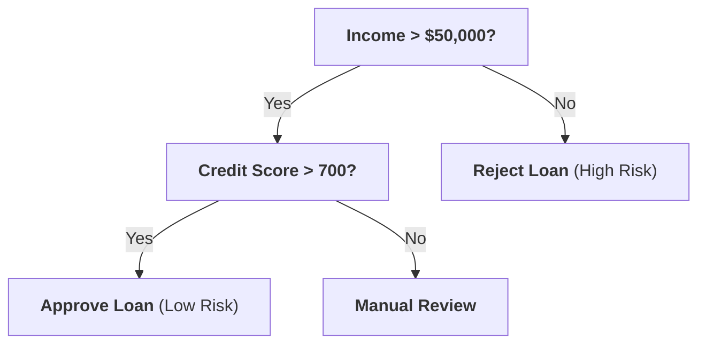

# Machine Learning Core Concepts (Concise Interview Cheat-Sheet)

> **Simple • Visual • High-Yield • Ready for Basic ML Interviews**
> 
> A clean, concise guide covering only what matters for clearing technical Machine Learning interview rounds.
> Every concept has:
> 1. **The 1-Sentence Recital Definition** (What to say out loud)
> 2. **A Simple Visual Graph** (So you can picture it immediately)
> 3. **How It Works in 2–3 Bullets** (No unnecessary math fluff)
> 4. **The #1 Interview Question & Direct Answer**

---

## 🧭 Companion Guides
- [EXPERIENCE_AND_BACKGROUND.md](EXPERIENCE_AND_BACKGROUND.md) — 🎙️ Rahul's Career Speaking Guide (WPP, Cognizant, Flagship Projects)
- [FASTAPI_MASTER_GUIDE.md](FASTAPI_MASTER_GUIDE.md) — ⚡ FastAPI Concepts & Serving Architecture
- [README_V2.md](README_V2.md) — 8-Level GenAI & Architecture Master Guide
- [interview_explanations.md](interview_explanations.md) — 117 Recruiter Questions & Deep Explanations

---

# 1. Bias-Variance Tradeoff

### 🎙️ The Definition to Recite:
> *"The Bias-Variance tradeoff is the tension between a model that is too simple (High Bias / Underfitting) and one that is too complex (High Variance / Overfitting). The goal is finding the optimal capacity that minimizes total test error."*

  

* **High Bias (Underfitting):** Model is too basic and misses true relationships. High training error and high test error.
  - *Fix:* Increase model complexity, engineer new features, reduce regularization.
* **High Variance (Overfitting):** Model memorizes the training data and noise. Low training error, but high test error.
  - *Fix:* Add more training data, apply L1/L2 regularization, prune decision trees, use Random Forest.

> 💡 **The #1 Interview Question:** *"How do you diagnose underfitting vs. overfitting?"*  
> **Answer:** *"If training error is high, the model is underfitting (high bias). If training error is low but test/validation error is high, the model is overfitting (high variance)."*

---

# 2. Linear Regression

### 🎙️ The Definition to Recite:
> *"Linear Regression models the linear relationship between predictor features and a continuous target variable by fitting a straight line that minimizes Mean Squared Error (MSE)."*

  

* **Formula:** `Prediction = (Weight * Feature) + Bias`
* **How It Works:** Finds weights that minimize vertical residual errors ($e = y - \hat{y}$).
* **Key Metrics:**
  - **MSE (Mean Squared Error):** Average squared error; penalizes large mistakes heavily.
  - **MAE (Mean Absolute Error):** Average absolute error; robust to outliers.
  - **R-squared ($R^2$):** Percentage of variance in the target explained by features (0.0 to 1.0).

> 💡 **The #1 Interview Question:** *"What are the 4 core assumptions of Linear Regression?"*  
> **Answer:** *"Remember L.I.N.E.: **L**inearity between features and target, **I**ndependence of residual errors, **N**ormality of residuals, and **E**qual error variance (Homoscedasticity)."*

---

# 3. Logistic Regression

### 🎙️ The Definition to Recite:
> *"Logistic Regression is a classification algorithm that predicts the probability of a binary outcome by passing a linear combination of features through the Sigmoid function, mapping any score to a value between 0 and 1."*

  

* **The Sigmoid Function:** `P(y=1) = 1 / (1 + e^(-z))`
* **Decision Boundary:** By default, threshold is **0.5** ($z = 0$). If $P \ge 0.5$, predict Class 1; otherwise Class 0.
* **Loss Function:** Uses **Binary Cross-Entropy (Log Loss)** instead of Mean Squared Error.

> 💡 **The #1 Interview Question:** *"Why can't we use Mean Squared Error (MSE) for Logistic Regression?"*  
> **Answer:** *"Using MSE with a non-linear Sigmoid function produces a bumpy, non-convex loss surface with local minima where gradient descent gets stuck. Binary Cross-Entropy produces a strictly convex bowl-shaped curve with one global minimum."*

---

# 4. Naive Bayes Classifier

### 🎙️ The Definition to Recite:
> *"Naive Bayes is a probabilistic classifier based on Bayes' Theorem that calculates the probability of each class given input features, assuming all features are completely independent of one another."*

* **Why is it called 'Naive'?:** In real life, features are rarely independent (e.g., words like 'free' and 'offer' often appear together in spam). It is 'naive' because it ignores feature correlations.
* **Why it still works well:** In classification, we only care about which class has the highest score, not the exact probability value.
* **Common Use Cases:** Text classification, spam filtering, sentiment analysis.

> 💡 **The #1 Interview Question:** *"What is the Zero-Frequency problem and how do you fix it?"*  
> **Answer:** *"If a word never appeared in training with a specific class, its probability is 0, which zeroes out the whole calculation. We fix it using **Laplace Smoothing** (adding 1 to the numerator) so no probability is ever zero."*

---

# 5. Decision Trees

### 🎙️ The Definition to Recite:
> *"A Decision Tree is a supervised learning model that splits data into smaller subsets by asking a hierarchy of sequential If/Else questions based on feature thresholds."*

* **Splitting Criteria:**
  - **Gini Impurity:** Measures node messiness ($0.0$ = completely pure, all one class). CART trees split to minimize Gini.
  - **Entropy & Information Gain:** Measures uncertainty reduction.
* **Major Weakness:** High variance (deep trees easily overfit and memorize training data).
* **Prevention:** Pre-pruning (`max_depth`, `min_samples_leaf`) and post-pruning.

> 💡 **The #1 Interview Question:** *"Why do Decision Trees not require feature scaling?"*  
> **Answer:** *"Because splits evaluate only one single feature at a time (e.g., `Age > 30`). The order of split values doesn't change whether a feature is scaled or not."*

---

# 6. Ensemble Methods: Random Forest & Boosting

### 🎙️ The Definition to Recite:
> *"Ensemble methods combine predictions from multiple individual models. The two primary approaches are Bagging (training independent trees in parallel to reduce variance) and Boosting (training trees sequentially to reduce bias)."*

  <b>Bagging (Random Forest) vs. Boosting (XGBoost)</b>

| Feature | Bagging (Random Forest) | Boosting (XGBoost / LightGBM) |
| :--- | :--- | :--- |
| **Training** | **Parallel** (Trees built independently) | **Sequential** (Each tree fixes mistakes of prior trees) |
| **Goal** | **Reduces Variance** (Stops overfitting) | **Reduces Bias** (Improves accuracy) |
| **Base Trees** | Deep, complex trees | Shallow, weak learners (depth 3–6) |

* **Random Forest Magic:**
  1. **Bootstrap Samples:** Each tree trains on a random subset of data drawn with replacement.
  2. **Feature Subsampling:** Each split selects from a random subset of features ($\sqrt{D}$), which **de-correlates the trees**.
  3. **Out-of-Bag (OOB) Error:** ~36.8% of data is left out of each tree, providing free built-in validation.

> 💡 **The #1 Interview Question:** *"Why is Random Forest better than a single Decision Tree?"*  
> **Answer:** *"A single tree has high variance and overfits. Random Forest trains many diverse, de-correlated trees on random data and features; averaging their votes cancels out individual errors, drastically reducing variance."*

---

# 7. Support Vector Machines (SVM)

### 🎙️ The Definition to Recite:
> *"Support Vector Machines are supervised models that find the optimal separating hyperplane that maximizes the margin (distance) between classes."*

  

* **Support Vectors:** The critical data points closest to the hyperplane that rest directly on the margin boundaries. If you move other points, the boundary doesn't change.
* **Hyperparameter C:**
  - **High C:** Strict margin, allows few errors (risks overfitting).
  - **Low C:** Wide margin, tolerates some misclassifications (better generalization).
* **The Kernel Trick:** Maps non-linearly separable data into a higher dimension where a linear boundary can separate them (e.g., RBF Kernel).

> 💡 **The #1 Interview Question:** *"What is the Kernel Trick in simple words?"*  
> **Answer:** *"It allows an SVM to solve non-linear problems by computing relationships in a higher-dimensional space without ever actually calculating the complex coordinates in that space."*

---

# 8. K-Nearest Neighbors (KNN)

### 🎙️ The Definition to Recite:
> *"K-Nearest Neighbors is an instance-based lazy learner that performs no explicit training; it stores the entire dataset and classifies a new query point by taking the majority vote of its K closest neighbors."*

  

* **Choosing K:**
  - Small $K$ ($K = 1$): Sensitive to noise and outliers (overfitting).
  - Large $K$ ($K = 50$): Smooth boundary, biased toward majority class (underfitting).
  - Rule of thumb: $K \approx \sqrt{N}$, chosen as an odd number for binary classification.
* **Curse of Dimensionality:** In high-dimensional spaces, points become equidistant, breaking distance metrics. Always use PCA or feature selection first.

> 💡 **The #1 Interview Question:** *"Why is feature scaling mandatory before running KNN?"*  
> **Answer:** *"KNN calculates physical Euclidean distances. If Salary is $100,000 and Age is 30, the salary numbers will completely dominate the distance calculation unless both features are scaled."*

---

# 9. K-Means Clustering

### 🎙️ The Definition to Recite:
> *"K-Means is an unsupervised clustering algorithm that groups unlabeled data into K clusters by minimizing the sum of squared distances between points and their assigned cluster centroids."*

  

* **How It Works (Lloyd's Algorithm):**
  1. Pick $K$ centroids.
  2. Assign each point to its nearest centroid.
  3. Recompute centroid coordinates as the average (mean) of all assigned points.
  4. Repeat until centroids stop moving.
* **How to Choose K:** Use the **Elbow Method** (plot Inertia vs. $K$ and find the bend where returns diminish).
* **K-Means++:** Initializes centroids far apart from each other probabilistically, preventing bad local minimum traps.

> 💡 **The #1 Interview Question:** *"What are the limitations of K-Means?"*  
> **Answer:** *"You must specify K in advance, it only finds spherical/circular clusters (fails on complex non-convex shapes), and it is sensitive to outliers. For arbitrary shapes, DBSCAN is preferred."*

---

# 10. Principal Component Analysis (PCA)

### 🎙️ The Definition to Recite:
> *"PCA is an unsupervised linear dimensionality reduction technique that transforms correlated features into a smaller set of uncorrelated, orthogonal variables called Principal Components, ranked by the variance they explain."*

  

* **How It Works:**
  1. Standardize features.
  2. Compute Covariance Matrix.
  3. Calculate Eigenvectors (directions of maximum spread) and Eigenvalues (amount of variance).
  4. Project data onto the top $K$ components.
* **Key Property:** All principal components are at **90-degree angles (orthogonal)**, meaning correlation between components is strictly **0.0** (eliminates multicollinearity).

> 💡 **The #1 Interview Question:** *"When do you use PCA in production?"*  
> **Answer:** *"When dealing with high-dimensional tabular data to reduce training time, remove multicollinearity before running linear models, or visualize high-dimensional clusters in 2D."*

---

# 11. Loss Functions & Optimizers (Cheat Sheet)

### 📊 Loss Functions at a Glance

| Loss Function | Use Case | What It Does |
| :--- | :--- | :--- |
| **MSE (Mean Squared Error)** | Regression | Squared errors: `(Actual - Predicted)^2`. Penalizes big errors heavily; outlier-sensitive. |
| **MAE (Mean Absolute Error)** | Regression | Absolute errors: `\|Actual - Predicted\|`. Robust to outliers. |
| **Binary Cross-Entropy** | Binary Classification | Penalizes confident wrong probability guesses exponentially. |
| **Categorical Cross-Entropy**| Multi-Class Classification | Standard multi-class loss paired with Softmax outputs. |

---

### ⚙️ Optimizers at a Glance

* **SGD (Stochastic Gradient Descent):** Updates weights using 1 sample per step. Fast, but oscillates erratically.
* **Momentum:** Adds velocity from past gradients to smooth out oscillations and accelerate through flat areas.
* **Adam (Industry Universal Default):** Combines **Momentum** (speed in right direction) with **RMSprop** (adaptive learning rates per parameter).

---

# 12. Model Evaluation & Classification Metrics

  

* **Accuracy:** `(TP + TN) / Total`
  - *Trap:* Fails on imbalanced data! In 99% non-fraud, guessing "No Fraud" gives 99% accuracy while detecting zero fraud.
* **Precision:** `TP / (TP + FP)`
  - *"Of all positive predictions, how many were right?"*
  - **Priority:** When false alarms are costly (e.g., Spam filtering, YouTube recommendations).
* **Recall (Sensitivity):** `TP / (TP + FN)`
  - *"Of all actual positives, how many did we catch?"*
  - **Priority:** When missing a positive is dangerous (e.g., Cancer detection, Fraud detection).
* **F1-Score:** Harmonic mean of Precision and Recall (`2 * (P * R) / (P + R)`). Best for imbalanced datasets.

---

# 13. Top 10 Rapid-Fire Basic ML Interview Q&A

---

### Q1: "What is the difference between L1 (Lasso) and L2 (Ridge) Regularization?"
> *"**L1 (Lasso)** adds a penalty on the absolute values of weights, driving non-important weights to **exactly zero** (feature selection).  
> **L2 (Ridge)** adds a penalty on squared weights, shrinking weights close to zero without eliminating them (handles multicollinearity)."*

---

### Q2: "Why is accuracy misleading for imbalanced datasets?"
> *"If 99.9% of transactions are legitimate, a dumb model that always predicts 'Legitimate' achieves 99.9% accuracy but catches zero fraud. We evaluate using **Precision, Recall, or F1-Score** instead."*

---

### Q3: "What is the difference between Parametric and Non-Parametric models?"
> *"**Parametric models** (Linear/Logistic Regression) assume a fixed formula with a fixed number of weights regardless of data size.  
> **Non-parametric models** (Decision Trees, KNN) make no rigid structural assumptions; model capacity grows as data grows."*

---

### Q4: "What causes Data Leakage and how do you prevent it?"
> *"Data leakage occurs when test information contaminates training. The most common cause is fitting feature scalers (`StandardScaler.fit()`) on the whole dataset before splitting. Always split first, then fit transformers strictly on training data only."*

---

### Q5: "What is the difference between Bagging and Boosting?"
> *"**Bagging** (Random Forest) trains independent trees in parallel to **reduce variance (overfitting)**.  
> **Boosting** (XGBoost) trains weak trees sequentially, where each new tree fixes the mistakes of the previous one to **reduce bias (underfitting)**."*

---

### Q6: "Why is feature scaling required for SVM and KNN, but not Decision Trees?"
> *"SVM and KNN calculate geometric distances between numbers, so large-scale features dominate. Decision Trees only compare values within one feature independently (e.g., `Age > 30`), so scale doesn't matter."*

---

### Q7: "What is Multicollinearity and how do you fix it?"
> *"Multicollinearity means two or more features are strongly correlated with each other. It is diagnosed using a correlation matrix or VIF $> 5$, and fixed by dropping one of the duplicate features, using PCA, or applying L2 Ridge regularization."*

---

### Q8: "What is Out-Of-Bag (OOB) error in Random Forest?"
> *"When bootstrapping rows with replacement, approximately 36.8% of data is left out of each tree. Evaluating trees on their unused rows provides a built-in cross-validation score without needing a separate test set."*

---

### Q9: "When would you choose DBSCAN over K-Means?"
> *"When clusters have arbitrary, non-spherical shapes (like concentric circles) or when the data has heavy noise/outliers that shouldn't be forced into any cluster."*

---

### Q10: "What is the difference between ROC-AUC and PR-AUC?"
> *"**ROC-AUC** evaluates True Positive Rate vs. False Positive Rate across balanced datasets.  
> **PR-AUC** evaluates Precision vs. Recall and is mandatory for **heavily imbalanced datasets** (e.g., 0.1% fraud) because it focuses exclusively on the minority class."*

---

## 🎯 3 Golden Takeaways for Your Interview
1. **Bias vs. Variance:** Underfitting = High Bias (increase capacity); Overfitting = High Variance (regularize, prune, or bag).
2. **Feature Scale:** Always know whether an algorithm relies on physical distance (KNN, SVM, PCA) or single-feature rules (Decision Trees).
3. **Imbalanced Targets:** Never report raw accuracy for fraud or rare events; always evaluate Precision, Recall, and F1-Score.
