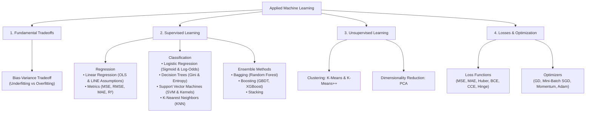

# Machine Learning Core Concepts (Interview-Ready Study Guide)

> **Clear • Professional • Direct Definitions • Ready to Recite**
> 
> A structured guide designed for technical machine learning interviews.
> Every concept provides:
> 1. **The Exact Definition to Recite** (Clear, professional, and easy to memorize)
> 2. **Core Mathematical Formulation** (Clean display equations)
> 3. **How the Algorithm Operates** (Step-by-step mechanics)
> 4. **Key Assumptions & Trade-Offs** (What interviewers always test)
> 5. **Direct 30-Second Interview Answers**

---

## 🧭 Companion Guides
- [EXPERIENCE_AND_BACKGROUND.md](EXPERIENCE_AND_BACKGROUND.md) — 🎙️ Rahul's Interview Speaking Guide (WPP, Cognizant, Projects)
- [FASTAPI_MASTER_GUIDE.md](FASTAPI_MASTER_GUIDE.md) — ⚡ FastAPI Concepts & Serving Architecture
- [README_V2.md](README_V2.md) — 8-Level Easy-Learn GenAI & ML Lead Study Guide
- [interview_explanations.md](interview_explanations.md) — 117 Interview Questions & Answers
- [interview_questions.md](interview_questions.md) — Raw Question Bank

---

## 🗺️ Machine Learning Curriculum Map

---

# Section 1: The Bias-Variance Tradeoff

### 🎙️ The Definition to Recite:
> *"The Bias-Variance tradeoff is the fundamental tension in supervised machine learning between a model's complexity and its ability to generalize to unseen data. Total expected prediction error consists of three additive components: Bias squared, Variance, and Irreducible error."*

---

### 📐 The Mathematical Decomposition

$$
\text{Total Error} = \text{Bias}^2 + \text{Variance} + \sigma^2
$$

| Term | Technical Definition | What It Indicates |
| :---: | :--- | :--- |
| **$\text{Bias}^2$** | The error introduced by approximating a complex real-world phenomenon with an overly simplistic model. | **Underfitting**: High training error and high test error. |
| **$\text{Variance}$** | The error introduced by a model being overly sensitive to random fluctuations in the training dataset. | **Overfitting**: Very low training error, but high test error. |
| **$\sigma^2$** | Irreducible noise inherent in the data collection process itself. | The theoretical minimum error lower-bound. |

---

### 🛠️ Practical Solutions (Interview Checklist)

* **To Fix High Bias (Underfitting):**
  1. Increase model capacity (e.g., transition from linear models to tree-based or non-linear models).
  2. Engineer new interaction terms or polynomial features.
  3. Decrease regularization penalties (reduce L1/L2 $\lambda$).
* **To Fix High Variance (Overfitting):**
  1. Increase training dataset volume.
  2. Apply feature selection to eliminate noisy or collinear predictors.
  3. Introduce regularization (L1 Lasso or L2 Ridge).
  4. Restrict model complexity (e.g., prune decision tree `max_depth`).
  5. Use bagging ensemble techniques (**Random Forest**).

---

# Section 2: Linear Regression

### 🎙️ The Definition to Recite:
> *"Linear Regression is a supervised learning algorithm that models the linear relationship between a continuous scalar dependent variable and one or more independent predictor features by fitting a linear equation to observed data."*

---

### 📐 The Model Formulation & Loss Function

$$
\hat{y} = \mathbf{w}^T \mathbf{x} + b
$$

$$
\mathcal{L}_{\text{MSE}} = \frac{1}{N} \sum_{i=1}^{N} (y_i - \hat{y}_i)^2
$$

* **Objective:** Finds weight vector $\mathbf{w}$ and intercept $b$ that minimize the **Mean Squared Error (MSE)**—the sum of squared vertical differences between observed targets and predicted values.

---

### ⚙️ Weight Estimation: OLS vs. Gradient Descent

1. **Ordinary Least Squares (OLS) Closed-Form Solution:**
   $$
   \hat{\mathbf{w}} = \left( \mathbf{X}^T \mathbf{X} \right)^{-1} \mathbf{X}^T \mathbf{y}
   $$
   - Computes the exact global minimum in a single matrix operation.
   - Computational complexity is $\mathcal{O}(d^3)$ due to matrix inversion; impractical when feature count $d > 10,000$.
2. **Gradient Descent:**
   - Iteratively updates weights in the direction of the negative gradient: $\mathbf{w} \leftarrow \mathbf{w} - \eta \nabla \mathcal{L}$.
   - Scales efficiently to millions of samples and high-dimensional spaces.

---

### ⚠️ The 5 Core Assumptions (Remember: L.I.N.E.)
1. **L — Linearity:** The relationship between features and the target is linear in parameters.
2. **I — Independence:** Residual errors are independent and uncorrelated (no autocorrelation).
3. **N — Normality:** Residual errors are normally distributed around zero: $\epsilon \sim \mathcal{N}(0, \sigma^2)$.
4. **E — Equal Variance (Homoscedasticity):** Residual error variance is constant across all predicted values.
5. **No Multicollinearity:** Independent features are not linearly correlated with each other (Variance Inflation Factor $\text{VIF} < 5$).

---

### 📊 Evaluation Metrics
* **MAE (Mean Absolute Error):** $\frac{1}{N} \sum |y - \hat{y}|$. Robust to outliers; shares the same unit scale as the target.
* **MSE (Mean Squared Error):** $\frac{1}{N} \sum (y - \hat{y})^2$. Penalizes large errors quadratically; sensitive to outliers.
* **RMSE (Root Mean Squared Error):** $\sqrt{\text{MSE}}$. Penalizes large errors while restoring target units.
* **$R^2$ (Coefficient of Determination):** $1 - \frac{\text{SS}_{\text{residual}}}{\text{SS}_{\text{total}}}$. The proportion of target variance explained by the model (0.0 to 1.0).
* **Adjusted $R^2$:** Penalizes the addition of non-informative predictor features:
  $$
  R^2_{\text{adj}} = 1 - \left[ \frac{(1 - R^2)(N - 1)}{N - p - 1} \right]
  $$

---

# Section 3: Logistic Regression

### 🎙️ The Definition to Recite:
> *"Logistic Regression is a supervised classification algorithm used to estimate the probability of a categorical outcome (typically binary). It applies the Sigmoid function to a linear combination of input features, mapping any real-valued number into a valid probability between 0 and 1."*

---

### 📐 The Mathematical Formulation

#### 1. The Sigmoid (Logistic) Function:
$$
P(y = 1 \mid \mathbf{x}) = \sigma(z) = \frac{1}{1 + e^{-z}} \quad \text{where} \quad z = \mathbf{w}^T \mathbf{x} + b
$$

#### 2. Odds and Log-Odds (Logit):
$$
\text{Odds} = \frac{p}{1 - p}, \qquad \ln\left( \frac{p}{1 - p} \right) = \mathbf{w}^T \mathbf{x} + b
$$
* The **Log-Odds (Logit)** transformation maps probabilities from $[0, 1]$ to $(-\infty, +\infty)$, making the relationship linear with respect to parameters.

#### 3. Binary Cross-Entropy Loss (Log Loss):
$$
\mathcal{L}_{\text{BCE}} = -\frac{1}{N} \sum_{i=1}^{N} \Big[ y_i \ln(\hat{p}_i) + (1 - y_i) \ln(1 - \hat{p}_i) \Big]
$$

---

### 🎙️ Direct Interview Question: *"Why not use MSE for Logistic Regression?"*
> *"Applying Mean Squared Error to a non-linear Sigmoid activation yields a **non-convex loss function with multiple local minima**, where gradient descent can easily get trapped. **Binary Cross-Entropy produces a strictly convex loss surface**, guaranteeing that gradient descent converges to the unique global minimum."*

---

# Section 4: Decision Trees

### 🎙️ The Definition to Recite:
> *"A Decision Tree is a non-parametric supervised learning algorithm that makes predictions by recursively partitioning the feature space into orthogonal sub-regions based on feature split criteria, forming a hierarchical tree of decisions."*

---

### 📐 Splitting Criteria: Gini Impurity vs. Entropy

#### 1. Gini Impurity (Default in scikit-learn CART):
$$
I_G(t) = 1 - \sum_{i=1}^{C} p_i^2
$$
* Measures the probability of a randomly chosen element being incorrectly classified.
* A pure node (all one class) has $I_G = 0.0$. Maximum impurity is $0.5$ (50/50 binary split).

#### 2. Shannon Entropy & Information Gain:
$$
H(t) = -\sum_{i=1}^{C} p_i \log_2(p_i)
$$

$$
\text{Information Gain} = H(\text{Parent}) - \sum_{k \in \text{Children}} \frac{N_k}{N_{\text{Parent}}} H(k)
$$

* **Gini vs. Entropy:** Gini is computationally faster because it avoids logarithmic operations. Both produce virtually identical tree structures in practice.

---

### 🛡️ Preventing Overfitting (Tree Regularization)
* Decision trees have **high variance** and will overfit if allowed to split until leaf nodes contain single samples.
* **Pre-Pruning Hyperparameters:**
  - `max_depth`: Hard ceiling on the number of split levels.
  - `min_samples_split`: Minimum sample count required to split an internal node.
  - `min_samples_leaf`: Minimum sample count required in a final leaf node.
* **Post-Pruning:** Cost-Complexity Pruning (`ccp_alpha`) prunes subtrees that fail to improve generalized validation performance.

---

# Section 5: Ensemble Methods & Random Forest

### 🎙️ The Definition to Recite:
> *"Ensemble methods combine predictions from multiple individual base estimators to achieve superior predictive accuracy, stability, and generalization compared to any single constituent model."*

---

### 🌲 Random Forest: Bagging + Feature Subsampling
Random Forest is an ensemble of decision trees trained in parallel using two levels of randomization:

1. **Bootstrap Aggregating (Bagging):** Each tree is trained on an independent bootstrap sample of $N$ rows drawn *with replacement* from the training set.
2. **Feature Subsampling:** At every candidate split, only a random subset of $m$ features is considered:
   $$
   m = \sqrt{D} \quad \text{(for classification)}, \qquad m = \frac{D}{3} \quad \text{(for regression)}
   $$
* **Why Feature Subsampling is Critical:** It **de-correlates the individual trees**. If one feature is dominant, standard trees would all split on it first, making their errors correlated. Forcing diverse feature subsets ensures that averaging predictions significantly reduces variance.

---

### 📐 Out-Of-Bag (OOB) Validation
When drawing $N$ samples with replacement, the probability that any specific sample is omitted from a tree is:

$$
\lim_{N \to \infty} \left( 1 - \frac{1}{N} \right)^N = \frac{1}{e} \approx 0.368 \quad (\mathbf{36.8\%})
$$

* **Interview Talking Point:** Approximately **36.8% of the data is never seen by a given tree**. These "Out-Of-Bag" instances serve as an internal validation dataset, providing unbiased error estimates without requiring a separate train/validation split.

---

### 🚀 Bagging vs. Boosting Comparison

| Attribute | Bagging (Random Forest) | Boosting (XGBoost, LightGBM) |
| :--- | :--- | :--- |
| **Execution Architecture** | **Parallel** (Trees built independently) | **Sequential** (Each tree fits prior residuals) |
| **Primary Objective** | **Reduces Variance** (Combats overfitting) | **Reduces Bias** (Increases model capacity) |
| **Base Estimator Complexity** | Deep, unpruned, complex trees | Shallow, weak learners (depth 3–6) |
| **Sensitivity to Outliers** | Low (Averaging stabilizes noise) | High (Sequentially focuses on difficult outliers) |

---

# Section 6: Support Vector Machines (SVM)

### 🎙️ The Definition to Recite:
> *"Support Vector Machines are supervised models that construct an optimal separating hyperplane in a multidimensional space to segregate classes with the maximum geometric margin—the perpendicular distance between the hyperplane and the closest data points, known as Support Vectors."*

---

### 📐 The Mathematical Objective

#### 1. Maximum Margin Formulation:
$$
\text{Margin} = \frac{2}{\|\mathbf{w}\|} \implies \min_{\mathbf{w}, b} \frac{1}{2} \|\mathbf{w}\|^2
$$

#### 2. Soft-Margin Optimization with Slack Variables ($\xi_i$):
$$
\min_{\mathbf{w}, b, \xi} \frac{1}{2} \|\mathbf{w}\|^2 + C \sum_{i=1}^{N} \xi_i \quad \text{subject to} \quad y_i(\mathbf{w}^T \mathbf{x}_i + b) \ge 1 - \xi_i
$$

* **Regularization Parameter $C$:**
  - **High $C$:** Heavily penalizes margin violations; creates a narrow margin. Can **overfit**.
  - **Low $C$:** Tolerates margin violations in exchange for a wider margin. Generalizes better on noisy data (**higher bias**).

---

### 🪄 The Kernel Trick (Non-Linear Classification)
* **Definition:** A mathematical technique that implicitly maps input vectors into a higher-dimensional feature space where non-linearly separable data becomes linearly separable.
* **Why it is efficient:** It computes the **inner dot product in the transformed space** without explicitly computing the high-dimensional coordinates of the data points.

#### The Radial Basis Function (RBF / Gaussian) Kernel:
$$
K(\mathbf{x}_i, \mathbf{x}_j) = \exp\left( -\gamma \|\mathbf{x}_i - \mathbf{x}_j\|^2 \right)
$$
* **Parameter $\gamma$ (gamma):** Controls the radius of influence of individual training points:
  - **High $\gamma$:** Sharp, localized decision boundaries (**Overfitting**).
  - **Low $\gamma$:** Smooth, generalized decision boundaries (**Underfitting**).

---

# Section 7: Principal Component Analysis (PCA)

### 🎙️ The Definition to Recite:
> *"Principal Component Analysis is an unsupervised linear dimensionality reduction technique that transforms a set of correlated variables into a smaller set of orthogonal, linearly uncorrelated variables called Principal Components, ranked by the proportion of total dataset variance they explain."*

---

### ⚙️ The 4-Step Mathematical Procedure
1. **Standardization:** Scale input features to zero mean and unit variance: $z = \frac{x - \mu}{\sigma}$.
2. **Covariance Matrix:** Compute covariance across all feature pairs: $\mathbf{\Sigma} = \frac{1}{N-1} \mathbf{X}^T \mathbf{X}$.
3. **Eigen-Decomposition:** Solve for eigenvectors ($\mathbf{v}$) and eigenvalues ($\lambda$):
   $$
   \mathbf{\Sigma} \mathbf{v} = \lambda \mathbf{v}
   $$
   - **Eigenvector $\mathbf{v}$:** Defines the spatial direction of the principal component.
   - **Eigenvalue $\lambda$:** Represents the magnitude of variance captured along that component axis.
4. **Projection:** Project the original standardized data onto the top $k$ eigenvectors with the largest eigenvalues.

---

### ⚠️ Two Essential Properties to State in Interviews:
1. **Orthogonality:** All principal components are mutually orthogonal (at 90-degree angles), meaning **correlation between components is strictly 0.0**, eliminating multicollinearity.
2. **Unsupervised:** PCA operates entirely without target labels $y$; it optimizes for feature variance retention alone.

---

# Section 8: K-Nearest Neighbors (KNN)

### 🎙️ The Definition to Recite:
> *"K-Nearest Neighbors is a non-parametric, instance-based supervised learning algorithm. As a 'lazy learner', it performs no explicit training phase; instead, it memorizes the training set and assigns predictions to new query points by calculating distance metrics to all stored instances and taking a majority vote (classification) or average (regression) across the $K$ closest neighbors."*

---

### 📐 Distance Metrics & Hyperparameter $K$

#### 1. Distance Formulations:
* **Euclidean Distance ($L_2$):** $\sqrt{\sum (p_i - q_i)^2}$
* **Manhattan Distance ($L_1$):** $\sum |p_i - q_i|$

#### 2. Choosing $K$ & Tradeoffs:
* **Small $K$ ($K = 1$):** Sensitive to noise, outliers, and boundary anomalies (**High Variance, Overfitting**).
* **Large $K$:** Smooths boundaries, biased toward dominant classes (**High Bias, Underfitting**).
* *Rule of thumb:* $K \approx \sqrt{N}$, chosen as an odd integer to prevent tie votes in binary classification.

#### 3. The Curse of Dimensionality:
* In high-dimensional spaces, the volume expands exponentially, rendering data points equidistant from one another and eroding distance metrics.
* *Remedy:* Always perform **feature scaling** and apply **dimensionality reduction (PCA)** prior to KNN.

---

# Section 9: K-Means Clustering

### 🎙️ The Definition to Recite:
> *"K-Means is an unsupervised iterative partition-based clustering algorithm that groups $N$ unlabeled observations into $K$ distinct clusters by minimizing the Within-Cluster Sum of Squares (WCSS or Inertia), which is the sum of squared Euclidean distances between data points and their respective assigned cluster centroids."*

---

### 📐 The Mathematical Objective (Inertia / WCSS)

$$
\mathcal{J}_{\text{WCSS}} = \sum_{k=1}^{K} \sum_{\mathbf{x} \in S_k} \|\mathbf{x} - \boldsymbol{\mu}_k\|^2
$$

* $S_k$ is the subset of observations assigned to cluster $k$.
* $\boldsymbol{\mu}_k$ is the coordinate centroid (mean) of cluster $k$.

---

### ⚙️ Lloyd's Algorithm Iteration:
1. **Initialize:** Select $K$ initial centroid coordinates.
2. **Assignment:** Assign each observation to its nearest centroid via Euclidean distance.
3. **Update:** Recompute each centroid coordinate as the arithmetic mean of all assigned points.
4. **Convergence:** Repeat steps 2 and 3 until centroid positions stabilize.

---

### ⚠️ K-Means++ Initialization
* **The Problem:** Uniform random initialization frequently selects initial centroids in close proximity, converging to suboptimal local minima.
* **The K-Means++ Solution:** Initializes the first centroid randomly, then selects each subsequent centroid with a probability proportional to its squared distance from the nearest existing centroid:
  $$
  P(x) = \frac{D(x)^2}{\sum D(x')^2}
  $$
* Ensures initial centroids are well-dispersed across the data distribution.

---

### 📏 Selecting Optimal $K$
1. **Elbow Method:** Plots WCSS against $K$ to identify the inflection point where marginal gains diminish.
2. **Silhouette Coefficient:** Evaluates cluster cohesion against cluster separation, normalized between $-1.0$ and $+1.0$:
   $$
   s(i) = \frac{b(i) - a(i)}{\max(a(i), b(i))}
   $$
   - $a(i)$: Mean intra-cluster distance.
   - $b(i)$: Mean nearest-cluster distance.
   - Values close to $+1.0$ indicate compact, well-separated clusters.

---

# Section 10: Loss Functions Master Summary

| Loss Function | Primary Task | Mathematical Formulation | Operational Properties |
| :--- | :--- | :---: | :--- |
| **Mean Squared Error (MSE)** | Regression | $\frac{1}{N} \sum (y - \hat{y})^2$ | Differentiable everywhere; penalizes large prediction errors quadratically. Outlier-sensitive. |
| **Mean Absolute Error (MAE)** | Regression | $\frac{1}{N} \sum \|y - \hat{y}\|$ | Robust to extreme outliers; has constant gradients ($\pm 1$), requiring dynamic step decay near zero. |
| **Huber Loss** | Regression | $\begin{cases} \frac{1}{2}(y-\hat{y})^2 & \|e\| \le \delta \\ \delta\|e\| - \frac{1}{2}\delta^2 & \text{otherwise} \end{cases}$ | Combines quadratic MSE behavior for small errors with linear MAE robustness for large errors. |
| **Binary Cross-Entropy** | Binary Classification | $-\frac{1}{N}\sum [y\ln(\hat{p}) + (1-y)\ln(1-\hat{p})]$ | Measures information divergence between ground truth binary labels and predicted probabilities. Strictly convex. |
| **Categorical Cross-Entropy** | Multi-Class Classification | $-\sum_{c=1}^{C} y_c \ln(\hat{p}_c)$ | Evaluates multi-class distributions; standard loss function paired with Softmax output layers. |
| **Hinge Loss** | Maximum Margin Classification (SVM) | $\max(0, 1 - y \cdot \hat{y})$ | Penalizes predictions that violate the margin boundary; produces sparse support vector solutions. |

---

# Section 11: Optimizers & Gradient Descent

### 🎙️ The Definition to Recite:
> *"An optimization algorithm iteratively adjusts model parameters (weights and biases) in the direction of the negative gradient of the loss function to minimize objective error."*

---

### ⚙️ The 4 Core Optimizers

#### 1. Stochastic Gradient Descent (SGD):
$$
\mathbf{w}_{t+1} = \mathbf{w}_t - \eta \nabla \mathcal{L}(\mathbf{w}_t)
$$
* Evaluates 1 sample per step. Fast and computationally cheap, but exhibits high variance oscillations across steep ravines.

#### 2. SGD with Momentum:
$$
\mathbf{v}_{t+1} = \beta \mathbf{v}_t + (1 - \beta) \nabla \mathcal{L}(\mathbf{w}_t), \qquad \mathbf{w}_{t+1} = \mathbf{w}_t - \eta \mathbf{v}_{t+1}
$$
* Accumulates an exponentially decaying moving average of past gradients, accelerating descent along consistent directions while dampening oscillations.

#### 3. RMSprop:
$$
\mathbf{s}_{t+1} = \gamma \mathbf{s}_t + (1 - \gamma) [\nabla \mathcal{L}(\mathbf{w}_t)]^2, \qquad \mathbf{w}_{t+1} = \mathbf{w}_t - \frac{\eta}{\sqrt{\mathbf{s}_{t+1}} + \epsilon} \nabla \mathcal{L}(\mathbf{w}_t)
$$
* Scales learning rates inversely proportional to the root of the moving average of squared gradients, dampening updates for volatile parameters.

#### 4. Adam (Adaptive Moment Estimation):
$$
\mathbf{m}_t = \beta_1 \mathbf{m}_{t-1} + (1 - \beta_1) g_t, \qquad \mathbf{v}_t = \beta_2 \mathbf{v}_{t-1} + (1 - \beta_2) g_t^2
$$

$$
\mathbf{w}_{t+1} = \mathbf{w}_t - \frac{\eta}{\sqrt{\hat{\mathbf{v}}_t} + \epsilon} \hat{\mathbf{m}}_t
$$

* **Why Adam is the universal default:** Integrates the directional acceleration of **Momentum** (first moment) with the adaptive coordinate scaling of **RMSprop** (second moment).

---

# Section 12: Top 10 Rapid-Fire ML Interview Q&A (Direct Recital)

---

### Q1: "What is the difference between L1 (Lasso) and L2 (Ridge) Regularization?"
**Direct Answer:**
> *"L1 Regularization adds the sum of absolute weight values ($\lambda \sum |w|$), driving non-informative feature weights completely to **zero**, thereby performing automated feature selection. 
> L2 Regularization adds the sum of squared weight values ($\lambda \sum w^2$), shrinking weights asymptotically toward zero without eliminating them completely, which is effective for mitigating multicollinearity."*

---

### Q2: "Why is feature scaling mandatory for KNN, SVM, and PCA, but not for Decision Trees?"
**Direct Answer:**
> *"KNN, SVM, and PCA rely directly on **Euclidean distance or variance calculations**, where unscaled features with larger numerical ranges disproportionately dominate the optimization. 
> Decision Trees evaluate **monotonic splits on single individual features independently** (e.g., $X_j > \text{threshold}$), making tree split purity completely invariant to feature scale."*

---

### Q3: "What is the difference between Precision and Recall?"
**Direct Answer:**
> *"**Precision** measures the proportion of predicted positive instances that were truly positive ($\frac{TP}{TP + FP}$), which is critical when false positives carry a high cost (e.g., spam filtering). 
> **Recall** measures the proportion of actual positive instances that the model successfully identified ($\frac{TP}{TP + FN}$), which is critical when false negatives carry a severe liability (e.g., disease diagnosis or fraud detection)."*

---

### Q4: "Why is accuracy an inappropriate metric for imbalanced classification?"
**Direct Answer:**
> *"In severe class imbalance (e.g., 99.9% negative transactions), a trivial model predicting the negative class 100% of the time achieves 99.9% accuracy while exhibiting zero predictive utility for the minority class. Model performance on imbalanced data must be assessed using **Precision, Recall, F1-Score, or the Area Under the Precision-Recall Curve (PR-AUC)**."*

---

### Q5: "What is the difference between Bagging and Boosting?"
**Direct Answer:**
> *"**Bagging** fits independent base models in parallel on bootstrapped samples of the training data and averages their predictions to **reduce variance (overfitting)**, as implemented in Random Forest. 
> **Boosting** fits weak learners sequentially, where each successive estimator is trained on the pseudo-residuals or weighted errors of preceding models to **reduce bias (underfitting)**, as implemented in XGBoost."*

---

### Q6: "What is Out-Of-Bag (OOB) error in Random Forest?"
**Direct Answer:**
> *"In bootstrap sampling with replacement, approximately 36.8% of observations are excluded from each individual tree's training set. The Out-Of-Bag error evaluates each tree on its respective unselected observations, yielding an unbiased cross-validation score without requiring a separate held-out validation set."*

---

### Q7: "What is the Curse of Dimensionality?"
**Direct Answer:**
> *"As feature dimensionality increases, the volume of the feature space expands exponentially, causing data points to become extremely sparse and equidistant from each other. This degrades the discriminative utility of distance metrics in algorithms like KNN and K-Means. It is addressed using dimensionality reduction (PCA) or feature selection."*

---

### Q8: "How does Gradient Boosting work in simple terms?"
**Direct Answer:**
> *"Gradient Boosting constructs an ensemble sequentially by first establishing a baseline prediction, calculating the pseudo-residuals of the loss function, training a shallow decision tree to predict those residuals, scaling the tree's contribution by a learning rate ($\eta$), and iteratively repeating the process to minimize loss."*

---

### Q9: "What is the difference between Parametric and Non-Parametric models?"
**Direct Answer:**
> *"**Parametric models** (e.g., Linear and Logistic Regression) assume a fixed functional form with a static parameter count that remains constant regardless of training data volume. 
> **Non-parametric models** (e.g., Decision Trees, KNN) make no rigid structural assumptions, allowing model complexity and capacity to expand dynamically with the volume of training data."*

---

### Q10: "How do you detect and resolve multicollinearity?"
**Direct Answer:**
> *"Multicollinearity is diagnosed using feature correlation matrices and the **Variance Inflation Factor (VIF)**, where a VIF value exceeding 5 to 10 signifies problematic collinearity. 
> It is resolved by **removing redundant features**, applying **Principal Component Analysis (PCA)** to obtain orthogonal predictors, or utilizing **L2 Ridge Regularization**, which stabilizes weight estimates in the presence of correlated predictors."*

---

## 🎯 3 Golden Takeaways for Your Interview

1. **Bias vs. Variance:** Underfitting = High Bias (increase model capacity); Overfitting = High Variance (regularize, prune, or bag).
2. **Algorithm Mechanics:** Linear/Logistic = parametric hyperplanes; Trees/Forests = orthogonal recursive splits; SVM = margin maximization; PCA = orthogonal variance decomposition.
3. **Evaluation Protocol:** Never report raw accuracy on imbalanced targets; report Precision, Recall, and F1-Score.
