# Machine Learning Core Concepts: The Teacher-First Interview Cheat-Sheet

> **Intuitive • Concise • High-Yield • Teacher-Designed for Technical ML Interviews**
> 
> A master study guide built on a proven pedagogical framework. Every concept teaches you:
> 1. 🎯 **The Big Picture** — Why was this algorithm invented? What problem does it solve?
> 2. 🎙️ **The 30-Second Interview Pitch** — The exact words to say when asked *"Can you explain X?"*.
> 3. 🧠 **How It Works** — The physical and geometric intuition in 2–3 clear operational steps.
> 4. 📊 **Visual Mental Model** — A clean, retina-ready vector graph for instant visual recall.
> 5. 📐 **The Core Formula De-Mystified** — Plain-English labeled variables with zero confusing notation.
> 6. ⚠️ **Assumptions & Red Flags** — When does it fail in production?
> 7. 🛡️ **The Interview Defense** — The 2 tough follow-up cross-questions every interviewer asks.

---

## 🧭 Companion Guides
- [EXPERIENCE_AND_BACKGROUND.md](EXPERIENCE_AND_BACKGROUND.md) — 🎙️ Rahul's Career Speaking Guide (WPP, Cognizant, Flagship Projects)
- [FASTAPI_MASTER_GUIDE.md](FASTAPI_MASTER_GUIDE.md) — ⚡ FastAPI Concepts, Async Lifecycles & Serving Architecture
- [TRANSFORMER_ARCHITECTURE.md](TRANSFORMER_ARCHITECTURE.md) — 🤖 Transformer Architecture, Attention (Q, K, V), RoPE, GQA & Frontier LLMs
- [README_V2.md](README_V2.md) — 8-Level Enterprise GenAI & Azure Architecture Master Guide
- [interview_explanations.md](interview_explanations.md) — 117 Recruiter Questions & Deep Technical Explanations

---

## 🗺️ Machine Learning Curriculum Map

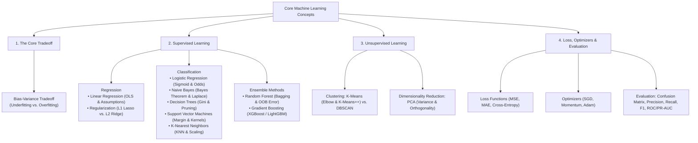

---

# 1. The Bias-Variance Tradeoff

### 🎯 1. The Big Picture ("Why does this exist?")
Every machine learning model makes prediction errors on unseen data. The central challenge of machine learning is balancing two opposing sources of error: making the model **too rigid** (it misses real patterns) versus making it **too flexible** (it memorizes random noise).

---

### 🎙️ 2. The 30-Second Interview Pitch (Exact Recital)
> *"The Bias-Variance tradeoff is the fundamental tension in supervised learning between a model's complexity and its ability to generalize. Expected test error decomposes into three additive terms: **Bias squared** (error from overly simplistic assumptions), **Variance** (error from extreme sensitivity to training noise), and **Irreducible Error** (noise inherent in the data itself). The goal is finding the optimal capacity that minimizes total test error."*

---

### 🧠 3. How It Works (The Core Mechanics)
1. **Low Complexity Models (High Bias):** Models like simple linear lines cannot capture non-linear patterns. They produce high error on both training and testing datasets (**Underfitting**).
2. **High Complexity Models (High Variance):** Deep trees or high-degree polynomials fit every single training point perfectly, including random outliers. They produce near-zero training error, but fail catastrophically on test data (**Overfitting**).
3. **The Sweet Spot:** As model complexity increases, Bias decreases while Variance increases. The optimal model sits at the inflection point where their sum is minimized.

---

### 📊 4. Visual Mental Model

<p align="center">
  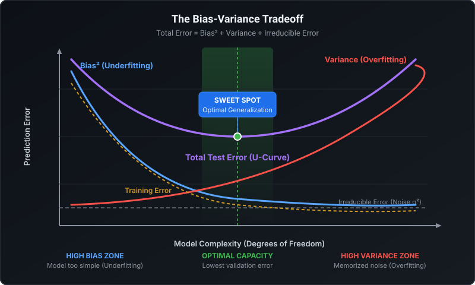
</p>

---

### 📐 5. The Core Formula De-Mystified

```text
Total Expected Error = (Bias)^2 + Variance + Irreducible Noise
```

$$
\text{Total Error} = \text{Bias}^2 + \text{Variance} + \sigma^2
$$

* **Bias Squared ($\text{Bias}^2$):** $\left( E[\hat{y}] - y \right)^2$ — Distance between the model's average prediction and the true target.
* **Variance:** $E\left[ (\hat{y} - E[\hat{y}])^2 \right]$ — How much predictions fluctuate across different training splits.
* **Irreducible Error ($\sigma^2$):** Unmeasured variables or natural sensor noise; the theoretical minimum error limit.

---

### ⚠️ 6. Key Assumptions & Red Flags
* **Red Flag (Underfitting):** High training error + High validation error. Model is under-parameterized.
* **Red Flag (Overfitting):** Very low training error + High validation error (a growing gap between train and test curves).

---

### 🛡️ 7. The Interview Defense (Top 2 Cross-Questions)

* **Q1: "If your production model suffers from High Variance, what are your top 4 remedies?"**
  - **Answer:** *"1) Collect more training data or apply data augmentation; 2) Add L1/L2 regularization to penalize large weights; 3) Apply feature selection to eliminate noisy predictors; and 4) Restrict model capacity (e.g., limit tree `max_depth` or use ensemble Bagging like Random Forest)."*

* **Q2: "What is the difference between Bias in the Bias-Variance tradeoff versus the bias term $b$ in a neural network or linear equation?"**
  - **Answer:** *"The bias term $b$ is an adjustable intercept parameter that allows the activation function or line to shift away from the origin. Bias in the Bias-Variance tradeoff refers to systematic generalization error caused by erroneous model assumptions."*

---

# 2. Linear Regression & Regularization (L1 vs. L2)

### 🎯 1. The Big Picture ("Why does this exist?")
When we want to predict a continuous numerical value (such as house prices, revenue, or latency) based on one or more input measurements, Linear Regression provides the simplest, most interpretable baseline by finding the best-fit straight line.

---

### 🎙️ 2. The 30-Second Interview Pitch (Exact Recital)
> *"Linear Regression is a supervised learning algorithm that models the linear relationship between predictor features and a continuous scalar target by fitting a linear equation that minimizes the Mean Squared Error (MSE). Model parameters can be calculated analytically via the closed-form Ordinary Least Squares (OLS) equation or iteratively using Gradient Descent."*

---

### 🧠 3. How It Works (The Core Mechanics)
1. **The Hypothesis:** Each feature $x_j$ is assigned a learnable weight $w_j$, plus an intercept $b$: $\hat{y} = \mathbf{w}^T \mathbf{x} + b$.
2. **Residuals:** For each data point, the residual error is the vertical distance between the actual target and the fitted line: $e_i = y_i - \hat{y}_i$.
3. **Optimization:** The algorithm squares these residuals and finds the weights that minimize the total sum of squared errors (OLS).

---

### 📊 4. Visual Mental Model

<p align="center">
  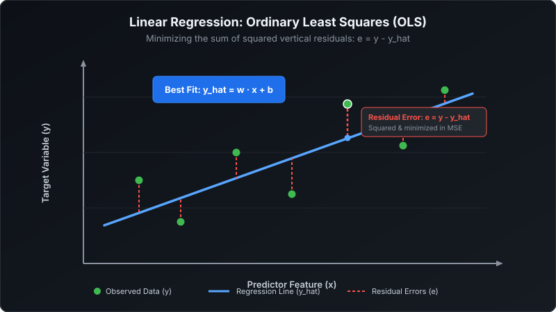
</p>

---

### 📐 5. The Core Formula De-Mystified

```text
Prediction:       y_hat = (w1 * x1) + (w2 * x2) + ... + b
MSE Loss:         Loss  = (1 / N) * Sum( (y_actual - y_predicted)^2 )
OLS Solution:     w     = (X^T * X)^(-1) * X^T * y
```

$$
\hat{y} = \mathbf{w}^T \mathbf{x} + b, \qquad \mathcal{L}_{\text{MSE}} = \frac{1}{N}\sum_{i=1}^{N}(y_i - \hat{y}_i)^2
$$

* **Closed-Form (OLS):** Finds exact minimum in one step, but computing $(X^T X)^{-1}$ has complexity `O(d^3)`, becoming slow when feature count $d > 10,000$.
* **Gradient Descent:** Scales to millions of rows and features by taking small iterative steps downhill.

---

### ⚠️ 6. Key Assumptions & Red Flags (Remember: L.I.N.E.)
1. **L — Linearity:** Relationship between features and target must be linear.
2. **I — Independence:** Errors must be uncorrelated (check Durbin-Watson for time-series autocorrelation).
3. **N — Normality:** Residual errors must be normally distributed around zero.
4. **E — Equal Variance (Homoscedasticity):** Residual error variance must remain constant across all predictions.
5. **No Multicollinearity:** Predictors must not be highly correlated with each other (Variance Inflation Factor $\text{VIF} < 5$).

---

### 🛡️ 7. The Interview Defense (Top 2 Cross-Questions)

* **Q1: "What is the exact mathematical difference between L1 (Lasso) and L2 (Ridge) Regularization?"**
  - **Answer:** *"**L1 Regularization (Lasso)** adds a penalty proportional to the sum of absolute weights (`λ * Sum(|w|)`). Because its constraint region has sharp corners on the coordinate axes, it drives non-informative weights to **strictly zero**, performing automated feature selection. **L2 Regularization (Ridge)** adds a penalty proportional to squared weights (`λ * Sum(w^2)`). Its circular constraint shrinks weights smoothly toward zero without eliminating them, stabilizing models against multicollinearity."*

* **Q2: "What is the difference between $R^2$ and Adjusted $R^2$?"**
  - **Answer:** *"$R^2$ measures the percentage of target variance explained by the model, but it has a major flaw: adding any new feature—even random noise—will always increase or maintain $R^2$. **Adjusted $R^2$** introduces a penalty for the number of features, increasing only if a new predictor improves model fit beyond random chance."*

---

# 3. Logistic Regression & Binary Cross-Entropy

### 🎯 1. The Big Picture ("Why does this exist?")
Linear regression fails for categorical decisions (e.g. Will this user churn? Is this transaction fraud?) because a straight line outputs values from $-\infty$ to $+\infty$, which are invalid probabilities. Logistic Regression solves this by squashing the linear output into a smooth S-curve bounded strictly between 0 and 1.

---

### 🎙️ 2. The 30-Second Interview Pitch (Exact Recital)
> *"Logistic Regression is a supervised classification algorithm used to estimate the probability of a categorical outcome. It passes a linear combination of input features through the non-linear Sigmoid activation function, mapping any real-valued score into a valid probability between 0 and 1. It is optimized using Binary Cross-Entropy loss via Maximum Likelihood Estimation."*

---

### 🧠 3. How It Works (The Core Mechanics)
1. **Linear Score ($z$):** Calculates a weighted sum of inputs: $z = \mathbf{w}^T \mathbf{x} + b$.
2. **Sigmoid Mapping:** Passes $z$ through $\sigma(z) = \frac{1}{1 + e^{-z}}$. When $z=0$, probability is exactly $0.5$.
3. **Decision Rule:** By default, if $P(y=1) \ge 0.5$ (meaning $z \ge 0$), predict Class 1; otherwise Class 0.
4. **Log-Odds (Logit):** The natural log of the odds ratio is linear with respect to the input features: $\ln\left(\frac{p}{1-p}\right) = \mathbf{w}^T \mathbf{x} + b$.

---

### 📊 4. Visual Mental Model

<p align="center">
  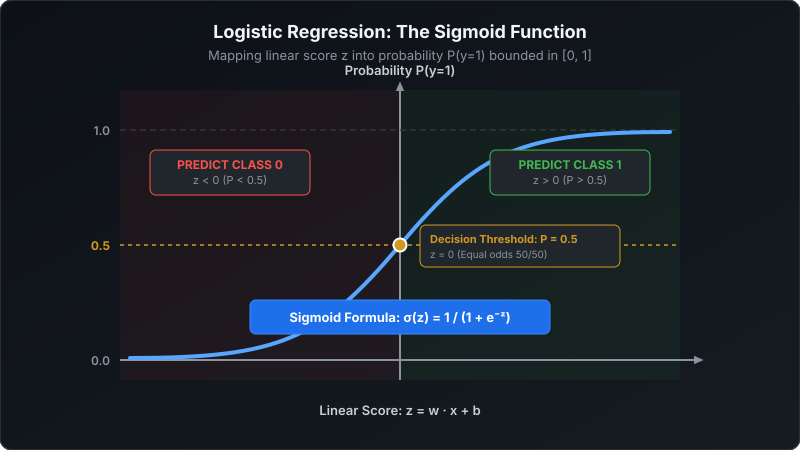
</p>

---

### 📐 5. The Core Formula De-Mystified

```text
Sigmoid Function:  P(y=1) = 1 / ( 1 + e^(-z) )     where z = w^T * x + b
Log-Odds (Logit):  ln( P / (1 - P) ) = w^T * x + b
BCE Loss:          Loss   = - (1/N) * Sum[ y*ln(p) + (1-y)*ln(1-p) ]
```

$$
P(y=1 \mid \mathbf{x}) = \frac{1}{1 + e^{-(\mathbf{w}^T \mathbf{x} + b)}}, \qquad \mathcal{L}_{\text{BCE}} = -\frac{1}{N}\sum_{i=1}^{N} \Big[ y_i \ln(\hat{p}_i) + (1-y_i)\ln(1-\hat{p}_i) \Big]
$$

---

### ⚠️ 6. Key Assumptions & Red Flags
* Assumes a linear relationship between features and the **log-odds** of the outcome.
* Vulnerable to **multicollinearity** (inflates standard errors of weights).
* Vulnerable to **complete separation** (if one feature perfectly separates the classes, weights blow up to infinity; fix by adding L2 regularization).

---

### 🛡️ 7. The Interview Defense (Top 2 Cross-Questions)

* **Q1: "Why can't we use Mean Squared Error (MSE) to train Logistic Regression?"**
  - **Answer:** *"Plugging the non-linear Sigmoid activation into an MSE loss function produces a **non-convex loss surface with multiple local minima and flat saddle points**, where gradient descent can easily stall. **Binary Cross-Entropy (Log Loss) yields a strictly convex loss function**, guaranteeing that gradient descent converges to the unique global minimum."*

* **Q2: "In production fraud detection, why should you rarely use the default 0.5 classification threshold?"**
  - **Answer:** *"The 0.5 threshold assumes equal costs for False Positives and False Negatives. In fraud detection, missing an actual fraud instance (False Negative) is far more expensive than flagging a legitimate user for verification (False Positive). We tune the threshold downward (e.g., to 0.2 or 0.3) using a Precision-Recall curve to maximize Recall."*

---

# 4. Naive Bayes Classifier

### 🎯 1. The Big Picture ("Why does this exist?")
When dealing with text classification, spam filtering, or high-dimensional categorical data, computing full joint probabilities across thousands of words is computationally impossible. Naive Bayes makes a simplifying assumption that allows instant, ultra-fast probabilistic classification even with limited training data.

---

### 🎙️ 2. The 30-Second Interview Pitch (Exact Recital)
> *"Naive Bayes is a family of probabilistic supervised classification algorithms based on Bayes' Theorem. It is called 'naive' because it makes the strong conditional independence assumption that every feature contributes independently to the probability of the class label. Despite this unrealistic assumption, it performs remarkably well for high-dimensional text classification."*

---

### 🧠 3. How It Works (The Core Mechanics)
1. **Prior Probability $P(\text{Class})$:** Base rate of each class in the training data (e.g., 20% of emails are Spam).
2. **Feature Likelihoods $P(x_j \mid \text{Class})$:** Probability of observing feature $x_j$ given the class (e.g., How often does "Free" appear in Spam vs. Inbox?).
3. **Posterior Calculation:** Multiplies the prior by the product of all individual feature likelihoods:
   $$P(\text{Class} \mid \mathbf{x}) \propto P(\text{Class}) \prod_{j=1}^{d} P(x_j \mid \text{Class})$$
4. **Decision:** Assign the class that produces the highest posterior probability.

---

### 📊 4. Visual Mental Model

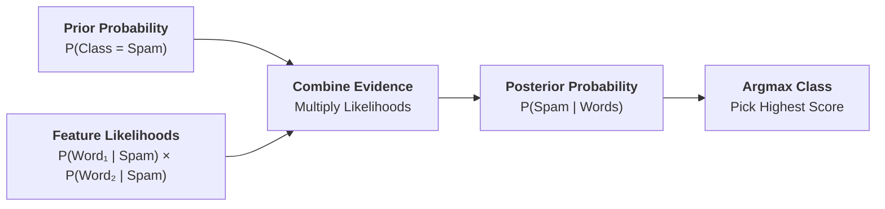

---

### 📐 5. The 3 Core Variants to Know in Interviews
1. **Gaussian Naive Bayes:** For continuous features; assumes features follow a normal distribution within each class.
2. **Multinomial Naive Bayes:** For discrete count data (word frequency counts in text documents).
3. **Bernoulli Naive Bayes:** For binary indicator features (word presence/absence: 1 or 0).

---

### ⚠️ 6. The Zero-Frequency Problem & Laplace Smoothing
* **The Trap:** If an incoming email contains a new word (e.g., "Cryptocurrency") that never appeared in the spam training set, $P(\text{"Cryptocurrency"} \mid \text{Spam}) = 0$. Because all feature probabilities are multiplied, **a single zero wipes out the entire class probability to zero**!
* **The Remedy (Laplace Smoothing):** Add a pseudo-count $\alpha = 1$ to the numerator and total vocabulary size $V$ to the denominator:
  $$\hat{P}(x_j \mid C) = \frac{\text{Count}(x_j, C) + 1}{\sum \text{Count}(x, C) + V}$$

---

### 🛡️ 7. The Interview Defense (Top 2 Cross-Questions)

* **Q1: "Why does Naive Bayes perform well in practice when its independence assumption is almost always false?"**
  - **Answer:** *"Classification does not require exact probability calibration; it only requires correct probability **ranking**. Even if correlated features push the computed probabilities toward 0 or 1, the relative rank order between classes usually remains correct, leading to high classification accuracy."*

* **Q2: "What is the primary advantage of Naive Bayes over complex deep learning models?"**
  - **Answer:** *"Naive Bayes requires zero iterative optimization—it computes simple counts in `O(N * d)` time. It trains instantly, consumes negligible memory, handles high-dimensional sparse text exceptionally well, and serves as an unbeatable fast baseline."*

---

# 5. Decision Trees & Regularization

### 🎯 1. The Big Picture ("Why does this exist?")
Linear models fail when relationships are non-linear or feature interactions exist (e.g., "High income is only safe IF existing debt is low"). Decision Trees mimic human rule-based reasoning by recursively splitting data into distinct rectangular sub-regions.

---

### 🎙️ 2. The 30-Second Interview Pitch (Exact Recital)
> *"A Decision Tree is a non-parametric supervised learning model that makes predictions by recursively partitioning the feature space into orthogonal sub-regions based on feature split criteria, forming an interpretable hierarchy of decision rules. Splits are chosen greedily to maximize node purity, measured by Gini Impurity or Information Gain."*

---

### 🧠 3. How It Works (The Core Mechanics)
1. **Greedy Splitting:** At every internal node, the algorithm scans all available features and candidate threshold split values.
2. **Purity Evaluation:** Selects the split that produces the largest drop in impurity from parent to children nodes.
3. **Stopping Criteria:** Recursion halts when a node becomes pure, reaches `max_depth`, or falls below `min_samples_split`.
4. **Prediction:** A new observation trickles down the tree branches; the leaf node assigns the majority class (classification) or mean target (regression).

---

### 📊 4. Visual Mental Model

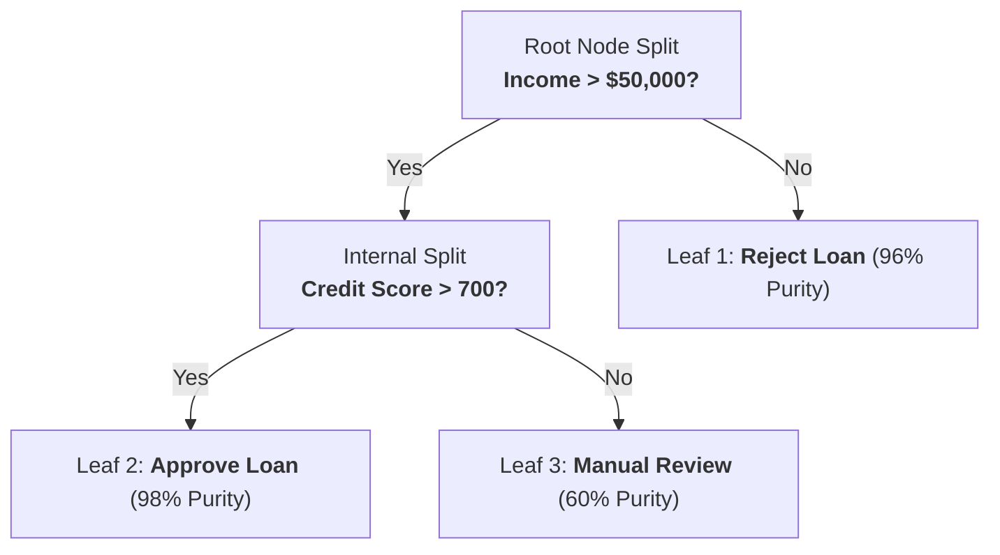

---

### 📐 5. The Splitting Criteria De-Mystified

#### Gini Impurity vs. Shannon Entropy:
```text
Gini Impurity:    I_G = 1 - Sum( (Probability of Class i)^2 )
Shannon Entropy:  H   = - Sum( p_i * log2(p_i) )
```

$$
I_G(t) = 1 - \sum_{i=1}^{C} p_i^2, \qquad H(t) = -\sum_{i=1}^{C} p_i \log_2(p_i)
$$

* **Gini Scale:** Completely pure node = `0.0`. Equal 50/50 binary split = `0.5`.
* **Gini vs. Entropy:** Gini is the industry default (scikit-learn CART) because it avoids calculating logarithms, making it computationally faster while producing virtually identical trees.

---

### ⚠️ 6. Key Assumptions & Red Flags
* **High Variance:** Unpruned trees will grow until every training observation has its own leaf, memorizing noise (100% training accuracy, terrible test accuracy).
* **Instability:** Small changes in training data can cause completely different initial splits, altering the entire downstream tree structure.

---

### 🛡️ 7. The Interview Defense (Top 2 Cross-Questions)

* **Q1: "Why is feature scaling unnecessary for Decision Trees, unlike KNN or SVM?"**
  - **Answer:** *"Decision Trees evaluate each feature **independently and monotonically** one at a time (e.g., `Age > 30`). Because tree splits only depend on the rank order of values within that single feature, monotonic scale transformations (like dividing by 1000 or taking log) have zero effect on split purity."*

* **Q2: "What is the difference between Pre-Pruning and Post-Pruning?"**
  - **Answer:** *"**Pre-pruning** stops tree growth early using heuristic thresholds during training (`max_depth`, `min_samples_split`, `min_samples_leaf`). **Post-pruning** allows the tree to grow deep first, then works backward using Cost-Complexity Pruning (`ccp_alpha`) to trim non-informative subtrees that fail to improve validation performance."*

---

# 6. Ensemble Methods: Random Forest & Boosting

### 🎯 1. The Big Picture ("Why does this exist?")
A single decision tree is unstable and overfits easily. Ensemble learning leverages the "wisdom of the crowd": combining predictions from multiple diverse base models cancels out individual errors, producing an aggregate predictor that is far more accurate and stable.

---

### 🎙️ 2. The 30-Second Interview Pitch (Exact Recital)
> *"Ensemble methods combine predictions from multiple individual base models. The two dominant paradigms are **Bagging** (Bootstrap Aggregation), which trains independent models in parallel on random data slices to **reduce variance** (as in Random Forest), and **Boosting**, which trains weak models sequentially to **reduce bias** by having each successive model fit the residual errors of prior models (as in XGBoost and LightGBM)."*

---

### 🧠 3. How It Works: Bagging vs. Boosting Master Comparison

| Attribute | Bagging (Random Forest) | Boosting (XGBoost / LightGBM) |
| :--- | :--- | :--- |
| **Architecture** | **Parallel** (Trees built independently) | **Sequential** (Each tree fixes prior errors) |
| **Primary Goal** | **Reduces Variance** (Solves overfitting) | **Reduces Bias** (Increases model capacity) |
| **Base Estimator** | Deep, unpruned, complex trees | Shallow, weak learners (stumps, depth 3–6) |
| **Aggregation** | Equal-weight voting or averaging | Weighted sum scaled by learning rate $\eta$ |
| **Outlier Sensitivity**| Low (Averaging absorbs noise) | High (Iteratively over-focuses on hard outliers) |

---

### 🌲 4. The Two Secrets of Random Forest
1. **Bootstrap Sampling (Bagging):** Each tree trains on an independent bootstrap sample of $N$ rows drawn *with replacement*. Approximately **36.8% of rows are omitted** from each tree, acting as a built-in cross-validation set called **Out-of-Bag (OOB) Error**.
2. **Feature Subsampling:** At every candidate split, the tree only considers a random subset of $m$ features ($m = \sqrt{D}$ for classification). This **de-correlates the trees** so one dominant feature cannot dictate every tree's initial split.

---

### 🚀 5. The Boosting Family: XGBoost vs. LightGBM
* **XGBoost:** Computes both **first-order gradients and second-order Hessians** (Taylor expansion) of the loss function, includes built-in L1/L2 leaf regularization, and handles missing values automatically.
* **LightGBM:** Replaces exact continuous split scanning with **Histogram Binning** (bins continuous values into 256 discrete bins) and **Leaf-wise tree growth**, training **10x to 15x faster** with lower RAM usage.

---

### 🛡️ 6. The Interview Defense (Top 2 Cross-Questions)

* **Q1: "Why is feature subsampling essential in Random Forest? Why not just use bagging alone?"**
  - **Answer:** *"If a dataset has one or two overwhelmingly predictive features, standard bagging would cause almost every tree to split on those exact same features at the root. The trees would become strongly correlated. Random feature subsampling forces trees to explore alternative features, ensuring their errors are independent so that averaging cancels out variance."*

* **Q2: "What is Out-Of-Bag (OOB) score and why is it useful?"**
  - **Answer:** *"When drawing $N$ samples with replacement, the probability that any single row is omitted from a tree is $(1 - 1/N)^N \approx 1/e \approx 36.8\%$. Evaluating each tree on its unselected rows yields an unbiased cross-validation score without requiring a separate held-out validation set."*

---

# 7. Support Vector Machines (SVM) & Kernel Trick

### 🎯 1. The Big Picture ("Why does this exist?")
Many linear boundaries can separate two classes, but boundaries that pass too close to data points are fragile and fail on new data. SVM finds the single **safest boundary** by maximizing the geometric buffer (margin) between classes.

---

### 🎙️ 2. The 30-Second Interview Pitch (Exact Recital)
> *"Support Vector Machines are supervised models that construct an optimal separating hyperplane in a multidimensional space to segregate classes with the maximum geometric margin—the perpendicular distance between the hyperplane and the closest data points, known as Support Vectors. For non-linear data, SVM uses the Kernel Trick to operate in higher-dimensional feature spaces without explicit coordinate transformations."*

---

### 🧠 3. How It Works (The Core Mechanics)
1. **The Hyperplane:** Defined as $\mathbf{w}^T \mathbf{x} + b = 0$.
2. **The Margin:** The distance between the positive margin boundary ($\mathbf{w}^T \mathbf{x} + b = +1$) and negative margin boundary ($\mathbf{w}^T \mathbf{x} + b = -1$) is equal to $\frac{2}{\|\mathbf{w}\|}$.
3. **Support Vectors:** The specific training points resting directly on the margin gutters. Moving any other points has zero effect on the decision boundary.
4. **Soft-Margin Parameter ($C$):** Controls the penalty for margin violations:
   - **High $C$:** Strictly penalizes errors, producing a narrow margin (risk of **overfitting**).
   - **Low $C$:** Tolerates misclassifications in exchange for a wider margin (better generalization, **higher bias**).

---

### 📊 4. Visual Mental Model

<p align="center">
  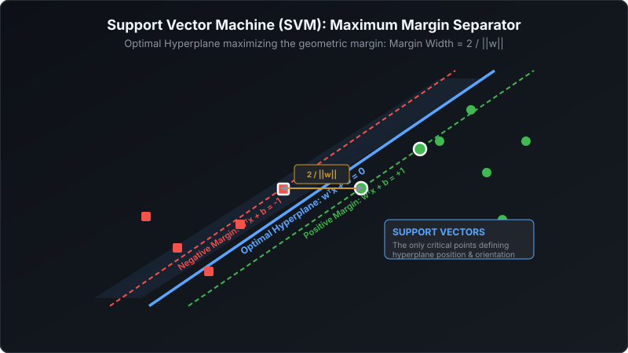
</p>

---

### 🪄 5. The Kernel Trick De-Mystified
* **The Problem:** Many datasets cannot be separated by a straight line in their original 2D or 3D space.
* **The Trick:** We can project data into a higher-dimensional space where it becomes linearly separable. Computing high-dimensional coordinates explicitly is computationally prohibitive.
* **The Mathematical Shortcut:** A **Kernel function** calculates the inner dot product between points in the higher-dimensional space directly using original coordinates: $K(\mathbf{x}_i, \mathbf{x}_j) = \phi(\mathbf{x}_i)^T \phi(\mathbf{x}_j)$.
* **RBF (Radial Basis Function / Gaussian) Kernel:**
  $$K(\mathbf{x}_i, \mathbf{x}_j) = \exp\left( -\gamma \|\mathbf{x}_i - \mathbf{x}_j\|^2 \right)$$
  - **High $\gamma$ (gamma):** Points must be very close to be considered similar; creates tight, complex boundaries (**overfitting**).
  - **Low $\gamma$:** Influence extends far; creates smooth, broad boundaries (**underfitting**).

---

### 🛡️ 6. The Interview Defense (Top 2 Cross-Questions)

* **Q1: "Why is feature scaling strictly mandatory before training an SVM?"**
  - **Answer:** *"SVM optimizes the geometric margin using Euclidean distance calculations ($\|\mathbf{w}\|$). If one feature has a large numerical range (e.g., Salary in thousands) and another has a small range (e.g., Age in decades), the unscaled larger feature will completely dominate the distance metric, making the SVM ignore the smaller feature."*

* **Q2: "What is the primary operational drawback of SVM compared to Tree Ensembles?"**
  - **Answer:** *"SVM training complexity scales quadratically or cubically with the number of samples (`O(N^2)` to `O(N^3)`). For datasets exceeding 100,000 observations, SVM becomes impractically slow to train compared to LightGBM or neural networks."*

---

# 8. K-Nearest Neighbors (KNN) & Curse of Dimensionality

### 🎯 1. The Big Picture ("Why does this exist?")
Sometimes you don't need a complex mathematical formula or equation to make a prediction. KNN operates on pure proximity: "Tell me who your closest neighbors are, and I'll tell you what you are."

---

### 🎙️ 2. The 30-Second Interview Pitch (Exact Recital)
> *"K-Nearest Neighbors is a non-parametric, instance-based supervised learning algorithm. As a 'lazy learner', it performs no explicit training phase; it stores the training dataset and predicts new queries by computing distance metrics (like Euclidean distance) to all stored instances and taking a majority vote (classification) or average (regression) across the $K$ closest neighbors."*

---

### 🧠 3. How It Works (The Core Mechanics)
1. **Choose $K$ & Distance Metric:** Default is Euclidean distance: $d(\mathbf{p}, \mathbf{q}) = \sqrt{\sum (p_i - q_i)^2}$.
2. **Find Neighbors:** Compute distance from the incoming query point to every single stored training point.
3. **Aggregate:**
   - **Classification:** Majority vote of class labels among the $K$ nearest points.
   - **Regression:** Mean average of target values among the $K$ nearest points.

---

### 📊 4. Visual Mental Model

<p align="center">
  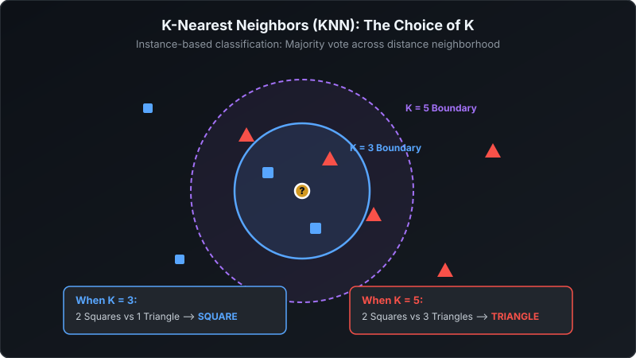
</p>

---

### ⚙️ 5. Hyperparameter $K$ & Tradeoffs
* **Small $K$ ($K=1$):** Model makes decisions based on single nearest point. Extremely sensitive to noise and outliers (**High Variance / Overfitting**).
* **Large $K$ ($K=50$):** Smooths boundaries, but votes become heavily biased toward the majority class (**High Bias / Underfitting**).
* **Rule of Thumb:** Set $K \approx \sqrt{N}$, and pick an **odd number** for binary classification to prevent tie votes.

---

### ⚠️ 6. The Curse of Dimensionality
* In 2D, points are packed closely. As dimensions increase to 100 or 1,000, the volume of the feature space expands exponentially.
* **The Trap:** Data points become extremely sparse and **equidistant from one another**. The ratio between the distance to the nearest neighbor and the distance to the farthest neighbor approaches 1, completely destroying the discriminative utility of distance metrics!
* **Remedy:** Always apply feature selection or dimensionality reduction (**PCA**) before using KNN.

---

### 🛡️ 7. The Interview Defense (Top 2 Cross-Questions)

* **Q1: "Why is KNN called a 'Lazy Learner' and what is its production cost?"**
  - **Answer:** *"It is called 'lazy' because its training phase is `O(1)`—it literally does nothing except store training data in memory. However, its inference cost is extremely expensive: for every single query, it must compute distances to all $N$ data points (`O(N * d)` time), making it unsuitable for real-time, low-latency production serving on large datasets."*

* **Q2: "How can you speed up inference in KNN?"**
  - **Answer:** *"Instead of brute-force exhaustive scanning, we index the training vectors using spatial partitioning trees like **KD-Trees** or **Ball-Trees**, or use Approximate Nearest Neighbor (ANN) vector indexing algorithms like **HNSW**."*

---

# 9. Clustering: K-Means vs. DBSCAN

### 🎯 1. The Big Picture ("Why does this exist?")
Most real-world data has no ground-truth labels. Clustering discovers natural groupings in customer behavior, transaction anomalies, or document topics without human supervision.

---

### 🎙️ 2. The 30-Second Interview Pitch (Exact Recital)
> *"Clustering is an unsupervised learning technique that groups unlabeled observations based on similarity. Partition-based methods like **K-Means** optimize spherical cluster boundaries by minimizing the Within-Cluster Sum of Squares (Inertia), while density-based methods like **DBSCAN** discover arbitrary non-spherical shapes and explicitly isolate noise and outliers."*

---

### 🧠 3. K-Means Mechanics (Lloyd's Algorithm)
1. **Initialize:** Select $K$ initial centroid coordinates.
2. **Assignment:** Assign each data point to its nearest centroid via Euclidean distance.
3. **Update:** Recompute each centroid coordinate as the arithmetic mean of all assigned points.
4. **Iterate:** Repeat assignment and update until centroid coordinates stabilize.

---

### 📊 4. Visual Mental Model: K-Means & The Elbow Curve

<p align="center">
  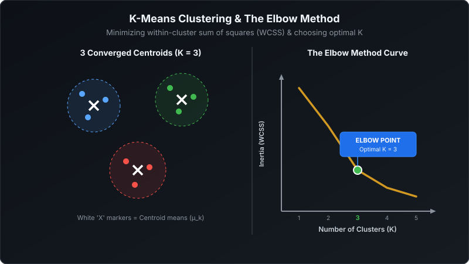
</p>

* **How to Select $K$ (The Elbow Method):** Plot cluster Inertia (WCSS) against $K$. The optimal $K$ sits at the "elbow" inflection point where adding more clusters yields diminishing returns.
* **K-Means++ Initialization:** Standard random initialization can place centroids close together, trapping the algorithm in bad local minima. K-Means++ chooses the first centroid randomly, then chooses each subsequent centroid with a probability proportional to its squared distance from existing centroids, ensuring well-dispersed starting points.

---

### 📊 5. Density-Based Clustering: DBSCAN

<p align="center">
  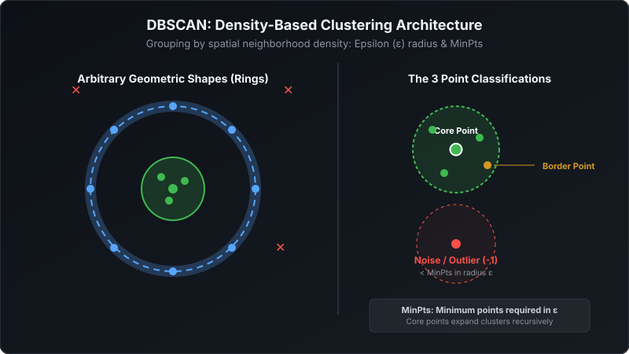
</p>

* **How DBSCAN Works:** Groups points that have at least `MinPts` neighbors within an `Epsilon` ($\epsilon$) distance radius.
  - **Core Point:** Has $\ge \text{MinPts}$ neighbors within radius $\epsilon$.
  - **Border Point:** Within radius $\epsilon$ of a core point, but has $< \text{MinPts}$ neighbors.
  - **Noise Point:** Outlier not close to any core points (assigned cluster label `-1`).

---

### 🛡️ 6. The Interview Defense (Top 2 Cross-Questions)

* **Q1: "When would you choose DBSCAN over K-Means?"**
  - **Answer:** *"I choose DBSCAN when: 1) Clusters have complex, non-spherical geometries (such as concentric circles or winding paths) that K-Means cannot separate; 2) The number of clusters $K$ is unknown in advance; and 3) The dataset contains significant noise/outliers that should be flagged and ignored rather than forced into clusters."*

* **Q2: "What are the primary weaknesses of DBSCAN?"**
  - **Answer:** *"DBSCAN struggles with datasets that have **varying density clusters** (since one global $\epsilon$ cannot fit both dense and sparse clusters) and becomes ineffective in high-dimensional spaces due to the Curse of Dimensionality."*

---

# 10. Principal Component Analysis (PCA)

### 🎯 1. The Big Picture ("Why does this exist?")
Datasets with 50 or 100 features often contain massive redundancy (e.g. Height in cm vs. Height in inches). PCA compresses high-dimensional correlated features into a few uncorrelated summary variables that capture the maximum information (variance).

---

### 🎙️ 2. The 30-Second Interview Pitch (Exact Recital)
> *"Principal Component Analysis is an unsupervised linear dimensionality reduction technique that transforms a set of correlated variables into a smaller set of orthogonal, linearly uncorrelated variables called Principal Components, ranked by the proportion of total dataset variance they explain."*

---

### 🧠 3. How It Works (The 4-Step Eigen-Decomposition)
1. **Standardize Data:** Features must be scaled to zero mean and unit variance ($z = \frac{x - \mu}{\sigma}$).
2. **Covariance Matrix:** Compute feature-by-feature covariance: $\mathbf{\Sigma} = \frac{1}{N-1}\mathbf{X}^T \mathbf{X}$.
3. **Eigen-Decomposition:** Solve for eigenvectors ($\mathbf{v}$) and eigenvalues ($\lambda$): $\mathbf{\Sigma} \mathbf{v} = \lambda \mathbf{v}$.
   - **Eigenvector:** The spatial direction of the principal component axis.
   - **Eigenvalue:** The magnitude of variance captured along that component axis.
4. **Projection:** Multiply the original data matrix by the top $k$ eigenvectors with the largest eigenvalues.

---

### 📊 4. Visual Mental Model

<p align="center">
  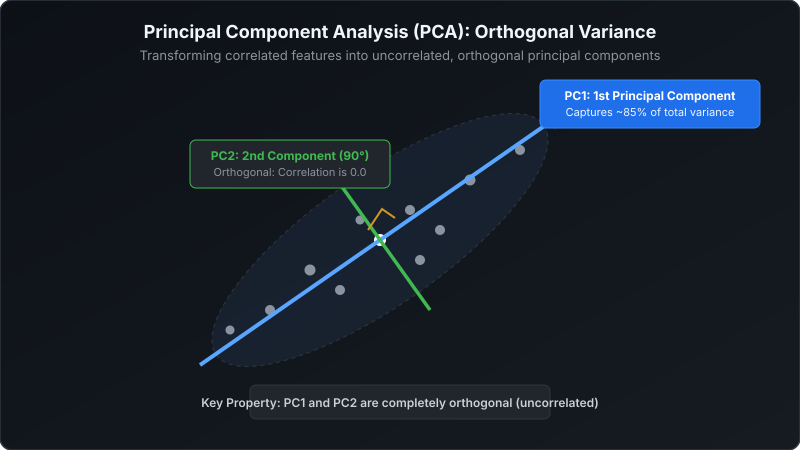
</p>

---

### ⚙️ 5. Non-Linear Embeddings: PCA vs. t-SNE vs. UMAP
* **PCA (Linear):** Preserves global variance across orthogonal axes. Fast, deterministic, but **flattens non-linear manifolds**, causing distinct embedding clusters to overlap.
* **t-SNE (Non-Linear):** Preserves local neighbor relationships by minimizing KL divergence. Great for 2D visualization of text/image embeddings, but does not preserve global distances and is slow (`O(N^2)`).
* **UMAP (Non-Linear):** Preserves both local and global topology using manifold theory. Faster (`O(N log N)`) and preferred for modern high-dimensional embedding visualization.

---

### 🛡️ 6. The Interview Defense (Top 2 Cross-Questions)

* **Q1: "Why must data be standardized before applying PCA?"**
  - **Answer:** *"PCA identifies principal axes solely by maximizing variance. If features are not standardized, a feature with naturally large values (like Salary in thousands) will exhibit huge numerical variance compared to a feature with small values (like Age in decades), causing PCA to align almost exclusively with Salary regardless of information content."*

* **Q2: "What is the correlation between Principal Component 1 (PC1) and Principal Component 2 (PC2)?"**
  - **Answer:** *"The correlation is **strictly 0.0**. By mathematical definition, all principal component eigenvectors are mutually orthogonal ($90^\circ$ right angles), which guarantees that all multicollinearity is eliminated."*

---

# 11. Loss Functions & Optimizers Cheat-Sheet

### 🎯 1. The Big Picture
A **Loss Function** measures how wrong the model's predictions are. An **Optimizer** is the mathematical engine that adjusts the model's weights step-by-step to minimize that loss.

---

### 📊 2. Regression Loss Functions Compared

<p align="center">
  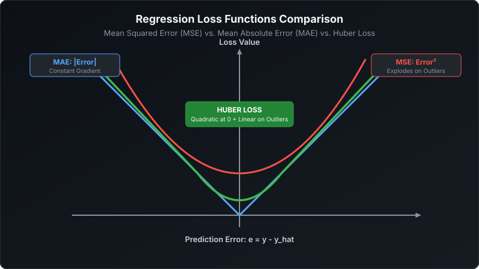
</p>

| Loss Function | Mathematical Penalty | Strengths | Vulnerabilities |
| :--- | :--- | :--- | :--- |
| **MSE (L2 Loss)** | $\frac{1}{N} \sum (y - \hat{y})^2$ | Smooth, differentiable everywhere; easy to optimize. | Squaring penalizes large mistakes heavily; **extremely sensitive to outliers**. |
| **MAE (L1 Loss)** | $\frac{1}{N} \sum \|y - \hat{y}\|$ | **Robust to extreme outliers**; reflects median. | Constant gradient ($\pm 1$), which can overshoot or oscillate near zero. |
| **Huber Loss** | Quadratic near 0, Linear past threshold $\delta$ | Combines MSE smooth convergence with MAE outlier robustness. | Requires tuning the $\delta$ threshold parameter. |

---

### ⚙️ 3. Classification Loss Functions
* **Binary Cross-Entropy (Log Loss):** $-\frac{1}{N} \sum [y \ln(p) + (1-y)\ln(1-p)]$. Penalizes confident wrong guesses exponentially; strictly convex for logistic regression.
* **Categorical Cross-Entropy:** $-\sum y_c \ln(p_c)$. Multi-class standard paired with Softmax output layers.
* **Hinge Loss:** $\max(0, 1 - y \cdot \hat{y})$. Maximizes margin boundaries; standard loss function for Support Vector Machines.

---

### 🚀 4. The 3 Core Optimizers

<p align="center">
  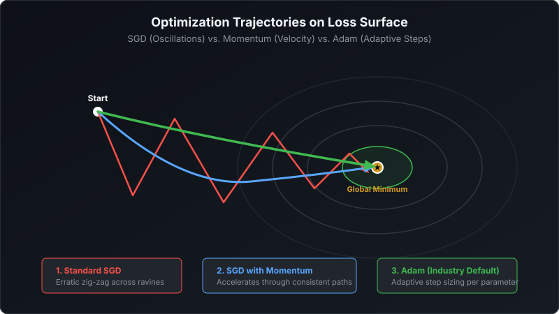
</p>

1. **SGD (Stochastic Gradient Descent):** Updates weights using 1 random sample per step: $w \leftarrow w - \eta \nabla \mathcal{L}$. Fast, but oscillates erratically across steep ravines.
2. **SGD with Momentum:** Accumulates a moving velocity vector of past gradients: $v \leftarrow \beta v + \eta \nabla \mathcal{L}$. Accelerates down consistent directions and dampens oscillations.
3. **Adam (Adaptive Moment Estimation):** The universal industry default. Combines **Momentum** (tracks first moment: gradient mean) with **RMSprop** (tracks second moment: squared gradient variance to scale learning rates adaptively per parameter).

---

# 12. Model Evaluation & Classification Metrics

### 🎯 1. The Big Picture
Reporting 99% accuracy in fraud detection is meaningless if 99% of transactions are legitimate and the model simply predicts "No Fraud" every time. Evaluation metrics must reflect real-world business trade-offs.

---

### 📊 2. The 2x2 Confusion Matrix Card

<p align="center">
  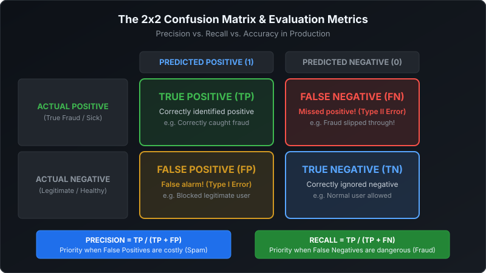
</p>

---

### 📐 3. The 4 Metrics You Must Recite

```text
Precision:  TP / (TP + FP)   --> "When we predict Positive, how often are we right?"
Recall:     TP / (TP + FN)   --> "Out of all actual Positives, how many did we catch?"
F1-Score:   2 * (P * R) / (P + R)  --> Harmonic mean balancing Precision and Recall
Accuracy:   (TP + TN) / Total      --> Total correct guesses (Fails on imbalanced data)
```

* **When to prioritize Precision:** When **False Positives are costly**. Example: Email spam filtering (marking an important email as spam annoys users).
* **When to prioritize Recall:** When **False Negatives are dangerous**. Example: Cancer screening or Fraud detection (missing a positive case is catastrophic).
* **F1-Score:** Harmonic mean. Gives a reliable single metric when class distributions are imbalanced.

---

### 📈 4. ROC-AUC vs. PR-AUC
* **ROC-AUC (Receiver Operating Characteristic):** Plots True Positive Rate vs. False Positive Rate across all thresholds. Useful for general ranking on **balanced datasets**.
* **PR-AUC (Precision-Recall Curve):** Plots Precision vs. Recall. **Mandatory for heavily skewed datasets** (e.g., 0.1% fraud), because it evaluates the minority class without being inflated by a massive count of True Negatives.

---

### ⚠️ 5. Preventing Data Leakage
* **Definition:** When test-set information inadvertently influences the training phase, creating falsely optimistic validation metrics that collapse in production.
* **Top Cause:** Fitting feature scalers (`StandardScaler.fit()`) on the entire dataset *before* performing train-test splits.
* **Golden Rule:** **Always split first.** Fit scalers and imputers *only* on training data, then call `.transform()` on test data.

---

# 13. Master Rapid-Fire Interview Battlecard

| # | Interview Question | Winning 1–2 Sentence Direct Response |
| :---: | :--- | :--- |
| **Q1** | **What is the difference between L1 (Lasso) and L2 (Ridge) Regularization?** | *"L1 adds a penalty on absolute weights, driving non-informative coefficients strictly to **zero** for feature selection. L2 adds a penalty on squared weights, shrinking coefficients close to zero to stabilize correlated features."* |
| **Q2** | **Why does accuracy fail on imbalanced datasets?** | *"If 99.9% of transactions are legitimate, a model that always predicts 'No Fraud' gets 99.9% accuracy while catching zero fraud. Performance must be evaluated using **Precision, Recall, F1-score, or PR-AUC**."* |
| **Q3** | **Why is feature scaling mandatory for KNN and SVM, but not Decision Trees?** | *"KNN and SVM calculate physical geometric distances between data points, so unscaled large features dominate. Decision Trees evaluate monotonic splits on one feature at a time, making split purity invariant to scale."* |
| **Q4** | **What is the difference between Bagging and Boosting?** | *"**Bagging** (Random Forest) trains independent models in parallel on random data slices to **reduce variance (overfitting)**. **Boosting** (XGBoost) trains models sequentially to fit prior residuals and **reduce bias (underfitting)**."* |
| **Q5** | **Why not use MSE for Logistic Regression?** | *"Passing Sigmoid through MSE produces a **non-convex loss surface with local traps**. Binary Cross-Entropy produces a strictly convex bowl with one global minimum."* |
| **Q6** | **What is the 'Naive' assumption in Naive Bayes?** | *"It assumes all predictor features are conditionally independent given the class. While unrealistic, it works well in practice because classification only requires getting the **rank order** of probabilities right."* |
| **Q7** | **What is Laplace Smoothing?** | *"If a word never appeared with a class in training, its likelihood is zero, wiping out the entire probability. Laplace smoothing adds a count of 1 to the numerator so no probability is ever zero."* |
| **Q8** | **What is the Kernel Trick in SVM?** | *"It allows linear models to solve non-linear problems by computing inner dot products in a higher-dimensional space without ever explicitly calculating coordinates in that space."* |
| **Q9** | **What is Out-Of-Bag (OOB) error in Random Forest?** | *"In bootstrap sampling, ~36.8% of rows are left out of each tree's training set. Evaluating trees on their unused rows provides a built-in cross-validation score without a separate test set."* |
| **Q10** | **When do you choose DBSCAN over K-Means?** | *"When clusters have arbitrary, non-spherical shapes (like concentric rings) and when the data contains heavy noise/outliers that shouldn't be forced into any cluster."* |
| **Q11** | **What is Multicollinearity and how do you resolve it?** | *"When two or more predictor features are strongly correlated. It is diagnosed using a correlation matrix or VIF $> 5$, and resolved by dropping redundant features, using PCA, or applying L2 Ridge."* |
| **Q12** | **What causes Data Leakage and how do you stop it?** | *"Data leakage happens when test data contaminates training (e.g. fitting scalers on the whole dataset before splitting). It is stopped by strictly fitting all transformers inside training folds only."* |

---

## 🎯 3 Golden Takeaways for Your Technical Interview
1. **The Core Tradeoff:** Underfitting = High Bias (increase capacity); Overfitting = High Variance (regularize, prune, or bag).
2. **Algorithm Mechanics:** Distance-based models (KNN, SVM, PCA) require scaling; tree-based models (Decision Tree, Random Forest) are scale-invariant.
3. **Evaluation Protocol:** Never report raw accuracy on imbalanced targets; report Precision, Recall, and F1-Score.
