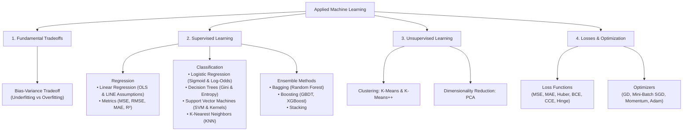
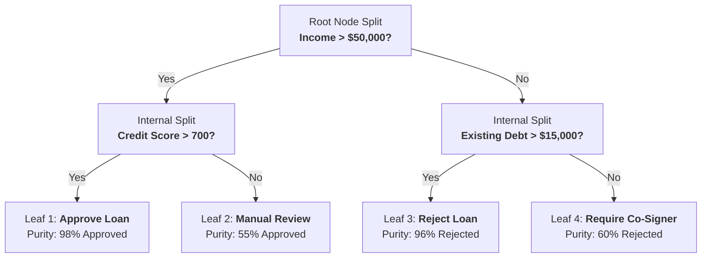
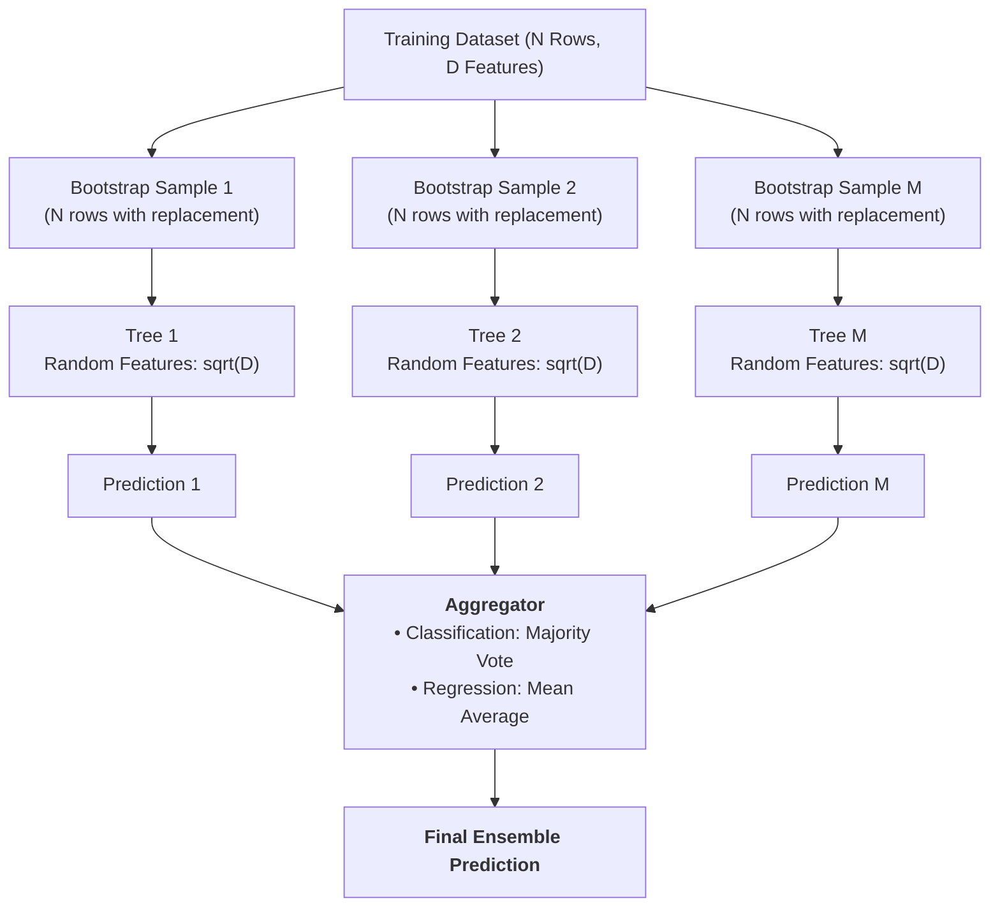
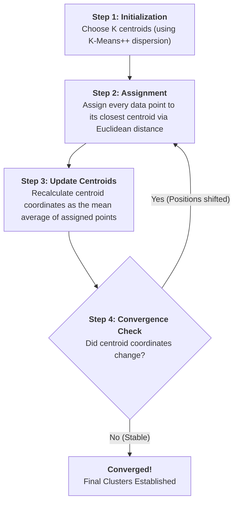

# Machine Learning Core Concepts (Interview-Ready Visual Guide)

> **Professional • Visual Graphs & Architecture • Direct Definitions • Spoken-Math Ready**
> 
> A complete, interview-tested study guide for technical Machine Learning interviews.
> Every concept is structured with:
> 1. 🎙️ **The Definition to Recite** (1–2 crisp, authoritative sentences ready to say out loud)
> 2. 📊 **Visual Graph / Architecture Representation** (Clear visual diagrams that explain the concept at a glance)
> 3. 📐 **Clean Mathematical Formulation** (Readable code blocks with labeled variables + centered display equations)
> 4. ⚙️ **Operational Mechanics** (Step-by-step functionality under the hood)
> 5. ⚠️ **Interview Trap Questions & Assumptions** (What senior interviewers specifically probe)
> 6. 🎙️ **Direct 30-Second Interview Answers**

---

## 🧭 Companion Guides
- [EXPERIENCE_AND_BACKGROUND.md](EXPERIENCE_AND_BACKGROUND.md) — 🎙️ Rahul's Career Speaking Guide (WPP, Cognizant, Flagship Projects)
- [FASTAPI_MASTER_GUIDE.md](FASTAPI_MASTER_GUIDE.md) — ⚡ FastAPI Concepts, Async Lifecycles & Serving Architecture
- [README_V2.md](README_V2.md) — 8-Level Easy-Learn GenAI & ML Lead Study Guide
- [interview_explanations.md](interview_explanations.md) — 117 Recruiter Questions & Deep Technical Explanations
- [interview_questions.md](interview_questions.md) — Raw Question Bank

---

## 🗺️ Machine Learning Curriculum Map



---

# Section 1: The Bias-Variance Tradeoff

### 🎙️ The Definition to Recite:
> *"The Bias-Variance tradeoff is the fundamental tension in supervised machine learning between a model's complexity and its ability to generalize to unseen data. Total expected prediction error decomposes into three additive components: Bias squared, Variance, and Irreducible error."*

---

### 📊 Visual Graph Representation

```text
Prediction
  Error |
        |   \                                 /  Total Test Error
        |    \                               /
        |     \                             /
        |      \         Optimal           /
        |       \        Capacity         /
        |        \          v            /
        |         \_________•___________/    <-- Sweet Spot (Minimum Test Error)
        |          \                   /
        |   Bias²   \                 /   Variance (Overfitting)
        |   (High)   \               /    (High)
        |             \             /
        |              \___________/
        |               Training Error (Always decreases)
        +----------------------------------------------------> Model Complexity
           Zone 1: Underfitting        Zone 2: Optimal        Zone 3: Overfitting
           - High Bias                 - Best Generalization   - High Variance
           - Model too simplistic      - Minimal Test Error    - Memorized training noise
```

---

### 📐 Clean Mathematical Formulation

```text
Expected Total Error = (Bias)^2 + Variance + Irreducible Noise
```

$$
\text{Total Error} = \text{Bias}^2 + \text{Variance} + \sigma^2
$$

| Term | Spoken Interview Explanation | What It Indicates In Production |
| :--- | :--- | :--- |
| **Bias Squared** | Error caused by wrong or overly rigid assumptions in the learning algorithm. | **Underfitting**: Both training error and validation error remain unacceptably high. |
| **Variance** | Error caused by extreme sensitivity to small fluctuations in the training data. | **Overfitting**: Very low training error, but high validation error. |
| **Irreducible Noise** | Natural variance, measurement errors, or missing features in the dataset. | Theoretical minimum error ceiling that no model can overcome. |

---

### 🛠️ Practical Solutions (Interview Action Checklist)

* **How to Fix High Bias (Underfitting):**
  1. Increase model capacity (e.g., transition from linear models to tree ensembles or neural networks).
  2. Engineer new features, interaction terms, or polynomial features.
  3. Decrease regularization penalties (reduce L1 or L2 regularization strength).

* **How to Fix High Variance (Overfitting):**
  1. Collect more training data or apply data augmentation.
  2. Apply feature selection to eliminate noisy, irrelevant, or collinear predictors.
  3. Introduce regularization (L1 Lasso or L2 Ridge).
  4. Restrict model complexity (e.g., set `max_depth` and `min_samples_leaf` in trees).
  5. Use ensemble bagging techniques (**Random Forest**).

---

# Section 2: Linear Regression

### 🎙️ The Definition to Recite:
> *"Linear Regression is a supervised learning algorithm that models the linear relationship between a continuous scalar dependent variable and one or more independent predictor features by fitting a linear equation to observed data to minimize Mean Squared Error."*

---

### 📊 Visual Graph Representation

```text
 Target (y) |
            |                              • (Data point: actual y)
            |                             /
            |                       •    /
            |                           /|  <-- Residual error: e = y - y_hat
            |                          / |
            |                    •    /  • (Predicted: y_hat)
            |                        /
            |                  •    /
            |                      /
            |            •        /   Fitted Regression Line:
            |                    /    y_hat = (weight * x) + bias
            |        •          /
            |                  /
            +---------------------------------------------> Feature (x)
```

---

### 📐 Clean Mathematical Formulation

```text
Prediction Formula:   y_hat = (w1 * x1) + (w2 * x2) + ... + (wd * xd) + b
                      y_hat = w^T * x + b

Objective (MSE Loss): Loss  = (1 / N) * Sum( (y_actual - y_predicted)^2 )
```

$$
\hat{y} = \mathbf{w}^T \mathbf{x} + b
$$

$$
\mathcal{L}_{\text{MSE}} = \frac{1}{N} \sum_{i=1}^{N} (y_i - \hat{y}_i)^2
$$

---

### ⚙️ Weight Estimation: Closed-Form OLS vs. Gradient Descent

1. **Ordinary Least Squares (OLS) Closed-Form:**
   ```text
   Weights = (X^T * X)^(-1) * X^T * y
   ```
   - Computes the exact global minimum in a single matrix calculation.
   - Computational cost is `O(d^3)` due to matrix inversion; becomes impractical when feature count `d > 10,000`.

2. **Gradient Descent:**
   ```text
   Weights_new = Weights_old - (Learning_Rate * Gradient_of_Loss)
   ```
   - Iteratively updates weights step-by-step; scales efficiently to millions of rows and features.

---

### ⚠️ The 5 Core Assumptions (Remember: L.I.N.E.)

1. **L — Linearity:** The relationship between predictors and the target variable is linear.
2. **I — Independence:** Residual errors are independent of one another (no autocorrelation in time series).
3. **N — Normality:** Residual errors are normally distributed with a mean of zero.
4. **E — Equal Variance (Homoscedasticity):** Residual error variance remains constant across all predicted values.
5. **No Multicollinearity:** Predictor features are not strongly correlated with each other (Variance Inflation Factor `VIF < 5`).

---

### 📊 Evaluation Metrics

* **MAE (Mean Absolute Error):** `(1 / N) * Sum( |y - y_hat| )`
  - Unit matches target variable; robust to extreme outliers.
* **MSE (Mean Squared Error):** `(1 / N) * Sum( (y - y_hat)^2 )`
  - Penalizes large errors quadratically; sensitive to outliers.
* **RMSE (Root Mean Squared Error):** `SquareRoot( MSE )`
  - Heavily penalizes large errors while converting units back to the target scale.
* **R-squared ($R^2$):** `1 - (Residual_Sum_of_Squares / Total_Sum_of_Squares)`
  - Measures the percentage of variance in $y$ explained by the model (ranges from 0.0 to 1.0).
* **Adjusted R-squared:** Penalizes the addition of useless features that do not improve explanatory power:
  ```text
  Adjusted_R2 = 1 - [ ((1 - R2) * (N - 1)) / (N - p - 1) ]
  ```
  *(where N = sample count, p = feature count)*

---

# Section 3: Logistic Regression

### 🎙️ The Definition to Recite:
> *"Logistic Regression is a supervised classification algorithm used to estimate the probability of a categorical outcome. It applies the Sigmoid function to a linear combination of input features, mapping any real-valued number into a valid probability between 0 and 1."*

---

### 📊 Visual Graph Representation

```text
 Probability
   P(y = 1) |
       1.0  |                                    ----------------- (Class 1)
            |                                  /
            |                                 /
       0.75 |                               /
            |                              /
       0.50 | - - - - - - - - - - - - - - •  <-- Decision Boundary (z = 0, P = 0.5)
            |                            /
       0.25 |                           /
            |                          /
        0.0 | ------------------------        (Class 0)
            +-----------------------------•----------------------->
                    z < 0 (Predict 0)    z = 0      z > 0 (Predict 1)
                                      Score: z = w^T * x + b
```

---

### 📐 Clean Mathematical Formulation

```text
1. Linear Combination:   z = (w1 * x1) + (w2 * x2) + ... + b
2. Sigmoid Activation:   Probability = 1 / ( 1 + e^(-z) )
3. Odds Ratio:           Odds = Probability / (1 - Probability)
4. Log-Odds (Logit):     ln( Odds ) = z = w^T * x + b
```

$$
P(y = 1 \mid \mathbf{x}) = \sigma(z) = \frac{1}{1 + e^{-z}} \quad \text{where} \quad z = \mathbf{w}^T \mathbf{x} + b
$$

$$
\ln\left( \frac{p}{1 - p} \right) = \mathbf{w}^T \mathbf{x} + b
$$

#### Binary Cross-Entropy Loss (Log Loss):
```text
BCE Loss = - (1 / N) * Sum[ y * ln(p_hat) + (1 - y) * ln(1 - p_hat) ]
```

$$
\mathcal{L}_{\text{BCE}} = -\frac{1}{N} \sum_{i=1}^{N} \Big[ y_i \ln(\hat{p}_i) + (1 - y_i) \ln(1 - \hat{p}_i) \Big]
$$

---

### 🎙️ Direct Interview Question: *"Why not use MSE for Logistic Regression?"*
> *"Applying Mean Squared Error to a non-linear Sigmoid output produces a **non-convex loss surface filled with local minima and saddle points**, where gradient descent can easily get stuck. **Binary Cross-Entropy yields a strictly convex loss surface**, guaranteeing that gradient descent reliably converges to the global minimum."*

---

# Section 4: Decision Trees

### 🎙️ The Definition to Recite:
> *"A Decision Tree is a non-parametric supervised learning algorithm that makes predictions by recursively partitioning the feature space into orthogonal sub-regions based on feature split criteria, forming a hierarchical tree of decisions."*

---

### 📊 Visual Graph Representation



---

### 📐 Splitting Criteria: Gini Impurity vs. Entropy

#### 1. Gini Impurity (Default in scikit-learn CART):
```text
Gini Impurity = 1 - Sum( (Probability of Class i)^2 )
```

$$
I_G(t) = 1 - \sum_{i=1}^{C} p_i^2
$$

* Measures the probability that a randomly chosen element would be incorrectly labeled.
* **Pure Node (all one class):** `Gini = 0.0`.
* **Worst Split (50/50 binary):** `Gini = 0.5`.

#### 2. Shannon Entropy & Information Gain:
```text
Entropy = - Sum( p_i * log2(p_i) )
Information Gain = Parent_Entropy - Weighted_Child_Entropy
```

$$
H(t) = -\sum_{i=1}^{C} p_i \log_2(p_i)
$$

* **Gini vs. Entropy:** Gini is computationally faster because it does not require calculating logarithms. In practice, both yield virtually identical decision trees.

---

### 🛡️ Tree Regularization (Preventing Overfitting)
* Unpruned decision trees have **high variance** and will split until every single training observation sits in its own leaf node (100% memorization).
* **Key Hyperparameters to State in Interviews:**
  - `max_depth`: Hard limit on tree depth.
  - `min_samples_split`: Minimum number of samples required to attempt a split.
  - `min_samples_leaf`: Minimum number of samples required in a terminal leaf node.
  - `ccp_alpha`: Cost-Complexity Pruning parameter to trim redundant branches post-training.

---

# Section 5: Ensemble Methods & Random Forest

### 🎙️ The Definition to Recite:
> *"Ensemble methods combine predictions from multiple individual base models to achieve superior predictive accuracy, stability, and generalization. Random Forest is an ensemble of decision trees trained in parallel using bootstrap aggregating (bagging) and random feature subsampling."*

---

### 📊 Visual Graph Representation



---

### 🌲 Why Feature Subsampling is Critical
* Standard bagging on decision trees often produces correlated trees if one or two features are overwhelmingly predictive (all trees will split on that feature first).
* Random Forest forces each split to choose from only a random subset of features:
  ```text
  Feature Subset Size for Classification = SquareRoot( Total_Features )
  Feature Subset Size for Regression     = Total_Features / 3
  ```
* **Interview Point:** Random feature subsampling **de-correlates the individual trees**. When independent errors are averaged, ensemble variance decreases dramatically.

---

### 📐 Out-Of-Bag (OOB) Error: The Built-In Cross-Validation
* When drawing $N$ samples with replacement, the probability of any given row being left out is:
  ```text
  Probability row omitted = (1 - 1/N)^N  -->  1/e  ≈  36.8%
  ```
* **Interview Talking Point:** Each tree leaves out approximately **36.8% of the training data**. We evaluate each tree on its unselected rows to calculate an unbiased validation score without needing a separate validation set.

---

### 🚀 Bagging vs. Boosting Master Comparison

| Attribute | Bagging (Random Forest) | Boosting (XGBoost, LightGBM) |
| :--- | :--- | :--- |
| **Execution** | **Parallel** (Trees built independently) | **Sequential** (Each tree fixes prior errors) |
| **Primary Goal** | **Reduces Variance** (Stops overfitting) | **Reduces Bias** (Increases learning power) |
| **Base Estimator** | Deep, unpruned trees | Shallow, weak learners (stumps, depth 3–6) |
| **Weights** | Equal voting weight for all trees | Higher weights assigned to accurate trees |
| **Outlier Risk** | Low (Averaging absorbs noise) | High (Iteratively over-focuses on outliers) |

---

# Section 6: Support Vector Machines (SVM)

### 🎙️ The Definition to Recite:
> *"Support Vector Machines are supervised models that construct an optimal separating hyperplane in a multidimensional space to segregate classes with the maximum geometric margin—the perpendicular distance between the hyperplane and the closest data points, known as Support Vectors."*

---

### 📊 Visual Graph Representation

```text
 Feature 2 |
           |          (+) Class (+1)
           |             (+)     (+)
           |           (+)    [+]  <-- Support Vector
           |  - - - - - - - - -•- - - - - - - - - -  Positive Margin: w^T * x + b = +1
           |                  /
           |                 /   <-- Optimal Hyperplane: w^T * x + b = 0
           |  <--- Margin --/--->   Margin Width = 2 / ||w||
           |               /
           |  - - - - - - • - - - - - - - - - - - -  Negative Margin: w^T * x + b = -1
           |           [-]  <-- Support Vector
           |        (-)    (-)
           |     (-)   (-)     (-) Class (-1)
           +---------------------------------------------> Feature 1
```

---

### 📐 Clean Mathematical Formulation

```text
Hyperplane Equation:          w^T * x + b = 0
Margin Width:                 Margin = 2 / ||w||
Optimization Objective:       Minimize: (1/2) * ||w||^2 + C * Sum( Slack_Variables )
```

$$
\min_{\mathbf{w}, b, \xi} \frac{1}{2} \|\mathbf{w}\|^2 + C \sum_{i=1}^{N} \xi_i \quad \text{subject to} \quad y_i(\mathbf{w}^T \mathbf{x}_i + b) \ge 1 - \xi_i
$$

* **Hyperparameter $C$ (Regularization):**
  - **High $C$:** Strictly penalizes margin violations. Creates a narrow margin. Risk of **overfitting**.
  - **Low $C$:** Tolerates misclassifications and margin violations in exchange for a wider margin. Generalizes better on noisy data (**higher bias**).

---

### 🪄 The Kernel Trick (Non-Linear Classification)
* **Definition:** A mathematical shortcut that maps non-linearly separable points into a higher-dimensional space where they become linearly separable, **without ever computing the explicit high-dimensional coordinates**.
* **Radial Basis Function (RBF / Gaussian) Kernel:**
  ```text
  Kernel_Similarity = exp( -gamma * Squared_Euclidean_Distance )
  ```
  - **High $\gamma$ (gamma):** Points must be very close to be considered similar. Produces tight, intricate decision boundaries (**overfitting**).
  - **Low $\gamma$:** Points far away are considered similar. Produces smooth, sweeping decision boundaries (**underfitting**).

---

# Section 7: Principal Component Analysis (PCA)

### 🎙️ The Definition to Recite:
> *"Principal Component Analysis is an unsupervised linear dimensionality reduction technique that transforms a set of correlated variables into a smaller set of orthogonal, linearly uncorrelated variables called Principal Components, ranked by the proportion of total dataset variance they explain."*

---

### 📊 Visual Graph Representation

```text
 Feature 2 |
           |                         ^  PC1 (First Principal Component)
           |                        /   - Direction of MAXIMUM variance
           |                    •  /    - Captures the primary data spread
           |                 •   •/ •
           |             •  •  • /
           |          •  •  •   /•
           |           •  •    /
           |       •  •       /
           |      /          /
           |     v <-------+------->  PC2 (Second Principal Component)
           |                \         - Orthogonal (90 degrees) to PC1
           |                 \        - Captures remaining variance
           +----------------------------------------------------> Feature 1
```

---

### ⚙️ The 4-Step Mathematical Procedure

1. **Standardize Data:** Normalize each feature to zero mean and unit variance (`z = (x - mean) / std`).
2. **Covariance Matrix:** Compute feature-by-feature covariance (`Covariance = (1 / (N - 1)) * X^T * X`).
3. **Eigen-Decomposition:** Solve for eigenvalues and eigenvectors:
   ```text
   Covariance_Matrix * Eigenvector = Eigenvalue * Eigenvector
   ```
   - **Eigenvector:** The spatial direction of the principal axis.
   - **Eigenvalue:** The magnitude of data variance captured along that axis.
4. **Project:** Multiply original data by the top $k$ eigenvectors with the largest eigenvalues.

---

### ⚠️ Two Essential Properties for Interviews
1. **Orthogonality:** Every principal component is at a 90-degree angle to every other component. Their correlation is **strictly 0.0**, completely eliminating multicollinearity.
2. **Unsupervised:** PCA ignores target labels $y$; it preserves variance within the feature matrix $X$ alone.

---

# Section 8: K-Nearest Neighbors (KNN)

### 🎙️ The Definition to Recite:
> *"K-Nearest Neighbors is a non-parametric, instance-based supervised learning algorithm. As a lazy learner, it performs no explicit training phase; it stores the training dataset and predicts new queries by computing distance metrics to all stored instances and taking a majority vote or average across the $K$ closest points."*

---

### 📊 Visual Graph Representation

```text
 Feature 2 |
           |          ▲ (Class: Triangle)
           |        ▲   ▲
           |           /-----\
           |          /  ▲    \
           |         /   ▲     \
           |        |  ( ? )    |   <-- Query Point to Classify
           |        |   ■   ■   |
           |         \         /
           |          \---■---/     ■ (Class: Square)
           |
           |      Inner Circle (K = 3): 2 Squares, 1 Triangle  --> Predicts: SQUARE
           |      Outer Circle (K = 5): 2 Squares, 3 Triangles --> Predicts: TRIANGLE
           +----------------------------------------------------> Feature 1
```

---

### 📐 Distance Metrics & The Choice of $K$

1. **Euclidean Distance ($L_2$):**
   ```text
   Distance = SquareRoot( (x1 - x2)^2 + (y1 - y2)^2 )
   ```
2. **Manhattan Distance ($L_1$):**
   ```text
   Distance = |x1 - x2| + |y1 - y2|
   ```
3. **Choosing $K$:**
   - **Small $K$ ($K = 1$):** Extremely sensitive to noise and outliers (**high variance, overfitting**).
   - **Large $K$ ($K = 50$):** Blurs neighborhood boundaries; biased toward the majority class (**high bias, underfitting**).
   - *Rule of thumb:* Choose $K \approx \sqrt{N}$, and pick an **odd number** for binary classification to avoid tie votes.

---

### ⚠️ The Curse of Dimensionality
* In 100-dimensional space, the volume expands exponentially. All points become sparse and roughly equidistant from each other, destroying distance metrics.
* **Interview Answer:** Always apply **feature scaling** (StandardScaler) and perform **dimensionality reduction (PCA)** before using KNN.

---

# Section 9: K-Means Clustering

### 🎙️ The Definition to Recite:
> *"K-Means is an unsupervised iterative partition-based clustering algorithm that groups $N$ unlabeled observations into $K$ distinct clusters by minimizing the Within-Cluster Sum of Squares (Inertia) between data points and their assigned cluster centroids."*

---

### 📊 Visual Graph Representation



---

### 📐 The Mathematical Objective (Inertia / WCSS)

```text
Inertia (WCSS) = Sum over all clusters [ Sum of squared distances from points to centroid ]
```

$$
\mathcal{J}_{\text{WCSS}} = \sum_{k=1}^{K} \sum_{\mathbf{x} \in S_k} \|\mathbf{x} - \boldsymbol{\mu}_k\|^2
$$

---

### 📏 Selecting Optimal $K$: The Elbow Method

```text
 Inertia |
 (WCSS)  |  \
         |   \
         |    \
         |     \
         |      •  <-- The "Elbow Point" (Optimal K = 3)
         |       \____
         |            \______
         |                   \________
         +---------------------------------------> Number of Clusters (K)
            K=1   K=2   K=3   K=4   K=5   K=6
```

* **Elbow Method:** Plot Inertia against $K$. The optimal $K$ is the inflection point where additional clusters yield diminishing returns.
* **Silhouette Score:** Evaluates cluster compactness vs. separation:
  ```text
  Silhouette = (Distance_to_Nearest_Cluster - Mean_Distance_Within_Cluster) / Max(Distances)
  ```
  - Ranges from `-1.0` (bad clustering) to `+1.0` (tight, well-separated clusters).

---

### ⚠️ Why K-Means++ is Superior to Random Initialization
* Standard random initialization can place multiple centroids close together, trapping the algorithm in bad local minima.
* **K-Means++:** Picks the first centroid randomly, then chooses each subsequent centroid with a probability proportional to its squared distance from the nearest existing centroid. This guarantees initial centroids are well-dispersed across the data.

---

# Section 10: Loss Functions Master Summary

### 📊 Visual Comparison of Regression Losses

```text
 Loss Value |
            |      \      MSE: Error^2 (Explodes on large outliers)      /
            |       \                                                  /
            |        \         MAE: |Error| (Linear penalty)          /
            |         \       /                               \      /
            |          \     /                                 \    /
            |           \___/   <-- Huber: Smooth curve near 0  \__/
            |                   Linear slopes past delta threshold
            +--------------------------------------------------------> Prediction Error (y - y_hat)
                       Negative Error           0           Positive Error
```

---

### 📐 Master Loss Comparison Table

| Loss Function | Primary Task | Spoken Mathematical Formulation | Operational Properties |
| :--- | :--- | :--- | :--- |
| **Mean Squared Error (MSE)** | Regression | `(1 / N) * Sum( (y - y_hat)^2 )` | Smooth and differentiable everywhere. Penalizes large errors quadratically. Extremely sensitive to outliers. |
| **Mean Absolute Error (MAE)** | Regression | `(1 / N) * Sum( \|y - y_hat\| )` | Robust to extreme outliers. Gradient is constant ($\pm 1$), which can overshoot near the minimum. |
| **Huber Loss** | Regression | Quadratic if `\|e\| <= delta`, Linear if `\|e\| > delta` | The best of both worlds: quadratic near zero for smooth convergence, linear for large errors to resist outliers. |
| **Binary Cross-Entropy** | Binary Classification | `- (1 / N) * Sum[ y*ln(p) + (1-y)*ln(1-p) ]` | Strictly convex loss surface for Sigmoid probabilities. Penalizes confident wrong predictions exponentially. |
| **Categorical Cross-Entropy** | Multi-Class Classification | `- Sum over classes [ y_c * ln(p_c) ]` | Standard multi-class loss function paired with Softmax output layers. |
| **Hinge Loss** | Maximum Margin (SVM) | `Max( 0, 1 - (y_actual * y_pred) )` | Penalizes predictions that violate the margin boundary. Produces sparse support vector solutions. |

---

# Section 11: Optimizers & Gradient Descent

### 🎙️ The Definition to Recite:
> *"An optimization algorithm iteratively adjusts model parameters (weights and biases) in the direction of the negative gradient of the loss function to minimize objective prediction error."*

---

### 📊 Visual Optimization Trajectories

```text
 Loss Contour Surface |
                      |       /-----------------------\
                      |      /   /-----------------\   \
                      |     /   /   /-----------\   \   \
                      |    /   /   /    /----\   \   \   \
                      |   |   |   |    |  ★   |   |   |   |  <-- Global Minimum (★)
                      |    \   \   \    \----/   /   /   /
                      |     \   \   \-----------/   /   /
                      |      \   \-----------------/   /
                      |       \-----------------------/
                      |
                      |  Trajectory Styles:
                      |  1. SGD:      \/\/\/\/\/\/\/\   (High-variance zig-zag bouncing)
                      |  2. Momentum: ~~~~~~~~~~~~~~>   (Accelerating arc, dampens bounce)
                      |  3. Adam:     -------------->   (Direct, adaptive vector scaling)
```

---

### ⚙️ The 4 Core Optimizers

#### 1. Stochastic Gradient Descent (SGD):
```text
Weight_New = Weight_Old - (Learning_Rate * Gradient)
```
* Updates weights using 1 sample per step. Fast and computationally cheap, but bounces erratically across steep ravines.

#### 2. SGD with Momentum:
```text
Velocity = (Beta * Velocity_Previous) + (Learning_Rate * Gradient)
Weight_New = Weight_Old - Velocity
```
* Accumulates a moving average of past gradients. Acts like a heavy ball rolling downhill, accelerating through consistent directions while smoothing out oscillations.

#### 3. RMSprop:
```text
Moving_Squared_Grad = (Gamma * Moving_Squared_Grad) + (1 - Gamma) * (Gradient^2)
Weight_New = Weight_Old - [ Learning_Rate / (SquareRoot(Moving_Squared_Grad) + Epsilon) ] * Gradient
```
* Dynamically scales learning rate inversely proportional to the root of squared gradients. Dampens volatile parameters.

#### 4. Adam (Adaptive Moment Estimation):
```text
First_Moment  = Beta1 * Past_Moment  + (1 - Beta1) * Gradient           (Direction/Momentum)
Second_Moment = Beta2 * Past_Variance + (1 - Beta2) * (Gradient^2)       (Scale/RMSprop)
Weight_New    = Weight_Old - [ Learning_Rate / (SquareRoot(Second_Moment) + Epsilon) ] * First_Moment
```
* **Why Adam is the universal industry default:** It combines the directional speed of **Momentum** with the coordinate-wise step sizing of **RMSprop**.

---

# Section 12: Top 10 Rapid-Fire ML Interview Q&A (Direct Recital)

---

### Q1: "What is the difference between L1 (Lasso) and L2 (Ridge) Regularization?"
**Direct Spoken Recital:**
> *"L1 Regularization adds a penalty proportional to the **sum of absolute weights** (`Penalty = Lambda * Sum(|Weights|)`). It drives non-informative weights to **strictly zero**, acting as automated feature selection. 
> L2 Regularization adds a penalty proportional to the **sum of squared weights** (`Penalty = Lambda * Sum(Weights^2)`). It shrinks weights asymptotically toward zero without eliminating them, which is ideal for handling multicollinearity."*

---

### Q2: "Why is feature scaling mandatory for KNN, SVM, and PCA, but not for Decision Trees?"
**Direct Spoken Recital:**
> *"KNN, SVM, and PCA rely directly on **Euclidean distance or variance calculations**, where unscaled features with large numerical ranges (like salary) dominate features with smaller scales (like age). 
> Decision Trees evaluate **isolated monotonic splits on one feature at a time** (e.g., `Age > 30`), meaning a feature's split point is completely invariant to linear scale transformations."*

---

### Q3: "What is the difference between Precision and Recall?"
**Direct Spoken Recital:**
> *"**Precision** measures how many of our positive predictions were actually correct:
> `Precision = True Positives / (True Positives + False Positives)`
> It is critical when false alarms carry a high cost, like spam detection. 
> **Recall** measures how many of the actual positive cases we successfully identified:
> `Recall = True Positives / (True Positives + False Negatives)`
> It is critical when missing a positive case is catastrophic, like cancer screening or fraud detection."*

---

### Q4: "Why is accuracy an inappropriate metric for imbalanced classification?"
**Direct Spoken Recital:**
> *"In severe class imbalance (e.g., 99.9% legitimate transactions and 0.1% fraud), a trivial baseline model that blindly predicts 'No Fraud' every single time achieves 99.9% accuracy while detecting zero fraud. Imbalanced problems must be evaluated using **Precision, Recall, F1-Score, or PR-AUC**."*

---

### Q5: "What is the difference between Bagging and Boosting?"
**Direct Spoken Recital:**
> *"**Bagging** fits independent base models in parallel on bootstrapped samples and averages their outputs to **reduce variance (prevent overfitting)**, as in Random Forest. 
> **Boosting** trains models sequentially, where each new weak learner focuses on the residual errors of the previous models to **reduce bias (prevent underfitting)**, as in XGBoost."*

---

### Q6: "What is Out-Of-Bag (OOB) error in Random Forest?"
**Direct Spoken Recital:**
> *"When bootstrapping with replacement, approximately **36.8% of training observations are left out** of each individual tree's training set. The Out-Of-Bag error evaluates each tree on its unselected observations, providing a built-in cross-validation score without needing a separate held-out validation set."*

---

### Q7: "What is the Curse of Dimensionality?"
**Direct Spoken Recital:**
> *"As the number of features increases, the volume of the feature space grows exponentially, causing data points to become extremely sparse and roughly equidistant from one another. This erodes the discriminative utility of distance metrics in algorithms like KNN and K-Means. We solve it using **PCA** or feature selection."*

---

### Q8: "How does Gradient Boosting work in simple terms?"
**Direct Spoken Recital:**
> *"Gradient Boosting builds an ensemble step-by-step. It starts with an initial baseline prediction, calculates the residual errors of the loss function, trains a shallow decision tree to predict those errors, scales the tree's contribution by a learning rate, and iteratively adds new trees until the overall loss is minimized."*

---

### Q9: "What is the difference between Parametric and Non-Parametric models?"
**Direct Spoken Recital:**
> *"**Parametric models** (like Linear and Logistic Regression) assume a fixed mathematical structure with a static set of weights that does not change as data grows. 
> **Non-parametric models** (like Decision Trees and KNN) make no rigid structural assumptions; their complexity and parameters grow dynamically with the volume of training data."*

---

### Q10: "How do you detect and resolve multicollinearity?"
**Direct Spoken Recital:**
> *"Multicollinearity is diagnosed using correlation matrices and the **Variance Inflation Factor (VIF)**, where a VIF value greater than 5 indicates severe correlation. 
> It is resolved by **dropping one of the redundant features**, applying **PCA** to produce orthogonal components, or utilizing **L2 Ridge Regularization**, which stabilizes weight calculations."*

---

## 🎯 3 Golden Rules for Your Technical Interview

1. **Bias vs. Variance:** Underfitting = High Bias (increase capacity); Overfitting = High Variance (regularize, prune, or bag).
2. **Feature Scale:** Always state whether an algorithm is scale-sensitive (distance/variance based) or scale-invariant (rule/tree based).
3. **Imbalanced Targets:** Never report raw accuracy for fraud or anomaly detection; always report Precision, Recall, and F1-Score.
