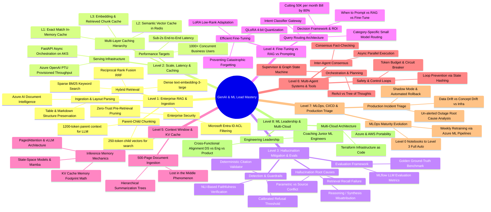

# Master GenAI & ML Lead Interview Study Guide

> **Structured for Visual Learners**: Every topic begins with an end-to-end **Flowchart / Architecture Diagram**, followed by a crisp breakdown of **What Each Piece Does**, key **Trade-offs**, and an **Interview "Golden Answer" Blueprint** grounded in **Azure Cloud**.

---

## 🗺️ Master Curriculum Roadmap (Mind Map)

| Level | Topic | Core Interview Question Mapped |
| :--- | :--- | :--- |
| **Level 1** | **Enterprise RAG & Permission-Aware Ingestion** | *ML Lead Q1 (500K docs, SharePoint/ACLs) & Hard GenAI Q1* |
| **Level 2** | **Scale, Low Latency (<2s) & Multi-Level Caching** | *Hard GenAI Q1 (Part C: 1000+ users, caching)* |
| **Level 3** | **Hallucination Mitigation, Evals & Guardrails** | *Hard GenAI Q3 (Medical scenario, citations, NLI)* |
| **Level 4** | **Fine-Tuning vs RAG Decision Framework & Cost Cutting** | *Hard GenAI Q2 (Reduce $50K/mo bill, LoRA/QLoRA)* |
| **Level 5** | **Context Window Management & Long-Context Processing** | *Hard GenAI Q4 (500-page filings, KV Cache, PagedAttention)* |
| **Level 6** | **Multi-Agent Systems, Tool Execution & Safety** | *Hard GenAI Q5 (Scientific research orchestrator, loops)* |
| **Level 7** | **MLOps Maturity, CI/CD & Production Incident Triage** | *ML Lead Q3, Q5, Q7, Q8 (0-to-3 maturity, Monday outage)* |
| **Level 8** | **Engineering Leadership, Mentoring & Multi-Cloud** | *ML Lead Q6, Q9, Q10 (Junior coaching, cross-cloud)* |

---

# Level 1: Enterprise RAG Architecture & Ingestion

> **Target Interview Questions:**
> - *"You're asked to build an enterprise RAG system for a company with 500K+ internal documents across SharePoint, Confluence, and PDFs with 5,000 daily queries. How do you design this end-to-end?"* (ML Lead Q1)
> - *"Design an advanced RAG retrieval pipeline across text, tables, and temporal updates."* (Hard GenAI Q1)

---

### 1.1 The Complete Architecture Flowchart

---

### 1.2 What Each Piece Does

#### A. Document Ingestion & Layout-Aware Parsing
* **The Problem:** Standard PDF text strippers mash tables, headers, and footnotes into an unreadable soup, ruining vector similarity.
* **The Solution:** Use **Azure AI Document Intelligence** (formerly Form Recognizer). It parses documents by layout, extracts markdown tables cleanly with rows/columns intact, and preserves reading order.
* **Incremental Updates:** Documents are placed in **Azure Blob Storage**. An **Azure Event Grid** trigger detects additions/modifications and fires an event so we only re-index updated documents (no full re-indexing).

#### B. Chunking Strategy: Parent-Child (Hierarchical)
* **The Problem:** Small chunks (200 tokens) are great for accurate embedding matches, but lack context for generation. Large chunks (1000 tokens) dilute embedding semantics.
* **The Solution (Parent-Child):**
  - **Child Chunks (200-300 tokens):** Indexed for semantic vector search.
  - **Parent Document/Section (1000-1500 tokens):** Stored in metadata or blob.
  - When a child chunk matches the query, we pass its **parent context** to the LLM. The LLM gets the complete picture without embedding noise.

#### C. Dual-Embedding Strategy: Dense + Sparse (Hybrid Search)
* **Dense Vectors (`text-embedding-3-large`):** Captures conceptual meaning (e.g., *"financial health"* matches *"profit margins and cash flow"*).
* **Sparse Vectors (BM25):** Captures exact keywords, part numbers, SKU codes, employee IDs, and acronyms where vector search fails.
* **Reciprocal Rank Fusion (RRF):** Combines the ranks from both search results deterministically:
  $$\text{RRF Score}(d) = \sum_{m \in \{\text{dense}, \text{sparse}\}} \frac{1}{k + \text{Rank}_m(d)} \quad (k \approx 60)$$

#### D. Enterprise Security & Access Control (Microsoft Entra ID ACLs)
* **Crucial Enterprise Concept:** If an employee isn't allowed to read the CEO's executive compensation memo on SharePoint, the RAG system must **never** return it or use it as context.
* **How It Works:** During ingestion, extract the Access Control List (ACL) from SharePoint/Confluence. Store allowed `group_ids` and `user_ids` as a filterable collection in **Azure AI Search**.
* At query time, extract the user's Entra ID claims from the bearer token and apply a hard filter:
  `search.in(user_groups, 'group1,group2')` *before* vector ranking.

#### E. Cross-Encoder Semantic Reranker
* **Why:** Vector search retrieves candidate chunks using bi-encoders (query and document embedded independently).
* **Reranker:** A cross-encoder model passes both the query and candidate chunk simultaneously through attention layers, scoring true semantic relevance. Reduces top 50 candidates down to the top 5 highest-signal chunks.

---

### 1.3 Key Architectural Trade-Offs

| Decision | Option A | Option B | Why We Choose Option B for Enterprise |
| :--- | :--- | :--- | :--- |
| **Search Type** | Dense Vector Only | Hybrid (Dense + BM25) + RRF | Pure vector search fails on product SKUs, acronyms, and names. Hybrid is mandatory. |
| **Chunking** | Fixed-size (500 tokens) | Parent-Child (Hierarchical) | Fixed-size splits sentences and loses context. Parent-child gives precise search + broad generation context. |
| **Access Control** | Post-filtering (filter LLM output) | Pre-filtering (filter in Search Index via ACLs) | Post-filtering leaks data, wastes tokens, and violates enterprise compliance. Pre-filtering is secure and fast. |
| **Embedding Dims** | 1536 dims | 3072 dims (reduced via Matryoshka) | Azure `text-embedding-3-large` supports Matryoshka embeddings (truncate to 1024 or 1536 without loss) to cut storage by 50%. |

---

### 1.4 The 3-Minute Interview "Golden Answer" Script

When the interviewer asks: **"How do you design an enterprise RAG system for 500K documents with permissions?"**

> **1. Framing & Requirements (30s):**
> *"I treat enterprise RAG as three distinct subsystems: An asynchronous secure ingestion pipeline, a hybrid retrieval engine with permission pre-filtering, and an observable generation layer with guardrails."*
>
> **2. Ingestion & Security (60s):**
> *"For 500K documents across SharePoint and Confluence, documents flow into Azure Blob Storage with Azure Event Grid triggers for incremental updates. We parse them with layout-aware parsers (Azure AI Document Intelligence) to preserve tables and headers.
> Critically, during ingestion, we extract the document's Entra ID Access Control List (ACL) and store allowed user/group IDs in Azure AI Search. We use parent-child chunking: 250-token child chunks for vector indexing, mapped to 1200-token parent sections."*
>
> **3. Retrieval & Serving (60s):**
> *"At query time, the user authenticates via Microsoft Entra ID through Azure API Management. We extract their security groups and issue a hybrid search in Azure AI Search combining dense embeddings (`text-embedding-3-large`) and sparse BM25, pre-filtered by their security IDs.
> We combine results using Reciprocal Rank Fusion (RRF), run the top 50 candidates through Azure AI Search's Semantic Reranker down to top 5, and assemble the parent context."*
>
> **4. Generation & Observability (30s):**
> *"The context is passed to Azure OpenAI GPT-4o with strict citation formatting and an explicit refusal prompt if confidence is low. We run Azure AI Content Safety and log inputs, latency, and faithfulness scores via MLflow to catch drift."*

---
