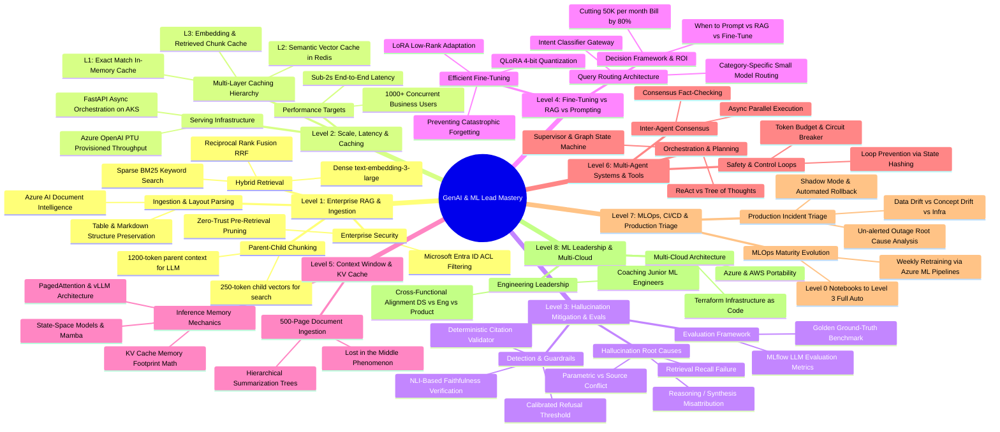
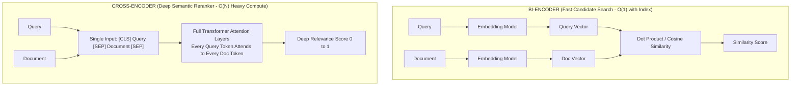

# Master GenAI & ML Lead Interview Study Guide

> **Structured for Visual Learners**: Every topic begins with an end-to-end **Flowchart / Architecture Diagram**, followed by a crisp breakdown of **What Each Piece Does**, key **Trade-offs**, and an **Interview "Golden Answer" Blueprint** grounded in **Azure Cloud**.

---

## 🗺️ Master Curriculum Roadmap (Mind Map)



| Level | Topic | Core Interview Question Mapped |
| :--- | :--- | :--- |
| **Level 1** | **Enterprise RAG & Permission-Aware Ingestion** | *ML Lead Q1 (500K docs, SharePoint/ACLs) & Hard GenAI Q1* |
| **Level 2** | **Scale, Low Latency (<2s) & Multi-Level Caching** | *Hard GenAI Q1 (Part C: 1000+ users, caching)* |
| **Level 3** | **Hallucination Mitigation, Evals & Guardrails** | *Hard GenAI Q3 (Medical scenario, citations, NLI)* |
| **Level 4** | **Fine-Tuning vs RAG Decision Framework & Cost Cutting** | *Hard GenAI Q2 (Reduce $50K/mo bill, LoRA/QLoRA)* |
| **Level 5** | **Context Window Management & Long-Context Processing** | *Hard GenAI Q4 (500-page filings, KV Cache, PagedAttention)* |
| **Level 6** | **Multi-Agent Systems, Tool Execution & Safety** | *Hard GenAI Q5 (Scientific research orchestrator, loops)* |
| **Level 7** | **MLOps Maturity, CI/CD & Production Incident Triage** | *ML Lead Q3, Q5, Q7, Q8 (0-to-3 maturity, Monday outage)* |
| **Level 8** | **Engineering Leadership, Mentoring & Multi-Cloud** | *ML Lead Q6, Q9, Q10 (Junior coaching, cross-cloud)* |

---

# Level 1: Enterprise RAG Architecture & Ingestion

> **Target Interview Questions:**
> - *"You're asked to build an enterprise RAG system for a company with 500K+ internal documents across SharePoint, Confluence, and PDFs with 5,000 daily queries. How do you design this end-to-end?"* (ML Lead Q1)
> - *"Design an advanced RAG retrieval pipeline across text, tables, and temporal updates."* (Hard GenAI Q1)

---

### 1.1 The Complete Architecture Flowchart


---

### 1.2 The Jargon Buster: What Every Technical Term ACTUALLY Means

Interviewers will test if you actually understand the mechanics behind these buzzwords. Here is the plain-English intuition, visual mechanics, and mathematical rationale for each.

---

#### 🧩 1. Dense Embeddings vs. Sparse Embeddings (BM25)

```
[Query: "iPhone 15 Pro Max error 404"]
       │
       ├─── Dense Search (Semantic) ───► Understood: "smartphone flagships having web page connection issues"
       │                                 (Misses the exact model number or error code!)
       │
       └─── Sparse Search (BM25) ──────► Understood: Exact matches for "iPhone", "15", "Pro", "Max", "404"
                                         (Finds exact tech specs and error logs, misses synonyms!)
```

* **Dense Vector (`text-embedding-3-large`):**
  - **What it is:** A list of 1,536 continuous floating-point numbers (e.g., `[0.014, -0.231, 0.891, ...]`).
  - **How it works:** Maps sentences into a multi-dimensional semantic space. Words with similar meanings are close together (e.g., *"physician"* $\approx$ *"doctor"*).
  - **The Blind Spot:** Completely ignores exact alphanumeric strings. If a user searches for an exact part number `XJ-900` or an error code `ERR_404_AUTH`, dense embeddings often fail because they blur the exact token into general "error" concepts.
* **Sparse Vector (BM25 - Best Matching 25):**
  - **What it is:** A vector where 99.9% of values are zero, except at specific dictionary positions corresponding to exact words that appear in the document.
  - **How it works under the hood (The 3 BM25 dials):**
    1. **Term Frequency (TF):** How often the word appears in the chunk (with diminishing returns so repeating a word 50 times doesn't break the score).
    2. **Inverse Document Frequency (IDF):** How rare the word is across the entire 500K document set. Words like *"the"* get near-zero weight; words like *"hyperparameter"* get huge weight.
    3. **Document Length Normalization:** Penalizes artificially long documents so they don't win simply by having more words.
* **Why Enterprise Needs Both (Hybrid):** Dense captures *intent and synonyms*; Sparse catches *exact model names, error codes, legal clauses, and employee IDs*.

---

#### ⚖️ 2. Reciprocal Rank Fusion (RRF): Why We Can't Just Average Scores

* **The Problem:** 
  - Dense search gives you **Cosine Similarity scores** between `0.0` and `1.0` (e.g., `0.84`).
  - BM25 search gives you **unbounded keyword relevance scores** (e.g., `18.6` or `124.2`).
  - **You cannot add or average $0.84$ and $18.6$!** Their statistical distributions and scales are completely incomparable.
* **The Solution (RRF):**
  Throw away the raw scores completely! Only look at their **rank position** (1st place, 2nd place, 3rd place).

$$\text{RRF Score}(d) = \frac{1}{60 + \text{Rank}_{\text{Dense}}(d)} + \frac{1}{60 + \text{Rank}_{\text{BM25}}(d)}$$

```
Document A: 1st in Dense (#1), 50th in BM25 (#50) 
  RRF = 1/(60+1) + 1/(60+50) = 0.0163 + 0.0090 = 0.0253

Document B: 3rd in Dense (#3), 2nd in BM25 (#2)
  RRF = 1/(60+3) + 1/(60+2)  = 0.0158 + 0.0161 = 0.0319  <-- WINS! (High consensus across both)
```
* **Why the constant 60?** It prevents top-ranked outliers from dominating the score and smooths out noise between rank #1 and rank #2.

---

#### 🔄 3. Bi-Encoder vs. Cross-Encoder (The Reranker)

This is one of the most frequently asked questions in senior GenAI interviews.



| Dimension | Bi-Encoder (Search) | Cross-Encoder (Reranker) |
| :--- | :--- | :--- |
| **How it inputs** | Query and Doc encoded **separately** | Query and Doc concatenated and fed **together** |
| **Cross-Attention** | ❌ None (Vectors compared only at the very end) | ✅ Full cross-attention across all tokens simultaneously |
| **Speed** | ⚡ Milliseconds (pre-computed document vectors) | 🐢 Heavy compute (requires full forward pass per doc) |
| **Where used** | Searching 500,000 documents down to **Top 50** | Reranking those **Top 50** candidates down to **Top 5** |

---

#### 📦 4. Parent-Child (Hierarchical) Chunking

* **The Classical Chunking Dilemma:**
  - **Small Chunks (150-250 tokens):** High embedding accuracy (precise semantic vector), but when fed to the LLM, the model hallucinates because sentences are severed and missing surrounding context.
  - **Large Chunks (1000-1500 tokens):** Great broad context for the LLM to read, but the embedding vector is a blurry average of 4 different topics, meaning vector search fails to retrieve it.
* **The Mechanism:**
  1. Slice a document into a large **Parent Chunk** (e.g., an entire section: 1200 tokens).
  2. Subdivide that parent into 4 small **Child Chunks** (e.g., 300 tokens each).
  3. **Index only the Child Chunks** into Azure AI Search for vector search.
  4. When the user's query hits a Child Chunk, **retrieve its Parent Chunk** and inject the Parent into the LLM's prompt.
  - *Result:* Needle-point search accuracy + complete contextual clarity for the LLM.

---

#### 🪆 5. Matryoshka Embeddings (MRL)

* **Analogy:** Russian nesting dolls (a doll inside a doll inside a doll).
* **What it is:** Normally, if an embedding model produces 3,072 dimensions, every dimension is equally weighted. If you chop off the last 2,000 numbers, the vector breaks.
* **How Matryoshka Representation Learning (MRL) works:**
  Models like OpenAI's `text-embedding-3-large` are explicitly trained so that the **most important semantic information is front-loaded in the first 256, 512, or 1024 dimensions**.
* **Why it matters for interviews:**
  - You can truncate 3,072-dimensional vectors to **1,024 dimensions** directly in code.
  - **Benefits:** 66% reduction in vector database storage costs, 3x faster vector search latency, with less than a 1.5% drop in retrieval accuracy.

---

#### 🔒 6. Microsoft Entra ID Access Control Lists (ACLs): Pre-filtering vs. Post-filtering

* **The Problem:** In an enterprise with SharePoint/Confluence, User A (Junior Analyst) must NOT see files belonging to HR (Executive Compensation) or M&A (Acquisitions).
* **The Rookie Mistake (Post-Filtering):**
  The RAG system searches all 500K docs, finds the top 5 relevant docs, and then checks: *"Does User A have permission?"* If all 5 docs are restricted, the user gets zero results, even though there were 5 other valid docs they were allowed to see! Plus, you risked data leakage in your logs.
* **The Enterprise Solution (Pre-Filtering):**
  1. During ingestion, parse document permissions: `allowed_principals = ["group_sales", "user_rahul", "tenant_marketing"]`. Store this as a filterable collection field in Azure AI Search.
  2. When User A queries, decode their Entra ID JWT token: they belong to `["group_sales", "user_rahul"]`.
  3. Pre-filter the index directly inside Azure AI Search:
     ```json
     filter: "allowed_principals/any(p: search.in(p, 'group_sales, user_rahul'))"
     ```
  4. Only permitted documents are even considered in the vector math. Zero data leakage, maximum compliance.

---

#### 📄 7. Layout-Aware Parsing vs. Regular OCR

* **Regular OCR (e.g., raw Tesseract):** Reads page strictly left-to-right, top-to-bottom. If a document has 2 columns, it reads line 1 of Column 1, then line 1 of Column 2! Tables get turned into random disjointed text.
* **Layout-Aware Parsing (Azure AI Document Intelligence):**
  - Uses computer vision bounding-box detection to recognize page topology (headers, 2-column layouts, sidebars, footnotes).
  - Explicitly reconstructs tables into **structured Markdown (`| Col 1 | Col 2 |`)** or HTML `<table>` tags.
  - Preserves cell relationships so the embedding model and LLM understand that `$4.2M` belongs to `Q3 Revenue` and not `Q2 Expenses`.

---

### 1.3 Key Architectural Trade-Offs Matrix

| Component | Option A | Option B (Production Choice) | Why? (The Interview Rationale) |
| :--- | :--- | :--- | :--- |
| **Search Mechanism** | Dense Vector Only | Hybrid (Dense + BM25) + RRF | Pure vector search fails on product SKUs, acronyms, and names. Hybrid covers both semantic meaning and exact keywords. |
| **Score Merging** | Linear Weighted Sum $(\alpha \cdot \text{Dense} + \beta \cdot \text{BM25})$ | Reciprocal Rank Fusion (RRF) | Linear sum requires manual tuning of $\alpha$ and $\beta$ across document types. RRF is scale-invariant and zero-tuning. |
| **Chunking** | Fixed Token Size (500 tokens) | Parent-Child (Hierarchical) | Fixed chunking severs sentences and table rows. Parent-child gives pinpoint vector search with broad context for generation. |
| **Security** | Post-filtering LLM output | Pre-filtering Search Index via Entra ID ACLs | Post-filtering causes empty responses, high latency, and violates compliance. Pre-filtering guarantees zero unauthorized exposure. |
| **Reranking** | Re-run LLM on all chunks | Cross-Encoder Reranker model | Re-running LLM on 50 chunks costs $0.10+ per query and takes 4 seconds. Cross-encoders take ~50ms and cost fractions of a cent. |

---

### 1.4 The 3-Minute Interview "Golden Answer" Script

When the interviewer asks: **"How do you design an enterprise RAG system for 500K documents with permissions?"**

> **1. Framing & High-Level Architecture (30s):**
> *"I treat enterprise RAG as three distinct decoupled stages: an asynchronous layout-aware ingestion pipeline, a permission-filtered hybrid retrieval engine, and an observable generation layer with verifiable citations."*
>
> **2. Ingestion & Security (60s):**
> *"For 500K documents across SharePoint and Confluence, files land in Azure Blob Storage triggering Azure Functions. We parse documents using Azure AI Document Intelligence to preserve layout and tabular structures as markdown.
> We use a **Parent-Child chunking** strategy: 250-token child chunks for vector indexing, linked to 1200-token parent sections. Crucially, we extract Microsoft Entra ID Access Control Lists (ACLs) and store permitted security groups directly on each chunk in Azure AI Search."*
>
> **3. Hybrid Retrieval & Reranking (60s):**
> *"When a user queries via Azure API Management, we decode their Entra ID JWT claims and issue a **pre-filtered hybrid search** in Azure AI Search. This executes dense retrieval via `text-embedding-3-large` (truncated to 1024 dims via Matryoshka learning) and sparse BM25 for exact keyword matching.
> We merge candidate ranks using **Reciprocal Rank Fusion (RRF)** to eliminate scale mismatch, and pass the top 50 candidates through a **Cross-Encoder Semantic Reranker** to prune down to the top 5 highest-signal parent chunks."*
>
> **4. Generation & Observability (30s):**
> *"We feed the parent context into Azure OpenAI GPT-4o with a strict grounding prompt: requiring verbatim source citations and an explicit refusal if context confidence is below threshold. All requests are logged in MLflow to monitor faithfulness, latency, and answer relevance."*

---

# Level 2: Scale, Low Latency (<2s) & Multi-Level Caching

> **Target Interview Questions:**
> - *"How do you achieve <2 second latency with 1,000+ concurrent users in an enterprise RAG system?"* (Hard GenAI Q1 Part C)
> - *"Describe your multi-level caching strategy across different layers."* (Hard GenAI Q1 Part C)
> - *"Your deep learning model works great in research but fails to scale for production business needs. How do you bridge the gap?"* (ML Lead Q2)

---

### 2.1 The High-Concurrency Serving Flowchart (<2s Latency)

```mermaid
flowchart TD
    User([1,000+ Concurrent Users]) --> APIM[Azure API Management\nRate Limiting + Request Coalescing]
    
    subgraph CACHE_LAYER["Multi-Layer Caching Hierarchy"]
        APIM --> L1{L1: Exact Match Cache\nHash: SHA256(Query + UserACL)}
        L1 -- "Hit (5ms)" --> ReturnCached[Return Cached Answer]
        
        L1 -- "Miss" --> EmbedQ[Embed Query\ntext-embedding-3-large]
        EmbedQ --> L2{L2: Semantic Vector Cache\nAzure Cache for Redis Enterprise\nCosine Sim > 0.95}
        L2 -- "Hit (35ms)" --> ReturnCached
    end

    subgraph RETRIEVAL_LAYER["Parallel Retrieval & Pruning (150ms)"]
        L2 -- "Miss" --> Coalesce[Request Coalescing / Single-Flight Engine]
        Coalesce --> SearchCluster[(Azure AI Search\nHNSW Index: efSearch=64)]
        
        SearchCluster --> ParallelProc["Async Parallel Pruning & Reranking\nCross-Encoder ONNX Runtime on GPU"]
    end

    subgraph INFERENCE_LAYER["Low-Latency Generation (1.2s - 1.5s)"]
        ParallelProc --> PTU[Azure OpenAI Service\nPTU: Provisioned Throughput Units\nDedicated GPU Capacity]
        
        PTU -- SSE Streaming Tokens --> StreamEngine[FastAPI Streaming Engine\nChunked Transfer-Encoding]
        StreamEngine --> StreamUser([User Sees First Token in <400ms])
    end

    subgraph FALLBACK["Resilience & Graceful Degradation"]
        PTU -. "Latency > 1.8s or 429" .-> CircuitBreaker{Circuit Breaker\nTrips Open}
        CircuitBreaker --> FastModel[Fallback: GPT-4o-mini or Distilled Model]
        CircuitBreaker --> StaleCache[Fallback: Stale Cache / Top Extracted Passage]
    end
```

---

### 2.2 The Jargon Buster: Under-the-Hood Mechanics

Interviewers ask these questions to see if you have actually built low-latency systems or just called raw APIs.

---

#### ⚡ 1. Exact Match Caching vs. Semantic Caching (Redis Vector Search)

```
User A asks: "What is our company maternity leave policy?"
User B asks: "How many weeks of maternity leave do employees get?"
```

* **Exact Match Cache (L1):**
  - **Mechanism:** Computes a cryptographic hash of the raw string: `SHA256("What is our company maternity leave policy?" + user_group_id)`.
  - **Storage:** Stored in high-speed in-memory Redis key-value store.
  - **Latency:** **~2ms to 5ms.**
  - **The Limitation:** User B asks the exact same question with slightly different phrasing. Exact match gives a **Cache Miss**.
* **Semantic Vector Cache (L2):**
  - **Mechanism:** When query embedding $\vec{q}$ is generated, query Redis Enterprise using vector similarity search against previously answered queries.
  - **The Cosine Similarity Threshold ($\tau$):**
    - If $\cos(\vec{q}, \vec{q}_{\text{cached}}) \ge 0.95$, the system determines the semantic intent is identical and returns the cached answer.
    - If $\cos(\vec{q}, \vec{q}_{\text{cached}}) < 0.95$, it proceeds to full RAG retrieval.
  - **Latency:** **~30ms to 50ms** (Bypasses vector search, reranker, and the entire LLM call!).
  - **Cache Invalidation:** If a document is updated in Blob Storage, invalidate all semantic cache entries tagged with that `document_id`.

---

#### 🏭 2. Azure OpenAI PTU (Provisioned Throughput Units) vs. PAYG (Pay-As-You-Go)

This is the #1 reason enterprise LLM systems fail at scale during pilot tests.

```
PAYG (Pay-As-You-Go):
Requests ──► Shared Multi-Tenant GPU Pool ──► Random Latency Spikes (2s to 12s) + HTTP 429 Rate Limits

PTU (Provisioned Throughput Units):
Requests ──► Dedicated Reserved GPUs (Fixed Capacity) ──► Deterministic Latency (<1.5s) + ZERO 429s
```

* **The PAYG Trap:** Pay-as-you-go shares GPUs with other Azure customers. During peak hours (e.g., 2 PM EST), Azure throttles you with `HTTP 429: Too Many Requests`, and response latency swings unpredictably between 2 seconds and 10+ seconds.
* **The PTU Solution:** You reserve dedicated processing units (PTUs) for your Azure OpenAI deployment.
  - **Deterministic Throughput:** Guarantees exact capacity (e.g., 100 PTUs $\approx$ 1,000 tokens/sec sustained).
  - **Zero Multi-Tenant Contention:** Response time is rock-solid and predictable.
  - **Cost Rule of Thumb:** If your organization generates steady traffic above ~150,000 requests/day, PTU is actually **cheaper** than PAYG, while eliminating latency spikes.

---

#### 🏎️ 3. Vector DB Index Tuning: HNSW Parameters (`m`, `efConstruction`, `efSearch`)

* **What is HNSW?** Hierarchical Navigable Small World graphs. Think of it like an express highway system: top layers have long-distance jumps across concepts; lower layers have fine-grained local streets.
* **The 3 Dials in Azure AI Search:**
  1. **`m` (Bi-directional Link Count, e.g., 16 or 32):** The number of connection edges per node. Higher `m` = higher retrieval recall, but uses more RAM.
  2. **`efConstruction` (e.g., 200 to 400):** How many neighbors to evaluate during *indexing time*. Higher = slower indexing, but builds a much better search graph.
  3. **`efSearch` (e.g., 32 to 64):** How deep the priority queue explores during *query time*.
* **The Latency Optimization Dial:**
  - In production, set `efSearch = 48` or `64`. Setting it to `400` only gains 0.5% in recall but quadruples search latency from 15ms to 65ms!

---

#### 🤝 4. Request Coalescing (Single-Flight Pattern)

* **The Problem:** The CEO announces an acquisition in an all-hands meeting. Suddenly, 500 employees simultaneously ask the exact same question: *"What does the acquisition mean for stock options?"*
* **Without Coalescing:** The system fires 500 identical vector searches, 500 identical reranks, and 500 identical GPT-4o calls. The system crashes.
* **With Request Coalescing (Single-Flight in FastAPI/Go):**
  - The API Gateway checks if a query with the exact same fingerprint is currently *already in-flight*.
  - Requests 2 through 500 **lock onto the existing in-flight promise/future**.
  - Exactly **one** backend LLM call executes. When it completes, the result is broadcasted to all 500 waiting HTTP connections simultaneously.
  - Compute saved: 99.8%!

---

#### ⏱️ 5. TTFT (Time to First Token) vs. TPOT (Time Per Output Token)

Interviewers will ask: *"How can you claim <2s latency if generating 500 words takes 3 seconds?"*

$$\text{Total Latency} = \text{TTFT} + (\text{Tokens Generated} \times \text{TPOT})$$

* **TTFT (Time to First Token):** How long before the user sees the first word appear on screen. This includes network transit, embedding, vector retrieval, reranking, and the initial LLM prompt processing pass. **Target: <400ms.**
* **TPOT (Time Per Output Token):** The speed at which each subsequent token is generated by the LLM (typically ~20ms - 35ms per token).
* **Server-Sent Events (SSE) Streaming:** By streaming tokens to the frontend UI via SSE chunked transfer-encoding, the user perceives the response as instantaneous (<400ms) because reading starts immediately, even while generation completes in 1.8 seconds.

---

#### 🛡️ 6. Circuit Breakers & Graceful Degradation

* **What it is:** Borrowed from electrical engineering (and Netflix Hystrix). If a component fails or slows down, trip the breaker to protect the system.
* **The 3 States:**
  - **Closed (Normal):** All traffic goes to full pipeline (Hybrid Search + Cross-Encoder + GPT-4o).
  - **Open (Degraded Mode):** If p95 latency exceeds 1.8s or error rate exceeds 5% over a 1-minute window:
    - Skip the Cross-Encoder reranker.
    - Route queries to a lightweight model (**GPT-4o-mini**) or return pre-computed FAQ summaries.
  - **Half-Open (Testing Recovery):** Sends 5% of traffic to the main pipeline. If it succeeds with sub-2s latency, close the breaker and restore normal operations.

---

### 2.3 Key Architectural Trade-Offs Matrix

| Optimization | Naive Approach | Production Scaled Choice | Why? (The Interview Rationale) |
| :--- | :--- | :--- | :--- |
| **Caching Scope** | No caching (every query hits LLM) | L1 Exact Hash + L2 Semantic Vector Cache (Redis) | Eliminates 40-60% of repetitive enterprise queries; drops their latency from 2000ms to 30ms. |
| **OpenAI Deployment** | Pay-As-You-Go (PAYG) | Provisioned Throughput Units (PTU) | PAYG suffers from noisy-neighbor multi-tenant latency spikes and 429 rate limits. PTUs guarantee deterministic throughput. |
| **Response Delivery** | Buffered JSON response | Server-Sent Events (SSE) Streaming | Streaming drops perceived Time To First Token (TTFT) to <400ms, creating a silky smooth user experience. |
| **Reranker Engine** | Python PyTorch Cross-Encoder | ONNX Runtime on TensorRT / Triton Inference | ONNX Runtime with FP16 quantization accelerates cross-encoder inference from 180ms down to 25ms on GPU. |
| **Spike Handling** | Queuing requests sequentially | Request Coalescing (Single-Flight) | Merges simultaneous identical queries into a single execution, preventing server meltdowns during company-wide events. |

---

### 2.4 The 3-Minute Interview "Golden Answer" Script

When the interviewer asks: **"How do you achieve sub-2 second latency with 1,000+ concurrent users in an enterprise RAG system?"**

> **1. Framing & The Latency Budget (30s):**
> *"Achieving sub-2s latency for 1,000+ concurrent users requires strict latency budgeting across three decoupled layers: a multi-tier caching layer, an async retrieval pipeline, and a dedicated GPU serving tier. We split the 2-second budget into: 50ms for caching/routing, 150ms for hybrid retrieval and reranking, and 1.5s for LLM generation with a Time-To-First-Token under 400ms."*
>
> **2. Multi-Level Caching & Spike Protection (60s):**
> *"At the ingress, Azure API Management enforces rate limits and **Request Coalescing (single-flight execution)** so identical burst queries only trigger a single backend call.
> We implement a 2-tier cache:
> - **L1 Exact Match Cache:** A Redis key-value hash of the query and user security groups (~5ms).
> - **L2 Semantic Vector Cache:** Using Azure Cache for Redis Enterprise with vector search. If the incoming query has a cosine similarity $\ge 0.95$ with a cached query, we return the cached response in ~35ms, bypassing search and the LLM entirely. This absorbs 40-50% of enterprise query volume."*
>
> **3. High-Throughput Retrieval & Inference (60s):**
> *"For cache misses, our FastAPI orchestrator executes parallel async calls to Azure AI Search with optimized HNSW index parameters (`efSearch=64`). Candidate chunks are reranked using an ONNX-optimized Cross-Encoder running on GPU node pools.
> For LLM generation, instead of Pay-As-You-Go which suffers from multi-tenant queuing and 429 rate limits, we deploy **Azure OpenAI with Provisioned Throughput Units (PTU)**. PTU guarantees dedicated GPU capacity with deterministic token generation speeds. We stream tokens back to the user via Server-Sent Events (SSE), achieving a perceived Time To First Token of <400ms."*
>
> **4. Resilience & Fallback (30s):**
> *"Finally, we implement a **Circuit Breaker** pattern. If the LLM p95 latency spikes over 1.8 seconds, the system automatically degrades gracefully: bypassing the cross-encoder and falling back to GPT-4o-mini or returning extracted passages with high-confidence extractive summaries."*

---

