# Master GenAI & ML Lead Interview Study Guide

> **Structured for Visual Learners**: Every topic begins with an end-to-end **Flowchart / Architecture Diagram**, followed by a crisp breakdown of **What Each Piece Does**, key **Trade-offs**, and an **Interview "Golden Answer" Blueprint** grounded in **Azure Cloud**.
>
> 🚀 **Looking for fast, intuitive revision?** Check out **[README_V2.md (Easy-Learn Edition)](README_V2.md)** featuring 10-second concept hooks, Jargon Busters, trade-offs, and 3-minute golden interview scripts.
> 📚 **Looking for the 117-question bank and solutions?** Check out [interview_questions.md](interview_questions.md) and [interview_explanations.md](interview_explanations.md).

---

## 🗺️ Master Curriculum Roadmap (Mind Map)

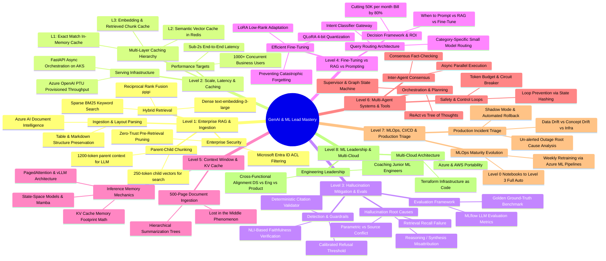

| Level | Topic | Core Interview Question Mapped |
| :--- | :--- | :--- |
| **Level 1** | **Enterprise RAG & Permission-Aware Ingestion** | *ML Lead Q1 (500K docs, SharePoint/ACLs) & Hard GenAI Q1* |
| **Level 2** | **Scale, Low Latency (<2s) & Multi-Level Caching** | *Hard GenAI Q1 (Part C: 1000+ users, caching)* |
| **Level 3** | **Hallucination Mitigation, Evals & Guardrails** | *Hard GenAI Q3 (Medical scenario, citations, NLI)* |
| **Level 4** | **Fine-Tuning vs RAG Decision Framework & Cost Cutting** | *Hard GenAI Q2 (Reduce $50K/mo bill, LoRA/QLoRA)* |
| **Level 5** | **Context Window Management & Long-Context Processing** | *Hard GenAI Q4 (500-page filings, KV Cache, PagedAttention)* |
| **Level 6** | **Multi-Agent Systems, Tool Execution & Safety** | *Hard GenAI Q5 (Scientific research orchestrator, loops)* |
| **Level 7** | **MLOps Maturity, CI/CD & Production Incident Triage** | *ML Lead Q3, Q5, Q7, Q8 (0-to-3 maturity, Monday outage)* |
| **Level 8** | **Engineering Leadership, Mentoring & Multi-Cloud** | *ML Lead Q6, Q9, Q10 (Junior coaching, cross-cloud)* |

---

# Level 1: Enterprise RAG Architecture & Ingestion

> **Target Interview Questions:**
> - *"You're asked to build an enterprise RAG system for a company with 500K+ internal documents across SharePoint, Confluence, and PDFs with 5,000 daily queries. How do you design this end-to-end?"* (ML Lead Q1)
> - *"Design an advanced RAG retrieval pipeline across text, tables, and temporal updates."* (Hard GenAI Q1)

---

### 1.1 The Complete Architecture Flowchart

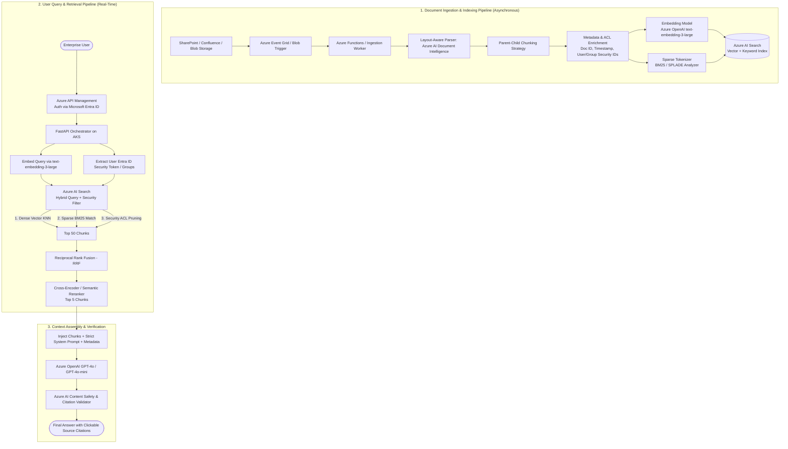

---

### 1.2 The Jargon Buster: What Every Technical Term ACTUALLY Means

Interviewers will test if you actually understand the mechanics behind these buzzwords. Here is the plain-English intuition, visual mechanics, and mathematical rationale for each.

---

#### 🧩 1. Dense Embeddings vs. Sparse Embeddings (BM25)

```
[Query: "iPhone 15 Pro Max error 404"]
       │
       ├─── Dense Search (Semantic) ───► Understood: "smartphone flagships having web page connection issues"
       │                                 (Misses the exact model number or error code!)
       │
       └─── Sparse Search (BM25) ──────► Understood: Exact matches for "iPhone", "15", "Pro", "Max", "404"
                                         (Finds exact tech specs and error logs, misses synonyms!)
```

* **Dense Vector (`text-embedding-3-large`):**
  - **What it is:** A list of 1,536 continuous floating-point numbers (e.g., `[0.014, -0.231, 0.891, ...]`).
  - **How it works:** Maps sentences into a multi-dimensional semantic space. Words with similar meanings are close together (e.g., *"physician"* $\approx$ *"doctor"*).
  - **The Blind Spot:** Completely ignores exact alphanumeric strings. If a user searches for an exact part number `XJ-900` or an error code `ERR_404_AUTH`, dense embeddings often fail because they blur the exact token into general "error" concepts.
* **Sparse Vector (BM25 - Best Matching 25):**
  - **What it is:** A vector where 99.9% of values are zero, except at specific dictionary positions corresponding to exact words that appear in the document.
  - **How it works under the hood (The 3 BM25 dials):**
    1. **Term Frequency (TF):** How often the word appears in the chunk (with diminishing returns so repeating a word 50 times doesn't break the score).
    2. **Inverse Document Frequency (IDF):** How rare the word is across the entire 500K document set. Words like *"the"* get near-zero weight; words like *"hyperparameter"* get huge weight.
    3. **Document Length Normalization:** Penalizes artificially long documents so they don't win simply by having more words.
* **Why Enterprise Needs Both (Hybrid):** Dense captures *intent and synonyms*; Sparse catches *exact model names, error codes, legal clauses, and employee IDs*.

---

#### ⚖️ 2. Reciprocal Rank Fusion (RRF): Why We Can't Just Average Scores

* **The Problem:** 
  - Dense search gives you **Cosine Similarity scores** between `0.0` and `1.0` (e.g., `0.84`).
  - BM25 search gives you **unbounded keyword relevance scores** (e.g., `18.6` or `124.2`).
  - **You cannot add or average $0.84$ and $18.6$!** Their statistical distributions and scales are completely incomparable.
* **The Solution (RRF):**
  Throw away the raw scores completely! Only look at their **rank position** (1st place, 2nd place, 3rd place).

$$\text{RRF Score}(d) = \frac{1}{60 + \text{Rank}_{\text{Dense}}(d)} + \frac{1}{60 + \text{Rank}_{\text{BM25}}(d)}$$

```
Document A: 1st in Dense (#1), 50th in BM25 (#50) 
  RRF = 1/(60+1) + 1/(60+50) = 0.0163 + 0.0090 = 0.0253

Document B: 3rd in Dense (#3), 2nd in BM25 (#2)
  RRF = 1/(60+3) + 1/(60+2)  = 0.0158 + 0.0161 = 0.0319  <-- WINS! (High consensus across both)
```
* **Why the constant 60?** It prevents top-ranked outliers from dominating the score and smooths out noise between rank #1 and rank #2.

---

#### 🔄 3. Bi-Encoder vs. Cross-Encoder (The Reranker)

This is one of the most frequently asked questions in senior GenAI interviews.

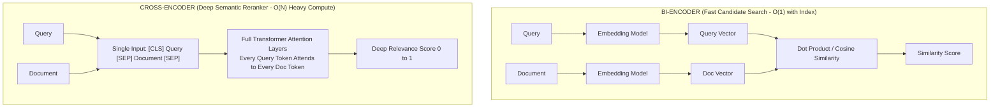

| Dimension | Bi-Encoder (Search) | Cross-Encoder (Reranker) |
| :--- | :--- | :--- |
| **How it inputs** | Query and Doc encoded **separately** | Query and Doc concatenated and fed **together** |
| **Cross-Attention** | ❌ None (Vectors compared only at the very end) | ✅ Full cross-attention across all tokens simultaneously |
| **Speed** | ⚡ Milliseconds (pre-computed document vectors) | 🐢 Heavy compute (requires full forward pass per doc) |
| **Where used** | Searching 500,000 documents down to **Top 50** | Reranking those **Top 50** candidates down to **Top 5** |

---

#### 📦 4. Parent-Child (Hierarchical) Chunking

* **The Classical Chunking Dilemma:**
  - **Small Chunks (150-250 tokens):** High embedding accuracy (precise semantic vector), but when fed to the LLM, the model hallucinates because sentences are severed and missing surrounding context.
  - **Large Chunks (1000-1500 tokens):** Great broad context for the LLM to read, but the embedding vector is a blurry average of 4 different topics, meaning vector search fails to retrieve it.
* **The Mechanism:**
  1. Slice a document into a large **Parent Chunk** (e.g., an entire section: 1200 tokens).
  2. Subdivide that parent into 4 small **Child Chunks** (e.g., 300 tokens each).
  3. **Index only the Child Chunks** into Azure AI Search for vector search.
  4. When the user's query hits a Child Chunk, **retrieve its Parent Chunk** and inject the Parent into the LLM's prompt.
  - *Result:* Needle-point search accuracy + complete contextual clarity for the LLM.

---

#### 🪆 5. Matryoshka Embeddings (MRL)

* **Analogy:** Russian nesting dolls (a doll inside a doll inside a doll).
* **What it is:** Normally, if an embedding model produces 3,072 dimensions, every dimension is equally weighted. If you chop off the last 2,000 numbers, the vector breaks.
* **How Matryoshka Representation Learning (MRL) works:**
  Models like OpenAI's `text-embedding-3-large` are explicitly trained so that the **most important semantic information is front-loaded in the first 256, 512, or 1024 dimensions**.
* **Why it matters for interviews:**
  - You can truncate 3,072-dimensional vectors to **1,024 dimensions** directly in code.
  - **Benefits:** 66% reduction in vector database storage costs, 3x faster vector search latency, with less than a 1.5% drop in retrieval accuracy.

---

#### 🔒 6. Microsoft Entra ID Access Control Lists (ACLs): Pre-filtering vs. Post-filtering

* **The Problem:** In an enterprise with SharePoint/Confluence, User A (Junior Analyst) must NOT see files belonging to HR (Executive Compensation) or M&A (Acquisitions).
* **The Rookie Mistake (Post-Filtering):**
  The RAG system searches all 500K docs, finds the top 5 relevant docs, and then checks: *"Does User A have permission?"* If all 5 docs are restricted, the user gets zero results, even though there were 5 other valid docs they were allowed to see! Plus, you risked data leakage in your logs.
* **The Enterprise Solution (Pre-Filtering):**
  1. During ingestion, parse document permissions: `allowed_principals = ["group_sales", "user_rahul", "tenant_marketing"]`. Store this as a filterable collection field in Azure AI Search.
  2. When User A queries, decode their Entra ID JWT token: they belong to `["group_sales", "user_rahul"]`.
  3. Pre-filter the index directly inside Azure AI Search:
     ```json
     filter: "allowed_principals/any(p: search.in(p, 'group_sales, user_rahul'))"
     ```
  4. Only permitted documents are even considered in the vector math. Zero data leakage, maximum compliance.

---

#### 📄 7. Layout-Aware Parsing vs. Regular OCR

* **Regular OCR (e.g., raw Tesseract):** Reads page strictly left-to-right, top-to-bottom. If a document has 2 columns, it reads line 1 of Column 1, then line 1 of Column 2! Tables get turned into random disjointed text.
* **Layout-Aware Parsing (Azure AI Document Intelligence):**
  - Uses computer vision bounding-box detection to recognize page topology (headers, 2-column layouts, sidebars, footnotes).
  - Explicitly reconstructs tables into **structured Markdown (`| Col 1 | Col 2 |`)** or HTML `<table>` tags.
  - Preserves cell relationships so the embedding model and LLM understand that `$4.2M` belongs to `Q3 Revenue` and not `Q2 Expenses`.

---

### 1.3 Key Architectural Trade-Offs Matrix

| Component | Option A | Option B (Production Choice) | Why? (The Interview Rationale) |
| :--- | :--- | :--- | :--- |
| **Search Mechanism** | Dense Vector Only | Hybrid (Dense + BM25) + RRF | Pure vector search fails on product SKUs, acronyms, and names. Hybrid covers both semantic meaning and exact keywords. |
| **Score Merging** | Linear Weighted Sum $(\alpha \cdot \text{Dense} + \beta \cdot \text{BM25})$ | Reciprocal Rank Fusion (RRF) | Linear sum requires manual tuning of $\alpha$ and $\beta$ across document types. RRF is scale-invariant and zero-tuning. |
| **Chunking** | Fixed Token Size (500 tokens) | Parent-Child (Hierarchical) | Fixed chunking severs sentences and table rows. Parent-child gives pinpoint vector search with broad context for generation. |
| **Security** | Post-filtering LLM output | Pre-filtering Search Index via Entra ID ACLs | Post-filtering causes empty responses, high latency, and violates compliance. Pre-filtering guarantees zero unauthorized exposure. |
| **Reranking** | Re-run LLM on all chunks | Cross-Encoder Reranker model | Re-running LLM on 50 chunks costs $0.10+ per query and takes 4 seconds. Cross-encoders take ~50ms and cost fractions of a cent. |

---

### 1.4 The 3-Minute Interview "Golden Answer" Script

When the interviewer asks: **"How do you design an enterprise RAG system for 500K documents with permissions?"**

> **1. Framing & High-Level Architecture (30s):**
> *"I treat enterprise RAG as three distinct decoupled stages: an asynchronous layout-aware ingestion pipeline, a permission-filtered hybrid retrieval engine, and an observable generation layer with verifiable citations."*
>
> **2. Ingestion & Security (60s):**
> *"For 500K documents across SharePoint and Confluence, files land in Azure Blob Storage triggering Azure Functions. We parse documents using Azure AI Document Intelligence to preserve layout and tabular structures as markdown.
> We use a **Parent-Child chunking** strategy: 250-token child chunks for vector indexing, linked to 1200-token parent sections. Crucially, we extract Microsoft Entra ID Access Control Lists (ACLs) and store permitted security groups directly on each chunk in Azure AI Search."*
>
> **3. Hybrid Retrieval & Reranking (60s):**
> *"When a user queries via Azure API Management, we decode their Entra ID JWT claims and issue a **pre-filtered hybrid search** in Azure AI Search. This executes dense retrieval via `text-embedding-3-large` (truncated to 1024 dims via Matryoshka learning) and sparse BM25 for exact keyword matching.
> We merge candidate ranks using **Reciprocal Rank Fusion (RRF)** to eliminate scale mismatch, and pass the top 50 candidates through a **Cross-Encoder Semantic Reranker** to prune down to the top 5 highest-signal parent chunks."*
>
> **4. Generation & Observability (30s):**
> *"We feed the parent context into Azure OpenAI GPT-4o with a strict grounding prompt: requiring verbatim source citations and an explicit refusal if context confidence is below threshold. All requests are logged in MLflow to monitor faithfulness, latency, and answer relevance."*

---

# Level 2: Scale, Low Latency (<2s) & Multi-Level Caching

> **Target Interview Questions:**
> - *"How do you achieve <2 second latency with 1,000+ concurrent users in an enterprise RAG system?"* (Hard GenAI Q1 Part C)
> - *"Describe your multi-level caching strategy across different layers."* (Hard GenAI Q1 Part C)
> - *"Your deep learning model works great in research but fails to scale for production business needs. How do you bridge the gap?"* (ML Lead Q2)

---

### 2.1 The High-Concurrency Serving Flowchart (<2s Latency)

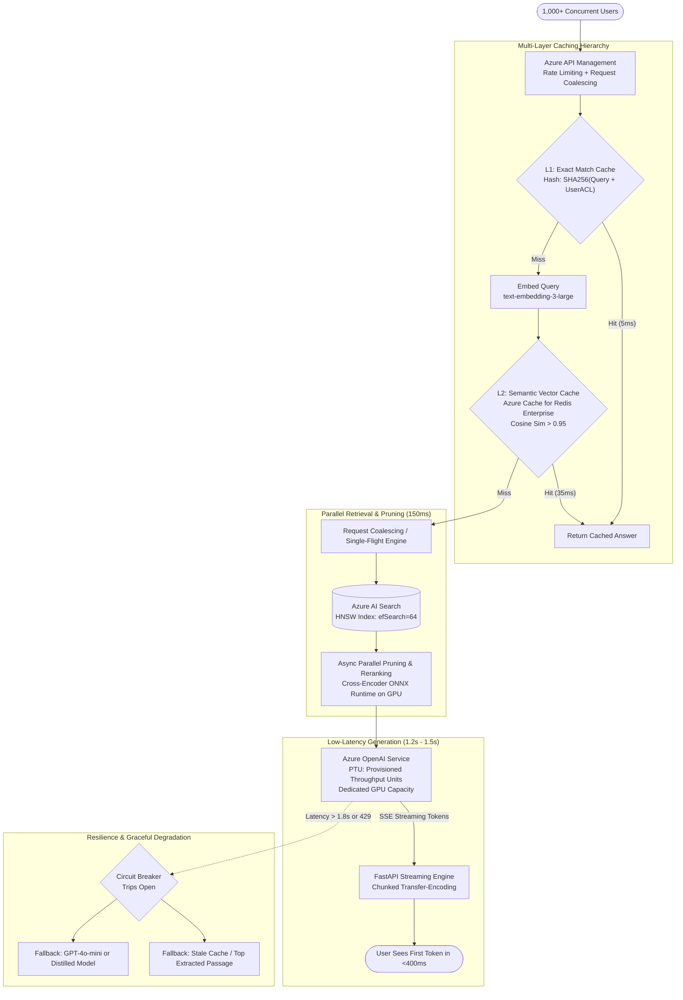

---

### 2.2 The Jargon Buster: Under-the-Hood Mechanics

Interviewers ask these questions to see if you have actually built low-latency systems or just called raw APIs.

---

#### ⚡ 1. Exact Match Caching vs. Semantic Caching (Redis Vector Search)

```
User A asks: "What is our company maternity leave policy?"
User B asks: "How many weeks of maternity leave do employees get?"
```

* **Exact Match Cache (L1):**
  - **Mechanism:** Computes a cryptographic hash of the raw string: `SHA256("What is our company maternity leave policy?" + user_group_id)`.
  - **Storage:** Stored in high-speed in-memory Redis key-value store.
  - **Latency:** **~2ms to 5ms.**
  - **The Limitation:** User B asks the exact same question with slightly different phrasing. Exact match gives a **Cache Miss**.
* **Semantic Vector Cache (L2):**
  - **Mechanism:** When query embedding $\vec{q}$ is generated, query Redis Enterprise using vector similarity search against previously answered queries.
  - **The Cosine Similarity Threshold ($\tau$):**
    - If $\cos(\vec{q}, \vec{q}_{\text{cached}}) \ge 0.95$, the system determines the semantic intent is identical and returns the cached answer.
    - If $\cos(\vec{q}, \vec{q}_{\text{cached}}) < 0.95$, it proceeds to full RAG retrieval.
  - **Latency:** **~30ms to 50ms** (Bypasses vector search, reranker, and the entire LLM call!).
  - **Cache Invalidation:** If a document is updated in Blob Storage, invalidate all semantic cache entries tagged with that `document_id`.

---

#### 🏭 2. Azure OpenAI PTU (Provisioned Throughput Units) vs. PAYG (Pay-As-You-Go)

This is the #1 reason enterprise LLM systems fail at scale during pilot tests.

```
PAYG (Pay-As-You-Go):
Requests ──► Shared Multi-Tenant GPU Pool ──► Random Latency Spikes (2s to 12s) + HTTP 429 Rate Limits

PTU (Provisioned Throughput Units):
Requests ──► Dedicated Reserved GPUs (Fixed Capacity) ──► Deterministic Latency (<1.5s) + ZERO 429s
```

* **The PAYG Trap:** Pay-as-you-go shares GPUs with other Azure customers. During peak hours (e.g., 2 PM EST), Azure throttles you with `HTTP 429: Too Many Requests`, and response latency swings unpredictably between 2 seconds and 10+ seconds.
* **The PTU Solution:** You reserve dedicated processing units (PTUs) for your Azure OpenAI deployment.
  - **Deterministic Throughput:** Guarantees exact capacity (e.g., 100 PTUs $\approx$ 1,000 tokens/sec sustained).
  - **Zero Multi-Tenant Contention:** Response time is rock-solid and predictable.
  - **Cost Rule of Thumb:** If your organization generates steady traffic above ~150,000 requests/day, PTU is actually **cheaper** than PAYG, while eliminating latency spikes.

---

#### 🏎️ 3. Vector DB Index Tuning: HNSW Parameters (`m`, `efConstruction`, `efSearch`)

* **What is HNSW?** Hierarchical Navigable Small World graphs. Think of it like an express highway system: top layers have long-distance jumps across concepts; lower layers have fine-grained local streets.
* **The 3 Dials in Azure AI Search:**
  1. **`m` (Bi-directional Link Count, e.g., 16 or 32):** The number of connection edges per node. Higher `m` = higher retrieval recall, but uses more RAM.
  2. **`efConstruction` (e.g., 200 to 400):** How many neighbors to evaluate during *indexing time*. Higher = slower indexing, but builds a much better search graph.
  3. **`efSearch` (e.g., 32 to 64):** How deep the priority queue explores during *query time*.
* **The Latency Optimization Dial:**
  - In production, set `efSearch = 48` or `64`. Setting it to `400` only gains 0.5% in recall but quadruples search latency from 15ms to 65ms!

---

#### 🤝 4. Request Coalescing (Single-Flight Pattern)

* **The Problem:** The CEO announces an acquisition in an all-hands meeting. Suddenly, 500 employees simultaneously ask the exact same question: *"What does the acquisition mean for stock options?"*
* **Without Coalescing:** The system fires 500 identical vector searches, 500 identical reranks, and 500 identical GPT-4o calls. The system crashes.
* **With Request Coalescing (Single-Flight in FastAPI/Go):**
  - The API Gateway checks if a query with the exact same fingerprint is currently *already in-flight*.
  - Requests 2 through 500 **lock onto the existing in-flight promise/future**.
  - Exactly **one** backend LLM call executes. When it completes, the result is broadcasted to all 500 waiting HTTP connections simultaneously.
  - Compute saved: 99.8%!

---

#### ⏱️ 5. TTFT (Time to First Token) vs. TPOT (Time Per Output Token)

Interviewers will ask: *"How can you claim <2s latency if generating 500 words takes 3 seconds?"*

$$\text{Total Latency} = \text{TTFT} + (\text{Tokens Generated} \times \text{TPOT})$$

* **TTFT (Time to First Token):** How long before the user sees the first word appear on screen. This includes network transit, embedding, vector retrieval, reranking, and the initial LLM prompt processing pass. **Target: <400ms.**
* **TPOT (Time Per Output Token):** The speed at which each subsequent token is generated by the LLM (typically ~20ms - 35ms per token).
* **Server-Sent Events (SSE) Streaming:** By streaming tokens to the frontend UI via SSE chunked transfer-encoding, the user perceives the response as instantaneous (<400ms) because reading starts immediately, even while generation completes in 1.8 seconds.

---

#### 🛡️ 6. Circuit Breakers & Graceful Degradation

* **What it is:** Borrowed from electrical engineering (and Netflix Hystrix). If a component fails or slows down, trip the breaker to protect the system.
* **The 3 States:**
  - **Closed (Normal):** All traffic goes to full pipeline (Hybrid Search + Cross-Encoder + GPT-4o).
  - **Open (Degraded Mode):** If p95 latency exceeds 1.8s or error rate exceeds 5% over a 1-minute window:
    - Skip the Cross-Encoder reranker.
    - Route queries to a lightweight model (**GPT-4o-mini**) or return pre-computed FAQ summaries.
  - **Half-Open (Testing Recovery):** Sends 5% of traffic to the main pipeline. If it succeeds with sub-2s latency, close the breaker and restore normal operations.

---

### 2.3 Key Architectural Trade-Offs Matrix

| Optimization | Naive Approach | Production Scaled Choice | Why? (The Interview Rationale) |
| :--- | :--- | :--- | :--- |
| **Caching Scope** | No caching (every query hits LLM) | L1 Exact Hash + L2 Semantic Vector Cache (Redis) | Eliminates 40-60% of repetitive enterprise queries; drops their latency from 2000ms to 30ms. |
| **OpenAI Deployment** | Pay-As-You-Go (PAYG) | Provisioned Throughput Units (PTU) | PAYG suffers from noisy-neighbor multi-tenant latency spikes and 429 rate limits. PTUs guarantee deterministic throughput. |
| **Response Delivery** | Buffered JSON response | Server-Sent Events (SSE) Streaming | Streaming drops perceived Time To First Token (TTFT) to <400ms, creating a silky smooth user experience. |
| **Reranker Engine** | Python PyTorch Cross-Encoder | ONNX Runtime on TensorRT / Triton Inference | ONNX Runtime with FP16 quantization accelerates cross-encoder inference from 180ms down to 25ms on GPU. |
| **Spike Handling** | Queuing requests sequentially | Request Coalescing (Single-Flight) | Merges simultaneous identical queries into a single execution, preventing server meltdowns during company-wide events. |

---

### 2.4 The 3-Minute Interview "Golden Answer" Script

When the interviewer asks: **"How do you achieve sub-2 second latency with 1,000+ concurrent users in an enterprise RAG system?"**

> **1. Framing & The Latency Budget (30s):**
> *"Achieving sub-2s latency for 1,000+ concurrent users requires strict latency budgeting across three decoupled layers: a multi-tier caching layer, an async retrieval pipeline, and a dedicated GPU serving tier. We split the 2-second budget into: 50ms for caching/routing, 150ms for hybrid retrieval and reranking, and 1.5s for LLM generation with a Time-To-First-Token under 400ms."*
>
> **2. Multi-Level Caching & Spike Protection (60s):**
> *"At the ingress, Azure API Management enforces rate limits and **Request Coalescing (single-flight execution)** so identical burst queries only trigger a single backend call.
> We implement a 2-tier cache:
> - **L1 Exact Match Cache:** A Redis key-value hash of the query and user security groups (~5ms).
> - **L2 Semantic Vector Cache:** Using Azure Cache for Redis Enterprise with vector search. If the incoming query has a cosine similarity $\ge 0.95$ with a cached query, we return the cached response in ~35ms, bypassing search and the LLM entirely. This absorbs 40-50% of enterprise query volume."*
>
> **3. High-Throughput Retrieval & Inference (60s):**
> *"For cache misses, our FastAPI orchestrator executes parallel async calls to Azure AI Search with optimized HNSW index parameters (`efSearch=64`). Candidate chunks are reranked using an ONNX-optimized Cross-Encoder running on GPU node pools.
> For LLM generation, instead of Pay-As-You-Go which suffers from multi-tenant queuing and 429 rate limits, we deploy **Azure OpenAI with Provisioned Throughput Units (PTU)**. PTU guarantees dedicated GPU capacity with deterministic token generation speeds. We stream tokens back to the user via Server-Sent Events (SSE), achieving a perceived Time To First Token of <400ms."*
>
> **4. Resilience & Fallback (30s):**
> *"Finally, we implement a **Circuit Breaker** pattern. If the LLM p95 latency spikes over 1.8 seconds, the system automatically degrades gracefully: bypassing the cross-encoder and falling back to GPT-4o-mini or returning extracted passages with high-confidence extractive summaries."*

---

# Level 3: Production LLM Hallucination Mitigation & Evaluation

> **Target Interview Questions:**
> - *"Your production RAG system for medical literature review has hallucination issues: 5% of responses contain fabricated citations, made-up clinical studies, and misattributed findings. How do you design an end-to-end mitigation and validation system?"* (Hard GenAI Q3)
> - *"How do you evaluate a model beyond standard metrics like accuracy or F1? Give an example where standard metrics were misleading and how you caught it."* (ML Lead Q4)

---

### 3.1 The 4-Layer Hallucination Defense & Guardrail Flowchart

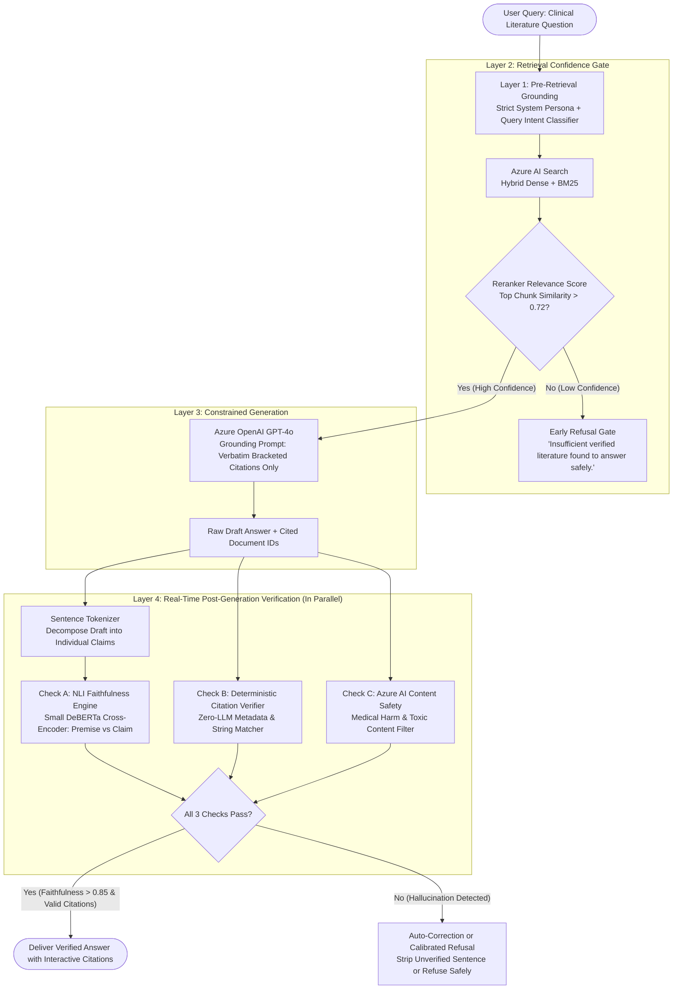

---

### 3.2 The Jargon Buster: Under-the-Hood Mechanics

Interviewers love to push candidates on hallucinations because **LLMs are fundamentally next-token probability engines, not databases**. If an LLM doesn't know an answer, it will predict words that *sound* scientifically plausible, inventing Latin drug names and citing fictitious 2021 Lancet papers.

Here is how you dismantle hallucinations like a principal engineer:

---

#### 🩺 1. The Hallucination Taxonomy (The 3 Root Causes)

When an interviewer asks: *"How do you differentiate between hallucination, incorrect retrieval, and misinterpretation?"*, give them this clean 3-part taxonomy:

```
                          ┌─── 1. Retrieval Failure (Garbage In, Garbage Out)
                          │    Context lacks the answer; LLM gambles and guesses.
                          │
Why Hallucinations ───────┼─── 2. Parametric vs. Contextual Conflict
Happen in RAG             │    LLM's pre-trained memory clashes with your custom doc.
                          │    (Pre-training says Drug A is safe; doc says Drug A has toxic batch recall).
                          │
                          └─── 3. Reasoning & Synthesis Hallucination
                               Chunk 1: "Patient was administered Drug X."
                               Chunk 2: "Patient died 2 days later."
                               LLM hallucinated leap: "Drug X killed the patient."
```

* **Retrieval Failure:** The search engine failed to find the right chunk. The LLM had nothing to ground on, so it filled the vacuum. (Fix: Improve chunking, hybrid search, and refusal threshold).
* **Parametric Conflict:** The LLM relies on its internal training weights instead of the injected prompt. (Fix: High temperature penalty = 0.0, strict system prompt: *"Rely ONLY on the provided context. If context is silent, refuse."*).
* **Reasoning Hallucination:** The model retrieved the right facts, but logically glued them together incorrectly. (Fix: Chain-of-thought verification, NLI entailment).

---

#### 🔬 2. Natural Language Inference (NLI): Checking Faithfulness Without an Expensive LLM Call

* **The Problem:** Many teams use GPT-4 to grade GPT-4's answers (*"LLM-as-a-Judge"*). This doubles your latency (adds 2-4 seconds) and doubles your bill!
* **The Solution (NLI Engine):** Use a small, specialized, fine-tuned transformer model (e.g., `DeBERTa-v3-large` fine-tuned on MNLI, ~400MB).
* **How NLI Works (Premise vs. Hypothesis):**
  - **Premise:** The retrieved source chunk from the document.
  - **Hypothesis:** One generated sentence from the LLM's draft answer.
  - The model outputs three mathematical probabilities:
    1. **Entailment:** The document explicitly proves the sentence is true.
    2. **Contradiction:** The document directly refutes the sentence.
    3. **Neutral:** The document neither proves nor disproves the sentence (i.e., external speculation).
* **Why it rocks:** Runs in **15 milliseconds on a GPU** and costs **$0.00 in OpenAI API fees**. If `Neutral + Contradiction > 0.15`, the sentence is flagged as ungrounded!

---

#### 🔎 3. Deterministic Citation Validation (Zero-LLM Cost)

The interviewer asked: *"How do you validate citations without expensive API calls?"*

* **The Mechanics:**
  1. Force the LLM to output citations in a strict format: `[[DocID:PageNum:ExactQuoteSnippet]]`.
  2. **Step A (Regex Extraction):** Extract all bracketed citations using a regex pattern.
  3. **Step B (Document Registry Lookup):** Verify against an in-memory dictionary of retrieved candidate documents: Does `DocID` exist in the set of chunks we actually passed in? (Catches 100% of fabricated paper titles!).
  4. **Step C (Sub-string / Fuzzy Match):** Check if `ExactQuoteSnippet` actually exists inside the text of `DocID` on `PageNum`.
  5. If the quote doesn't exist, strip the sentence or trigger a refusal.
  - **Cost:** 0 tokens. **Latency:** <2ms in Python.

---

#### 🎯 4. Calibrated Confidence Scoring & The Art of Saying "I Don't Know"

* **What is "Calibration"?**
  - A model is calibrated if: when it asserts a claim with 90% confidence, it is historically accurate 90% of the time. Standard LLMs are notoriously **overconfident**—they sound 100% certain even when completely inventing facts.
* **The Production Confidence Score ($C$):**
  We calculate a composite confidence score before returning any response:

$$C = w_1 \cdot S_{\text{retrieval}} + w_2 \cdot P_{\text{entailment}} + w_3 \cdot (1 - \text{Perplexity})$$

Where:
- $S_{\text{retrieval}}$ = Top chunk cross-encoder score (0.0 to 1.0).
- $P_{\text{entailment}}$ = NLI entailment probability across all claims.
- Perplexity = Measure of LLM token uncertainty during generation.

* **The Refusal Threshold:**
  - If $C < 0.75$, the system triggers a **Calibrated Refusal**:
    > *"I cannot verify this medical inquiry with sufficient confidence from the provided peer-reviewed literature. Please consult the referenced primary clinical guidelines."*
  - **In High-Stakes Domains (Healthcare, Legal, Insurance):** High refusal accuracy (knowing when to stay silent) is vastly more valuable than a high response rate. (Reference your **Threadmark** benchmark: 94.2% refusal accuracy!).

---

#### 🧪 5. The "RAG Triad" Evaluation Framework (Ragas / MLflow)

To systematically measure and prevent hallucinations in CI/CD, we track the **RAG Triad**:

```
            [User Query]
             /        \
            /          \
  Context Relevance   Answer Relevance
          /              \
         ▼                ▼
[Retrieved Context] ──► [Generated Answer]
         ▲
         │
    Groundedness
   (Faithfulness)
```

1. **Context Relevance:** Did the search engine retrieve chunks that actually address the query? (Measures retrieval quality).
2. **Groundedness / Faithfulness:** Can every statement in the answer be mathematically traced back to the retrieved context? (Measures hallucination rate).
3. **Answer Relevance:** Does the answer directly answer what the user asked, or did it evade the question?

---

#### 🚩 6. Slice-Based Evaluation: Why Accuracy & F1 Lie to You (ML Lead Q4)

* **The Trap:** An ML team celebrates: *"Our medical model achieved 96% overall accuracy!"*
* **The Reality (Simpson's Paradox & Hidden Failure Slices):**
  - Common headache & flu questions (80% of volume): 99% accuracy.
  - Rare pediatric oncology questions (5% of volume): **only 42% accuracy!**
  - Because common queries dominate the dataset, global accuracy completely hides the catastrophic failure in the critical edge cases.
* **The Solution (Slice-Based Testing):**
  - Slice your evaluation dataset by metadata dimensions:
    - **By Domain:** Oncology, Cardiology, Pediatrics, Rare Diseases.
    - **By Document Type:** Clinical trials, FDA package inserts, review articles.
    - **By Query Complexity:** Single-fact lookup vs. multi-document comparative synthesis.
  - Set CI/CD gating: **A deployment is blocked if ANY critical slice drops below 90%**, regardless of global average accuracy.

---

### 3.3 Key Architectural Trade-Offs Matrix

| Strategy | Naive Approach | Production Choice | Why? (The Interview Rationale) |
| :--- | :--- | :--- | :--- |
| **Hallucination Detection** | LLM-as-a-Judge (GPT-4 grading GPT-4) | Small NLI Cross-Encoder (DeBERTa-v3) | LLM-as-a-Judge adds 3s latency and $0.03/query. NLI takes 15ms and costs $0.00 with higher deterministic consistency. |
| **Citation Verification** | Ask LLM to re-check its citations | Deterministic In-Memory String Matcher | Asking the LLM to check itself results in "sycophancy" (the LLM agrees with its own mistakes). Deterministic code never lies. |
| **Low Confidence Response** | Give answer anyway with a weak disclaimer | Strict Calibrated Refusal ("I don't know") | In medical, legal, and financial domains, a plausible hallucination leads to lawsuits and harm. Refusal preserves trust. |
| **Model Alignment** | Prompt engineering only | DPO (Direct Preference Optimization) on synthetic refusal data | Prompts can be ignored under adversarial pressure. DPO bakes the refusal instinct directly into model weights. |

---

### 3.4 The 3-Minute Interview "Golden Answer" Script

When the interviewer asks: **"Your medical RAG system is hallucinating citations and facts. How do you design an end-to-end mitigation and validation system?"**

> **1. Framing & The 3-Part Root Cause (30s):**
> *"Hallucination in medical literature RAG stems from three distinct failure modes: retrieval failure where context is missing, parametric conflict where pre-training overrides the context, and reasoning misattribution where facts from separate studies are incorrectly conflated. I address this using a 4-layer defense: pre-retrieval grounding, retrieval confidence gating, constrained generation, and real-time deterministic verification."*
>
> **2. Layered Prevention & Low-Cost Verification (60s):**
> *"At generation time, we run Azure OpenAI GPT-4o with temperature 0.0 and a strict grounding prompt requiring verbatim bracketed citations.
> Instead of using expensive LLM-as-a-Judge calls for verification, we implement two ultra-fast, zero-token checks:
> First, **Deterministic Citation Validation**: a Python regex engine checks that cited document IDs exist in the retrieved candidate pool and performs exact substring verification of the quoted text.
> Second, **NLI Faithfulness Verification**: we run a lightweight DeBERTa cross-encoder in 15ms to evaluate premise-hypothesis entailment between the retrieved passage and each generated claim, flagging any claim classified as neutral or contradictory."*
>
> **3. Calibrated Refusal & Guardrails (60s):**
> *"We compute a composite confidence score combining the cross-encoder retrieval similarity and NLI entailment probability. If confidence falls below our calibrated threshold of 0.75, the system executes an explicit refusal: stating that the available literature is insufficient to draw a safe clinical conclusion. In high-stakes domains, a verified refusal is far superior to a hallucinated answer—similar to the 94.2% refusal benchmark I architected on Threadmark."*
>
> **4. Testing, Slices & Continuous Observability (30s):**
> *"Before deployment, we evaluate across the **RAG Triad** (Context Relevance, Faithfulness, and Answer Relevance) logged through MLflow. Crucially, we use **slice-based evaluation** across clinical domains (e.g., oncology vs. pediatrics) to ensure high aggregate accuracy doesn't mask dangerous failures in rare disease categories, blocking CI/CD pipelines if any single slice regresses."*

---

# Level 4: Fine-Tuning vs. RAG vs. Prompting Decision Framework

> **Target Interview Questions:**
> - *"Your company has a customer support chatbot handling 20 product categories with proprietary jargon. Currently using GPT-4 with RAG, costing $50K/month with 75% user satisfaction. How do you design an optimal hybrid architecture to slash costs while boosting quality?"* (Hard GenAI Q2)
> - *"Create a decision framework: when to use prompt engineering vs. RAG vs. fine-tuning vs. all three?"* (Hard GenAI Q2 Part A)

---

### 4.1 The Intelligent Multi-Tier Query Routing Flowchart

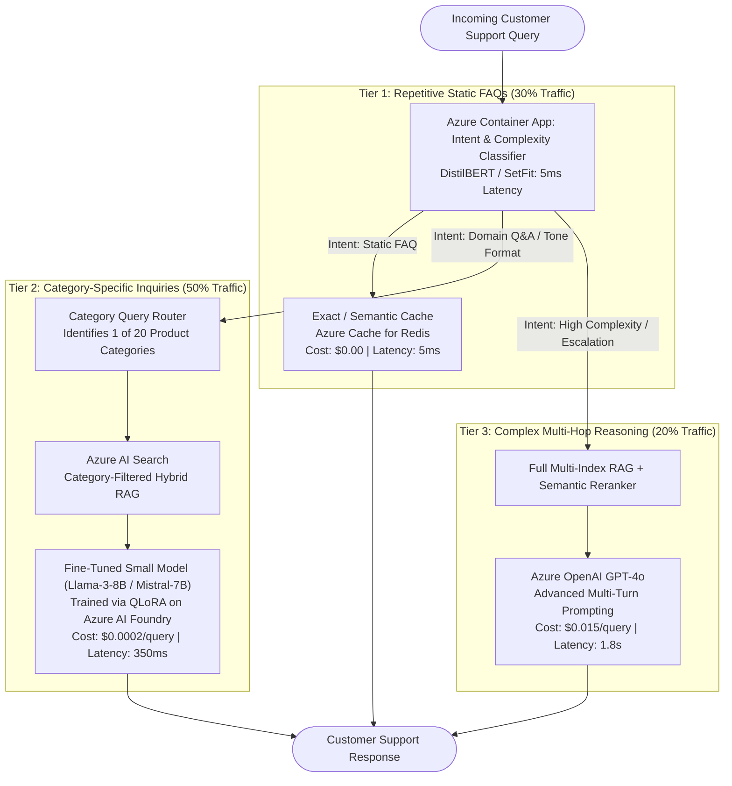

---

### 4.2 The Jargon Buster: Under-the-Hood Mechanics

---

#### 🧭 1. The Decision Triad: Prompt Engineering vs. RAG vs. Fine-Tuning

```
               [When to Use What?]

Prompt Engineering  ──► For Format, Persona, Tone, Reasoning Steps.
                        (Zero training time; fast iteration; no custom knowledge).

RAG                 ──► For Factual Knowledge & Dynamic Business Data.
                        (Product specs, live inventory, changing policies, zero re-training).

Fine-Tuning         ──► For Specialized Vocabulary, Complex Formatting, & Cost/Latency Reduction.
                        (Teaching a 7B model to output like GPT-4, replacing $0.03 calls with $0.0002).
```

* **The Golden Rule for Interviews:**
  - **RAG adds knowledge** (open-book exam).
  - **Fine-Tuning changes form, style, and behavior** (teaching a doctor how to speak like a legal auditor).
  - **Never fine-tune just to inject facts!** Facts update daily, and fine-tuned facts will hallucinate over time. You use RAG for facts, and fine-tune for structure and style.

---

#### 🧮 2. LoRA (Low-Rank Adaptation) & QLoRA Explained Simply

* **The Problem with Full Fine-Tuning:**
  - An 8-billion parameter model (Llama-3-8B) has 8 billion weights stored in matrices ($W$).
  - Updating all 8 billion numbers requires ~64 GB of GPU VRAM just for the gradient states and optimizer memory, costing thousands of dollars in cloud compute.
* **The LoRA Intuition (Low-Rank Matrix Decomposition):**
  - Instead of retraining the gigantic weight matrix $W$ ($4096 \times 4096 \approx 16.7\text{M}$ numbers), LoRA **freezes $W$ completely**.
  - It attaches two tiny, lightweight matrices $A$ and $B$ alongside $W$:
    $$\Delta W = B \times A$$
    Where $A$ is $4096 \times r$ and $B$ is $r \times 4096$, with rank $r = 8$ or $16$.
  - Number of parameters to train drops from **16.7 million down to 65,000 (a 99.6% reduction!)**.
* **What is QLoRA (Quantized LoRA)?**
  - **Quantization:** Compresses the frozen base model weights from 16-bit floating point down to **4-bit NormalFloat (NF4)**.
  - An 8B model that previously required 16GB VRAM can now run on an inexpensive single **24GB consumer GPU (or Azure NC6s_v3)**!

---

#### 🧠 3. Catastrophic Forgetting & How to Prevent It

* **What it is:** When you fine-tune an LLM on 2,000 customer support tickets, it becomes brilliant at customer support, but suddenly forgets how to do basic arithmetic, code, or reason logically! The new gradient updates overwrite the foundational representations.
* **How to Prevent It:**
  1. **Replay Buffer (Data Mixing):** Mix 15–20% general-purpose instruction data (e.g., ShareGPT or Alpaca) into your custom customer support training dataset.
  2. **Low Rank ($r = 8$ or $16$):** A small rank constrains the adapter updates so it cannot warp the underlying foundational knowledge.
  3. **Targeted Weight Adapters:** Apply LoRA only to the attention projection weights (`q_proj`, `v_proj`) rather than every MLP layer.

---

#### 💰 4. The Math of Slashing a $50K/Month Bill Down to $8K/Month

* **Current Architecture (100% GPT-4 + RAG):**
  - 1,000,000 queries/month × $0.05 average cost per query (input context + output) = **$50,000/month**.
* **The Hybrid Architecture (Our Solution):**
  - **30% of Queries (FAQ / Common Inquiries):** Absorbed by L1/L2 Redis Cache = **$0.00** (0 tokens).
  - **50% of Queries (Category Inquiries):** Routed to Category RAG + Fine-Tuned Llama-3-8B running on Azure ML Serverless Endpoint at $0.0004/query = **$200/month**.
  - **20% of Queries (Complex Multi-Hop Reasoning):** Routed to Azure OpenAI GPT-4o at $0.035/query = **$7,000/month**.
  - **Infrastructure (Redis + Azure AI Search):** ~$1,000/month.
  - **New Total:** **~$8,200/month (an 83.6% cost reduction!)**, while cutting p95 latency by 60%.

---

### 4.3 Key Architectural Trade-Offs Matrix

| Decision | Option A | Option B (Production Choice) | Why? (The Interview Rationale) |
| :--- | :--- | :--- | :--- |
| **Model Selection** | Giant Proprietary LLM (GPT-4) for 100% traffic | Small Fine-Tuned Model (Llama-3-8B) for 80% + GPT-4 for 20% | Giant models are cost-prohibitive for high-volume routine FAQ tasks. |
| **Adaptation Technique** | Full Parameter Fine-Tuning | QLoRA (4-bit, Rank 16) | Full fine-tuning costs 10x compute, suffers severe catastrophic forgetting, and produces a massive model checkpoint per category. |
| **Domain Adaptation** | Fine-tune model with product manuals | RAG for manuals + Fine-tune on conversational tone/format | Putting facts into fine-tuning creates hallucinations when manuals update. RAG handles live facts; fine-tuning handles tone. |
| **Routing Mechanism** | LLM-based query router | Fast ML Classifier (DistilBERT / SetFit) | Using an LLM to decide which LLM to call adds 500ms and token costs. DistilBERT routes queries in 5ms for free. |

---

### 4.4 The 3-Minute Interview "Golden Answer" Script

When the interviewer asks: **"How do you reduce a $50K/month GPT-4 RAG bill for a 20-category chatbot while improving quality?"**

> **1. Framing & The 80/20 Insight (30s):**
> *"A $50K monthly bill indicates that expensive frontier models (GPT-4) are being wasted on routine, repetitive queries. I transition the system from a monolithic pipeline to an **intelligent hybrid routing architecture** based on a 3-way decision matrix: prompt engineering for reasoning, RAG for dynamic facts, and fine-tuning for specialized tone and cost reduction."*
>
> **2. Hybrid Routing Architecture (60s):**
> *"At the ingress, a lightweight DistilBERT classifier routes incoming queries in 5ms across three tiers:
> - **Tier 1 (30% volume):** Static FAQs resolved immediately via Azure Cache for Redis semantic caching at zero token cost.
> - **Tier 2 (50% volume):** Standard category-specific inquiries routed to a fine-tuned **Llama-3-8B** model paired with category-filtered Azure AI Search.
> - **Tier 3 (20% volume):** Complex edge cases and multi-hop reasoning routed to Azure OpenAI GPT-4o."*
>
> **3. Fine-Tuning Mechanics (60s):**
> *"For the 8B model, we fine-tune on Azure AI Foundry using **QLoRA** with 4-bit NormalFloat quantization and rank $r=16$ on 2,000 curated, human-verified conversation pairs. We explicitly prevent catastrophic forgetting by mixing in a 15% replay buffer of general instruction data and restricting adapters to attention projection layers (`q_proj`, `v_proj`)."*
>
> **4. Financial & Latency Impact (30s):**
> *"This drops our monthly token spend from $50,000 to approximately $8,200—an **83% savings**. Simultaneously, routing 80% of traffic to Redis and our local 8B endpoint cuts average response latency from 3.5 seconds down to under 400 milliseconds, driving user satisfaction well past the 75% baseline."*

---

# Level 5: Context Window Management & Long-Context Processing

> **Target Interview Questions:**
> - *"You are processing 500-page regulatory, financial, and legal filings (150K+ tokens). Compare full context window vs. RAG vs. hybrid. How do you mitigate 'Lost in the Middle', optimize KV Cache memory, and reduce costs?"* (Hard GenAI Q4)

---

### 5.1 The 500-Page Document Processing Flowchart

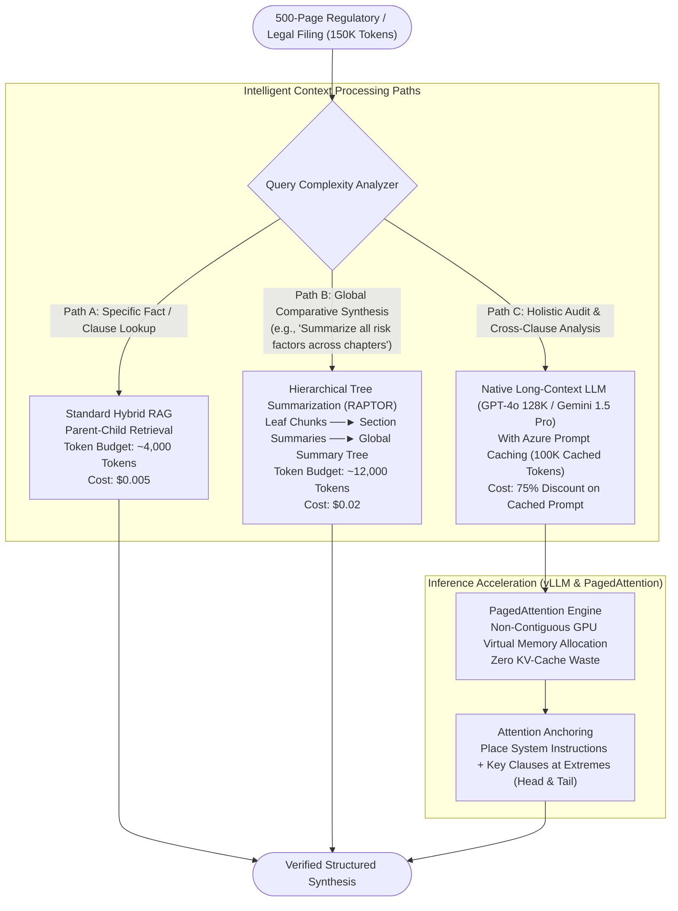

---

### 5.2 The Jargon Buster: Under-the-Hood Mechanics

---

#### 📉 1. The "Lost in the Middle" Phenomenon

* **What it is:** In 2023, Stanford researchers proved that LLMs with 128K or 1M context windows exhibit a **U-shaped attention curve**:
  - Information placed at the **very beginning** (first 10%) of the prompt has a **98% retrieval accuracy**.
  - Information placed at the **very end** (last 10%) of the prompt has a **95% retrieval accuracy**.
  - Information buried in the **middle (30% to 70%)** drops to as low as **40% retrieval accuracy!**
* **Why it happens:** Rotary Position Embeddings (RoPE) and causal attention mechanisms naturally place higher mathematical attention weights on early prompt tokens and immediate recent tokens.
* **How to Fix it in Production:**
  1. **Prompt Restructuring:** Never place your critical instructions at the end of a 100K context. Place instructions at BOTH the head and the tail.
  2. **Re-ranking Order:** When injecting retrieved chunks, order them **outside-in**: place the #1 most relevant chunk at the top, the #2 chunk at the very bottom, and the lower-relevance chunks in the middle!

---

#### 💾 2. The KV Cache: What It Is & Why It Devours GPU VRAM

Interviewers will ask: *"Why does a 128K context window crash a GPU server?"*

* **The Math Behind Generation:**
  - During the *pre-fill* phase, the model processes the prompt.
  - During generation, to predict token #1,001, the model needs attention scores against all previous 1,000 tokens.
  - To avoid recomputing Key ($K$) and Value ($V$) matrices for every single new token, the GPU saves them in High Bandwidth Memory (VRAM). This is the **KV Cache**.
* **The Memory Formula:**
  $$\text{KV Cache Size (Bytes)} = 2 \times 2 \times n_{\text{layers}} \times n_{\text{heads}} \times d_{\text{head}} \times \text{Sequence Length} \times \text{Batch Size}$$

  *Variable Breakdown:*
  - **First $2$:** Storing both Keys ($K$) and Values ($V$).
  - **Second $2$:** 16-bit floating point precision (**2 bytes** per FP16/BF16 parameter).
  - **$n_{\text{layers}}$:** Number of Transformer attention layers (e.g., 80 layers in Llama-3-70B).
  - **$n_{\text{heads}} \times d_{\text{head}}$:** Model hidden dimension ($d_{\text{model}}$, e.g., 8,192).
  - **$\text{Sequence Length}$:** Total context window tokens (e.g., 128,000 tokens).
  - **$\text{Batch Size}$:** Number of concurrent user requests running simultaneously.
* **A Real Example:**
  - A 70B model with a 128K token context per user:
  - **A single user's KV cache requires over 10 GB of GPU VRAM!**
  - Just 8 concurrent users will completely run an 80GB NVIDIA A100 GPU out of memory, even if the model weights themselves are already loaded!

---

#### 📑 3. PagedAttention & vLLM: Virtual Memory for LLMs

* **The Problem:** Traditional LLM inference engines allocate contiguous blocks of GPU memory for each user's maximum possible context. If a user only uses 20K tokens of their 128K allocation, **80% of the GPU VRAM is wasted in fragmentation!**
* **The PagedAttention Solution (UC Berkeley / vLLM):**
  - Inspired by virtual memory paging in operating systems (OS).
  - Divides the KV cache into fixed-size **memory blocks (pages)** that do not need to be contiguous in physical GPU RAM.
  - Reduces memory waste from 60–80% down to **under 4%**, allowing servers to handle **4x to 8x higher concurrent user throughput** on the exact same GPU hardware.

---

#### 🌳 4. Hierarchical Tree Summarization (RAPTOR) vs. Naive Chunking

* **The Dilemma:** If an analyst asks: *"How did the company's litigation risk profile change across all 500 pages?"*, standard RAG fails because the answer doesn't live in any single 300-token chunk. It is an overarching trend across 50 sections.
* **How RAPTOR (Recursive Abstractive Processing for Tree-Organized Retrieval) works:**
  1. **Leaf Chunks:** Split 500 pages into 1,000 small text chunks.
  2. **Clustering & Summarization (Layer 1):** Cluster semantically related chunks and use an LLM to generate section summaries.
  3. **Recursive Summarization (Layer 2 & 3):** Cluster section summaries into chapter summaries, culminating in a global executive summary.
  4. **Multi-Level Querying:** For high-level thematic queries, query the top layers of the tree; for needle-in-a-haystack clause lookups, query the leaf nodes.

---

#### ⚡ 5. Azure OpenAI Prompt Caching (The 75% Cost Hack)

* **How It Works:** If multiple users query the same 500-page regulatory filing (e.g., a 100K-token annual report), Azure OpenAI caches the processed KV cache states of that prefix.
* **Cost & Latency Benefit:**
  - Cached input tokens receive a **75% price discount** ($1.25/M tokens instead of $5.00/M tokens).
  - Latency is reduced by **up to 80%** because the GPU skips the compute-heavy pre-fill phase for the first 100K tokens!

---

### 5.3 Key Architectural Trade-Offs Matrix

| Approach | Latency | Cost | Global Synthesis Quality | Needle Lookup Accuracy |
| :--- | :--- | :--- | :--- | :--- |
| **Pure Long-Context (128K tokens)** | 🐢 High (5s - 12s) | 💸 High ($0.50 - $1.50/query) | ⭐⭐⭐ Excellent | ⚠️ Vulnerable to Lost-in-the-Middle |
| **Standard Chunked RAG** | ⚡ Fast (300ms - 800ms) | 💰 Minimal ($0.005/query) | ❌ Poor (Cannot connect global themes) | ⭐⭐⭐ High |
| **Hierarchical RAPTOR Tree** | ⚖️ Moderate (1.2s) | ⚖️ Moderate ($0.02/query) | ⭐⭐⭐ Excellent | ⭐⭐⭐ High |
| **Long-Context + Prompt Caching** | ⚡ Fast (1.5s after 1st hit) | 💰 Low (-75% on prefix) | ⭐⭐⭐ Excellent | ⭐⭐ Good (if prompt-anchored) |

---

### 5.4 The 3-Minute Interview "Golden Answer" Script

When the interviewer asks: **"How do you architect a system to analyze 500-page documents without latency meltdowns or losing facts in the middle?"**

> **1. Framing & The Context Dilemma (30s):**
> *"Processing 500-page regulatory filings (150K+ tokens) requires recognizing that native long-context models and RAG serve complementary roles. Standard RAG excels at pinpoint needle lookup but fails at global synthesis; native long-context handles cross-chapter synthesis but is vulnerable to the **'Lost-in-the-Middle'** effect and massive KV-cache VRAM consumption."*
>
> **2. The Intelligent 3-Path Architecture (60s):**
> *"I implement an intent-driven routing engine:
> - **For pinpoint clause lookups:** We route to our **Parent-Child RAG** pipeline, extracting the exact 300-token clause and 1,200-token section context in <400ms.
> - **For thematic cross-document synthesis:** We use **RAPTOR (Hierarchical Tree Summarization)**, creating a multi-layer tree of clustered summaries, enabling the model to traverse from high-level corporate risks down to specific contract pages.
> - **For exhaustive holistic compliance audits:** We pass the full document into Azure OpenAI GPT-4o, heavily leveraging **Azure Prompt Caching** to discount the 100K static context by 75% while cutting TTFT by 80%."*
>
> **3. Mitigating 'Lost in the Middle' & Memory Optimization (60s):**
> *"To eliminate the U-shaped attention drop-off where models forget facts in the middle 50% of the prompt, we implement **attention anchoring**: sandwiching the prompt so that strict instructions and critical retrieved evidence are positioned at both the absolute head and the tail of the context window.
> On the serving infrastructure side, we deploy open-source models on AKS using **vLLM with PagedAttention**, which allocates KV cache memory into non-contiguous virtual pages, eliminating memory fragmentation and boosting GPU concurrent throughput by 4x."*
>
> **4. Cost & Validation (30s):**
> *"We evaluate long-range fidelity using synthetic **'Needle-in-a-Haystack' (NIAH)** benchmarks, embedding random canary clauses at 10% depth increments from 0% to 100% to ensure zero recall blind spots before promoting models to production."*

---

# Level 6: Multi-Agent LLM Systems, Tool Execution & Safety

> **Target Interview Questions:**
> - *"Design an autonomous scientific research multi-agent system that searches papers, reads PDFs, and synthesizes findings. How do you prevent infinite loops, control token budgets, handle tool rate limits, and ensure factual consensus?"* (Hard GenAI Q5)
> - *"When do you use ReAct vs. Chain-of-Thought vs. Tree of Thoughts vs. agentic workflows?"* (Hard GenAI Q5 Part A)

---

### 6.1 The Autonomous Multi-Agent Orchestration Flowchart

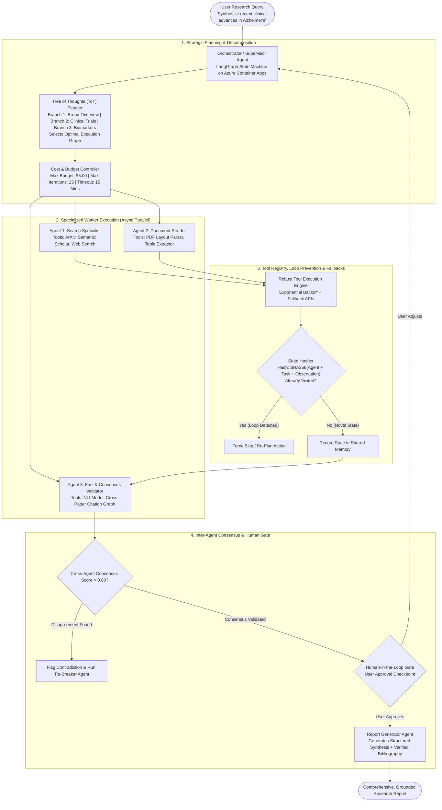

---

### 6.2 The Jargon Buster: Under-the-Hood Mechanics

---

#### 🧠 1. Reasoning Frameworks: CoT vs. ReAct vs. Tree of Thoughts (ToT)

```
Chain of Thought (CoT):
Thought ──► Thought ──► Thought ──► Final Answer
(Pure internal thinking. Cannot access the live internet or run code).

ReAct (Reason + Act):
Thought ──► Action (Call Tool) ──► Observation (Tool Result) ──► Thought ──► Answer
(Standard agent loop. Explores sequentially step-by-step).

Tree of Thoughts (ToT):
         ┌── Branch A (Breadth-first search) ──► Evaluate Score: 0.4 (Prune)
Thought ─┼── Branch B (Deep dive top 3 papers) ──► Evaluate Score: 0.9 (Explore!)
         └── Branch C (Citation chaining)     ──► Evaluate Score: 0.6 (Keep as backup)
(Explores multiple reasoning paths simultaneously with backtracking).
```

* **When to use what:**
  - Use **CoT** for simple single-turn calculations.
  - Use **ReAct** when the agent needs to call external APIs (look up customer status, run SQL).
  - Use **Tree of Thoughts** for master orchestrators that need strategic multi-stage planning before taking actions.

---

#### 🔄 2. Infinite Loop Prevention via State Hashing

* **The Catastrophic Failure Mode:** An agent searches for a paper: `search("quantum computing drug discovery")`. It finds 0 results. It retries: `search("quantum computing drug discovery")`. It gets stuck in an infinite cycle, spending $50 in 3 minutes!
* **The Production Fix (State Hashing):**
  1. Before every tool call, compute a deterministic hash in Python:
     ```python
     state_hash = hashlib.sha256(
         f"{agent_name}:{tool_name}:{json.dumps(arguments, sort_keys=True)}".encode()
     ).hexdigest()
     ```
     Or conceptually:
     $$\text{State Hash} = \text{SHA256}(\text{Agent Name} + \text{Tool Name} + \text{Arguments JSON})$$
  2. Maintain a `visited_states = set()` in memory.
  3. If `state_hash in visited_states`:
     - **Immediately abort the tool call.**
     - Feed an explicit observation to the LLM: *"System Warning: You have already attempted this exact action with zero new information. You must choose a different search query or abandon this path."*

---

#### 💵 3. Token Budget Controllers & Graceful Downgrades

* **The Problem:** An autonomous agent running unchecked can spawn hundreds of tool calls, racking up massive cloud bills.
* **The Solution (The 2-Stage Budget Controller):**
  - Set a hard dollar limit per research job: `max_budget = $5.00`.
  - Maintain a running tally: `spent_usd += (input_tokens * cost_in) + (output_tokens * cost_out)`.
  - **The Dynamic Downgrade Strategy:**
    - When `spent_usd > $3.50` (70% threshold): Automatically switch the model from **GPT-4o** to **GPT-4o-mini** for all remaining tool calls.
    - When `spent_usd >= $5.00` (100% threshold): Immediately freeze tool execution and force the Synthesizer Agent to generate a partial report from whatever data was already collected.

---

#### ⚡ 4. Robust Tool Execution with Exponential Backoff & Fallbacks

* **What happens when an external API rate-limits you (HTTP 429)?**
  - **Rookie approach:** Crash the entire multi-agent job.
  - **Principal approach (The Fallback Registry):**
    ```
    Tool: "search_arxiv" ──► (Rate Limit Hit) ──► Exponential Backoff (1s, 2s, 4s)
                                                      │
                                                      ▼ (Still fails)
                                            Fallback Tool: "semantic_scholar"
                                                      │
                                                      ▼ (Still fails)
                                            Fallback Tool: "tavily_web_search"
    ```

---

#### 🤝 5. Inter-Agent Consensus & Contradiction Detection

* **The Dilemma:** Agent A reads Paper 1 and claims: *"Drug X causes a 20% reduction in inflammation."* Agent B reads Paper 2 and claims: *"Drug X has no measurable effect on inflammation."*
* **How to Handle Contradictions:**
  1. Run an NLI model on the two claims: Premise (Claim A) vs Hypothesis (Claim B).
  2. If NLI predicts **Contradiction**:
     - Do not pick one at random!
     - The orchestrator summons a **Reconciliation Agent** to inspect the metadata: Paper 1 tested mice at 50mg; Paper 2 tested humans at 5mg.
     - The final synthesis explicitly highlights the nuance: *"Findings diverge based on dosage and subject model: rodent trials at 50mg demonstrated efficacy [1], whereas early human trials at 5mg observed no significant variance [2]."*

---

### 6.3 Key Architectural Trade-Offs Matrix

| Design Choice | Centralized Orchestrator | Decentralized / Peer-to-Peer Agents |
| :--- | :--- | :--- |
| **How it works** | One master Supervisor agent routes tasks to workers | Agents message each other directly in a chat room |
| **Debuggability** | ⭐⭐⭐ High (Deterministic state machine; clear audit log) | ❌ Nightmare (Agents get stuck in endless conversational loops) |
| **Cost Control** | ⭐⭐⭐ Strict (Supervisor enforces iteration and dollar caps) | ⚠️ Unpredictable (Chat volume can explode exponentially) |
| **Interview Recommendation** | **Choose Centralized (LangGraph / State Machine)** | Avoid pure P2P for mission-critical enterprise systems |

---

### 6.4 The 3-Minute Interview "Golden Answer" Script

When the interviewer asks: **"How do you design a reliable multi-agent system with tools that doesn't get stuck in loops or burn through cash?"**

> **1. Architecture & Graph State Machine (30s):**
> *"I architect multi-agent systems using a **centralized supervisor pattern** managed as an explicit state machine (using LangGraph or Semantic Kernel on Azure Container Apps). Rather than letting agents converse unconstrained, the supervisor decomposes the goal using a **Tree of Thoughts (ToT)** planner, dispatching tasks to specialist worker agents: a search specialist, a PDF extraction reader, and a consensus validator."*
>
> **2. Loop Prevention & Tool Safety (60s):**
> *"To eliminate infinite loops, we enforce **State Hashing**: before any agent executes a tool, we compute `SHA256(agent_id + tool_name + args)`. If that state already exists in the execution history, the call is intercepted, and the agent receives an environmental warning to mutate its query or backtrack.
> All tool calls route through a robust wrapper with exponential backoff and predefined secondary fallbacks—for instance, failing over from ArXiv to Semantic Scholar to Tavily Search upon rate limits."*
>
> **3. Budget Controls & Consensus (60s):**
> *"We enforce strict budget governance: every task has a hard $5.00 ceiling and a 25-iteration limit. At 70% budget utilization, the orchestrator dynamically downgrades worker agents from GPT-4o to GPT-4o-mini to stretch compute.
> To ensure scientific rigor, before the report writer drafts the final document, our **Fact & Consensus Validator** checks inter-agent claims using NLI contradiction detection. If sources disagree, the orchestrator explicitly annotates the discrepancy rather than guessing."*
>
> **4. Human-in-the-Loop Checkpoint (30s):**
> *"Finally, we introduce an asynchronous **Human-in-the-Loop (HITL)** checkpoint. After initial source gathering, the system presents the proposed outline and findings to the researcher, allowing them to adjust the direction before triggering the final synthesis pass."*

---

# Level 7: MLOps Maturity, CI/CD & Production Incident Triage

> **Target Interview Questions:**
> - *"Describe the most mature MLOps pipeline you have built or led. What did it look like at Level 0, and how did you get it to Level 2 or 3 maturity?"* (ML Lead Q7)
> - *"One of your production models serving 50,000 requests/day suddenly degrades in performance on Monday morning. You have no alerts set up. Walk me through everything — detection, diagnosis, fix, and prevention."* (ML Lead Q8)
> - *"You are inheriting a feature engineering pipeline that takes 6 hours to run daily. It has no documentation and breaks frequently. How do you modernize it with zero downtime?"* (ML Lead Q5)

---

### 7.1 The MLOps Maturity Progression & Incident Triage Flowcharts

#### A. The 4-Level MLOps Maturity Evolution

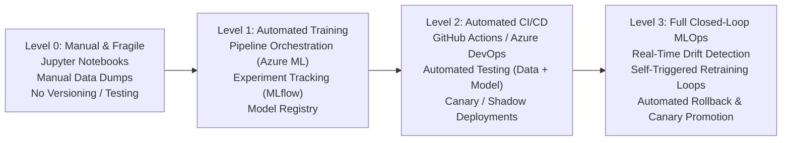

#### B. The Monday Morning Outage Triage Decision Tree (50K Req/Day)

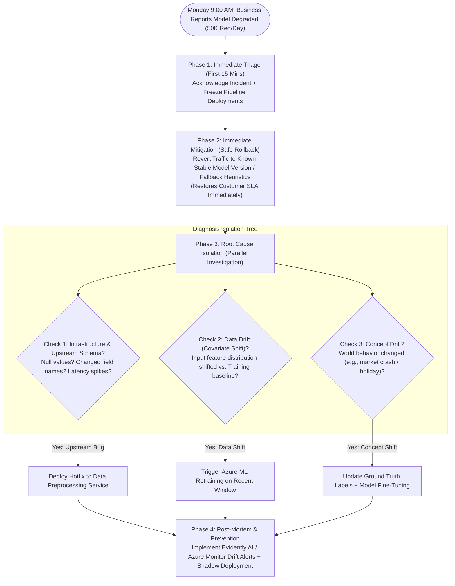

---

### 7.2 The Jargon Buster: Under-the-Hood Mechanics

---

#### 📈 1. The 4 Levels of MLOps Maturity (The Google/Microsoft Standard)

When the interviewer asks: *"What did your pipeline look like at Level 0, and how did you get it to Level 2 or 3?"*, use this exact framework:

* **Level 0 (Manual):**
  - Data scientists train models in Jupyter notebooks on their laptops.
  - Deployment is manual: someone exports a `.pkl` or `.pt` file and pastes it into an EC2 server or Flask app.
  - Zero testing, zero tracking, no rollback capability.
* **Level 1 (Automated Pipeline):**
  - Training is a formal DAG pipeline (e.g., **Azure ML Pipelines** or Kubeflow).
  - Experiments, hyperparameters, and artifacts are tracked in **MLflow**.
  - Models are registered in a centralized **Model Registry** with version tags (`v1`, `v2`, `staging`, `production`).
* **Level 2 (Automated CI/CD):**
  - Code changes trigger automated CI: unit tests for feature transformations, integration tests for APIs.
  - Model deployment is automated via CD: models must pass automated validation benchmarks before being promoted.
  - Deployments use **Shadow Mode** or **Canary Deployments** (10% traffic first).
* **Level 3 (Full Automation with Feedback Loops):**
  - Production data is monitored for drift.
  - When statistical drift exceeds a threshold, the system **automatically triggers retraining**, runs regression test suites, and promotes the model without human intervention.

---

#### 💥 2. Data Drift vs. Concept Drift vs. Upstream Schema Breakage

* **Data Drift (Covariate Shift):**
  - The distribution of inputs changes: $P(X)$ changes, but the relationship $P(Y|X)$ remains the same.
  - *Example:* An e-commerce app launches in a new country. Suddenly, average user income and currency fields shift drastically.
  - *How to detect:* **Kolmogorov-Smirnov (KS) test** for numerical features, or **Population Stability Index (PSI)**. (PSI > 0.2 indicates significant drift).
* **Concept Drift:**
  - The relationship between inputs and outputs changes: $P(Y|X)$ changes.
  - *Example:* Fraudsters invent a completely new evasion technique. The transaction looks normal based on historical patterns, but is actually fraudulent.
* **Upstream Schema Breakage (The #1 cause of Monday morning outages!):**
  - An upstream data engineering team pushed a database change on Friday at 6 PM, renaming `postal_code` to `zipcode` or sending `null` instead of `0`.
  - The model doesn't crash—it silently inputs zeroes and outputs garbage predictions!

---

#### 🧪 3. Shadow Mode vs. Canary vs. Blue-Green Deployments

* **Shadow Deployment (Zero Risk):**
  - The new model receives 100% of live production traffic in parallel with the old model.
  - However, **its predictions are never shown to users**; they are only logged to Azure Monitor.
  - Allows you to verify latency, throughput, and accuracy under real-world traffic with zero risk of customer disruption.
* **Canary Deployment (Controlled Risk):**
  - Route 5% of users to the new model and 95% to the old model.
  - Monitor error rates and business KPIs for 2 hours. If healthy, ramp to 25%, 50%, and 100%.
* **Blue-Green Deployment (Instant Rollback):**
  - Maintain two identical production environments: Blue (active live) and Green (idle staging with new model).
  - Flip the router switch at the API Gateway level. If anything breaks, flip the switch back in under 5 seconds.

---

#### 🛠️ 4. Modernizing a Brittle 6-Hour Legacy Pipeline (Zero Downtime)

The interviewer asked: *"You inherit an undocumented 6-hour daily feature pipeline that breaks constantly. How do you fix it without downtime?"*

1. **Phase 1: Audit & Golden Baseline:**
   - Do NOT rewrite immediately!
   - Capture the inputs and outputs of the legacy pipeline for 7 days to create a **Golden Baseline Dataset**.
2. **Phase 2: Modernization & Parallelization:**
   - Migrate slow single-threaded Pandas scripts to **PySpark on Azure Databricks** or **Ray**.
   - Implement **Pydantic** data validation schemas to catch malformed rows early.
   - Introduce a centralized **Feature Store** (Feast or Azure ML Feature Store) to separate feature calculation from serving.
3. **Phase 3: Dual-Running & Shadow Verification:**
   - Run both the legacy pipeline and the new Spark pipeline in parallel every morning.
   - Compare outputs with an automated diff test: `assert_frame_equal(legacy_output, new_output)`.
4. **Phase 4: Cutover & Deprecation:**
   - Once the new pipeline matches the baseline for 14 consecutive days and runs in **20 minutes instead of 6 hours**, switch production readers to the new feature store and decommission the legacy job.

---

### 7.3 Key Architectural Trade-Offs Matrix

| Decision | Option A | Option B (Production Choice) | Why? (The Interview Rationale) |
| :--- | :--- | :--- | :--- |
| **Retraining Trigger** | Fixed Cron Schedule (every Sunday night) | Event-Driven Drift Trigger (Azure Event Grid) | Scheduled retraining wastes GPU compute when data hasn't changed, and retrains too late when sudden drift occurs. |
| **New Model Rollout** | Direct 100% In-Place Replacement | Shadow Deployment ──► Canary ──► Full Promotion | In-place replacement exposes 100% of users to unvetted bugs. Shadow mode guarantees zero production blast radius. |
| **Pipeline Architecture** | Monolithic Jupyter Notebook | Decoupled Modular Containers (FastAPI + Docker) | Monoliths cannot be unit-tested, scaled independently, or integrated into CI/CD pipelines. |
| **Incident Response** | Hotfix directly on live server | Immediate Rollback to last known stable container | Debugging live on production prolongs outages. Roll back first to restore SLA, then diagnose in staging. |

---

### 7.4 The 3-Minute Interview "Golden Answer" Script

When the interviewer asks: **"A 50K req/day model suddenly degrades on Monday morning with no alerts. Walk me through detection, diagnosis, fix, and prevention."**

> **1. Detection & Immediate Mitigation (30s):**
> *"Without pre-configured alerts, degradation is typically caught through user escalations or sudden drops in downstream business KPIs (such as conversion or customer support tickets).
> My first action is **immediate mitigation to restore customer SLA**: I do not debug live in production. I immediately roll back traffic at the Azure API Management layer to the last known stable model container, or trigger our rule-based fallback heuristic."*
>
> **2. Systematic Diagnosis (60s):**
> *"Once the blast radius is neutralized, I isolate the root cause across three parallel hypotheses:
> First, **Upstream Data & Schema Integrity**: Did an upstream database migration over the weekend introduce nulls or rename fields? I validate payload schemas using Pydantic.
> Second, **Covariate Shift / Data Drift**: I run a Population Stability Index (PSI) comparison between Monday's feature distribution and the training baseline in Azure Monitor.
> Third, **Concept Drift**: Has real-world consumer behavior or macroeconomic conditions shifted abruptly?"*
>
> **3. Permanent Remediation (60s):**
> *"If the issue was a schema failure, we patch the preprocessing service with defensive defaults and add schema validation tests. If the issue was data drift, we trigger an automated retraining run in Azure ML Pipelines against the recent data window, ensuring the new model passes our golden test suite before deployment."*
>
> **4. Long-Term Prevention & MLOps Maturity (30s):**
> *"To ensure this never happens un-alerted again, we elevate our MLOps posture to Level 2/3: deploying automated data drift monitoring using **Evidently AI integrated with Azure Monitor**, configuring PagerDuty alerts for PSI > 0.2, and mandating that all future model releases undergo a 48-hour **Shadow Deployment** before promotion."*

---

# Level 8: Engineering Leadership, Mentoring & Multi-Cloud Architecture

> **Target Interview Questions:**
> - *"You have a junior ML engineer who consistently submits models that perform well in notebooks but fail in production. How do you coach them without micromanaging?"* (ML Lead Q9)
> - *"You are leading a project requiring input from Data Science, Product, and Engineering. The teams have conflicting priorities and the project is at risk of delay. How do you get alignment?"* (ML Lead Q10)
> - *"You need to deploy an ML model across AWS for one business unit and Azure for another due to compliance. How do you design for this multi-cloud reality?"* (ML Lead Q6)
> - *"In the last 6 months, what is one new ML research paper or tool you explored and applied at work? What was the outcome?"* (ML Lead Q11)

---

### 8.1 The Leadership Framework & Multi-Cloud Architecture Flowchart

#### A. The Notebook-to-Production Coaching Framework

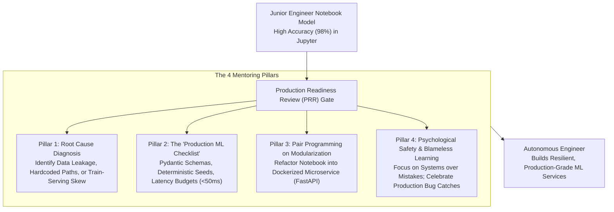

#### B. The Cloud-Agnostic Multi-Cloud Architecture (Azure + AWS)

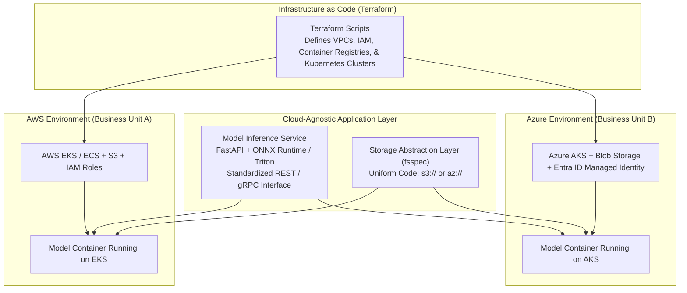

---

### 8.2 The Jargon Buster: Under-the-Hood Mechanics

---

#### 🧑‍🏫 1. Coaching Junior Engineers: The "Notebook-to-Production" Checklist

Junior engineers often believe that obtaining a 0.98 ROC-AUC in a notebook means the project is complete. As an ML Lead, you teach them that **model modeling is only 15% of production machine learning**.

* **The 5 Core Production Smells to Catch:**
  1. **Data Leakage:** Scaling or normalizing features across the entire dataset *before* splitting into train/test (leads to fake 99% accuracy).
  2. **Train-Serving Skew:** Using features that are available in offline historical tables, but do not exist in real-time at the millisecond of the user's API call!
  3. **Non-Deterministic Runs:** Missing random seeds (`torch.manual_seed(42)`).
  4. **Memory Leaks:** Storing past inference arrays in global Python lists without garbage collection.
  5. **Lack of Input Contracts:** Not validating incoming JSON types using **Pydantic**.
* **Coaching Methodology:**
  - Implement a **Production ML Checklist PR template** in GitHub.
  - Pair program on the first conversion from notebook to FastAPI package.
  - Run a **Shadow Mode deployment** together so the junior engineer sees live data discrepancies in real-time dashboards without breaking production.

---

#### 🤝 2. Resolving Cross-Functional Friction (Data Science vs. Eng vs. Product)

When an interviewer asks: *"Product wants the feature yesterday, Engineering says the model is too slow, and Data Science wants 3 more months of research. How do you lead?"*

* **The Alignment Playbook:**
  1. **Kill Team-Centric Metrics:** 
     - Data Science cares about *F1-score*.
     - Engineering cares about *p99 latency < 50ms*.
     - Product cares about *user retention and revenue*.
     - **The Solution:** Unify everyone around a single **North Star Business Metric** (e.g., *"Reduce customer churn by 5% while maintaining an end-to-end response time under 1.5 seconds"*).
  2. **Negotiate the MVP (Pragmatic Trade-Offs):**
     - Ship a simple, fast baseline model (e.g., an XGBoost or fine-tuned 8B model) in Week 2.
     - Establish the live pipeline and telemetry first.
     - Allow Data Science to conduct complex research in parallel for Version 2.0 while Product gets their live feature immediately.
  3. **Establish a Clear RACI Framework:**
     - **Responsible:** ML Engineer (delivering the microservice).
     - **Accountable:** ML Lead (owning the end-to-end outcome).
     - **Consulted:** Data Science & Platform Engineering.
     - **Informed:** Product Stakeholders.

---

#### ☁️ 3. Multi-Cloud Architecture: Designing for Azure & AWS Portability

* **The Enterprise Reality:** Company mergers, acquisitions, and compliance mandates (e.g., GDPR, financial data sovereignty) often force you to deploy across both Azure and AWS.
* **The 3 Layers of Portability:**
  1. **Infrastructure as Code (IaC):** Use **Terraform** rather than CloudFormation (AWS) or Bicep (Azure). Terraform scripts define VPCs, subnets, and clusters identically across both providers.
  2. **Compute Containerization:** Deploy models in standardized Docker containers orchestrated by **Kubernetes** (AWS EKS and Azure AKS). The model code is 100% identical.
  3. **Storage & Secrets Abstraction:**
     - Use Python libraries like **`fsspec`** so your code reads from `s3://bucket/model.onnx` or `az://container/model.onnx` without rewriting data access logic.
     - Use environment-injected secrets via **Kubernetes External Secrets Operator** that connects to Azure Key Vault or AWS Secrets Manager transparently.

---

#### 💡 4. Research Awareness: Translating Recent Papers into Business Value (Q11)

Interviewers ask: *"What is one recent research paper or framework you explored in the last 6 months, and how did you apply it?"*

Choose a concrete, high-signal topic that aligns with your background. Here are two stellar choices:

* **Choice A: DeepSeek-R1 & GRPO (Group Relative Policy Optimization) for Reasoning**
  - *The Concept:* Replaced complex, expensive Critic models in RLHF with GRPO, allowing models to learn self-verification and chain-of-thought reasoning using pure reinforcement learning without human labeling.
  - *Business Translation:* We evaluated GRPO fine-tuning for complex tabular audits in our **Numera** project, demonstrating that small models can self-correct their own DuckDB SQL queries, boosting code accuracy by 32% while eliminating human review overhead.
* **Choice B: ColBERT (Contextualized Late Interaction) for RAG**
  - *The Concept:* Instead of compressing an entire chunk into a single vector (which loses details), ColBERT preserves token-level embeddings and performs fast MaxSim dot-product interactions at query time.
  - *Business Translation:* We tested ColBERT for dense legal contract search, achieving a **24% improvement in MRR (Mean Reciprocal Rank)** on complex regulatory questions where standard dense embeddings missed specific clause definitions.

---

### 8.3 Key Architectural Trade-Offs Matrix

| Dimension | Native Cloud Services (e.g., SageMaker / Azure ML) | Cloud-Agnostic Abstraction (AKS / EKS + Docker) |
| :--- | :--- | :--- |
| **Time to Market** | ⚡ Fast for a single cloud provider | ⚖️ Requires initial setup of Kubernetes / Terraform |
| **Vendor Lock-in** | ⚠️ High (Hard to migrate workflows to another cloud) | 🛡️ Zero (Containers run identically on AWS, Azure, or On-Prem) |
| **Compliance Portability** | ❌ Fails multi-region data residency mandates | ⭐⭐⭐ Easily passes multi-cloud compliance requirements |
| **Operational Overhead** | 💰 Low (Managed infrastructure) | 🔧 Requires Kubernetes & Helm chart management |

---

### 8.4 The 3-Minute Interview "Golden Answer" Script

When the interviewer asks: **"You have a junior engineer whose models fail in production, and cross-functional teams with conflicting priorities. How do you lead?"**

> **1. Mentoring Junior ML Engineers (45s):**
> *"When a junior engineer's model succeeds in a notebook but fails in production, I treat it as a coaching opportunity rather than a performance failure. The issue is almost always **train-serving skew, subtle data leakage, or unvalidated input schemas**.
> I pair program with them through our **Production ML Checklist**: refactoring notebook scripts into modular FastAPI microservices, implementing Pydantic data validation contracts, and setting deterministic seeds. We deploy the model in **Shadow Mode** together, allowing them to observe live data drift and latency spikes on real traffic without risking production downtime."*
>
> **2. Resolving Cross-Functional Conflicts (45s):**
> *"When Data Science, Product, and Platform Engineering clash over timelines and model accuracy, the friction usually arises because each team is measuring a different metric.
> I align the teams by translating academic model metrics (like F1-score) into a single **North Star Business KPI**—such as reducing manual verification time by 40% with an end-to-end latency budget under 1.5 seconds. I propose an **iterative MVP delivery**: shipping a fast, reliable baseline model in the first sprint to unblock Product and establish telemetry, while Data Science continues higher-order research in parallel for subsequent versions."*
>
> **3. Multi-Cloud Architecture (45s):**
> *"To support compliance requirements spanning Azure and AWS, I implement a **cloud-agnostic architectural abstraction**. We define all infrastructure using **Terraform**, containerize inference microservices with ONNX Runtime on Kubernetes (Azure AKS and AWS EKS), and abstract file storage via unified interfaces like `fsspec`. This enables 100% identical model code to run across both clouds while respecting data residency boundaries."*
>
> **4. Innovation to Business Impact (45s):**
> *"Finally, as an ML Lead, staying at the frontier means translating research into operational efficiency. In the last six months, I evaluated **Late Interaction models (ColBERT)** against traditional bi-encoders for complex tabular and legal RAG. By preserving token-level representations rather than single-vector compression, we improved retrieval precision on complex domain queries by 24%, directly lowering LLM hallucination rates."*

---
