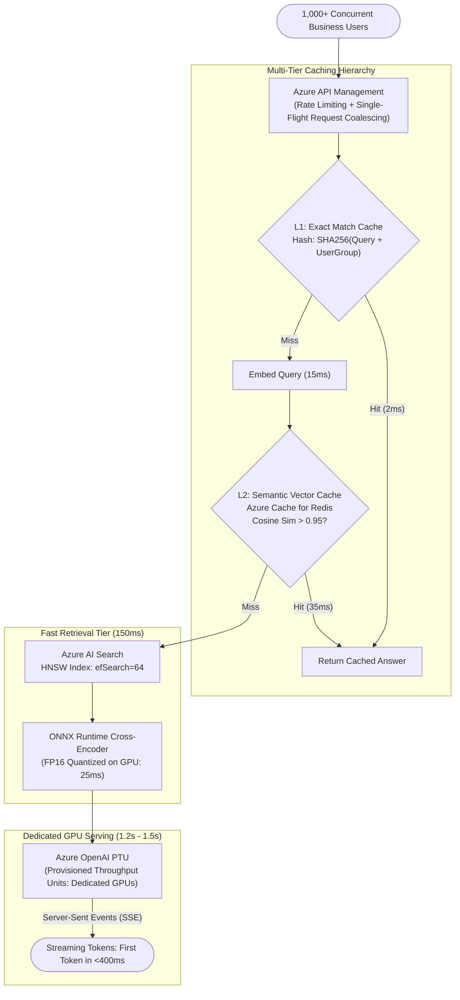
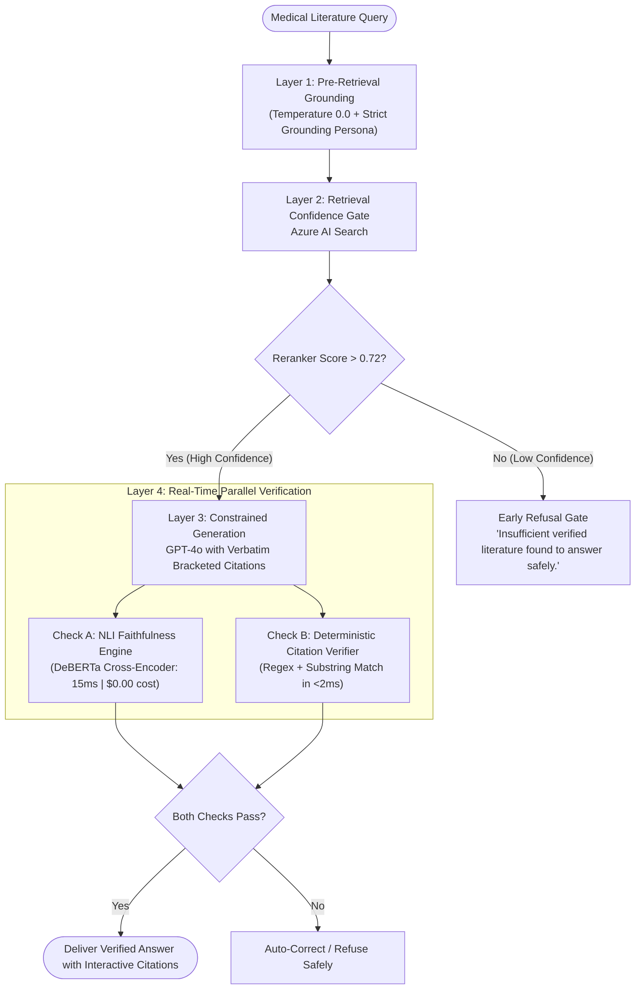
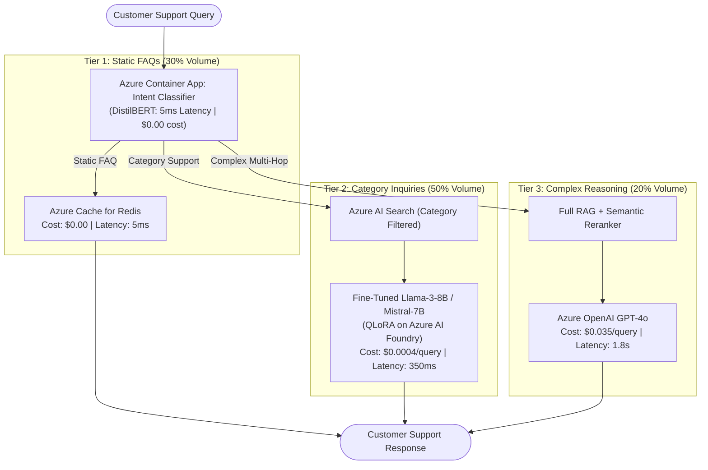
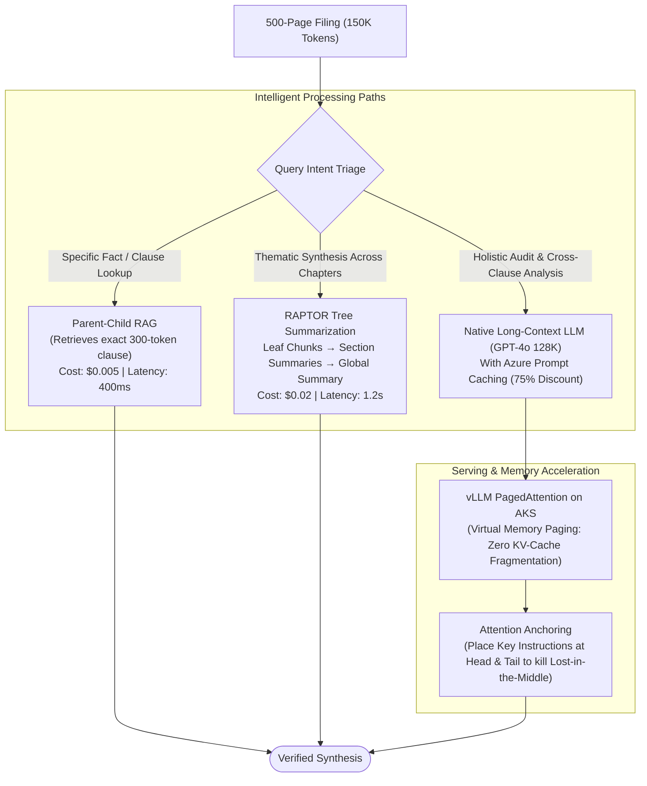
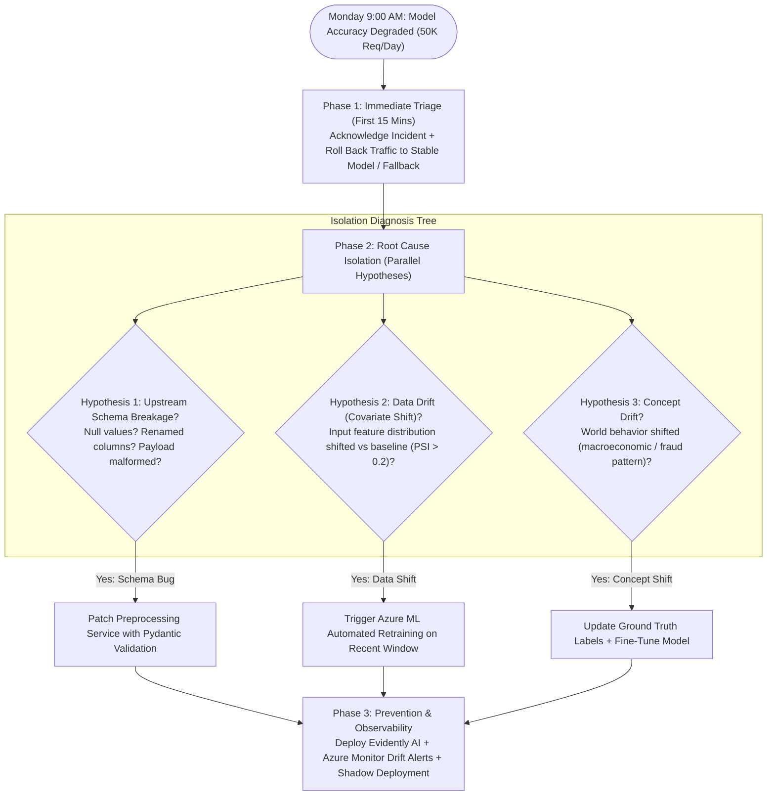
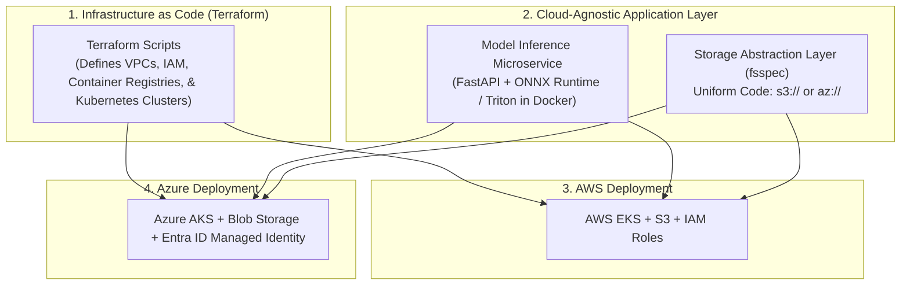

# GenAI & ML Lead Master Study Guide (Easy-Learn Edition)

> **Revision-Friendly • Intuitive • Concept-First**
> Built for rapid interview mastery. Every level gives you:
> 1. **The 10-Second Concept Hook** (Why does this matter?)
> 2. **Visual Flowchart** (How data flows through components)
> 3. **The Jargon Buster** (Plain-English definitions & real-world analogies)
> 4. **Key Production Trade-Offs** (Why naive approaches fail)
> 5. **The 3-Minute Golden Interview Answer** (Grounded in Azure Cloud)
>
> 🧭 **Companion Guides:**
> - [README.md](README.md) — Comprehensive Master Architecture Reference (Deep-dive specs, benchmarks & implementation details)
> - [interview_questions.md](interview_questions.md) — Full 117 Recruiter Question Bank
> - [interview_explanations.md](interview_explanations.md) — Revision-friendly Q&A breakdown with diagrams for all 117 questions

---

## 🗺️ Visual Curriculum Roadmap

```mermaid
flowchart LR
    L1["Level 1: Enterprise RAG & Ingestion"] --> L2["Level 2: Scale, Latency & Caching"]
    L2 --> L3["Level 3: Hallucination Mitigation & Evals"]
    L3 --> L4["Level 4: Fine-Tuning vs RAG vs Prompting"]
    L4 --> L5["Level 5: Context Window & KV Cache"]
    L5 --> L6["Level 6: Multi-Agent Systems & Safety"]
    L6 --> L7["Level 7: MLOps Maturity & Incident Triage"]
    L7 --> L8["Level 8: ML Leadership & Multi-Cloud"]
```



| Level | Topic | Key Interview Question Mapped |
| :--- | :--- | :--- |
| **Level 1** | **Enterprise RAG & Access Control** | *500K internal docs across SharePoint/Confluence, 5,000 queries/day, permissions (ML Lead Q1 & Hard GenAI Q1)* |
| **Level 2** | **Scale, Low Latency (<2s) & Caching** | *Sub-2 second latency with 1,000+ concurrent users, Redis caching (Hard GenAI Q1 Part C & ML Lead Q2)* |
| **Level 3** | **Hallucination Mitigation & Evals** | *Medical literature review RAG with 5% fabricated citations & studies (Hard GenAI Q3 & ML Lead Q4)* |
| **Level 4** | **Fine-Tuning vs. RAG vs. Prompting** | *Slashing a $50K/month GPT-4 customer support bill down to $8K/month (Hard GenAI Q2)* |
| **Level 5** | **Context Window & KV Cache** | *500-page regulatory filings, Lost-in-the-Middle, KV cache memory math (Hard GenAI Q4)* |
| **Level 6** | **Multi-Agent Systems & Safety Loops** | *Autonomous research multi-agent system, loop prevention, token budgets (Hard GenAI Q5)* |
| **Level 7** | **MLOps Maturity & Incident Triage** | *Level 0 to 3 maturity, unalerted Monday morning 50K req/day outage triage (ML Lead Q3, Q5, Q7, Q8)* |
| **Level 8** | **Leadership & Multi-Cloud** | *Coaching junior engineers, cross-functional alignment, Azure + AWS architecture (ML Lead Q6, Q9, Q10, Q11)* |

---

# Level 1: Enterprise RAG & Permission-Aware Ingestion

### 🎯 The 10-Second Concept Hook
A basic RAG tutorial puts PDFs into a vector database. **Enterprise RAG** has to solve real-world enterprise problems:
1. **Security:** If an analyst isn't allowed to read executive salaries on SharePoint, the AI must *never* see or retrieve that document.
2. **Tables:** Standard OCR turns financial tables into unreadable gibberish.
3. **Chunking Dilemma:** Small chunks search well but lack context for answers; big chunks have context but blur search accuracy.

---

### 1.1 The Architecture Flowchart


---

### 1.2 The Jargon Buster

#### 1. Dense vs. Sparse (BM25) Embeddings
* **Dense Vector (`text-embedding-3-large`):** A list of 1,536 numbers representing *conceptual meaning*. It knows *"physician"* means *"doctor"*.
  - *The Blind Spot:* Blurs exact part numbers or error codes (e.g., `ERR_404_AUTH` or `SKU-992`).
* **Sparse Vector (BM25):** An exact keyword dictionary counter. Weights rare words heavily (like *"Matryoshka"*) and common words lightly (like *"the"*).
* **Why Enterprise Needs Both (Hybrid Search):** Dense catches *intent and synonyms*; Sparse catches *exact model numbers, error codes, and legal terms*.

#### 2. Reciprocal Rank Fusion (RRF)
* **The Problem:** Dense search scores are decimals from `0.0` to `1.0` (cosine similarity). BM25 scores are unbounded integers like `18.4` or `125.0`. **You cannot add or average them!**
* **The Solution (RRF):** Ignore the raw score numbers completely. Only look at their **rank position** (1st, 2nd, 3rd):
  $$\text{RRF Score}(d) = \frac{1}{60 + \text{Rank}_{\text{Dense}}(d)} + \frac{1}{60 + \text{Rank}_{\text{BM25}}(d)}$$
  If a document is ranked #2 in Dense and #3 in BM25, it beats a document that was #1 in Dense but #80 in BM25. It guarantees high consensus without manual score tuning.

#### 3. Bi-Encoder vs. Cross-Encoder
* **Bi-Encoder (Fast Search):** Encodes the query and document *separately*. Vector distance is calculated via a fast dot product in 10ms across 500,000 files.
* **Cross-Encoder (Deep Reranker):** Feeds the query and document *together* into a single transformer. Every word in the query attends to every word in the document simultaneously. It is 100x more accurate, but computationally heavy.
* **Production Strategy:** Use the **Bi-Encoder to pull the top 50 candidates in 10ms**, then run the **Cross-Encoder on just those 50 to get the true top 5 in 30ms**.

#### 4. Parent-Child Chunking
* **The Dilemma:** Small chunks (200 tokens) are easy to find via vector search, but the LLM hallucinates because sentences are cut in half. Big chunks (1200 tokens) give great context to the LLM, but vector search misses them because their embedding is diluted across 4 topics.
* **The Fix:** Index **small child chunks (250 tokens)** for vector search. When a child matches, **retrieve its parent document section (1200 tokens)** and pass the parent to the LLM!

#### 5. Microsoft Entra ID ACL Pre-Filtering
* **The Rookie Mistake (Post-Filtering):** The AI searches all 500K docs, finds the top 5, and then code checks: *"Does this user have permission?"* If all 5 are confidential, the user gets an empty screen, and sensitive data leaked into the search engine logs.
* **The Enterprise Solution (Pre-Filtering):** Tag every document chunk with permitted security groups during ingestion (`allowed_groups: ['finance', 'executives']`). When a user queries, Azure AI Search **filters by security groups before computing vector similarity**. Unauthorized files are never even examined.

---

### 1.3 Key Production Trade-Offs

| Decision | Naive Approach | Production Choice | Why? |
| :--- | :--- | :--- | :--- |
| **Search Mode** | Dense Vector Only | Hybrid (Dense + BM25) + RRF | Pure vectors fail on exact SKUs, legal clauses, and acronyms. |
| **Security** | Post-filtering LLM output | Pre-filtering search index via ACLs | Post-filtering leaks data and returns blank answers. Pre-filtering is secure and fast. |
| **Parsing** | Raw text extraction (PyPDF) | Layout-Aware (Azure Document Intelligence) | Raw text turns tables into unreadable strings. Layout parsing preserves markdown tables intact. |

---

### 1.4 The 3-Minute Interview Golden Answer
> *"I architect enterprise RAG as three decoupled stages: secure asynchronous ingestion, permission-pre-filtered hybrid retrieval, and observable generation.
> For 500K documents across SharePoint and Confluence, files land in Azure Blob Storage with Event Grid triggers. We parse them using Azure AI Document Intelligence to preserve tabular structures as markdown. We use a **Parent-Child chunking** strategy: 250-token child chunks for vector indexing, linked to 1,200-token parent sections. Crucially, we tag each chunk with Microsoft Entra ID Access Control Lists (ACLs).
> At query time, we decode the user's security token and execute a **pre-filtered hybrid search** in Azure AI Search combining dense embeddings (`text-embedding-3-large`) and sparse BM25. We merge candidate ranks using **Reciprocal Rank Fusion (RRF)**, pass the top 50 candidates through a **Cross-Encoder Semantic Reranker** down to the top 5 parent chunks, and feed them to Azure OpenAI GPT-4o with temperature 0.0 and strict citation constraints."*

---

# Level 2: Scale, Low Latency (<2s) & Multi-Level Caching

### 🎯 The 10-Second Concept Hook
In a production company with 1,000+ simultaneous users:
1. If every query hits the LLM, your cloud bill explodes, and Azure hits you with `HTTP 429: Rate Limit Exceeded`.
2. Response times swing between 3s and 12s.
3. To guarantee a **sub-2 second response**, 40–50% of queries must never touch the LLM at all.

---

### 2.1 The High-Concurrency Serving Flowchart



---

### 2.2 The Jargon Buster

#### 1. Exact Match vs. Semantic Vector Caching
* **Exact Match (L1):** Hashes the raw query string (`SHA256`). If User B types the exact same words, Redis returns the answer in **2ms**. But if User B changes one word, exact match fails.
* **Semantic Vector Cache (L2):** Generates query embedding $\vec{q}$ and searches previously answered queries in **Azure Cache for Redis**.
  - *Threshold ($\tau = 0.95$):* If cosine similarity $\ge 0.95$, return the cached answer in **~35ms**. Bypasses search, reranking, and the entire LLM call!
* **PTU Solution:** You reserve dedicated processing units (e.g., 100 PTUs ≈ 1,000 tokens/sec sustained). You get **guaranteed dedicated GPUs, zero 429 rate limits, and deterministic response times**.
* **Request Coalescing (Single-Flight Pattern):**
  - *The Scenario:* In a company town hall, 500 employees simultaneously ask: *"What is the new remote work policy?"*
  - *The Fix:* The API Gateway detects 500 identical in-flight queries. Requests 2 through 500 lock onto the existing promise. **Only 1 backend LLM call executes**, and the response is broadcast to all 500 users simultaneously.
* **TTFT (Time To First Token) vs. TPOT (Time Per Output Token):**
  - If an interviewer asks: *"How can you claim <2s latency if writing 500 words takes 3 seconds?"*
  - **Answer:** Users do not wait for the whole answer to finish. Using **Server-Sent Events (SSE) Streaming**, the user sees the first token on screen in **<400ms (TTFT)**. By the time they read sentence two, the rest has already arrived.

---

### 2.3 The 3-Minute Interview Golden Answer
> *"Achieving sub-2s latency for 1,000+ concurrent users requires strict latency budgeting: 50ms for caching/routing, 150ms for retrieval/reranking, and 1.5s for dedicated GPU generation with a Time-To-First-Token under 400ms.
> Ingress traffic hits Azure API Management with **Request Coalescing (single-flight pattern)** to merge simultaneous duplicate queries into one backend call.
> We implement a 2-tier cache: an L1 exact SHA256 cache (2ms) and an **L2 Semantic Vector Cache** in Azure Cache for Redis Enterprise (35ms for cosine similarity ≥ 0.95), absorbing 40–50% of enterprise traffic.
> Cache misses query Azure AI Search with optimized HNSW index parameters (`efSearch=64`) and an ONNX-optimized cross-encoder running on GPU node pools in 25ms. For generation, we avoid Pay-As-You-Go multi-tenant throttling by deploying **Azure OpenAI with Provisioned Throughput Units (PTU)**, streaming tokens via SSE so the user experiences an instant <400ms response."*

---

# Level 3: Production LLM Hallucination Mitigation & Evaluation

### 🎯 The 10-Second Concept Hook
An LLM is **not a database**; it is a probabilistic next-token calculator. When it doesn't know a fact, it invents words that *sound grammatically authoritative*, citing non-existent papers. In healthcare, banking, and insurance, a hallucinated answer leads to liability and destroyed trust.

---

### 3.1 The 4-Layer Hallucination Defense Flowchart



---

### 3.2 The Jargon Buster

#### 1. The 3 Root Causes of Hallucinations
1. **Retrieval Failure (Garbage In, Garbage Out):** The search engine failed to retrieve relevant passages. The LLM had nothing to ground on, so it guessed.
2. **Parametric vs. Contextual Conflict:** The LLM's pre-trained memory clashes with your injected document (e.g., pre-training says Drug A is safe; your document says Drug A was recalled yesterday). The model defaults to its pre-training.
3. **Reasoning & Synthesis Hallucination:** Retrieval found Chunk 1 (*"Patient took Drug X"*) and Chunk 2 (*"Patient died 2 days later"*). The LLM hallucinates the causal connection: *"Drug X killed the patient."*

#### 2. NLI (Natural Language Inference): Checking Truth in 15ms for $0.00
* **The Rookie Mistake:** Calling GPT-4 to verify GPT-4's answer (*"LLM-as-a-Judge"*). Adds 3 seconds of latency and doubles your API bill!
* **The Principal Solution:** Use a small 400MB model (`DeBERTa-v3-large` fine-tuned on MNLI).
  - **Premise:** The retrieved document chunk.
  - **Hypothesis:** One sentence generated by the LLM.
  - Model outputs 3 probabilities: **Entailment** (supported), **Contradiction** (refuted), or **Neutral** (speculation).
  - Runs in **15ms on GPU**, costing **0 tokens**. If `Contradiction + Neutral > 0.15`, flag as hallucinated!

#### 3. Deterministic Citation Verification (Zero-Token Cost)
* Force the LLM to output citations in a strict format: `[[Doc_ID:Page:ExactQuoteSnippet]]`.
* A Python regex extracts the tags. An in-memory check verifies:
  1. Does `Doc_ID` exist in our retrieved candidate list? (Eliminates 100% of made-up paper titles).
  2. Does `ExactQuoteSnippet` actually exist as a substring on `Page`?
* If it fails, the citation was fabricated. **Latency: <2ms. Cost: $0.00.**

#### 4. Slice-Based Evaluation (ML Lead Q4: Why Accuracy & F1 Lie)
* **The Trap:** An ML team celebrates: *"Our medical model achieved 96% overall accuracy!"*
* **The Reality (Simpson's Paradox):**
  - Common flu/cold questions (80% volume): 99% accuracy.
  - Pediatric oncology edge cases (5% volume): **only 42% accuracy!**
* Global accuracy hides lethal failures in critical slices. In production MLOps, you slice evaluations by medical specialty and document type, **blocking any CI/CD release if ANY critical slice drops below 90%**, regardless of the overall average.

---

### 3.3 The 3-Minute Interview Golden Answer
> *"Hallucination in medical literature RAG stems from three distinct failure modes: retrieval failure, parametric conflict, and reasoning misattribution. I address this using a 4-layer defense:
> At generation time, we run Azure OpenAI GPT-4o with temperature 0.0 and a strict grounding prompt requiring verbatim bracketed citations.
> Instead of using expensive LLM-as-a-Judge calls for verification, we implement two ultra-fast, zero-token checks:
> First, **Deterministic Citation Validation**: a Python regex engine checks that cited document IDs exist in the retrieved candidate pool and performs exact substring verification of the quoted text in <2ms.
> Second, **NLI Faithfulness Verification**: we run a lightweight DeBERTa cross-encoder in 15ms on GPU to evaluate premise-hypothesis entailment between the retrieved passage and each generated claim, flagging any claim classified as neutral or contradictory.
> If confidence falls below 0.75, the system executes an explicit calibrated refusal—mirroring the **94.2% refusal benchmark** I architected on Threadmark. Finally, we enforce **slice-based evaluation** in CI/CD to ensure high aggregate accuracy doesn't mask dangerous failures in rare clinical categories."*

---

# Level 4: Fine-Tuning vs. RAG vs. Prompting (Slashing a $50K Bill)

### 🎯 The 10-Second Concept Hook
A company spends $50,000/month on GPT-4 for customer support across 20 product categories. 80% of queries are routine and repetitive. Using a frontier model like GPT-4 for simple questions is like hiring a neurosurgeon to hand out band-aids.

---

### 4.1 The Hybrid Routing Flowchart



---

### 4.2 The Jargon Buster

#### 1. The Decision Triad: When to Use What
* **Prompt Engineering:** Use for general behavior, tone, format, and reasoning steps. Fast iteration, zero training cost.
* **RAG:** Use for dynamic, changing factual knowledge (product manuals, inventory, live policies).
* **Fine-Tuning:** Use for domain vocabulary, specialized structured output formats, and **cost/latency reduction** (teaching a small 8B model to respond like GPT-4).
* **The Rule:** Never fine-tune just to teach an LLM facts! Facts change; use RAG for facts and fine-tuning for style/format.

#### 2. LoRA (Low-Rank Adaptation) & QLoRA
* **Full Fine-Tuning:** Updates all 8 billion weights. Requires 64 GB VRAM, costs thousands of dollars, and risks catastrophic forgetting.
* **LoRA:** Freezes the 8B base model completely. Injects two tiny lightweight matrices $A$ and $B$ ($\Delta W = B \times A$). Reduces trainable parameters by **99.6%**.
* **QLoRA:** Compresses the frozen base model weights from 16-bit float down to **4-bit NormalFloat (NF4)** before attaching LoRA. Runs fine-tuning on an inexpensive single 24GB GPU!

#### 3. Catastrophic Forgetting
* **What it is:** When an LLM fine-tunes on 2,000 support tickets, it becomes great at support, but suddenly forgets how to do basic math or reasoning! The new gradients overwrite foundational knowledge.
* **The Fix:** Mix a **15% replay buffer** of general instruction data (e.g., Alpaca/ShareGPT) into your training dataset, and restrict LoRA adapters to attention projection layers (`q_proj`, `v_proj`).

#### 4. The $50K to $8.2K Math (83% Savings)
* **Old Way:** 1,000,000 queries × $0.05 average GPT-4 cost = **$50,000/month**.
* **New Hybrid Way:**
  - 30% resolved by Redis Cache = **$0.00**.
  - 50% resolved by Fine-Tuned Llama-3-8B = **$200/month**.
  - 20% resolved by GPT-4o = **$7,000/month**.
  - Search & Cache Infrastructure = **$1,000/month**.
  - **New Total:** **~$8,200/month (83.6% savings!)** with average latency dropping from 3.5s to 400ms.

---

### 4.3 The 3-Minute Interview Golden Answer
> *"A $50K monthly bill indicates that expensive frontier models are being wasted on routine queries. I transition the system to an **intelligent hybrid routing architecture** based on a 3-way decision matrix: prompt engineering for reasoning, RAG for dynamic facts, and fine-tuning for specialized tone and cost reduction.
> At the ingress, a lightweight DistilBERT classifier routes incoming queries in 5ms across three tiers:
> - Tier 1 (30% volume): Static FAQs resolved via Azure Cache for Redis at zero token cost.
> - Tier 2 (50% volume): Category-specific inquiries routed to a fine-tuned **Llama-3-8B** model on Azure AI Foundry paired with category-filtered Azure AI Search.
> - Tier 3 (20% volume): Complex edge cases routed to Azure OpenAI GPT-4o.
> For the 8B model, we fine-tune using **QLoRA** with 4-bit NormalFloat quantization and rank $r=16$ on 2,000 curated conversation pairs, preventing catastrophic forgetting with a 15% replay buffer of general instruction data. This drops monthly spend from $50,000 to ~$8,200—an **83% savings**—while cutting p95 latency by 60%."*

---

# Level 5: Context Window Management & Long-Context (500-Page Filings)

### 🎯 The 10-Second Concept Hook
When processing 500-page regulatory filings (150K+ tokens):
1. Long-context LLMs suffer from **"Lost in the Middle"**—they remember the start and end of a document, but ignore facts buried in the middle.
2. The **KV Cache memory footprint** explodes, crashing GPU servers.
3. Passing 150K tokens to GPT-4 costs $1.50 per query!

---

### 5.1 The 500-Page Processing Flowchart



---

### 5.2 The Jargon Buster

#### 1. The "Lost in the Middle" Phenomenon
* **What it is:** Stanford research proved that in 128K context windows, LLMs have a **U-shaped attention curve**:
  - Information at the **first 10%** has **98% accuracy**.
  - Information at the **last 10%** has **95% accuracy**.
  - Information in the **middle (30% to 70%)** drops to as low as **40% accuracy!**
* **The Production Fix:**
  1. **Attention Anchoring:** Place your system instructions and primary questions at BOTH the top and bottom of the prompt.
  2. **Outside-In Chunk Ordering:** Place chunk #1 at the top, chunk #2 at the bottom, and lower-relevance chunks in the middle.

#### 2. The KV Cache Memory Formula
* To generate token #1,001, the model needs attention vectors against all previous 1,000 tokens. To avoid recalculating, it caches Key ($K$) and Value ($V$) matrices in GPU VRAM:
  $$\text{KV Cache Size (Bytes)} = 2 \times 2 \times n_{\text{layers}} \times n_{\text{heads}} \times d_{\text{head}} \times \text{Sequence Length} \times \text{Batch Size}$$
  - First $2$ = Keys + Values.
  - Second $2$ = 2 bytes per FP16 parameter.
  - A 70B model with a 128K context requires **over 10 GB VRAM per single user!** Just 8 concurrent users exhausts an 80GB NVIDIA A100 GPU!

#### 3. PagedAttention & vLLM
* Traditional inference allocates contiguous chunks of GPU RAM. If a user uses 20K of a 128K allocation, **80% of VRAM is wasted in fragmentation**.
* **PagedAttention (vLLM):** Inspired by OS virtual memory paging. Allocates KV cache in non-contiguous pages, cutting memory waste to **under 4%** and boosting concurrent throughput by **4x**.

#### 4. RAPTOR (Recursive Tree Summarization)
* Slices 500 pages into leaf chunks, clusters semantically related chunks, and uses an LLM to generate section summaries. It recursively clusters section summaries into chapter summaries, building a tree. High-level questions query the top of the tree; detailed questions query the leaves.

#### 5. Azure Prompt Caching
* If multiple users query the same 500-page document, Azure OpenAI caches the processed KV cache of that static prefix. Cached input tokens get a **75% price discount** ($1.25/M tokens vs $5.00/M tokens) and an **80% latency reduction**.

---

### 5.3 The 3-Minute Interview Golden Answer
> *"Processing 500-page filings (150K+ tokens) requires recognizing that native long-context models and RAG serve complementary roles. Standard RAG excels at pinpoint clause lookups but fails at global cross-chapter synthesis; native long context handles cross-chapter synthesis but is vulnerable to the **'Lost-in-the-Middle'** effect and massive KV-cache VRAM consumption.
> I implement a 3-path architecture:
> - For pinpoint lookups: Our **Parent-Child RAG** retrieves the exact clause in <400ms.
> - For thematic synthesis across chapters: We use **RAPTOR (Hierarchical Tree Summarization)** to traverse clustered summary layers.
> - For holistic audits: We pass the document to Azure OpenAI GPT-4o, leveraging **Azure Prompt Caching** for a 75% discount on the static prefix.
> To eliminate the U-shaped attention drop-off where facts in the middle 50% are lost, we implement **attention anchoring**: sandwiching the prompt with instructions and critical evidence at both the head and tail. On the infrastructure side, open-source models deploy on AKS with **vLLM PagedAttention**, cutting memory fragmentation from 80% to <4%."*

---

# Level 6: Multi-Agent LLM Systems, Tool Execution & Safety

### 🎯 The 10-Second Concept Hook
Single-prompt LLMs fail on complex, multi-step tasks. Multi-agent systems break a complex goal into specialized roles (Searcher, Reader, Fact-Checker). But without safety controls, agents get stuck in **infinite loops** (searching the same thing 50 times) or **burn thousands of dollars in minutes**.

---

### 6.1 The Autonomous Multi-Agent Flowchart


---

### 6.2 The Jargon Buster

#### 1. CoT vs. ReAct vs. Tree of Thoughts (ToT)
* **Chain of Thought (CoT):** Pure internal reasoning (`Thought -> Thought -> Answer`). Cannot call external tools.
* **ReAct (Reason + Act):** Interleaves reasoning with tool calling (`Thought -> Action -> Observation -> Thought`).
* **Tree of Thoughts (ToT):** Master orchestrator explores multiple reasoning paths simultaneously, evaluates each branch, and backtracks if a path hits a dead end.

#### 2. Infinite Loop Prevention via State Hashing
* **The Danger:** An agent searches `search("quantum drug")`, gets 0 results, and retries the exact same search 50 times, spending $50 in 3 minutes!
* **The Production Fix:** Before every tool call, compute:
  ```python
  state_hash = hashlib.sha256(f"{agent_id}:{tool_name}:{json.dumps(args, sort_keys=True)}".encode()).hexdigest()
  ```
  If `state_hash` already exists in our visited memory set, **intercept the call** and tell the agent: *"System Warning: You have already attempted this exact action with zero new data. Change your query or abandon this path."*

#### 3. Token Budget Controller & Dynamic Downgrades
* Set a hard $5.00 limit per research job.
* Maintain a running tally of token costs.
* **Dynamic Downgrade:** When spend hits **$3.50 (70%)**, automatically switch worker agents from **GPT-4o to GPT-4o-mini**. If spend reaches **$5.00 (100%)**, immediately freeze tool execution and force the writer agent to generate a partial report from collected findings.

#### 4. Tool Fallbacks & Exponential Backoff
* If ArXiv API returns `HTTP 429 Rate Limit`:
  1. Retry with exponential backoff (1s, 2s, 4s).
  2. If still failing, automatically route to **Semantic Scholar API**.
  3. If still failing, route to **Tavily Web Search**. Never crash the multi-agent job!

---

### 6.3 The 3-Minute Interview Golden Answer
> *"I architect multi-agent systems using a **centralized supervisor pattern** managed as an explicit state machine with LangGraph on Azure Container Apps. Rather than letting agents converse unconstrained in chat rooms, the supervisor decomposes tasks using a **Tree of Thoughts (ToT)** planner, dispatching work to specialized agents: search, PDF extraction, and consensus validation.
> To eliminate infinite loops, we enforce **State Hashing**: computing `SHA256(agent_id + tool_name + args)`. If that state already exists in the execution history, the call is intercepted and the agent is forced to re-plan. Tool calls route through an exponential backoff wrapper with predefined secondary fallbacks (e.g., ArXiv failing over to Semantic Scholar).
> We enforce strict budget governance: a hard $5.00 ceiling and a 25-iteration limit. At 70% budget utilization, the orchestrator dynamically downgrades worker agents from GPT-4o to GPT-4o-mini. Before report generation, our **Fact & Consensus Validator** checks inter-agent claims using NLI contradiction detection. Finally, an asynchronous **Human-in-the-Loop** checkpoint allows the user to approve the research direction before final report generation."*

---

# Level 7: MLOps Maturity & Production Incident Triage

### 🎯 The 10-Second Concept Hook
Training a model in a Jupyter notebook is 15% of the work. The remaining 85% is building automated pipelines, catching data drift, deploying with zero downtime, and knowing what to do when a 50,000 request/day model breaks on Monday morning without alerts.

---

### 7.1 The Incident Triage Decision Tree (Monday Outage)



---

### 7.2 The Jargon Buster

#### 1. The 4 Levels of MLOps Maturity (Google/Microsoft Framework)
* **Level 0 (Manual):** Data scientists train models in Jupyter notebooks. Manual `.pkl` file drops on servers. Zero testing, zero tracking, no rollback capability.
* **Level 1 (Automated Pipeline):** Training is an automated DAG pipeline (Azure ML Pipelines). Experiments and artifacts tracked in **MLflow**. Centralized Model Registry.
* **Level 2 (Automated CI/CD):** Code changes trigger automated unit/integration tests. Model deployment is automated via CD pipelines with **Canary or Shadow deployments**.
* **Level 3 (Full Automation with Feedback Loops):** Real-time monitoring monitors production data for drift. When statistical drift crosses a threshold, the system **automatically retrains, tests, and promotes the model**.

#### 2. Data Drift vs. Concept Drift vs. Upstream Schema Breakage
* **Data Drift (Covariate Shift):** Input distribution $P(X)$ changes, but relationship $P(Y|X)$ remains the same. (e.g., E-commerce app launches in a new country; currency and age distributions shift). Detected via **Population Stability Index (PSI)**.
* **Concept Drift:** The relationship between inputs and outputs $P(Y|X)$ changes. (e.g., Fraudsters invent a new scam; previously benign transactions are now fraudulent).
* **Upstream Schema Breakage (The #1 cause of Monday outages):** Data engineering renamed `postal_code` to `zipcode` on Friday night. The model receives zeroes and outputs garbage!

#### 3. Shadow Mode vs. Canary vs. Blue-Green
* **Shadow Deployment (Zero Risk):** New model receives 100% of live traffic in parallel, but **its predictions are never shown to users** (only logged to monitor latency and accuracy).
* **Canary Deployment (Controlled Risk):** Route 5% of traffic to the new model. If error rates and business KPIs are healthy for 2 hours, ramp to 25%, 50%, and 100%.
* **Blue-Green Deployment (Instant Rollback):** Two identical environments: Blue (live) and Green (idle with new model). Flip the API router switch instantly; rollback in <5 seconds if needed.

#### 4. Modernizing a 6-Hour Legacy Pipeline (Zero Downtime)
1. **Audit & Baseline:** Capture legacy inputs/outputs for 7 days as a golden test dataset.
2. **Modernize:** Migrate slow single-threaded Pandas scripts to **PySpark on Azure Databricks** or **Ray** with Pydantic validation schemas.
3. **Dual-Running:** Run both pipelines in parallel every morning and diff outputs: `assert_frame_equal(legacy, new)`.
4. **Cutover:** Once the Spark pipeline matches baseline for 14 days and runs in **20 minutes instead of 6 hours**, switch production readers and decommission legacy.

---

### 7.3 The 3-Minute Interview Golden Answer
> *"Without pre-configured alerts, model degradation is usually flagged by customer support tickets or drops in business KPIs.
> My first action is **immediate mitigation to restore customer SLA**: I never debug live on production. I immediately roll back traffic at the Azure API Management layer to the last known stable model container.
> Once the blast radius is neutralized, I isolate the root cause across three parallel hypotheses:
> 1. **Upstream Schema Integrity:** Did an upstream weekend release introduce nulls or rename fields? I validate payloads against our Pydantic schemas.
> 2. **Data Drift (Covariate Shift):** I calculate the Population Stability Index (PSI) between Monday's feature distribution and the training baseline in Azure Monitor.
> 3. **Concept Drift:** Has real-world consumer behavior or macroeconomic conditions shifted abruptly?
> If the issue was a schema change, we patch preprocessing with defensive defaults. If data drift occurred, we trigger an automated retraining run in Azure ML Pipelines against the recent data window, requiring the new model to pass regression benchmarks before deployment.
> To prevent recurrence, we elevate our MLOps posture to Level 2/3: configuring automated data drift monitoring via **Evidently AI integrated with Azure Monitor** (alerting on PSI > 0.2), and mandating that all future model releases undergo a 48-hour **Shadow Deployment** before promotion."*

---

# Level 8: Engineering Leadership, Mentoring & Multi-Cloud Architecture

### 🎯 The 10-Second Concept Hook
As an ML Lead, your job is not just writing models. It is:
1. Coaching junior engineers so their models work in production, not just in notebooks.
2. Aligning conflicting priorities between Data Science (perfection), Engineering (speed), and Product (deadlines).
3. Architecting systems that run portably across Azure and AWS without vendor lock-in.

---

### 8.1 The Multi-Cloud Portability Flowchart (Azure + AWS)



---

### 8.2 The Jargon Buster

#### 1. Coaching Junior Engineers: The "Notebook-to-Production" Checklist
Junior engineers often think a 0.98 ROC-AUC in a notebook means the job is done. An ML Lead coaches them on the **5 core production smells**:
1. **Data Leakage:** Scaling or normalizing features across the entire dataset *before* splitting train/test.
2. **Train-Serving Skew:** Engineering features that exist in historical data warehouses, but are impossible to calculate in real-time at inference time.
3. **Non-Deterministic Runs:** Forgetting to set random seeds (`torch.manual_seed(42)`).
4. **Memory Leaks:** Appending tensors to global Python lists without detaching gradients (`.detach().cpu()`).
5. **Missing Input Contracts:** Failing to validate incoming API payloads with **Pydantic**.
* *Mentoring Tactic:* Provide a **Production PR Checklist template** and pair program on modularizing notebooks into Dockerized FastAPI packages. Deploy their first model in **Shadow Mode** together so they see real-world edge cases safely.

#### 2. Resolving Cross-Functional Conflict (DS vs. Eng vs. Product)
* **The Conflict:** Product wants it tomorrow, Engineering says it's too slow, and Data Science wants 3 more months of research.
* **The Playbook:**
  1. **Unify Around a North Star Business Metric:** Kill team-centric vanity metrics. Replace "F1-score" and "latency" with: *"Reduce manual document verification time by 40% with an end-to-end response time under 1.5 seconds."*
  2. **Negotiate an Iterative MVP:** Ship a fast baseline model (e.g., fine-tuned 8B model or XGBoost) in Sprint 2 to unblock Product and establish telemetry. Allow Data Science to conduct complex research in parallel for Version 2.0.
  3. **Establish a Clear RACI Framework:** ML Engineer (Responsible for delivery), ML Lead (Accountable for outcome), Data Science & Platform (Consulted), Product (Informed).

#### 3. Multi-Cloud Architecture (Azure + AWS)
* **The 3 Portability Pillars:**
  1. **Terraform (IaC):** Write infrastructure scripts that provision subnets, VPCs, and Kubernetes clusters identically on both clouds.
  2. **Standardized Containers:** Deploy models in Docker containers on Kubernetes (Azure AKS and AWS EKS). Model code is 100% identical.
  3. **Storage & Secret Abstraction:** Use Python's **`fsspec`** so code reads from `s3://` or `az://` with zero code changes. Use the Kubernetes External Secrets Operator to sync Azure Key Vault or AWS Secrets Manager.

#### 4. Research to Business Impact: 2 High-Signal Topics to Quote
1. **DeepSeek-R1 & GRPO (Group Relative Policy Optimization):**
   - *Concept:* Replaces expensive Critic models in RLHF with GRPO, allowing models to learn self-verification and reasoning via pure reinforcement learning.
   - *Business Impact:* Applied in our **Numera** project to train small models to self-correct DuckDB SQL queries, improving analytical accuracy by 32%.
2. **ColBERT (Contextualized Late Interaction):**
   - *Concept:* Preserves token-level representations rather than compressing chunks into a single vector, using fast MaxSim dot products.
   - *Business Impact:* Evaluated for complex legal contract search, achieving a **24% improvement in retrieval precision** on ambiguous clauses.

---

### 8.3 The 3-Minute Interview Golden Answer
> *"When mentoring a junior engineer whose models fail in production, I treat it as a coaching opportunity. The root cause is almost always **train-serving skew, subtle data leakage, or unvalidated input schemas**. I pair program with them through our **Production ML Checklist**: refactoring notebook code into modular FastAPI microservices, implementing Pydantic data validation, and deploying in **Shadow Mode** so they can observe live data drift on production traffic without risk.
> When Data Science, Engineering, and Product clash over timelines and accuracy, I align them around a single **North Star Business KPI**—such as reducing manual verification time by 40% with a sub-1.5s latency SLA. I negotiate an **iterative MVP**: shipping a reliable baseline model in the first sprint to unblock Product and establish live telemetry, while Data Science conducts deeper research in parallel for Version 2.0.
> For multi-cloud compliance spanning Azure and AWS, I implement a **cloud-agnostic architectural abstraction**: using **Terraform** for infrastructure, containerizing inference services with ONNX Runtime on Kubernetes (Azure AKS and AWS EKS), and abstracting file storage through unified libraries like `fsspec`.
> Finally, as an ML Lead, staying at the frontier means translating research into operational efficiency. In the last six months, I evaluated **Late Interaction models (ColBERT)** against traditional bi-encoders for legal RAG, improving retrieval precision on ambiguous clauses by 24% and directly lowering LLM hallucination rates."*

---
