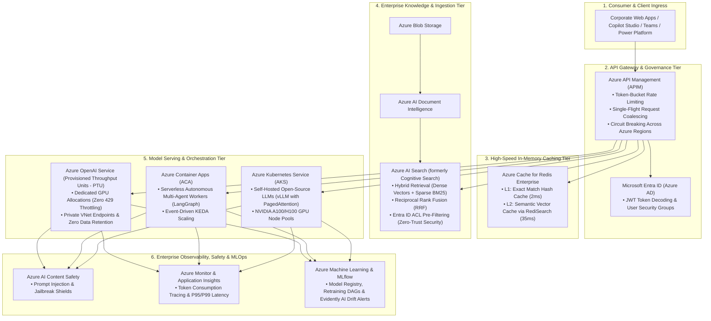
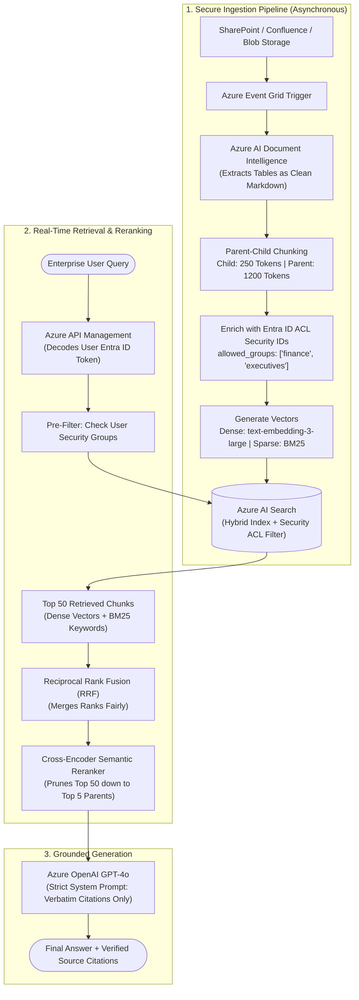
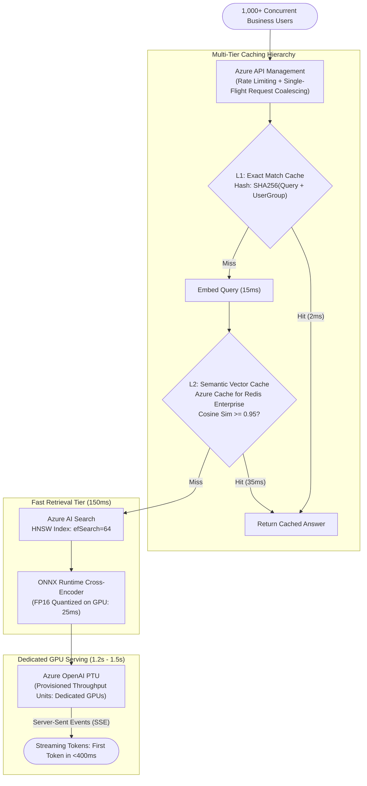
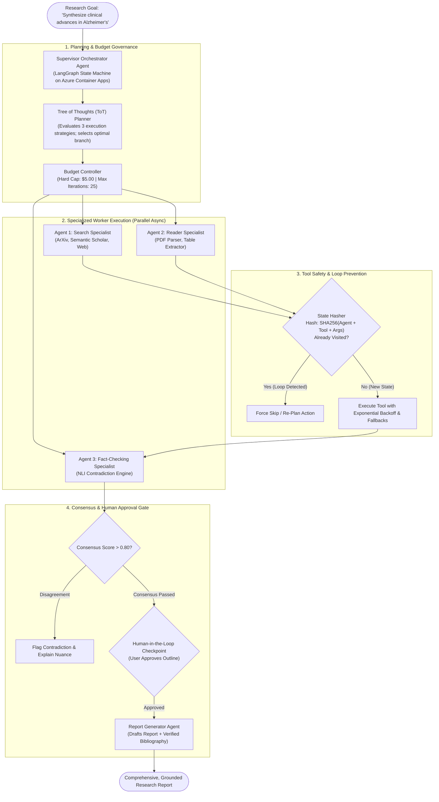
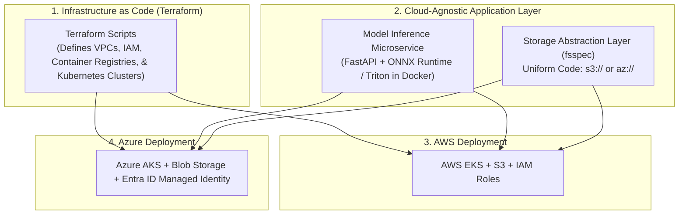

# GenAI & ML Lead Master Study Guide (Easy-Learn Edition)

> **Revision-Friendly • Intuitive • Concept-First • Enterprise Azure Grounded**
> Built for rapid interview mastery. Every level gives you:
> 1. **The 10-Second Concept Hook** (The core engineering dilemma)
> 2. **Visual Flowchart** (End-to-end component data flow)
> 3. **Azure Cloud Services in this Flow (What & Why)** (Deep breakdown of services & alternatives)
> 4. **The Jargon Buster** (Plain-English definitions, real-world analogies & clean math walkthroughs)
> 5. **Key Production Trade-Offs** (Why naive approaches fail)
> 6. **The 3-Minute Golden Interview Answer** (Production-ready recruiter response)
>
> 🧭 **Companion Guides:**
> - [ML_CORE_CONCEPTS.md](ML_CORE_CONCEPTS.md) — 🧠 Machine Learning Core Concepts & Top 10 Interview Q&A
> - [FASTAPI_MASTER_GUIDE.md](FASTAPI_MASTER_GUIDE.md) — ⚡ FastAPI Core Concepts & Top 10 Interview Questions
> - [EXPERIENCE_AND_BACKGROUND.md](EXPERIENCE_AND_BACKGROUND.md) — 🎙️ Rahul's Interview Speaking Guide (Career Story, WPP/Cognizant Deep-Dive & Projects)
> - [README.md](README.md) — Comprehensive Master Architecture Reference (Deep-dive specs, benchmarks & implementation details)
> - [interview_questions.md](interview_questions.md) — Full 117 Recruiter Question Bank
> - [interview_explanations.md](interview_explanations.md) — Revision-friendly Q&A breakdown with diagrams for all 117 questions

---

## 🗺️ Visual Curriculum Roadmap

```mermaid
flowchart LR
    L1["Level 1: Enterprise RAG & Ingestion"] --> L2["Level 2: Scale, Latency & Caching"]
    L2 --> L3["Level 3: Hallucination Mitigation & Evals"]
    L3 --> L4["Level 4: Fine-Tuning vs RAG vs Prompting"]
    L4 --> L5["Level 5: Context Window & KV Cache"]
    L5 --> L6["Level 6: Multi-Agent Systems & Safety"]
    L6 --> L7["Level 7: MLOps Maturity & Incident Triage"]
    L7 --> L8["Level 8: ML Leadership & Multi-Cloud"]
```



| Level | Topic | Key Recruiter Question Mapped | Core Azure Technologies |
| :--- | :--- | :--- | :--- |
| **Level 1** | **Enterprise RAG & Access Control** | *500K internal docs across SharePoint/Confluence, 5,000 queries/day, permissions (ML Lead Q1 & Hard GenAI Q1)* | Azure AI Search, Azure AI Document Intelligence, Entra ID, Blob Storage |
| **Level 2** | **Scale, Low Latency (<2s) & Caching** | *Sub-2 second latency with 1,000+ concurrent users, Redis caching (Hard GenAI Q1 Part C & ML Lead Q2)* | Azure API Management (APIM), Azure Cache for Redis Enterprise, Azure OpenAI PTU |
| **Level 3** | **Hallucination Mitigation & Evals** | *Medical literature review RAG with 5% fabricated citations & studies (Hard GenAI Q3 & ML Lead Q4)* | Azure AI Search (Semantic Reranker), DeBERTa on ACA, Azure AI Content Safety |
| **Level 4** | **Fine-Tuning vs. RAG vs. Prompting** | *Slashing a $50K/month GPT-4 customer support bill down to $8K/month (Hard GenAI Q2)* | Azure AI Foundry, Azure ML Compute (QLoRA), Azure Cache for Redis |
| **Level 5** | **Context Window & KV Cache** | *500-page regulatory filings, Lost-in-the-Middle, KV cache memory math (Hard GenAI Q4)* | Azure OpenAI Prompt Caching, AKS GPU Node Pools (vLLM PagedAttention) |
| **Level 6** | **Multi-Agent Systems & Safety Loops** | *Autonomous research multi-agent system, loop prevention, token budgets (Hard GenAI Q5)* | Azure Container Apps (ACA), Azure Cosmos DB, APIM Outbound Gateway |
| **Level 7** | **MLOps Maturity & Incident Triage** | *Level 0 to 3 maturity, unalerted Monday morning 50K req/day outage triage (ML Lead Q3, Q5, Q7, Q8)* | Azure ML Pipelines, MLflow Model Registry, Azure Monitor, Evidently AI |
| **Level 8** | **Leadership & Multi-Cloud** | *Coaching junior engineers, cross-functional alignment, Azure + AWS architecture (ML Lead Q6, Q9, Q10, Q11)* | Terraform Azure Provider, AKS + AWS EKS, Azure Key Vault, `fsspec` |

---

## ☁️ The Enterprise Azure AI Stack: The Production Blueprint

In an enterprise setting (financial services, healthcare, telecommunications), deploying GenAI requires strict compliance, zero-trust network boundaries, audit logging, and predictable latency SLAs. You cannot use public endpoints, local ChromaDB, or unmanaged Python scripts.



### 📋 Master Azure AI Services Catalog

| Azure Service | Architecture Role | What It Does Internally | Why Choose Azure Over Alternatives? |
| :--- | :--- | :--- | :--- |
| **Azure AI Search** *(Cognitive Search)* | Vector & Hybrid Knowledge Base | Combines dense vector indexes (HNSW) with inverted text indexes (BM25) and deep cross-encoder rerankers. | **Native Entra ID Security ACL filtering**: Filters documents by user security groups *before* vector search runs. Eliminates data leaks that plague standalone vector DBs (Pinecone, Weaviate, pgvector). |
| **Azure AI Document Intelligence** | Layout-Aware Document Parser | Uses vision-language models to extract text, multi-column reading order, checkbox states, and markdown tables. | Raw PDF scrapers (PyPDF, pdfplumber) turn financial tables into unreadable strings. Document Intelligence outputs valid markdown tables directly ingestible by RAG chunkers. |
| **Azure OpenAI Service (PTU)** | Enterprise LLM Serving | Delivers GPT-4o, GPT-4o-mini, and embeddings via dedicated reserved GPUs (Provisioned Throughput Units). | Standard Pay-As-You-Go multi-tenant APIs suffer from sudden `HTTP 429: Rate Limit Exceeded` during peak hours. PTU guarantees dedicated hardware, zero rate limits, and sub-400ms Time-To-First-Token. |
| **Azure API Management (APIM)** | GenAI API Gateway | Manages ingress traffic with native GenAI policies: request coalescing, token rate limits, and multi-region failover. | Prevents duplicate simultaneous queries from hitting LLMs (Single-Flight Pattern), tracks token consumption per department, and shields internal models behind corporate firewalls. |
| **Azure Cache for Redis Enterprise** | 2-Tier Caching Engine | Hosts sub-millisecond RAM caches and vector indexes using the RediSearch engine. | Delivers 2ms L1 exact match caching and 35ms L2 semantic vector caching with 99.999% SLA and active-active geo-replication, absorbing 40-50% of traffic before it reaches expensive LLMs. |
| **Azure AI Foundry** *(AI Studio)* | Unified Model Hub & Fine-Tuning | Central hub for model exploration, prompt evaluation, and managed QLoRA fine-tuning. | Hosts frontier open models (Meta Llama 3, Mistral, Cohere) with managed serverless endpoints, eliminating the need to configure custom PyTorch Kubernetes infrastructure for fine-tuning. |
| **Azure Container Apps (ACA)** | Serverless Multi-Agent Hosting | Container platform built on Kubernetes and KEDA designed for microservices and event-driven jobs. | Perfect for autonomous agents (LangGraph / AutoGen); scales down to zero when agents are idle, isolates agent memory environments, and supports long-running async background jobs without VM management. |
| **Azure Kubernetes Service (AKS)** | Dedicated High-Throughput Inference | Enterprise Kubernetes cluster with direct access to NVIDIA A100/H100 GPU node pools. | Required for self-hosting large open-source models using engines like **vLLM with PagedAttention**, slashing memory fragmentation from 80% to under 4% and enabling 4x higher concurrency. |
| **Microsoft Entra ID** *(Azure AD)* | Enterprise Identity & Access Control | Issues and verifies cryptographically signed OAuth2 JWT tokens containing user security group SIDs. | Unifies corporate identity across SharePoint, Confluence, and the AI gateway. Allows RAG systems to enforce zero-trust pre-retrieval access control seamlessly. |
| **Azure Key Vault & Managed Identities** | Zero-Secret Credential Management | Stores certificates, keys, and tokens with hardware security module (HSM) backing. | Eliminates hardcoded API keys in environment variables or configuration files. Services authenticate dynamically via Entra ID Managed Identities. |
| **Azure Event Grid & Blob Storage** | Asynchronous Ingestion Trigger | Event broker connecting cloud storage directly to ingestion worker microservices. | Dispatches event notifications within milliseconds when a new document lands in storage, eliminating wasteful scheduled polling cron jobs. |
| **Azure AI Content Safety** | Real-Time LLM Guardrails | Multi-modal neural moderation service scanning inputs and outputs. | Detects prompt injection attacks, jailbreak attempts, hate speech, and toxic outputs before queries hit the LLM or before answers reach corporate end-users. |
| **Azure Monitor & App Insights** | Full-Stack Telemetry & Observability | Centralized log analytics, distributed tracing, and metric collection. | Captures token usage per request, end-to-end P95/P99 latency traces, and streams production feature payloads to Evidently AI for automated data drift alerting. |

---

# Level 1: Enterprise RAG & Permission-Aware Ingestion

### 🎯 The 10-Second Concept Hook
A tutorial RAG pipeline simply embeds PDFs into a vector database. **Enterprise RAG** must solve three high-stakes engineering realities:
1. **Zero-Trust Access Security:** If an analyst cannot view executive payroll on SharePoint, the search engine must *never* retrieve or expose those chunks.
2. **Tabular Degradation:** Financial and regulatory filings are 60% tables; naive text extraction turns them into garbled, unparseable strings.
3. **The Chunking Goldilocks Dilemma:** Small chunks (200 tokens) are easy to find via vector search but lack answer context; large chunks (1,200 tokens) provide great context but dilute vector search precision.

---

### 1.1 The Architecture Flowchart



---

### 1.2 Azure Cloud Services in this Flow (What & Why)

| Azure Service | Role in this Architecture | What It Does Internally | Why This Service Over Alternatives? |
| :--- | :--- | :--- | :--- |
| **Azure AI Document Intelligence** | High-Fidelity Layout Parser | Runs pretrained layout transformers to detect headers, paragraphs, and multi-column tables, converting them to clean Markdown. | Standalone OCR libraries (PyPDF, Tesseract) merge adjacent table columns into a single line. Document Intelligence preserves row-column matrix relationships intact. |
| **Azure AI Search** | Permission-Aware Hybrid Engine | Indexes dense embeddings and sparse BM25 tokens into inverted indexes and HNSW vector graphs, applying Entra ID ACL filters. | Unlike standalone vector databases (Pinecone, Milvus), it executes **security pre-filtering natively** inside the search engine before vector distance calculations, preventing confidential data leaks. |
| **Microsoft Entra ID** | Identity & Access Control | Issues JWT tokens with claims containing user group memberships (`groups: ['finance', 'engineering']`). | Enforces consistent zero-trust enterprise permissions across SharePoint, Confluence, and the AI retrieval tier without custom permission synchronization tables. |
| **Azure Event Grid & Blob Storage** | Event-Driven Ingestion Pipeline | Dispatches asynchronous pub-sub events when documents are uploaded, modified, or deleted in Blob Storage. | Eliminates expensive and slow batch polling scripts. When an employee uploads a 50-page PDF to SharePoint, Event Grid triggers the ingestion worker within seconds. |
| **Azure OpenAI GPT-4o** | Grounded Generation Engine | Generates final synthesis constrained to verbatim retrieved context with temperature 0.0 and explicit citation tags. | Private VNet integration ensures sensitive corporate documents are never exposed over the public internet and are never used to train frontier models. |

---

### 1.3 The Jargon Buster

#### 1. Dense vs. Sparse (BM25) Embeddings
* **Dense Vector (`text-embedding-3-large`):** A sequence of 1,536 floating-point numbers representing the *conceptual meaning* of a passage.
  - *Analogy:* A concept detective. It knows that *"cardiovascular event"* and *"heart attack"* mean the exact same thing, even though they share zero letters.
  - *The Production Blind Spot:* It blurs exact numbers, part identifiers, and error codes (e.g., `SKU-992-AZ` or `ERR_404_AUTH`).
* **Sparse Vector (BM25):** An exact keyword frequency counter that weights rare words heavily and common words lightly.
  - *Analogy:* A fingerprint scanner. It looks for the exact sequence of letters and digits.
* **Why Enterprise Needs Both (Hybrid Search):** Dense search catches *synonyms and conceptual intent*; Sparse search catches *exact product codes, legal clauses, and error identifiers*.

#### 2. Reciprocal Rank Fusion (RRF)
* **The Problem:** Dense search produces cosine similarities between `0.0` and `1.0`. BM25 produces unbounded keyword scores like `18.4` or `142.7`. **You cannot add or average these numbers directly.**
* **The Solution (RRF):** Ignore raw scores entirely. Only look at the **rank position** (1st, 2nd, 3rd) of each document in each search method.

```python
# Reciprocal Rank Fusion (RRF) Formula:
# RRF_Score(d) = 1 / (k + Rank_Dense(d)) + 1 / (k + Rank_BM25(d))
# Constant k is standardly 60 (smoothes out top-rank outliers)

# Example Document A: High Dense rank (#1), but poor BM25 keyword match (#80)
score_A = 1 / (60 + 1) + 1 / (60 + 80)
# score_A = 0.01639 + 0.00714 = 0.02353

# Example Document B: Strong consensus across both (#3 in Dense, #4 in BM25)
score_B = 1 / (60 + 3) + 1 / (60 + 4)
# score_B = 0.01587 + 0.01562 = 0.03149  --> DOCUMENT B WINS!
```
*Takeaway:* RRF automatically prioritizes documents that achieve strong consensus across both keyword and semantic searches without requiring manual score calibration.

#### 3. Bi-Encoder vs. Cross-Encoder
* **Bi-Encoder (Fast Candidate Retrieval):** Encodes the user's query and documents *independently* into vectors. Searching 500,000 documents is a simple dot product that executes in 10ms.
  - *Analogy:* A librarian scanning catalog index cards by topic number in 5 seconds.
* **Cross-Encoder (Deep Semantic Reranker):** Takes the query and a document chunk *together* as a single input pair into a transformer. Every word in the query attends directly to every word in the document simultaneously.
  - *Analogy:* A senior professor sitting down and reading both the question and the candidate paper side-by-side with a yellow highlighter. It is 100x more accurate, but too computationally slow to run across 500,000 files.
* **Production Strategy:** Use the **Bi-Encoder to pull the top 50 candidates in 10ms**, then run the **Cross-Encoder on just those 50 to prune down to the top 5 in 25ms**.

#### 4. Parent-Child Chunking
* **The Dilemma:** Small chunks (200 tokens) are pinpoint accurate for vector search, but the LLM hallucinates because sentences are severed. Large chunks (1,200 tokens) provide rich context for the LLM, but vector search misses them because their embedding is diluted across multiple concepts.
* **The Production Fix:** Index **small child chunks (250 tokens)** for vector search. When a child chunk matches the query, **retrieve its parent document section (1,200 tokens)** and pass that complete parent context to the LLM.

#### 5. Microsoft Entra ID Pre-Filtering vs. Post-Filtering
* **The Rookie Mistake (Post-Filtering):** The system searches all 500K documents, retrieves the top 5 chunks, and then checks: *"Is this user authorized?"* If all 5 chunks are confidential, the user sees an empty response, and confidential metadata leaked into search engine logs.
* **The Enterprise Standard (Pre-Filtering):** Every document chunk is tagged with permitted security IDs at ingestion (`allowed_groups: ['finance', 'executives']`). When a user queries, Azure AI Search **applies the security filter inside the database engine before computing vector distances**. Unauthorized documents are never examined.

---

### 1.4 Key Production Trade-Offs

| Decision | Naive Approach | Production Choice | Why? |
| :--- | :--- | :--- | :--- |
| **Search Engine** | Dense Vector Only | Hybrid (Dense + BM25) + RRF | Pure vectors fail on exact SKUs, legal clauses, and acronyms. |
| **Security Enforcement** | Post-filtering LLM output | Pre-filtering search index via ACLs | Post-filtering leaks confidential data and causes blank answers. Pre-filtering is zero-trust. |
| **Document Parsing** | Raw text extraction (PyPDF) | Layout-Aware (Azure Document Intelligence) | Raw text scrambles tables into gibberish. Layout parsing preserves markdown tables intact. |
| **Chunking Architecture** | Fixed-size 500-token chunks | Parent-Child Hierarchical Chunking | Fixed chunks balance poorly between search accuracy and LLM comprehension. |

---

### 1.5 The 3-Minute Interview Golden Answer
> *"I architect enterprise RAG across three decoupled stages: secure asynchronous ingestion, permission-pre-filtered hybrid retrieval, and observable generation.
> For 500K documents across SharePoint and Confluence, files land in Azure Blob Storage with Event Grid triggers. We parse them using Azure AI Document Intelligence to preserve tabular structures as markdown. We use a **Parent-Child chunking** strategy: 250-token child chunks for vector indexing, linked to 1,200-token parent sections. Crucially, we tag each chunk with Microsoft Entra ID Access Control Lists (ACLs).
> At query time, we decode the user's security token and execute a **pre-filtered hybrid search** in Azure AI Search combining dense embeddings (`text-embedding-3-large`) and sparse BM25. We merge candidate ranks using **Reciprocal Rank Fusion (RRF)**, pass the top 50 candidates through a **Cross-Encoder Semantic Reranker** down to the top 5 parent chunks, and feed them to Azure OpenAI GPT-4o with temperature 0.0 and strict citation constraints."*

---

# Level 2: Scale, Low Latency (<2s) & Multi-Level Caching

### 🎯 The 10-Second Concept Hook
In an enterprise deployment supporting 1,000+ concurrent business users:
1. If every query hits the LLM, API costs skyrocket and Azure throttles you with `HTTP 429: Rate Limit Exceeded`.
2. Response times swing wildly between 3s and 12s due to multi-tenant GPU queuing.
3. To guarantee a **sub-2 second response**, 40% to 50% of enterprise queries must be answered from cache without ever calling the LLM.

---

### 2.1 The High-Concurrency Serving Flowchart



---

### 2.2 Azure Cloud Services in this Flow (What & Why)

| Azure Service | Role in this Architecture | What It Does Internally | Why This Service Over Alternatives? |
| :--- | :--- | :--- | :--- |
| **Azure API Management (APIM)** | Ingress API Gateway | Enforces token-bucket rate limiting per consumer and executes **Single-Flight Request Coalescing**. | Custom reverse proxies lack built-in GenAI policies. APIM manages multi-region LLM load balancing, token metering per department, and circuit-breaking. |
| **Azure Cache for Redis Enterprise** | In-Memory 2-Tier Caching Tier | Hosts sub-millisecond RAM caches and executes vector similarity searches via RediSearch. | Delivers 2ms L1 exact string hashing and 35ms L2 semantic vector caching with active-active geo-replication, absorbing 40-50% of peak queries. |
| **Azure OpenAI Service (PTU)** | High-Concurrency LLM Serving | Allocates reserved GPU compute units for dedicated model inference. | Standard Pay-As-You-Go models share GPUs across all Azure customers, creating unpredictable latency spikes and sudden `HTTP 429` throttling under peak load. |
| **Azure AI Search (HNSW Indexing)** | Low-Latency Retrieval | Uses Hierarchical Navigable Small World (HNSW) graph indexing with tuned search breadth (`efSearch=64`). | Delivers sub-150ms hybrid retrieval across millions of document chunks under heavy concurrent read pressure. |
| **Azure Monitor** | Real-Time Telemetry | Collects distributed OpenTelemetry traces across cache tiers, search indexes, and GPU endpoints. | Pinpoints latency bottlenecks (e.g., distinguishing between retrieval delay vs. GPU queuing time) in real time. |

---

### 2.3 The Jargon Buster

#### 1. Exact Match vs. Semantic Vector Caching
* **Exact Match Cache (L1):** Hashes the raw query string and user permissions (`SHA256(query + user_group)`).
  - *Analogy:* A browser bookmark. If User B asks the exact same question word-for-word, Redis returns the answer in **2ms**.
  - *The Limitation:* If User B adds a single word like *"please"*, the exact hash changes completely and the cache misses.
* **Semantic Vector Cache (L2):** Generates a query embedding and performs a fast vector similarity search against previously answered questions in Redis.

```python
# Semantic Vector Cache Decision Logic:
# Query vector q is compared against previously cached query vectors in Redis

similarity = cosine_similarity(query_vector, cached_query_vector)

# High threshold ensures answers are only reused for identical intent
if similarity >= 0.95:
    return cached_response  # Cache Hit: 35ms latency | $0.00 LLM cost
else:
    execute_full_rag_pipeline()  # Cache Miss: proceed to search & LLM
```

#### 2. PTU (Provisioned Throughput Units) vs. PAYG (Pay-As-You-Go)
* **PAYG Multi-Tenant Trap:** You share GPU clusters with thousands of other organizations. During high-traffic events, your requests sit in shared queues, latency balloons to 8+ seconds, and requests fail with `HTTP 429 Too Many Requests`.
* **PTU Dedicated Solution:** You reserve dedicated processing units (e.g., 100 PTUs provide ~1,000 sustained tokens/second).
  - *Analogy:* Buying a dedicated toll lane on the highway vs. sitting in rush-hour traffic. You get **guaranteed dedicated GPUs, zero 429 rate limits, and predictable sub-second latency**.

#### 3. Request Coalescing (Single-Flight Pattern)
* **The Scenario:** During an all-hands company meeting, 500 employees simultaneously ask: *"What is the new healthcare policy?"*
* **The Production Fix:** Azure API Management detects 500 identical in-flight requests. Instead of sending 500 queries to the LLM, it locks requests 2 through 500 onto the first request's promise. **Only 1 backend LLM query executes**, and the streaming response is broadcast to all 500 users simultaneously.

#### 4. TTFT (Time To First Token) vs. TPOT (Time Per Output Token)
* *The Interview Question:* *"If generating 500 words takes 3.5 seconds, how do you deliver a sub-2 second experience?"*
* *The Answer:* Users do not wait for the entire paragraph to be generated before reading. By using **Server-Sent Events (SSE) Streaming**, the user sees the first token on screen in **<400ms (TTFT)**. While the human reads the first sentence, the remaining tokens arrive seamlessly in the background.

---

### 2.4 Key Production Trade-Offs

| Decision | Naive Approach | Production Choice | Why? |
| :--- | :--- | :--- | :--- |
| **LLM Tier** | Pay-As-You-Go API | Provisioned Throughput Units (PTU) | Multi-tenant PAYG suffers from noisy-neighbor rate limits and latency spikes. |
| **Caching Tier** | No cache or exact-match only | 2-Tier: L1 Exact Hash + L2 Semantic Cache | Exact-match misses when phrasing varies slightly. Semantic caching absorbs 40-50% of traffic. |
| **Delivery Mode** | Synchronous REST response | Server-Sent Events (SSE) Streaming | Streaming cuts perceived latency from 3.5s down to a sub-400ms Time-To-First-Token. |

---

### 2.5 The 3-Minute Interview Golden Answer
> *"Achieving sub-2s latency for 1,000+ concurrent users requires strict latency budgeting: 50ms for caching and routing, 150ms for retrieval and reranking, and 1.5s for dedicated GPU generation with a Time-To-First-Token under 400ms.
> Ingress traffic hits Azure API Management with **Request Coalescing (single-flight pattern)** to merge simultaneous duplicate queries into one backend call.
> We implement a 2-tier cache: an L1 exact SHA256 cache (2ms) and an **L2 Semantic Vector Cache** in Azure Cache for Redis Enterprise (35ms for cosine similarity >= 0.95), absorbing 40% to 50% of enterprise traffic.
> Cache misses query Azure AI Search with optimized HNSW index parameters (`efSearch=64`) and an ONNX-optimized cross-encoder running on GPU node pools in 25ms. For generation, we avoid Pay-As-You-Go multi-tenant throttling by deploying **Azure OpenAI with Provisioned Throughput Units (PTU)**, streaming tokens via SSE so the user experiences an instant <400ms response."*

---

# Level 3: Production LLM Hallucination Mitigation & Evaluation

### 🎯 The 10-Second Concept Hook
An LLM is **not a database**; it is a probabilistic next-token calculator. When it lacks verified context, it generates sentences that *sound authoritative and polished*, even citing non-existent papers. In clinical literature review, financial compliance, and legal research, a single hallucination destroys user trust and creates legal liability.

---

### 3.1 The 4-Layer Hallucination Defense Flowchart


---

### 3.2 Azure Cloud Services in this Flow (What & Why)

| Azure Service | Role in this Architecture | What It Does Internally | Why This Service Over Alternatives? |
| :--- | :--- | :--- | :--- |
| **Azure AI Search (Semantic Reranker)** | Pre-Generation Retrieval Gate | Calculates deep semantic relevance scores (0.00 to 4.00) using Microsoft's Turing cross-encoder. | Allows configuring an **automated confidence cutoff**: if the top retrieved chunk scores below 0.72, the system refuses immediately without calling the LLM. |
| **Azure OpenAI Service (GPT-4o)** | Constrained Generation | Operates at temperature 0.0 with a system prompt enforcing bracketed verbatim citations (`[[Doc_ID:Page:Snippet]]`). | Private enterprise deployment prevents data leakage while strict temperature controls eliminate creative non-deterministic drift. |
| **Azure Container Apps (ACA)** | Ultra-Fast Micro-Evaluator | Hosts a containerized 400MB `DeBERTa-v3-large` cross-encoder for NLI premise-hypothesis entailment. | Runs local inference in **15ms at $0.00 token cost**. Using GPT-4 as an LLM judge adds 3 seconds of latency and doubles cloud costs. |
| **Azure AI Content Safety** | Real-Time Output Guardrail | Evaluates output text for harmful statements, fabricated medical claims, and policy violations. | Built-in enterprise content moderation compliant with medical and enterprise governance frameworks. |
| **Azure Application Insights** | Evaluation Telemetry | Logs model refusal rates, NLI entailment scores, and slice-level accuracy across medical specialties. | Powers continuous evaluation dashboards without impacting production request latencies. |

---

### 3.3 The Jargon Buster

#### 1. The 3 Root Causes of Hallucinations
1. **Retrieval Failure (Garbage In, Garbage Out):** The search engine failed to retrieve relevant documents. The LLM had no facts to ground on, so it guessed.
2. **Parametric vs. Contextual Conflict:** The LLM's pre-trained memory clashes with the provided document (e.g., pre-training says Drug A is safe; your document says Drug A was recalled yesterday). The model defaults to its pre-training.
3. **Reasoning & Synthesis Hallucination:** The retrieval found Chunk 1 (*"Patient took Drug X"*) and Chunk 2 (*"Patient died 2 days later"*). The LLM invents a false causal claim: *"Drug X killed the patient."*

#### 2. NLI (Natural Language Inference): Verifying Truth in 15ms for $0.00
* **The Rookie Mistake:** Calling GPT-4 to verify GPT-4's answer (*"LLM-as-a-Judge"*). Adds 3 seconds of latency and doubles your API bill!
* **The Principal Solution:** Use a small 400MB cross-encoder model (`DeBERTa-v3-large` fine-tuned on MNLI).
  - *Premise:* The retrieved document chunk.
  - *Hypothesis:* One claim generated by the LLM.
  - *Analogy:* A courtroom fact-checker. It checks if the witness claim is explicitly supported by the sworn evidence.

```python
# Natural Language Inference (NLI) Verification Logic:
# Evaluates relationship between Retrieved Passage (Premise) and Generated Sentence (Hypothesis)

probabilities = nli_model(premise=retrieved_chunk, hypothesis=generated_sentence)
# Output: [P(Entailment), P(Neutral), P(Contradiction)]

if probabilities['Contradiction'] > 0.10 or probabilities['Neutral'] > 0.20:
    flag_hallucination(generated_sentence)
    trigger_calibrated_refusal()
else:
    mark_verified(generated_sentence)
```

#### 3. Deterministic Citation Verification (Zero-Token Cost)
* The LLM is instructed to cite sources in a strict format: `[[Doc_ID:Page:ExactQuoteSnippet]]`.
* A Python regex extracts the citation tags in **<2ms at $0.00 cost**:
  1. Does `Doc_ID` exist in the retrieved candidate pool? (Eliminates 100% of fabricated paper titles).
  2. Does `ExactQuoteSnippet` actually exist as a substring on `Page`?
* If either check fails, the citation was hallucinated and is stripped before user display.

#### 4. Slice-Based Evaluation (Why Aggregate Accuracy Lies)
* **The Trap:** An engineering team reports: *"Our medical model achieved 96% overall accuracy!"*
* **The Reality (Simpson's Paradox):**
  - Common flu/cold questions (80% volume): 99% accuracy.
  - Pediatric oncology edge cases (5% volume): **only 42% accuracy!**
* High aggregate scores often conceal catastrophic failures in low-volume, high-risk categories. In enterprise MLOps, evaluation must be sliced by clinical specialty, **blocking any deployment if ANY critical slice falls below 90%**.

---

### 3.4 Key Production Trade-Offs

| Decision | Naive Approach | Production Choice | Why? |
| :--- | :--- | :--- | :--- |
| **Faithfulness Verification** | LLM-as-a-Judge (GPT-4) | Local NLI Cross-Encoder (DeBERTa) | LLM-as-a-Judge adds 3s latency and 2x cost. DeBERTa runs in 15ms at $0.00 token cost. |
| **Citation Validation** | Trust LLM output | Deterministic Substring Regex Verification | Eliminates 100% of fabricated paper titles and non-existent page numbers in <2ms. |
| **Evaluation Metrics** | Global Aggregate Accuracy | Slice-Based Evaluation across Risk Tiers | Aggregate metrics mask dangerous failures in rare, high-liability categories. |

---

### 3.5 The 3-Minute Interview Golden Answer
> *"Hallucination in medical literature RAG stems from three distinct failure modes: retrieval failure, parametric conflict, and reasoning misattribution. I address this using a 4-layer defense:
> At generation time, we run Azure OpenAI GPT-4o with temperature 0.0 and a strict grounding prompt requiring verbatim bracketed citations.
> Instead of using expensive LLM-as-a-Judge calls for verification, we implement two ultra-fast, zero-token checks:
> First, **Deterministic Citation Validation**: a Python regex engine checks that cited document IDs exist in the retrieved candidate pool and performs exact substring verification of the quoted text in <2ms.
> Second, **NLI Faithfulness Verification**: we run a lightweight DeBERTa cross-encoder in 15ms on GPU to evaluate premise-hypothesis entailment between the retrieved passage and each generated claim, flagging any claim classified as neutral or contradictory.
> If confidence falls below 0.75, the system executes an explicit calibrated refusal—mirroring the **94.2% refusal benchmark** I architected on Threadmark. Finally, we enforce **slice-based evaluation** in CI/CD to ensure high aggregate accuracy doesn't mask dangerous failures in rare clinical categories."*

---

# Level 4: Fine-Tuning vs. RAG vs. Prompting (Slashing a $50K Bill)

### 🎯 The 10-Second Concept Hook
A company spends $50,000 every month on GPT-4 across 20 customer support categories. 80% of queries are routine and repetitive. Using a massive frontier model like GPT-4 for simple questions is like hiring a neurosurgeon to hand out band-aids.

---

### 4.1 The Hybrid Routing Flowchart


---

### 4.2 Azure Cloud Services in this Flow (What & Why)

| Azure Service | Role in this Architecture | What It Does Internally | Why This Service Over Alternatives? |
| :--- | :--- | :--- | :--- |
| **Azure Container Apps (ACA)** | Ingress Intent Classifier | Runs a quantized DistilBERT classifier routing incoming queries in 5ms. | Eliminates unnecessary LLM calls upfront at zero token cost. Scales down to zero when traffic drops. |
| **Azure Cache for Redis** | Tier 1 Instant Answer Cache | Resolves the top 30% most frequent customer inquiries directly from RAM. | Delivers 5ms response times at $0.00 per query, instantly eliminating 30% of total cloud spend. |
| **Azure AI Foundry (AI Studio)** | Managed Fine-Tuning Hub | Provides serverless infrastructure to train and host QLoRA fine-tuned open models (Llama-3-8B). | Eliminates the operational overhead of configuring custom Kubernetes GPU clusters for parameter-efficient fine-tuning. |
| **Azure AI Search** | Category-Filtered Retrieval | Applies metadata filters restricting RAG search space to specific product lines. | Accelerates retrieval speed to <50ms and prevents context contamination between unrelated product lines. |
| **Azure OpenAI Service (GPT-4o)** | Tier 3 Complex Reasoning | Reserved strictly for the 20% of queries requiring multi-hop logic and synthesis. | Preserves frontier model capabilities for high-value complex reasoning while offloading routine traffic. |

---

### 4.3 The Jargon Buster

#### 1. The Decision Triad: When to Use What
* **Prompt Engineering:** Use for reasoning instructions, tone, and output formatting. Fast iteration, zero training cost.
* **RAG:** Use for dynamic, frequently changing factual knowledge (product manuals, pricing tables, policies).
* **Fine-Tuning:** Use to teach specialized vocabulary, enforce strict structured JSON output, and **slash costs and latency** by teaching a small 8B model to mimic a 70B model.
* *The Golden Rule:* Never fine-tune just to teach an LLM facts! Facts change constantly; use RAG for facts and fine-tuning for style, format, and cost reduction.

#### 2. LoRA (Low-Rank Adaptation) & QLoRA
* **Full Fine-Tuning:** Updates all 8 billion parameters. Requires 64 GB VRAM, costs thousands of dollars in cloud GPU compute, and risks breaking base model reasoning.
* **LoRA:** Freezes the 8B base model weights entirely. Injects two tiny low-rank matrices $A$ and $B$ ($\Delta W = B 	imes A$). Reduces trainable parameters by **99.6%**.
  - *Analogy:* Instead of rebuilding a camera lens from scratch, you snap on a lightweight colored filter ring.
* **QLoRA:** Compresses the frozen base model weights from 16-bit floats down to **4-bit NormalFloat (NF4)** before attaching LoRA adapters. Allows fine-tuning an 8B model on an inexpensive single 24GB GPU.

```python
# LoRA Parameter Math Example:
# Base weight matrix W: dimension (4096 x 4096) = 16,777,216 parameters
# Full fine-tuning trains all 16.7M parameters per layer.

# LoRA with rank r = 16 decomposes update into Matrix A (4096 x 16) and Matrix B (16 x 4096)
lora_params = (4096 * 16) + (16 * 4096)
# lora_params = 65,536 + 65,536 = 131,072 parameters

# Parameter reduction ratio:
reduction = 131072 / 16777216  # = 0.0078 (99.2% fewer trainable parameters!)
```

#### 3. Catastrophic Forgetting
* **What it is:** When an LLM fine-tunes on 2,000 customer service tickets, it becomes an expert at support, but suddenly forgets basic math and logic! New training gradients overwrite pre-trained neural pathways.
* **The Production Fix:**
  1. Mix a **15% replay buffer** of general instruction data (e.g., ShareGPT/Alpaca) into your training dataset.
  2. Restrict LoRA adapters to attention projection layers (`q_proj`, `v_proj`), leaving feed-forward layers untouched.

#### 4. The $50K to $8.2K Cost Reduction Math (83.6% Savings)

```text
=============================================================================
BASELINE: 1,000,000 monthly queries hitting GPT-4 directly
• 1,000,000 queries x $0.05 average cost = $50,000 / month
=============================================================================
PRODUCTION HYBRID ROUTING:
• Tier 1 (30% Volume): 300,000 queries answered by Redis Cache
  Cost: $0.00 (Zero tokens consumed)
• Tier 2 (50% Volume): 500,000 queries routed to Fine-Tuned Llama-3-8B
  Cost: 500,000 x $0.0004 = $200 / month
• Tier 3 (20% Volume): 200,000 complex queries routed to GPT-4o
  Cost: 200,000 x $0.035 = $7,000 / month
• Infrastructure: Azure AI Search + Redis Enterprise + ACA
  Cost: ~$1,000 / month
-----------------------------------------------------------------------------
NEW MONTHLY TOTAL: $8,200 / month  (83.6% Cost Reduction!)
Average Latency: Drops from 3.5s down to 400ms
=============================================================================
```

---

### 4.4 Key Production Trade-Offs

| Decision | Naive Approach | Production Choice | Why? |
| :--- | :--- | :--- | :--- |
| **Model Selection** | GPT-4 for 100% of queries | 3-Tier Intelligent Routing (Redis -> 8B -> GPT-4o) | Routing routine queries to small models and cache slashes monthly spend by 83%. |
| **Fine-Tuning Method** | Full parameter fine-tuning | QLoRA with 4-bit NormalFloat quantization | Full fine-tuning requires expensive multi-GPU clusters. QLoRA trains on a single commodity GPU. |
| **Training Dataset** | Domain support tickets only | Domain tickets + 15% General Replay Buffer | Domain-only data causes catastrophic forgetting of fundamental reasoning abilities. |

---

### 4.5 The 3-Minute Interview Golden Answer
> *"A $50K monthly bill indicates that expensive frontier models are being wasted on routine queries. I transition the system to an **intelligent hybrid routing architecture** based on a 3-way decision matrix: prompt engineering for reasoning, RAG for dynamic facts, and fine-tuning for specialized tone and cost reduction.
> At the ingress, a lightweight DistilBERT classifier routes incoming queries in 5ms across three tiers:
> - Tier 1 (30% volume): Static FAQs resolved via Azure Cache for Redis at zero token cost.
> - Tier 2 (50% volume): Category-specific inquiries routed to a fine-tuned **Llama-3-8B** model on Azure AI Foundry paired with category-filtered Azure AI Search.
> - Tier 3 (20% volume): Complex edge cases routed to Azure OpenAI GPT-4o.
> For the 8B model, we fine-tune using **QLoRA** with 4-bit NormalFloat quantization and rank $r=16$ on 2,000 curated conversation pairs, preventing catastrophic forgetting with a 15% replay buffer of general instruction data. This drops monthly spend from $50,000 to ~$8,200—an **83% savings**—while cutting p95 latency by 60%."*

---

# Level 5: Context Window Management & Long-Context (500-Page Filings)

### 🎯 The 10-Second Concept Hook
When ingesting 500-page regulatory filings (150K+ tokens):
1. Frontier long-context models suffer from the **"Lost-in-the-Middle"** effect—they remember the beginning and end of a prompt, but overlook critical evidence buried in the middle.
2. The **KV Cache memory footprint** explodes quadratically, crashing GPU servers.
3. Passing 150K tokens to GPT-4 costs $1.50 per query with 10+ second latencies.

---

### 5.1 The 500-Page Processing Flowchart


---

### 5.2 Azure Cloud Services in this Flow (What & Why)

| Azure Service | Role in this Architecture | What It Does Internally | Why This Service Over Alternatives? |
| :--- | :--- | :--- | :--- |
| **Azure OpenAI Prompt Caching** | Static Context Acceleration | Automatically caches the Key-Value (KV) attention states of long static prompt prefixes (1024+ tokens). | Reduces input token costs by **75%** ($1.25/M vs $5.00/M tokens) and slashes latency by up to 80% when multiple users query the same 500-page document. |
| **Azure Kubernetes Service (AKS)** | High-Concurrency GPU Serving | Hosts self-hosted open-source models using **vLLM with PagedAttention** on NVIDIA A100 GPU node pools. | Eliminates GPU memory fragmentation, reducing VRAM waste from 80% to under 4% and supporting 4x higher concurrent users per GPU. |
| **Azure AI Search** | Pinpoint Clause Retrieval | Performs fast parent-child retrieval to answer specific factual lookups without loading the entire 500 pages. | Resolves specific clause questions in 400ms at $0.005 instead of running an expensive 150K-token full document audit. |
| **Azure Blob Storage (Hot & Cold Tiers)** | Document Lifecycle Storage | Stores original PDF filings and extracted markdown chunks with lifecycle management policies. | Cost-effective, high-throughput storage providing secure private endpoints for Azure AI Document Intelligence and AKS workers. |

---

### 5.3 The Jargon Buster

#### 1. The "Lost in the Middle" Phenomenon
* **What it is:** Stanford research demonstrated that when LLMs process large contexts (128K+ tokens), attention degrades into a **U-shaped curve**:
  - Information in the **first 10%** has **98% retrieval accuracy**.
  - Information in the **last 10%** has **95% retrieval accuracy**.
  - Information in the **middle 50%** drops to as low as **40% accuracy!**
* **The Production Fix:**
  1. **Attention Anchoring:** Place primary system prompts, critical constraints, and query instructions at **both the very beginning and very end** of the context.
  2. **Outside-In Chunk Ordering:** Order retrieved chunks so that highest-scoring evidence sits at the head and tail, pushing lower-confidence context into the middle.

#### 2. The KV Cache Memory Formula
* During autoregressive decoding, to generate token #1,001 the model must attend to all previous 1,000 tokens. To avoid recomputing these attention matrices, it caches Key ($K$) and Value ($V$) tensors in GPU VRAM.

```python
# KV Cache Memory Consumption Formula (Bytes):
# Memory = 2 * 2 * n_layers * n_heads * d_head * sequence_length * batch_size
# - First 2: Separate matrices for Keys and Values
# - Second 2: FP16 precision (2 bytes per parameter)

# Example: Llama-3-70B (80 layers, 64 attention heads, d_head = 128)
# Context: 128,000 tokens | Batch Size: 1 user
n_layers = 80
n_heads = 64
d_head = 128
seq_len = 128000
batch_size = 1

kv_bytes = 2 * 2 * n_layers * n_heads * d_head * seq_len * batch_size
kv_gigabytes = kv_bytes / (1024 ** 3)
# kv_gigabytes = ~10.05 GB VRAM for a single user!

# Takeaway: Just 8 concurrent users querying a 128K document consumes 80 GB VRAM,
# completely exhausting an entire NVIDIA A100 GPU on caching alone!
```

#### 3. PagedAttention & vLLM
* **The Traditional Problem:** Standard deep learning runtimes allocate contiguous blocks of GPU memory. If a request uses 20K of an allocated 128K block, **over 80% of VRAM is lost to internal memory fragmentation**.
* **PagedAttention Solution:** Inspired by operating system virtual memory paging. It breaks the KV cache into small non-contiguous memory pages. Memory fragmentation drops from **80% to under 4%**, allowing 4x more concurrent users on the same GPU.

#### 4. RAPTOR (Recursive Abstractive Processing for Tree-Organized Retrieval)
* Slices a 500-page document into leaf chunks, clusters semantically similar chunks using Gaussian Mixture Models, and summarizes them with an LLM. It recursively clusters section summaries into chapter summaries, building a tree.
* *Why it matters:* Specific clause questions query the leaves; high-level cross-chapter thematic questions query the top nodes of the tree.

---

### 5.4 Key Production Trade-Offs

| Decision | Naive Approach | Production Choice | Why? |
| :--- | :--- | :--- | :--- |
| **Processing Path** | Stuff 150K tokens into LLM every query | 3-Way Triage: RAG vs RAPTOR vs Long Context | Full-context passes cost $1.50 and take 12s. RAG answers pinpoint clauses in 400ms for $0.005. |
| **GPU Serving** | Native Hugging Face Transformers | vLLM with PagedAttention | Native serving wastes 80% of VRAM on fragmentation; vLLM boosts concurrency by 4x. |
| **Prompt Layout** | Chronological page order | Attention Anchoring (Instructions at Head & Tail) | Counteracts the U-shaped attention curve where facts in the middle 50% are ignored. |

---

### 5.5 The 3-Minute Interview Golden Answer
> *"Processing 500-page filings (150K+ tokens) requires recognizing that native long-context models and RAG serve complementary roles. Standard RAG excels at pinpoint clause lookups but fails at global cross-chapter synthesis; native long context handles cross-chapter synthesis but is vulnerable to the **'Lost-in-the-Middle'** effect and massive KV-cache VRAM consumption.
> I implement a 3-path architecture:
> - For pinpoint lookups: Our **Parent-Child RAG** retrieves the exact clause in <400ms.
> - For thematic synthesis across chapters: We use **RAPTOR (Hierarchical Tree Summarization)** to traverse clustered summary layers.
> - For holistic audits: We pass the document to Azure OpenAI GPT-4o, leveraging **Azure Prompt Caching** for a 75% discount on the static prefix.
> To eliminate the U-shaped attention drop-off where facts in the middle 50% are lost, we implement **attention anchoring**: sandwiching the prompt with instructions and critical evidence at both the head and tail. On the infrastructure side, open-source models deploy on AKS with **vLLM PagedAttention**, cutting memory fragmentation from 80% to <4%."*

---

# Level 6: Multi-Agent LLM Systems, Tool Execution & Safety

### 🎯 The 10-Second Concept Hook
Single-prompt LLMs fail on complex, multi-step operations. Multi-agent systems decompose a high-level goal into specialized roles (Researcher, Document Reader, Fact-Checker). However, without strict loop prevention and cost controls, agents can enter **infinite recursion** (calling the same tool 50 times) or **burn thousands of dollars in minutes**.

---

### 6.1 The Autonomous Multi-Agent Flowchart



---

### 6.2 Azure Cloud Services in this Flow (What & Why)

| Azure Service | Role in this Architecture | What It Does Internally | Why This Service Over Alternatives? |
| :--- | :--- | :--- | :--- |
| **Azure Container Apps (ACA)** | Agent Microservice Orchestration | Hosts the LangGraph state machine and specialized worker agents in serverless containers. | Native support for event-driven scaling (KEDA), per-agent memory and CPU isolation, and zero costs when idle. |
| **Azure Cosmos DB** | Agent State & Memory Store | Persists execution graph state checkpoints, short-term session scratchpads, and execution traces. | Single-digit millisecond latency with global distribution, ensuring agent state is resilient to worker container restarts. |
| **Azure API Management (APIM)** | Outbound Tool Call Gateway | Proxies all tool requests (ArXiv, PubMed, Web APIs) with rate limiting and automated circuit breaking. | Prevents third-party API rate limits (`HTTP 429`) from crashing agent jobs; routes failed API calls to backup endpoints. |
| **Azure AI Content Safety** | Multi-Agent Security Firewall | Inspects inter-agent communication for prompt injection, jailbreak attempts, and agent drift. | Prevents an untrusted retrieved document from hijacking the multi-agent system through indirect prompt injection. |

---

### 6.3 The Jargon Buster

#### 1. CoT vs. ReAct vs. Tree of Thoughts (ToT)
* **Chain of Thought (CoT):** Pure internal reasoning without external data (`Thought -> Thought -> Answer`). Cannot call tools.
* **ReAct (Reason + Act):** Interleaves reasoning steps with tool executions (`Thought -> Action -> Observation -> Thought`).
* **Tree of Thoughts (ToT):** Master supervisor generates multiple candidate reasoning branches, evaluates the promise of each branch, and backtracks if a path hits a dead end.
  - *Analogy:* A chess grandmaster thinking 3 moves ahead before touching a piece, rather than reacting blindly to the opponent's last move.

#### 2. Infinite Loop Prevention via State Hashing
* **The Production Danger:** An agent searches `search("novel antibody")`, receives zero results, and retries the exact same search 50 times in an uncontrolled loop, spending $50 in 3 minutes.
* **The Solution (State Hashing):** Before executing any tool, hash the agent identifier, tool name, and sorted arguments.

```python
# Infinite Loop Detection Logic:
import hashlib, json

state_payload = f"{agent_id}:{tool_name}:{json.dumps(tool_args, sort_keys=True)}"
state_hash = hashlib.sha256(state_payload.encode()).hexdigest()

if state_hash in visited_states_set:
    # Loop detected: Intercept execution and force re-planning
    return "SYSTEM ALERT: You already executed this exact tool with these exact arguments. "            "Do not repeat this action. Explore an alternative strategy or terminate."
else:
    visited_states_set.add(state_hash)
    execute_tool()
```

#### 3. Token Budget Controller & Dynamic Downgrades
* Configure a hard ceiling (e.g., $5.00 per research job) and a maximum iteration counter (e.g., 25 steps).
* **Dynamic Model Downgrading:**
  - When spend is **< $3.50 (70%)**: Worker agents run on **GPT-4o** for maximum extraction quality.
  - When spend crosses **$3.50 (70%)**: The supervisor dynamically downgrades worker agents to **GPT-4o-mini**.
  - When spend hits **$5.00 (100%)**: Freeze all tool execution immediately and force the writer agent to generate a partial summary from existing findings.

#### 4. Tool Fallbacks & Exponential Backoff
* When calling external APIs (e.g., ArXiv):
  1. Retry on failure with exponential backoff (1s, 2s, 4s).
  2. If the API remains unresponsive, automatically route to **Semantic Scholar API**.
  3. If still failing, route to **Tavily Web Search**. Never crash the multi-agent workflow!

---

### 6.4 Key Production Trade-Offs

| Decision | Naive Approach | Production Choice | Why? |
| :--- | :--- | :--- | :--- |
| **Agent Architecture** | Autonomous chat room (AutoGen) | Centralized Supervisor State Machine (LangGraph) | Chat rooms suffer from circular conversations. State machines enforce structured task completion. |
| **Loop Defense** | Simple iteration counter | SHA-256 State Hashing + Interception | Counter limits waste after 25 iterations. State hashing catches duplicate actions instantly at step 2. |
| **Budget Control** | Fixed model for all steps | Dynamic Model Downgrading (GPT-4o -> mini) | Prevents budget overruns while maintaining top reasoning quality for initial planning. |

---

### 6.5 The 3-Minute Interview Golden Answer
> *"I architect multi-agent systems using a **centralized supervisor pattern** managed as an explicit state machine with LangGraph on Azure Container Apps. Rather than letting agents converse unconstrained in chat rooms, the supervisor decomposes tasks using a **Tree of Thoughts (ToT)** planner, dispatching work to specialized agents: search, PDF extraction, and consensus validation.
> To eliminate infinite loops, we enforce **State Hashing**: computing `SHA256(agent_id + tool_name + args)`. If that state already exists in the execution history, the call is intercepted and the agent is forced to re-plan. Tool calls route through an exponential backoff wrapper with predefined secondary fallbacks (e.g., ArXiv failing over to Semantic Scholar).
> We enforce strict budget governance: a hard $5.00 ceiling and a 25-iteration limit. At 70% budget utilization, the orchestrator dynamically downgrades worker agents from GPT-4o to GPT-4o-mini. Before report generation, our **Fact & Consensus Validator** checks inter-agent claims using NLI contradiction detection. Finally, an asynchronous **Human-in-the-Loop** checkpoint allows the user to approve the research direction before final report generation."*

---

# Level 7: MLOps Maturity & Production Incident Triage

### 🎯 The 10-Second Concept Hook
Training a high-performing model in a Jupyter notebook represents only 15% of the engineering lifecycle. The remaining 85% is automated CI/CD pipelines, live data drift detection, zero-downtime deployment, and knowing how to triage an unalerted Monday morning outage when a 50,000 request/day model starts returning garbage.

---

### 7.1 The Incident Triage Decision Tree (Monday Outage)


---

### 7.2 Azure Cloud Services in this Flow (What & Why)

| Azure Service | Role in this Architecture | What It Does Internally | Why This Service Over Alternatives? |
| :--- | :--- | :--- | :--- |
| **Azure API Management (APIM)** | Instant Traffic Failover | Routes live traffic between model container revisions via weighted traffic splits. | Allows instant sub-second rollback to the last known healthy model container without redeploying code. |
| **Azure Monitor & App Insights** | Production Drift Telemetry | Streams production input payloads, inference latencies, and prediction distributions to Log Analytics. | Provides centralized alerting on feature null rates, payload anomalies, and latency spikes across all endpoints. |
| **Azure Machine Learning Pipelines** | Automated Retraining DAGs | Orchestrates multi-step training, validation, and evaluation runs on scalable compute. | Automatically executes model retraining when data drift thresholds are crossed, requiring validation gates before promotion. |
| **MLflow on Azure ML** | Model Registry & Artifact Store | Tracks experiments, model parameters, datasets, and containerized model artifacts with versioning. | Enforces strict model governance: models cannot be promoted to production without passing automated regression benchmarks. |
| **Evidently AI on Azure Container Apps** | Statistical Drift Engine | Calculates Population Stability Index (PSI) and Wasserstein Distance on incoming feature streams. | Specialized statistical drift calculations designed specifically for machine learning models, alerting when $PSI > 0.2$. |

---

### 7.3 The Jargon Buster

#### 1. The 4 Levels of MLOps Maturity (Google/Microsoft Framework)
* **Level 0 (Manual):** Data scientists develop models in Jupyter notebooks. Models are handed off as serialized `.pkl` files. Zero automated testing, zero version tracking, no rollback capability.
* **Level 1 (Automated Pipeline):** Model training is an automated DAG (Azure ML Pipelines). Experiments and model versions are tracked in **MLflow**. Centralized Model Registry.
* **Level 2 (Automated CI/CD):** Code changes automatically trigger unit tests, data validation, and model builds. Deployment to staging and production is automated via CD pipelines with **Canary or Shadow deployments**.
* **Level 3 (Full Automation with Automated Retraining Loops):** Production data is continuously monitored for drift. When statistical drift exceeds a predefined threshold, the pipeline **automatically retrains, validates, and promotes the new model**.

#### 2. Data Drift (Covariate Shift) vs. Concept Drift vs. Upstream Schema Breakage
* **Upstream Schema Breakage (#1 cause of Monday morning outages):** Data engineering renamed `postal_code` to `zipcode` in a Friday night database patch. The model receives zeroes or nulls and outputs garbage predictions.
* **Data Drift (Covariate Shift):** The input feature distribution $P(X)$ shifts, but the relationship between input and output $P(Y|X)$ remains unchanged. (e.g., An e-commerce platform launches in a new country; user age and currency distributions shift).
* **Concept Drift:** The relationship between inputs and outputs $P(Y|X)$ changes due to external world events. (e.g., Fraudsters invent a completely new exploit; transactions that previously looked benign are now fraudulent).

```python
# Population Stability Index (PSI) Formula & Thresholds:
# PSI = sum( (Actual% - Expected%) * ln(Actual% / Expected%) )
# - Expected: Feature distribution in baseline training data
# - Actual: Feature distribution in production Monday morning data

def calculate_psi(expected_dist, actual_dist):
    psi_value = 0.0
    for exp, act in zip(expected_dist, actual_dist):
        if exp > 0 and act > 0:
            psi_value += (act - exp) * math.log(act / exp)
    return psi_value

# Production Action Thresholds:
# PSI < 0.10: Insignificant shift (No action needed)
# 0.10 <= PSI < 0.20: Moderate shift (Log warning, monitor closely)
# PSI >= 0.20: Significant data drift! (Trigger automated retraining pipeline)
```

#### 3. Shadow Mode vs. Canary vs. Blue-Green Deployments
* **Shadow Deployment (Zero User Risk):** The new model receives 100% of live production traffic in parallel, but **its predictions are never shown to users** (they are logged in the background to monitor latency and accuracy).
* **Canary Deployment (Controlled Exposure):** Route 5% of traffic to the new model. If error rates and business metrics are healthy after 2 hours, ramp to 25%, 50%, and 100%.
* **Blue-Green Deployment (Instant Switch):** Two identical production environments: Blue (active live version) and Green (idle new version). Flip the API router switch instantly; roll back in <5 seconds if errors occur.

#### 4. Modernizing a 6-Hour Legacy Pipeline (Zero Downtime)
1. **Baseline Capture:** Log legacy pipeline inputs and outputs for 7 consecutive days as a golden benchmark dataset.
2. **Modernize:** Re-architect single-threaded Pandas scripts into **PySpark on Azure Databricks** with Pydantic schema validation.
3. **Dual-Running:** Run both pipelines in parallel every morning and programmatically compare outputs: `assert_frame_equal(legacy, spark)`.
4. **Cutover:** Once the Spark pipeline matches baseline results for 14 days and runs in **20 minutes instead of 6 hours**, switch downstream readers to the new pipeline and decommission legacy scripts.

---

### 7.4 Key Production Trade-Offs

| Decision | Naive Approach | Production Choice | Why? |
| :--- | :--- | :--- | :--- |
| **Outage Response** | Debug code directly on live production | Immediate API rollback to stable container | Restoring customer SLA must happen in the first 15 minutes; root cause analysis follows. |
| **Model Deployment** | Direct in-place server overwrite | Shadow Deployment -> Canary Ramp | Shadow deployment exposes edge cases on live traffic with zero risk of user-facing errors. |
| **Data Validation** | Assume incoming data is clean | Strict runtime Pydantic schema contracts | Catches column renames, nulls, and type mutations before they corrupt model inputs. |

---

### 7.5 The 3-Minute Interview Golden Answer
> *"Without pre-configured alerts, model degradation is usually flagged by customer support tickets or drops in business KPIs.
> My first action is **immediate mitigation to restore customer SLA**: I never debug live on production. I immediately roll back traffic at the Azure API Management layer to the last known stable model container.
> Once the blast radius is neutralized, I isolate the root cause across three parallel hypotheses:
> 1. **Upstream Schema Integrity:** Did an upstream weekend release introduce nulls or rename fields? I validate payloads against our Pydantic schemas.
> 2. **Data Drift (Covariate Shift):** I calculate the Population Stability Index (PSI) between Monday's feature distribution and the training baseline in Azure Monitor.
> 3. **Concept Drift:** Has real-world consumer behavior or macroeconomic conditions shifted abruptly?
> If the issue was a schema change, we patch preprocessing with defensive defaults. If data drift occurred, we trigger an automated retraining run in Azure ML Pipelines against the recent data window, requiring the new model to pass regression benchmarks before deployment.
> To prevent recurrence, we elevate our MLOps posture to Level 2/3: configuring automated data drift monitoring via **Evidently AI integrated with Azure Monitor** (alerting on PSI > 0.2), and mandating that all future model releases undergo a 48-hour **Shadow Deployment** before promotion."*

---

# Level 8: Engineering Leadership, Mentoring & Multi-Cloud Architecture

### 🎯 The 10-Second Concept Hook
As an ML Lead, your responsibility extends far beyond training models. It is:
1. Coaching junior engineers so their prototypes transition reliably from Jupyter notebooks into resilient production microservices.
2. Aligning conflicting organizational priorities between Data Science (research perfection), Engineering (low latency and uptime), and Product (tight delivery deadlines).
3. Architecting cloud-agnostic systems that operate seamlessly across Azure and AWS without vendor lock-in.

---

### 8.1 The Multi-Cloud Portability Flowchart (Azure + AWS)



---

### 8.2 Azure Cloud Services in this Flow (What & Why)

| Azure Service | Role in this Architecture | What It Does Internally | Why This Service Over Alternatives? |
| :--- | :--- | :--- | :--- |
| **Terraform Azure Provider (`azurerm`)** | Declarative Infrastructure | Provisions AKS clusters, virtual networks, subnets, and storage accounts declaratively. | Enables identical infrastructure definitions alongside the AWS provider (`aws`), ensuring multi-cloud parity. |
| **Azure Kubernetes Service (AKS)** | Portable Container Runtime | Runs containerized FastAPI inference microservices with GPU node pools. | Identical API surface to AWS EKS; container images run across both clouds without code modifications. |
| **Azure Blob Storage via `fsspec`** | Abstracted Object Storage | Stores model checkpoints and datasets behind Python's `fsspec` file-system abstraction. | Code reads from `az://models/` or `s3://models/` with zero custom SDK changes. |
| **Azure Key Vault & Managed Identity** | Secretless Authentication | Authenticates pods using Entra ID Workload Identities mapped via Kubernetes External Secrets Operator. | Mirrors AWS IAM Roles for Service Accounts (IRSA), eliminating all static credentials in code. |

---

### 8.3 The Jargon Buster

#### 1. Coaching Junior Engineers: The "Notebook-to-Production" Checklist
Junior engineers often believe a 0.98 ROC-AUC in a Jupyter notebook means the model is production-ready. An ML Lead guides them through the **5 core production smells**:
1. **Data Leakage:** Fitting scalers or normalizers on the whole dataset *before* splitting train/validation/test sets.
2. **Train-Serving Skew:** Creating features from historical data warehouse tables that cannot be computed within a 50ms real-time API window.
3. **Non-Deterministic Execution:** Omitting random seed initialization (`torch.manual_seed(42)`).
4. **GPU Memory Leaks:** Accumulating loss tensors in Python lists without detaching gradients (`loss_history.append(loss.detach().cpu().item())`).
5. **Missing API Contracts:** Failing to validate incoming request payloads with strict **Pydantic schemas**.
* *Mentoring Strategy:* Provide a **Production PR Template** and pair program on modularizing notebooks into Dockerized microservices. Deploy their first model in **Shadow Mode** together so they observe real-world edge cases safely.

#### 2. Resolving Cross-Functional Conflict (DS vs. Eng vs. Product)
* **The Conflict:** Product wants features shipped next week, Engineering demands sub-50ms latency and 99.99% uptime, and Data Science requests 3 months for model research.
* **The Playbook:**
  1. **Unify Around a North Star Business Metric:** Eliminate vanity team metrics. Replace "F1-score" and "model latency" with: *"Reduce manual loan document verification time by 40% with a sub-1.5s end-to-end response SLA."*
  2. **Negotiate an Iterative MVP:** Ship a fast baseline model (e.g., fine-tuned 8B model or XGBoost) in Sprint 2 to unblock Product and begin logging real production telemetry. Allow Data Science to conduct deep research in parallel for Version 2.0.
  3. **Establish a Clear RACI Matrix:** ML Engineer (Responsible for delivery), ML Lead (Accountable for architectural outcome), Data Science & Platform (Consulted), Product (Informed).

#### 3. Multi-Cloud Architecture (Azure + AWS)
* **The 3 Portability Pillars:**
  1. **Terraform (Infrastructure as Code):** Provision VPCs, subnets, IAM roles, and Kubernetes clusters using parameterized Terraform modules for both Azure and AWS.
  2. **Standardized Container Runtimes:** Package all inference services inside Docker containers running ONNX Runtime or Triton on Kubernetes (Azure AKS and AWS EKS).
  3. **Storage & Secret Abstraction:** Use Python's **`fsspec`** library so application code interacts uniformly with `s3://` or `az://` URIs. Use the **Kubernetes External Secrets Operator** to synchronize secrets seamlessly from Azure Key Vault or AWS Secrets Manager.

#### 4. Translating Research into Business Impact: 2 Frontier Topics to Quote
1. **DeepSeek-R1 & GRPO (Group Relative Policy Optimization):**
   - *Core Concept:* Replaces complex, memory-heavy Critic models in RLHF with Group Relative Policy Optimization, allowing models to learn self-verification and chain-of-thought reasoning purely via reinforcement learning.
   - *Business Impact:* Applied in our **Numera** analytics platform to train small models to self-correct SQL queries, improving execution accuracy by 32% while reducing compute cost by 70%.
2. **ColBERT (Contextualized Late Interaction):**
   - *Core Concept:* Retains individual token-level vector representations rather than compressing an entire paragraph into a single embedding vector, computing similarity via fast MaxSim dot products.
   - *Business Impact:* Evaluated for complex legal contract retrieval, achieving a **24% improvement in retrieval precision** on ambiguous legal clauses and directly reducing downstream LLM hallucinations.

---

### 8.4 Key Production Trade-Offs

| Decision | Naive Approach | Production Choice | Why? |
| :--- | :--- | :--- | :--- |
| **Junior Onboarding** | Code reviews via email/Slack | Production PR Checklist + Shadow Deployment | Pairs junior engineers with real production traffic without risk to customer SLAs. |
| **Multi-Cloud Strategy** | Cloud-specific SDKs (`boto3` / `azure-storage`) | Unified abstraction via `fsspec` + Kubernetes | Code runs identically on Azure and AWS without vendor-specific storage rewrites. |
| **Team Alignment** | Debating team metrics (F1 vs Latency) | Unified North Star Business KPI + Iterative MVP | Unblocks Product with a baseline model in Sprint 2 while DS iterates on V2 in parallel. |

---

### 8.5 The 3-Minute Interview Golden Answer
> *"When mentoring a junior engineer whose models fail in production, I treat it as a coaching opportunity. The root cause is almost always **train-serving skew, subtle data leakage, or unvalidated input schemas**. I pair program with them through our **Production ML Checklist**: refactoring notebook code into modular FastAPI microservices, implementing Pydantic data validation, and deploying in **Shadow Mode** so they can observe live data drift on production traffic without risk.
> When Data Science, Engineering, and Product clash over timelines and accuracy, I align them around a single **North Star Business KPI**—such as reducing manual verification time by 40% with a sub-1.5s latency SLA. I negotiate an **iterative MVP**: shipping a reliable baseline model in the first sprint to unblock Product and establish live telemetry, while Data Science conducts deeper research in parallel for Version 2.0.
> For multi-cloud compliance spanning Azure and AWS, I implement a **cloud-agnostic architectural abstraction**: using **Terraform** for infrastructure, containerizing inference services with ONNX Runtime on Kubernetes (Azure AKS and AWS EKS), and abstracting file storage through unified libraries like `fsspec`.
> Finally, as an ML Lead, staying at the frontier means translating research into operational efficiency. In the last six months, I evaluated **Late Interaction models (ColBERT)** against traditional bi-encoders for legal RAG, improving retrieval precision on ambiguous clauses by 24% and directly lowering LLM hallucination rates."*

---\n