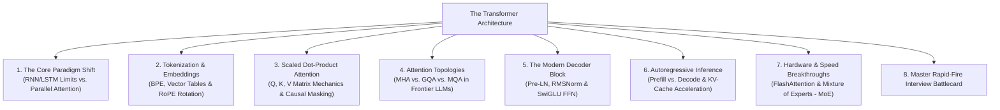
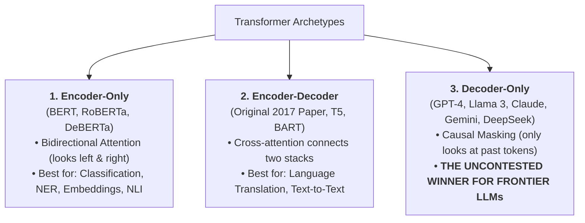
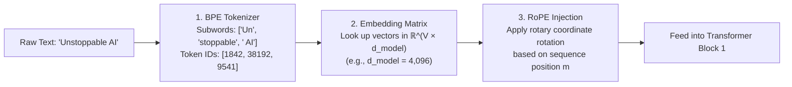
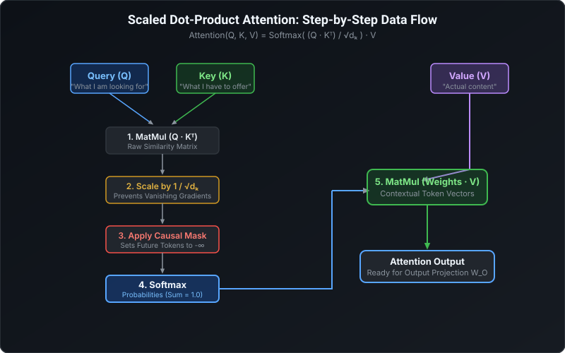
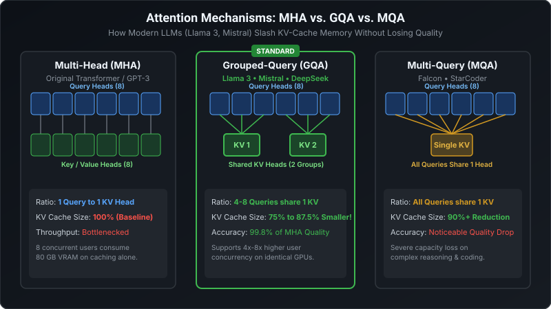
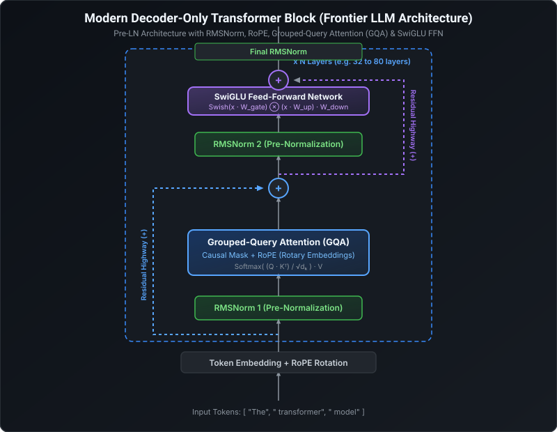
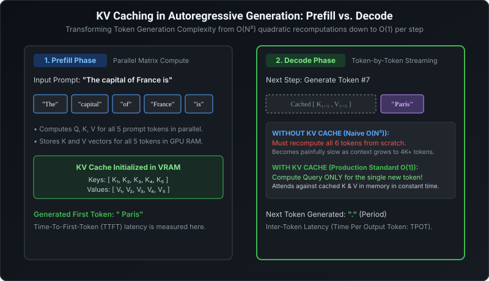
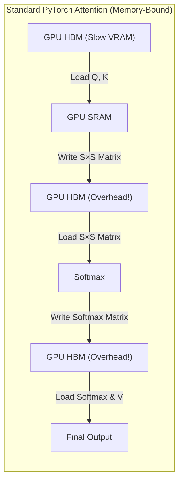
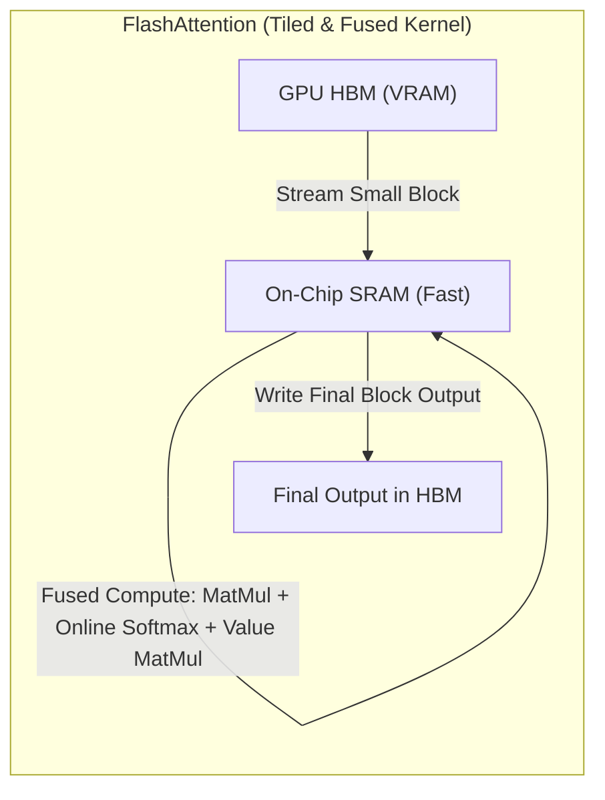

# The Transformer Architecture & Frontier LLMs: The Teacher-First Master Guide

> **Intuitive • Rigorous • Visual-First • From 2017 Foundations to 2026 Frontier LLMs (GPT-4o, Llama 3, Claude 3.5, DeepSeek)**
> 
> A master study guide built on a proven pedagogical framework. Every concept teaches you:
> 1. 🎯 **The Big Picture** — What physical or algorithmic limitation prompted this invention?
> 2. 🎙️ **The 30-Second Interview Pitch** — The exact verbatim script to deliver when asked *"Can you explain X?"*.
> 3. 🧠 **How It Works** — The geometric, tensor, and matrix mechanics broken into 2–3 operational steps.
> 4. 📊 **Visual Mental Model** — Retina-ready vector diagrams for instant visual memory recall.
> 5. 📐 **The Core Formula De-Mystified** — Dual representation: clean readable text in code blocks alongside standard math with zero unparsed symbols.
> 6. ⚠️ **Frontier Evolutions & Pitfalls** — How modern LLMs improved on the original 2017 paper (e.g., RoPE, RMSNorm, SwiGLU, GQA).
> 7. 🛡️ **The Interview Defense** — The tough follow-up cross-questions recruiters and principal architects ask to test real depth.

---

## 🧭 Companion Guides
- [EXPERIENCE_AND_BACKGROUND.md](EXPERIENCE_AND_BACKGROUND.md) — 🎙️ Rahul's Career Speaking Guide (WPP, Cognizant, Flagship Projects & Leadership)
- [ML_CORE_CONCEPTS.md](ML_CORE_CONCEPTS.md) — 🧠 Machine Learning Core Concepts, Math & Visuals (Bias-Variance, SVM, Trees, PCA)
- [FASTAPI_MASTER_GUIDE.md](FASTAPI_MASTER_GUIDE.md) — ⚡ FastAPI Serving Architecture, Async Lifecycles & Production Patterns
- [README_V2.md](README_V2.md) — ☁️ 8-Level Enterprise GenAI & Azure Architecture Master Guide
- [interview_questions.md](interview_questions.md) — Master Question Bank of 117 Principal & Lead Recruiter Inquiries
- [interview_explanations.md](interview_explanations.md) — Comprehensive Explanations & Deep-Dive Architecture Answers

---

## 🗺️ Transformer Architecture Curriculum Map



---

# 1. The Core Paradigm Shift: Why Transformers?

### 🎯 1. The Big Picture ("Why does this exist?")
Before 2017, natural language processing relied on **Recurrent Neural Networks (RNNs)** and **Long Short-Term Memory (LSTMs)** networks. 
These architectures processed text **one token at a time in chronological sequence**: to compute the hidden state at word #50, you had to wait for word #49, which had to wait for word #48.
This created two fatal roadblocks:
1. **The Sequential GPU Bottleneck:** GPUs are massively parallel computing engines designed to multiply giant matrices simultaneously. Processing words sequentially left 95% of GPU compute cores idle. Training on massive internet datasets was computationally impossible.
2. **Catastrophic Forgetting & Vanishing Gradients:** Even with LSTM gating mechanisms, passing information through 100 sequential recurrent steps caused gradients to either explode or vanish to zero. The model forgot facts mentioned at the beginning of a paragraph by the time it reached the end.

The Transformer (*Vaswani et al., 2017: "Attention Is All You Need"*) eliminated recurrence entirely, allowing models to process all tokens **simultaneously in parallel** by using **Self-Attention**.

---

### 🎙️ 2. The 30-Second Interview Pitch (Exact Recital)
> *"The Transformer is a non-recurrent deep learning architecture that models relationships across sequences entirely through self-attention mechanisms and feed-forward networks. Unlike sequential RNNs, transformers process all tokens simultaneously in parallel, eliminating the sequential compute bottleneck and allowing massive scalability on modern GPUs. By computing direct token-to-token attention weights, path lengths between distant words are constant $\mathcal{O}(1)$, completely resolving the vanishing gradient problem over long context."*

---

### 🧠 3. The 3 Architectural Archetypes (Which one won the LLM race?)



* **Why did Decoder-Only win the frontier race?**
  1. **Scaling Law Superiority:** Research proved that auto-regressive next-token prediction on decoder-only models exhibits the most predictable loss scaling per compute dollar.
  2. **Zero-Shot Generalization:** Training on next-token prediction naturally subsumes all NLP tasks (translation, summarization, coding, logic) simply by framing them as sequence completion.
  3. **Inference Simplicity:** Decoder-only architectures eliminate cross-attention projections and asymmetric KV-caches, simplifying distributed GPU serving.

---

### 🛡️ 4. The Interview Defense (Top 2 Cross-Questions)

* **Q1: "Why do transformers have an $\mathcal{O}(1)$ path length between tokens while RNNs have $\mathcal{O}(N)$?"**
  - **Answer:** *"In an RNN, information from token 1 must pass sequentially through $N-1$ intermediate hidden states to reach token $N$, creating an $\mathcal{O}(N)$ path length where signals attenuate. In a transformer, the self-attention matrix computes direct dot-product affinities between every pair of tokens in a single matrix multiplication, resulting in a direct $\mathcal{O}(1)$ path regardless of sequence distance."*

* **Q2: "If transformers process all words in parallel, how do they know the order of words in a sentence?"**
  - **Answer:** *"Without modification, self-attention is completely **permutation-invariant**—the sentence 'dog bites man' produces the exact same attention outputs as 'man bites dog'. To restore sequential understanding, transformers inject **Positional Encodings** (such as sinusoidal signals or modern Rotary Position Embeddings - RoPE) into the token representations before self-attention."*

---

# 2. Tokenization & Input Pipeline: From Text to Vectors

### 🎯 1. The Big Picture ("Why does this exist?")
Computers cannot multiply strings of text; neural networks only understand floating-point vectors.
Naive character-level models result in sequences that are too long and lack semantic density. Naive whole-word models require vocabularies of millions of words, still fail on misspellings, and choke on compound words or code syntax.
The industry standard is **Subword Tokenization (Byte-Pair Encoding - BPE)**.

---

### 🎙️ 2. The 30-Second Interview Pitch (Exact Recital)
> *"The input pipeline converts raw text into numerical token IDs using subword tokenization (typically Byte-Pair Encoding), maps each ID to a dense vector in an embedding matrix $E \in \mathbb{R}^{V \times d_{\text{model}}}$, and injects positional information. Modern frontier LLMs use **Rotary Position Embeddings (RoPE)**, which apply complex-valued 2D rotation matrices to token vectors, naturally encoding relative token distances through inner dot products."*

---

### 🧠 3. How It Works (The 3 Operational Stages)



1. **Byte-Pair Encoding (BPE):** Starts with individual bytes and iteratively merges the most frequently occurring character pairs in the training corpus until reaching a target vocabulary size $V$ (e.g., $128,000$ tokens in Llama 3). Rare words like *"unshakeable"* are split into `["un", "shake", "able"]`.
2. **Embedding Lookup Matrix:** A trainable tensor $W_{\text{embed}} \in \mathbb{R}^{V \times d_{\text{model}}}$. If a token ID is $42$, the model retrieves row $42$, outputting a vector of dimension $d_{\text{model}}$ (e.g., $4,096$ in Llama-3-8B).
3. **Positional Encoding:**
   - **Original 2017 (Sinusoidal):** Fixed mathematical sine and cosine waves of varying frequencies added directly to the embedding vectors.
   - **Modern Frontier LLMs (RoPE - Rotary Position Embedding):** Rotates the Query and Key vectors in 2D coordinate planes by an angle proportional to their absolute token position $m$.

---

### 📐 4. Positional Encodings: Sinusoidal vs. RoPE De-Mystified

#### 1. Sinusoidal Positional Encoding (Vaswani 2017):
```text
PE(pos, 2i)   = sin( pos / 10000^(2i / d_model) )
PE(pos, 2i+1) = cos( pos / 10000^(2i / d_model) )
```

* **The Limitation:** Values are simply added to token embeddings: $X_{\text{input}} = X_{\text{embed}} + \text{PE}$. It does not generalize well to sequences longer than those seen in training.

#### 2. Rotary Position Embedding (RoPE) — The Modern Standard (Llama 3, Mistral, Gemma):
Instead of *adding* a static vector, RoPE groups vector dimensions into pairs and **rotates** each 2D sub-vector by an angle $\theta_i$ multiplied by token position $m$:

```text
RoPE Rotation for position m on vector pair (x1, x2):
[ x1_rotated ] = [ cos(m * theta)   -sin(m * theta) ] [ x1 ]
[ x2_rotated ]   [ sin(m * theta)    cos(m * theta) ] [ x2 ]
```

$$R_{\Theta, m} = \begin{pmatrix} \cos(m\theta) & -\sin(m\theta) \\ \sin(m\theta) & \cos(m\theta) \end{pmatrix}$$

* **The Mathematical Magic:** When calculating attention $(Q_m)^T (K_n)$, the dot product of two rotated vectors depends **solely on their relative distance $(m - n)$**:
  $$\langle R_{\Theta, m} q, \; R_{\Theta, n} k \rangle = g(q, k, m - n)$$
  This allows LLMs to understand relative distance natively and enables context extension (e.g., from 8K to 128K tokens) by simply scaling the base frequency $\theta$.

---

### 🛡️ 5. The Interview Defense (Top 2 Cross-Questions)

* **Q1: "Why do modern LLMs use RoPE instead of learned absolute positional embeddings like GPT-2?"**
  - **Answer:** *"Learned absolute embeddings assign a static vector to each integer position ($0, 1, 2, \dots, 2048$). They completely fail to generalize to any position beyond the maximum sequence length seen during training. RoPE encodes positions through rotation angles, making attention a direct function of **relative distance $(m - n)$**, which preserves semantic decayed distance relationships and allows context extrapolation."*

* **Q2: "What is the token-to-word ratio for English text, and why does tokenization matter for multilingual performance?"**
  - **Answer:** *"In English, 1 token is roughly $0.75$ words (or $\approx 4$ characters). In non-English languages or code, poor tokenizers that lack diverse representation split words into individual bytes, causing 1 word to consume 4–8 tokens. This dramatically shrinks effective context window size and inflates inference latency and API cost. Modern models like Llama 3 expanded vocabulary size to 128K specifically to optimize non-English and code token efficiency."*

---

# 3. Scaled Dot-Product Attention: The Heart of the Transformer

### 🎯 1. The Big Picture ("Why does this exist?")
How does a model determine which words in a sentence relate to each other?
In the sentence *"The animal didn't cross the street because **it** was too tired"*, how does the model know whether **"it"** refers to the *animal* or the *street*?
Self-Attention calculates a dynamic affinity score between every word and every other word in the sequence.

---

### 🎙️ 2. The 30-Second Interview Pitch (Exact Recital)
> *"Scaled Dot-Product Attention computes contextual representations by mapping Query, Key, and Value projections. It calculates the dot product between all Queries and Keys to measure token compatibility, scales the results by the inverse square root of head dimension $\frac{1}{\sqrt{d_k}}$ to prevent vanishing gradients during softmax, applies an optional causal mask to prevent peeking at future tokens, and uses the resulting attention probabilities to compute a weighted sum over the Values."*

---

### 📊 3. Visual Mental Model

<p align="center">
  
</p>

---

### 🧠 4. The YouTube Search Mental Model ($Q, K, V$)
To explain Queries, Keys, and Values in an interview without sounding like a math textbook, use the **Search Engine Analogy**:
* **Query ($Q$):** The text you type into the search bar (*"python async tutorial"*). It represents what the current token is looking for.
* **Key ($K$):** The title, tags, and metadata of all videos in the database (*"Video A: Python Async", "Video B: Cooking Pasta"*). It represents what each token has to offer.
* **Compatibility ($Q \cdot K^T$):** The search engine calculates similarity between your query and each video's tags.
* **Softmax:** Normalizes compatibility scores into probabilities summing to $1.0$ (*Video A: 94%, Video B: 1%*).
* **Value ($V$):** The actual video content you watch. The model takes a weighted average of all Values based on their softmax scores.

---

### 📐 5. The Core Attention Formula De-Mystified

```text
Attention(Q, K, V) = Softmax( (Q · K^T) / sqrt(d_k) ) · V
```

$$
\text{Attention}(Q, K, V) = \text{Softmax}\left( \frac{Q K^T}{\sqrt{d_k}} \right) V
$$

* **Step 1: Compute Similarity ($Q K^T$):** If sequence length is $S$, multiplying $Q \in \mathbb{R}^{S \times d_k}$ by $K^T \in \mathbb{R}^{d_k \times S}$ produces an $S \times S$ matrix of raw dot-product similarity scores.
* **Step 2: Scale by $1 / \sqrt{d_k}$:** If $d_k = 128$, dot products grow large in magnitude. Dividing by $\sqrt{128} \approx 11.31$ stabilizes the variance back to $1.0$.
* **Step 3: Causal Masking (Lower Triangular Matrix):** In generative autoregressive LLMs, token $i$ cannot look at future tokens $j > i$. We replace all upper-triangular positions with $-\infty$.
* **Step 4: Softmax:** Because $e^{-\infty} = 0$, future positions become strictly $0.0\%$ probability, while past positions sum to $1.0$.
* **Step 5: Weighted Sum ($\text{Weights} \cdot V$):** Multiplies the $S \times S$ probability matrix by $V \in \mathbb{R}^{S \times d_v}$, yielding an $S \times d_v$ matrix of context-enriched token representations.

---

### 🛡️ 6. The Interview Defense (Top 2 Cross-Questions)

* **Q1: "Why do we divide by $\sqrt{d_k}$? What happens mathematically if we omit it?"**
  - **Answer:** *"If two independent random vectors of dimension $d_k$ have mean 0 and variance 1, their dot product has mean 0 and variance $d_k$. For large dimensions like $d_k = 128$, dot products become large numbers (e.g., $+40$ or $-40$). When fed into the Softmax function ($e^z / \sum e^z$), the largest values dominate completely, pushing the softmax output into regions with **extremely small gradients (vanishing gradients)**. Dividing by $\sqrt{d_k}$ scales the variance back to $1.0$, keeping gradients healthy for backpropagation."*

* **Q2: "What is Causal Masking and how is it implemented mathematically?"**
  - **Answer:** *"Causal masking ensures that during training on full sequences in parallel, the model cannot cheat by looking at future tokens it is supposed to predict. It is implemented by taking the raw attention score matrix and adding a mask matrix where the upper triangle (all entries where column index $j >$ row index $i$) is filled with $-\infty$. When Softmax is applied, $e^{-\infty} = 0$, guaranteeing zero attention weight to all future tokens."*

---

# 4. Attention Topologies: MHA vs. MQA vs. GQA

### 🎯 1. The Big Picture ("Why does this exist?")
In the original Transformer, every attention head had its own independent Query, Key, and Value projections (**Multi-Head Attention - MHA**).
During training on parallel sequences, this works well. But during **real-time inference**, caching all those Key and Value tensors for 32 heads across 80 layers for 1,000 users consumes **hundreds of gigabytes of GPU VRAM**, completely bottlenecking serving throughput.
Frontier LLMs solved this memory crisis using **Grouped-Query Attention (GQA)**.

---

### 🎙️ 2. The 30-Second Interview Pitch (Exact Recital)
> *"Standard Multi-Head Attention (MHA) pairs each Query head with an independent Key and Value head, creating a massive KV-cache memory bottleneck during autoregressive inference. **Grouped-Query Attention (GQA)**, used in Llama 3 and Mistral, divides Query heads into groups that share a single Key and Value head. A 8:1 query-to-KV ratio cuts KV-cache VRAM consumption by up to 87.5% with virtually zero loss in model quality, dramatically increasing serving concurrency."*

---

### 📊 3. Visual Mental Model

<p align="center">
  
</p>

---

### 🧠 4. Architectural Comparison

| Attention Topology | Query Heads | Key & Value Heads | Query-to-KV Ratio | KV-Cache Memory | Model Quality | Production Adoption |
| :--- | :---: | :---: | :---: | :---: | :---: | :--- |
| **MHA (Multi-Head)** | 32 | 32 | $1 : 1$ | 100% (Baseline) | High | Original Transformer, GPT-3, GPT-4 |
| **GQA (Grouped-Query)** | 32 | 4 or 8 | $4 : 1$ or $8 : 1$ | **12.5% to 25%** | **99.8% of MHA** | **Llama 3, Mistral, DeepSeek-V3** |
| **MQA (Multi-Query)** | 32 | 1 | $32 : 1$ | **3.1%** | Noticeable Drop | Falcon-40B, StarCoder |

* **Why GQA is the Uncontested Winner:**
  - **MQA (Multi-Query)** shared only 1 single KV head across all 32 queries. While it cut memory by 97%, it suffered noticeable accuracy drops in complex coding and reasoning tasks because all query heads were forced to attend to the exact same value subspace.
  - **GQA (Grouped-Query)** struck the optimal balance: by grouping 4 or 8 query heads to 1 KV head, it retains distinct representational subspaces while slashing KV-cache size by up to 87.5%.

---

### 🛡️ 5. The Interview Defense (Top 2 Cross-Questions)

* **Q1: "Why does GQA accelerate inference throughput if it has roughly the same number of compute FLOPs as MHA?"**
  - **Answer:** *"Autoregressive decoding is **memory-bandwidth bound**, not compute bound. To generate each token, the GPU must fetch massive KV-cache tensors from High-Bandwidth Memory (HBM) into on-chip SRAM. Because GQA reduces the size of the KV-cache by up to 87.5%, the GPU transfers 8x less data per token. This reduces memory read latency and allows batch sizes to scale 4x to 8x higher on the same GPU."*

* **Q2: "Can you convert an existing pre-trained MHA model into a GQA model without retraining from scratch?"**
  - **Answer:** *"Yes. Through **Uptraining**: you take the pre-trained MHA model, mean-pool the Key and Value projection matrices across the grouped heads to initialize the GQA heads, and then continue pre-training on a small fraction (e.g., 5%) of original training tokens. This was demonstrated by Ainslie et al. (2023) to achieve full MHA performance at a fraction of training cost."*

---

# 5. The Modern Decoder Block: Inside a Frontier LLM Layer

### 🎯 1. The Big Picture ("Why does this exist?")
A raw self-attention layer alone cannot learn complex hierarchical concepts. It must be paired with non-linear feed-forward transformations, residual highways, and normalizations to form a stable, deep network.
Frontier LLMs have evolved significantly from the 2017 paper: replacing **Post-LN with Pre-LN**, replacing **LayerNorm with RMSNorm**, and replacing **ReLU/GELU with SwiGLU**.

---

### 🎙️ 2. The 30-Second Interview Pitch (Exact Recital)
> *"A modern frontier LLM decoder block consists of two core sub-layers: a Masked Multi-Head/Grouped-Query Attention module and a non-linear Feed-Forward Network. To enable stable training at 100B+ scale, modern models use a **Pre-LN architecture** with **RMSNorm** (Root Mean Square Normalization), which eliminates mean-centering for a 20% speedup. For the FFN, modern architectures adopt **SwiGLU**, a gated activation function that boosts representational capacity by multiplying a Swish-activated linear projection with an up-projection."*

---

### 📊 3. Visual Mental Model

<p align="center">
  
</p>

---

### 🧠 4. The 3 Modern Evolutionary Leaps De-Mystified

#### 1. Post-LN vs. Pre-LN (Why Pre-LN unlocked 100B+ LLMs)
* **Post-LN (Original 2017 Transformer):**
  $$x_{l+1} = \text{LayerNorm}(x_l + \text{Sublayer}(x_l))$$
  - *The Fatal Flaw:* Gradients passing backward through normalization layers at the top of the stack get scaled down repeatedly. Deep networks (>20 layers) could not be trained without delicate learning rate warmups.
* **Pre-LN (Modern Frontier Standard):**
  $$x_{l+1} = x_l + \text{Sublayer}(\text{RMSNorm}(x_l))$$
  - *The Breakthrough:* The residual skip connection ($x_l + \dots$) acts as an **unimpeded gradient highway**, allowing gradients to flow directly from the final layer back to the input embeddings without attenuation. Models can scale to 80+ layers with stable convergence.

#### 2. LayerNorm vs. RMSNorm (Dropping Mean-Centering for Speed)
Standard LayerNorm centers activations by subtracting the mean $\mu$ and scales by the variance $\sigma$:
$$\text{LayerNorm}(x) = \frac{x - \mu}{\sigma} \odot \gamma + \beta$$

Research by Zhang & Sennrich (2019) demonstrated that **mean-centering contributes virtually nothing to training stability**—the regularization comes entirely from scaling by the root mean square!
**RMSNorm** discards $\mu$ completely:

```text
RMSNorm(x) = ( x / RMS(x) ) * gamma
where RMS(x) = sqrt( (1/d) * Sum(x_i^2) + epsilon )
```

$$\text{RMSNorm}(x) = \frac{x}{\sqrt{\frac{1}{d}\sum_{i=1}^{d}x_i^2 + \epsilon}} \odot \gamma$$

* *Engineering Benefit:* Eliminates two full reduction passes across GPU registers (computing and subtracting the mean), accelerating normalization by **~20%**.

#### 3. ReLU vs. GELU vs. SwiGLU (The Modern MLP Standard)
In standard transformers, the Feed-Forward Network (FFN) is a 2-layer MLP with ReLU or GELU:
$$\text{FFN}(x) = \text{GELU}(x W_1 + b_1) W_2 + b_2$$

Modern frontier LLMs (Llama 3, Mistral, PaLM) use **SwiGLU (Swish Gated Linear Unit)**:
```text
SwiGLU(x) = ( Swish(x · W_gate) ⊗ (x · W_up) ) · W_down
where Swish(z) = z · Sigmoid(z)
```

$$\text{SwiGLU}(x) = \Big( \text{Swish}(x W_{\text{gate}}) \odot (x W_{\text{up}}) \Big) W_{\text{down}}$$

* *Why it works:* It introduces a **multiplicative gating mechanism** (inspired by LSTM gates). One linear projection controls *what information flows through*, while the other projection provides the content.
* *Parameter adjustment:* Because SwiGLU uses three weight matrices instead of two, the intermediate hidden dimension is typically set to $\frac{8}{3} d_{\text{model}}$ instead of $4 d_{\text{model}}$ to maintain identical parameter counts.

---

### 🛡️ 5. The Interview Defense (Top 2 Cross-Questions)

* **Q1: "Why are residual connections (skip connections) critical in transformer blocks?"**
  - **Answer:** *"Residual connections add the identity input directly to the layer output ($x + f(x)$). In backpropagation, the gradient of $(x + f(x))$ with respect to $x$ is $1 + f'(x)$. The '$1$' term ensures that gradients can flow backward through 80+ layers without exponentially diminishing, eliminating the vanishing gradient problem in deep networks."*

* **Q2: "What is the typical expansion ratio of the Feed-Forward Network in a Transformer block?"**
  - **Answer:** *"In classic transformers, the FFN expands the hidden dimension by $4\times$ (e.g., from $d_{\text{model}} = 4096$ to $d_{\text{ffn}} = 16384$) before projecting back down. In modern models using SwiGLU (like Llama 3), because three projection matrices are used, the expansion ratio is set to approximately $\frac{8}{3} d_{\text{model}}$ (around $2.67\times$ or $\approx 14336$) to keep total FLOPs and parameter counts constant while gaining higher representational capacity."*

---

# 6. Autoregressive Inference & KV-Caching

### 🎯 1. The Big Picture ("Why does this exist?")
Training a transformer processes the entire prompt and target simultaneously using causal masking.
However, **generating text in production is fundamentally autoregressive**: the model predicts 1 token, appends it to the sequence, and runs the entire transformer again to predict the next token.
Without optimization, generating token #100 requires recomputing all attention matrices for tokens 1 through 99. By token #1000, compute explodes **quadratically $\mathcal{O}(N^2)$**, causing generating text to slow to a painful crawl.
**KV-Caching** transforms inference back to **$\mathcal{O}(1)$ per token**.

---

### 🎙️ 2. The 30-Second Interview Pitch (Exact Recital)
> *"Transformer inference operates across two distinct phases: the parallel **Prefill Phase**, which processes prompt tokens to generate the first output token, and the sequential **Decode Phase**, which emits tokens one-by-one. **KV-Caching** stores the Key and Value projection matrices of all past tokens in GPU VRAM. During each decode step, the model computes Query, Key, and Value projections for *only the single new token*, appends the new KV to the cache, and computes attention in $\mathcal{O}(1)$ compute time per step."*

---

### 📊 3. Visual Mental Model

<p align="center">
  
</p>

---

### 🧠 4. The 2 Inference Phases De-Mystified

1. **Phase 1: Prefill Phase (Compute-Bound):**
   - The user submits a prompt of 500 tokens.
   - The model computes $Q, K, V$ for all 500 tokens **simultaneously in parallel**, saturating GPU Tensor Cores.
   - It stores the 500 Key and Value vectors in GPU VRAM (the KV-Cache).
   - Emits the first token. Latency for this phase is called **Time-To-First-Token (TTFT)**.
2. **Phase 2: Decode Phase (Memory-Bandwidth-Bound):**
   - To generate token #502, the model does *not* recompute the first 500 tokens!
   - It only computes $q_{501}, k_{501}, v_{501}$ for the single newly generated token.
   - It appends $k_{501}$ and $v_{501}$ to the existing KV-Cache.
   - $q_{501}$ attends against all cached Keys $[K_1, \dots, K_{501}]$.
   - Multiplies attention weights by cached Values $[V_1, \dots, V_{501}]$.
   - Emits token #502. Latency between tokens is called **Time Per Output Token (TPOT)**.

---

### 📐 5. Decoding Strategies: From Logits to Output Words

The final linear layer (unembedding) projects the output vector back to vocabulary size $V$ (e.g., $128,000$), producing raw unnormalized numbers called **Logits** ($z$).

```text
Logits (z) --> Temperature Scaling (z / T) --> Top-K / Top-p (Nucleus) Filtering --> Softmax --> Token Sampling
```

* **Temperature ($T$):** Divides logits by $T$ before Softmax: $P(x_i) = \frac{e^{z_i / T}}{\sum e^{z_j / T}}$.
  - $T \to 0$ (Greedy Decoding): The highest logit dominates; output is deterministic and factual.
  - High $T > 1.0$: Flattens probabilities; output is creative, diverse, but prone to hallucinations.
* **Top-K Sampling:** Restricts candidate pool strictly to the $K$ tokens with highest probabilities (e.g., $K=50$).
* **Top-p (Nucleus) Sampling:** Dynamically keeps the smallest set of tokens whose cumulative probability exceeds $p$ (e.g., $p=0.90$). If the top token has 95% probability, only 1 token is considered; if predictions are uncertain, 30 tokens are considered.

---

### 🛡️ 6. The Interview Defense (Top 2 Cross-Questions)

* **Q1: "Why is the Prefill phase compute-bound while the Decode phase is memory-bandwidth-bound?"**
  - **Answer:** *"In the Prefill phase, all prompt tokens are processed as large matrix-matrix multiplications ($GEMM$), which fully saturates the arithmetic logic units (Tensor Cores) of the GPU. In the Decode phase, batch size is effectively 1 token per stream, turning computation into matrix-vector operations ($GEMV$). The bottleneck shifts completely to the time required to read gigabytes of cached KV tensors from GPU VRAM into on-chip cache registers."*

* **Q2: "What is the physical memory formula for storing the KV-cache of an LLM in production?"**
  - **Answer:** *"The memory in bytes is:
    $$\text{Memory} = 2 \times 2 \times n_{\text{layers}} \times n_{\text{heads}} \times d_{\text{head}} \times \text{seq\_len} \times \text{batch\_size}$$
    The first $2$ accounts for separate $K$ and $V$ matrices; the second $2$ accounts for 16-bit half-precision (FP16 or BF16, 2 bytes per float). For Llama-3-70B with 80 layers and 128K context, a single user session consumes $\approx 10\text{ GB}$ of VRAM."*

---

# 7. Frontier Innovations: FlashAttention & Mixture of Experts (MoE)

### 🎯 1. The Big Picture ("Why does this exist?")
As sequence lengths scaled from 2K to 128K tokens, standard attention crashed into physical hardware limits:
1. Writing the $S \times S$ attention matrix to High-Bandwidth Memory (HBM) required $\mathcal{O}(S^2)$ memory bandwidth.
2. Training dense 70B+ models reached physical power and financial limits.
Frontier AI resolved this with **FlashAttention** (hardware-aware computation) and **Mixture of Experts (MoE)** (sparse parameter routing).

---

### 🎙️ 2. The 30-Second Interview Pitch (Exact Recital)
> *"**FlashAttention** is an IO-aware exact attention algorithm that eliminates intermediate memory bottlenecks by tiling Query, Key, and Value matrices into small blocks that fit directly inside fast GPU on-chip SRAM, computing softmax online without ever materializing the massive $S \times S$ attention matrix in GPU HBM. **Mixture of Experts (MoE)** replaces dense feed-forward networks with multiple specialized sub-networks, using a lightweight router to activate only the top-2 experts per token, delivering 70B-parameter capacity at the inference cost and speed of a 14B model."*

---

### 🧠 3. FlashAttention De-Mystified (IO-Awareness & SRAM Tiling)





* **The Hardware Reality:** GPU on-chip SRAM memory is **10x faster** than GPU VRAM (HBM), but SRAM is tiny (only ~200KB per Streaming Multiprocessor).
* **The FlashAttention Breakthrough:**
  1. **Tiling:** Divides $Q, K, V$ into small blocks that fit inside SRAM.
  2. **Kernel Fusion:** Computes dot-product, online softmax scaling, and value multiplication in a **single fused GPU kernel**.
  3. **Recomputation in Backprop:** Does not save the $S \times S$ attention matrix during forward pass; instead, it recomputes it on the fly in backward pass from SRAM, saving memory and speeding up training by **2x to 4x**.

---

### 🧠 4. Mixture of Experts (MoE): Dense vs. Sparse Routing

In a standard dense model (like Llama-3-70B), **100% of the 70 billion parameters are active for every single token**.
In a Sparse MoE model (like Mixtral 8x7B or DeepSeek-V3):
1. The self-attention layer remains shared across all tokens.
2. The Feed-Forward Network (FFN) is replicated into $E$ distinct "experts" (e.g., $E=8$ sub-networks).
3. A lightweight **Gating Router Network** computes a softmax over the experts:
   $$\text{Router}(x) = \text{Softmax}(\text{TopK}(x \cdot W_g, \; k=2))$$
4. Only the **Top-2 experts** compute forward passes for that token.
5. The outputs are summed weighted by the router's probability scores.

```text
MoE Operational Ledger:
• Total Parameters: 47 Billion (Massive knowledge capacity)
• Active Parameters per Token: ~13 Billion (2 of 8 experts)
• Latency & Compute: Runs at the speed and cost of a 14B model!
```

---

### 🛡️ 5. The Interview Defense (Top 2 Cross-Questions)

* **Q1: "Does FlashAttention produce approximate or exact attention outputs?"**
  - **Answer:** *"FlashAttention is an **exact attention algorithm**, not an approximation. It mathematically computes identical attention outputs to standard attention down to numerical floating-point precision. The speedup and memory savings come entirely from **IO-awareness**: computing online softmax and fusing operations inside on-chip SRAM to eliminate memory traffic between GPU HBM and registers."*

* **Q2: "What is Expert Routing Collapse in MoE models, and how do you prevent it?"**
  - **Answer:** *"Routing collapse occurs when the router favors 1 or 2 experts early in training. Those experts receive more gradient updates, become more capable, and the router continues routing all tokens to them, leaving the remaining experts completely untrained. It is prevented by adding an **Auxiliary Load-Balancing Loss** during training that penalizes uneven token distribution across experts, forcing uniform capacity utilization."*

---

# 8. Master Rapid-Fire Interview Battlecard

| # | Technical Interview Question | Winning 1–2 Sentence Direct Response |
| :---: | :--- | :--- |
| **Q1** | **Why did Decoder-only win over Encoder-Decoder for frontier LLMs?** | *"Decoder-only models exhibit the most predictable scaling laws per compute dollar, unify all NLP tasks as autoregressive sequence completion, and simplify distributed KV-cache serving on GPU clusters."* |
| **Q2** | **What is the difference between Pre-LN and Post-LN?** | *"Post-LN normalizes after residual addition, causing gradients to attenuate in deep stacks. Pre-LN normalizes inputs *before* sublayers, keeping the residual skip connection as an unimpeded gradient highway for stable 100B+ scaling."* |
| **Q3** | **Why scale attention scores by $\frac{1}{\sqrt{d_k}}$?** | *"At high dimensions, vector dot products grow large in magnitude, pushing the Softmax function into flat regions with near-zero gradients. Scaling stabilizes variance back to $1.0$."* |
| **Q4** | **What is RoPE (Rotary Position Embedding) and why is it superior?** | *"RoPE rotates Query and Key vectors in 2D coordinate planes by angles proportional to token position, making attention dot products depend strictly on relative distance $(m-n)$ for seamless context extrapolation."* |
| **Q5** | **How does Grouped-Query Attention (GQA) reduce memory?** | *"GQA groups multiple Query heads to share a single Key and Value head (e.g., 8:1 ratio), cutting KV-cache VRAM consumption by up to 87.5% while maintaining 99.8% of full Multi-Head Attention accuracy."* |
| **Q6** | **Why do modern LLMs use RMSNorm instead of LayerNorm?** | *"RMSNorm discards the mean-centering step of LayerNorm, scaling purely by the root mean square. This eliminates two global reduction passes across GPU registers, speeding up normalization by ~20%."* |
| **Q7** | **What is the purpose of SwiGLU in the feed-forward network?** | *"SwiGLU replaces standard activation functions with a gated linear unit: multiplying a Swish-activated projection with an up-projection, introducing multiplicative gating that boosts representational capacity."* |
| **Q8** | **What is the difference between the Prefill and Decode phase in LLM inference?** | *"Prefill processes all prompt tokens in parallel and is compute-bound ($GEMM$). Decode emits tokens one-by-one autoregressively and is memory-bandwidth bound ($GEMV$) by reading the KV-cache."* |
| **Q9** | **How does FlashAttention achieve 2x–4x training speedup?** | *"It tiles $Q, K, V$ matrices into blocks that fit inside fast on-chip SRAM, computing online softmax in a single fused kernel without ever materializing the massive $S \times S$ attention matrix in slow GPU VRAM."* |
| **Q10** | **How does a Mixture of Experts (MoE) model achieve 70B capacity at 14B compute cost?** | *"MoE replaces the dense feed-forward network with multiple expert sub-networks, using a lightweight router to dynamically activate only the top-2 experts per token."* |

---

## 🎯 3 Golden Takeaways for Your Technical Interview
1. **Parallel Attention:** Transformers defeated RNNs because self-attention allows parallel GPU matrix multiplication and provides constant $\mathcal{O}(1)$ path lengths between any two tokens.
2. **Modern Architecture Recipe:** Modern frontier LLMs (Llama 3, Claude, Gemini) use: **Decoder-Only + Pre-LN + RMSNorm + RoPE + Grouped-Query Attention (GQA) + SwiGLU**.
3. **Inference Bottleneck:** Autoregressive generation is memory-bandwidth bound, which is why **KV-Caching, GQA, and FlashAttention** are mandatory for scalable production serving.
