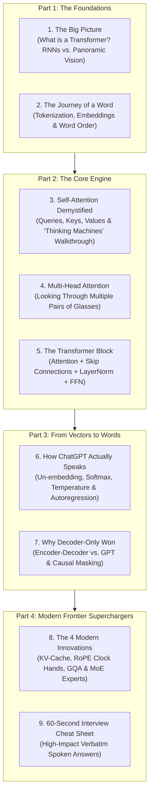
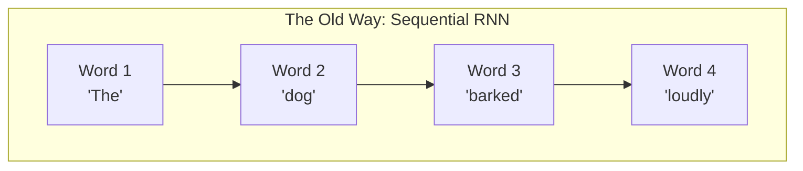
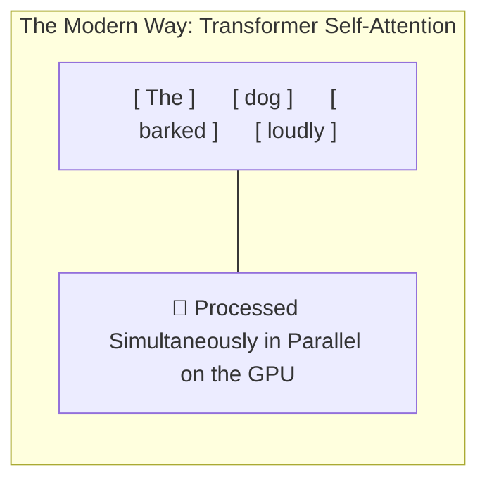
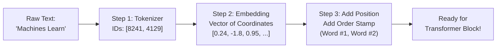
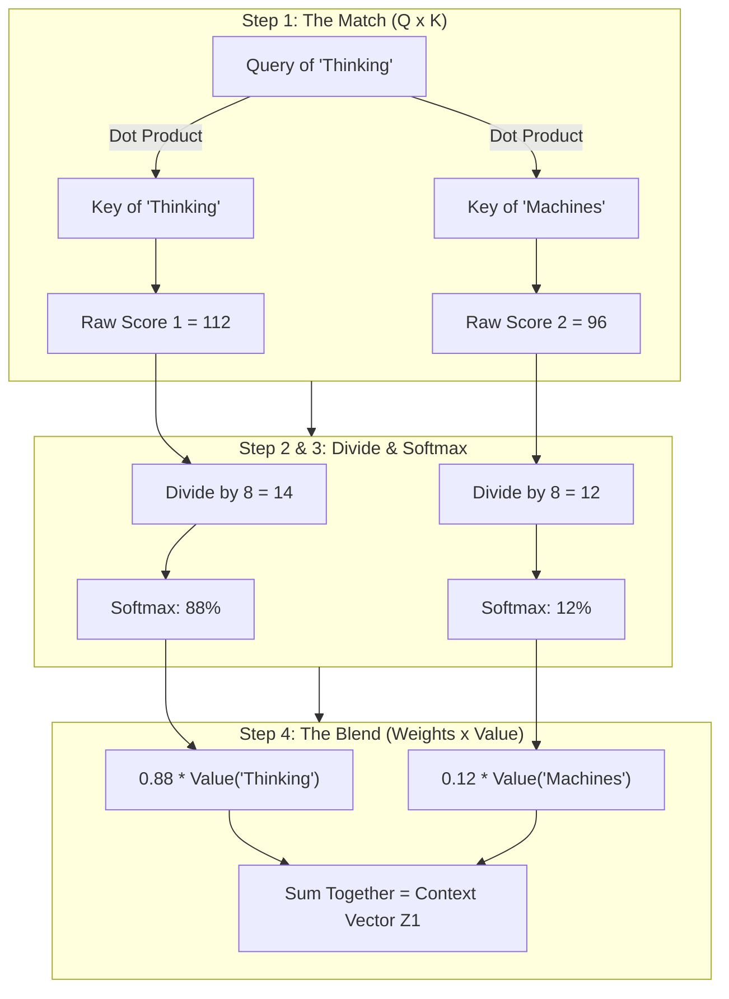
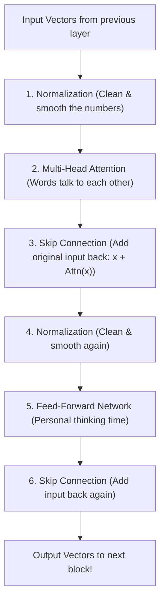
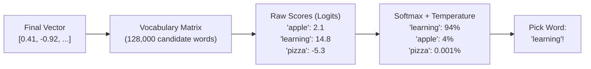
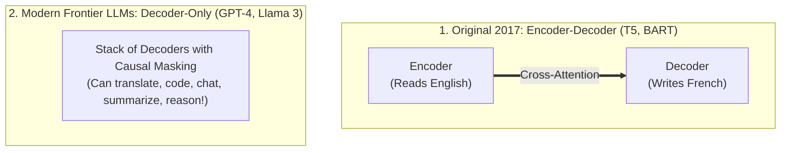

# The Illustrated Transformer & Frontier LLMs: A Beginner-Friendly Masterclass

> **Intuitive • Visual-First • Zero Unnecessary Jargon • From Core Foundations to Modern Frontier LLMs (GPT-4o, Llama 3, Claude 3.5, DeepSeek)**
>
> If you have ever felt overwhelmed by dense academic papers full of matrix calculus, Greek symbols, and intimidating hardware jargon, **you are in the right place**.
>
> This guide is built on the pedagogical philosophy of great educators like **Jay Alammar** (*The Illustrated Transformer*), **3Blue1Brown** (*Neural Networks & Attention*), and **Andrej Karpathy** (*Zero to Hero*). 
>
> We break every complex concept into:
> 1. 🌟 **The Intuitive Metaphor:** An everyday analogy you can visualize instantly.
> 2. 🚶 **The Concrete Walkthrough:** Real words (*"Thinking Machines"*) traced step-by-step with simple arithmetic.
> 3. 📊 **Clear Visual Diagrams:** Flowcharts and vector graphics that map 1:1 to the text.
> 4. 🎙️ **The 60-Second Interview Pitch:** Natural spoken English answers ready for your interviews.

---

## 🧭 Companion Guides in this Repository
- [EXPERIENCE_AND_BACKGROUND.md](EXPERIENCE_AND_BACKGROUND.md) — 🎙️ Rahul's Career Speaking Guide (WPP, Cognizant, Flagship Projects & Leadership)
- [ML_CORE_CONCEPTS.md](ML_CORE_CONCEPTS.md) — 🧠 Machine Learning Core Concepts, Math & Visuals (Bias-Variance, SVM, Trees, PCA)
- [FASTAPI_MASTER_GUIDE.md](FASTAPI_MASTER_GUIDE.md) — ⚡ FastAPI Serving Architecture, Async Lifecycles & Production Patterns
- [README_V2.md](README_V2.md) — ☁️ 8-Level Enterprise GenAI & Azure Architecture Master Guide
- [interview_questions.md](interview_questions.md) — Master Question Bank of 117 Principal & Lead Recruiter Inquiries
- [interview_explanations.md](interview_explanations.md) — Comprehensive Explanations & Deep-Dive Architecture Answers

---

## 🗺️ Visual Curriculum Roadmap



---

# 1. The Big Picture: What is a Transformer?

### 🎯 1. Explain It Like I'm 10: The Ultimate Fill-in-the-Blank Machine
At its core, every modern Large Language Model (ChatGPT, Claude, Llama 3, Gemini) does only **one single job**:

> **"Given a list of words, what is the single most likely word that comes next?"**

* If you give it: *"The sky is..."* $\to$ It predicts: *"blue"* (85% probability).
* If you give it: *"def calculate_area(width, height): return..."* $\to$ It predicts: *"width * height"* (92% probability).

Even complex tasks like writing poetry, translating French, drafting legal contracts, or writing Python code are fundamentally solved as **repeating this next-word prediction game billions of times**.

---

### ⏳ 2. The Old Way (RNNs) vs. The Transformer Way

Before Transformers arrived in 2017 (*Vaswani et al., "Attention Is All You Need"*), computers read language using **Recurrent Neural Networks (RNNs)** and **LSTMs**.



* **The RNN Problem (Reading Through a Keyhole):**
  - An RNN reads one word at a time, left-to-right, like listening to an old cassette tape.
  - To understand word #100, the computer had to wait for word #99, which had to wait for word #98, all the way back to word #1.
  - **Two Fatal Flaws:**
    1. **GPU Idleness:** Modern computer chips (GPUs) have thousands of tiny cores designed to do thousands of calculations *at the exact same second*. An RNN forced a massive GPU to sit idle, waiting for one word at a time.
    2. **Amnesia (Vanishing Memory):** By the time an RNN read page 5 of a document, the information from page 1 had been compressed, diluted, and forgotten.



* **The Transformer Breakthrough (Panoramic Photo):**
  - Instead of reading through a straw, a Transformer **takes a snapshot of the entire sentence at once**.
  - Every word can look directly at every other word in the sentence in a single step!
  - Distance no longer matters: word #1 and word #10,000 connect with the exact same directness (`O(1)` direct connection).

---

### 🕵️ 3. The Classic Riddle: Why Context is Everything
Look at this sentence:

> *"The animal didn't cross the street because **it** was too tired."*

What does the word **"it"** refer to? The *animal*, obviously.

Now change just **one single word** at the end:

> *"The animal didn't cross the street because **it** was too wide."*

What does **"it"** refer to now? The *street*!

How does a computer figure this out? The word *"it"* by itself has zero meaning. Its meaning is determined entirely by which other words it **pays attention to**. That is the magic of **Self-Attention**.

---

### 🎙️ 4. The 30-Second Interview Pitch (Say This Out Loud)
> *"Before 2017, language models used RNNs that read text one word at a time, which made training slow on GPUs and caused models to forget past context. The Transformer solved this by processing all words simultaneously in parallel and using **Self-Attention**—a mechanism that lets every word directly look at and gather information from every other word in the sequence, no matter how far apart they are."*

---

# 2. The Journey of a Word: From Raw Text to Numbers

Computers cannot understand letters, ink, or sound waves. They only understand numbers. Before a Transformer can process a sentence, the text goes through **3 simple preparation steps**.



---

### 🧱 Step 1: Tokenization (Chopping Text into LEGO Bricks)
We don't feed whole sentences into a model, and we usually don't feed individual letters either. Instead, we break text into **tokens** (common words, sub-words, or punctuation) using an algorithm called **Byte-Pair Encoding (BPE)**.

* **Common words** get their own single token: `"apple"` $\to$ `[1792]`
* **Rare or complex words** get chopped into familiar building blocks: 
  - `"unbelievable"` $\to$ `["un", "believ", "able"]`
* **Why not just use whole words?** A dictionary of all English words would be millions of words long, and it would crash on typos or new slang!
* **Rule of thumb:** In English, **1 token is roughly 0.75 words** (or about 4 characters). A 1,000-word essay is roughly 1,300 tokens.

---

### 🗺️ Step 2: Embeddings (Placing Words on a Semantic Map)
Once a word is converted into a number (like token ID `8241`), we look it up in a massive dictionary table called the **Embedding Matrix**.

This turns the single ID into a long list of numbers called a **Vector** (for example, 4,096 numbers in Llama-3).

Think of these numbers as **GPS coordinates on a giant semantic map**:

```text
                  High Status / Royalty
                          ▲
                          │    ★ King (0.91, 0.88)
                          │
       ★ Man (0.82, 0.12) │
                          │
◄─────────────────────────┼─────────────────────────► Masculine vs. Feminine
                          │
     ★ Woman (-0.79, 0.15)│
                          │    ★ Queen (-0.85, 0.84)
                          ▼
```

* Words that mean similar things (like `"king"` and `"queen"`, or `"dog"` and `"puppy"`) end up sitting close to each other in this mathematical space.
* Even mathematical relationships emerge naturally:
  ```text
  Vector("King") - Vector("Man") + Vector("Woman") ≈ Vector("Queen")
  ```

---

### 🪑 Step 3: Positional Encoding (Giving Words a Seat Number)
Because a Transformer looks at all words at the exact same moment, it has a funny blind spot: **it is completely order-blind!**

To a raw Transformer:
* *"Dog bites man"*
* *"Man bites dog"*

...look 100% identical! They have the exact same words.

To fix this, we attach a **Position Stamp** to each word vector before sending it into the model:
* Word 1 gets a "Position 1" stamp.
* Word 2 gets a "Position 2" stamp.
* Word 3 gets a "Position 3" stamp.

Now the model knows both **what** the word means and **where** it sits in the sentence.

---

# 3. Self-Attention Demystified: The "Thinking Machines" Walkthrough

Now we enter the heart of the Transformer: **Self-Attention**.

To make this completely crystal clear, we will follow the iconic teaching method of Jay Alammar: we will trace an actual 2-word sentence — **"Thinking Machines"** — through the math with simple, real numbers!

---

### 🏷️ 1. The 3 Badges: Query, Key, and Value
For every word, the Transformer creates **3 different vectors**. Think of them as 3 badges worn by a person walking into a networking conference:

| Badge | Technical Name | Real-World Meaning | The Question It Asks |
| :---: | :---: | :--- | :--- |
| **Q** | **Query** | What I am currently looking for. | *"Hey everyone, I need someone who can describe my action!"* |
| **K** | **Key** | My nametag / label of who I am. | *"Hello, my nametag says: I am a plural noun."* |
| **V** | **Value** | The actual information / content I hold. | *"Here is my full meaning and features to share with you."* |

---

### 🚶 2. Tracing "Thinking Machines" Step-by-Step

Let's see how the word **"Thinking"** updates its meaning by paying attention to itself and to **"Machines"**.



#### Step 1: Compare Badges (The Dot Product)
We take the **Query** of *"Thinking"* and multiply it (dot product) against the **Key** of every word in the sentence:
* Match with itself: `Query("Thinking") · Key("Thinking")` = **112**
* Match with neighbor: `Query("Thinking") · Key("Machines")` = **96**

A higher score means a stronger connection!

#### Step 2: Scale Down (Divide by 8)
Why divide? If vectors have 64 dimensions, multiplying them can produce huge numbers like 1,000 or 5,000. When numbers get that big, the next step (Softmax) flattens out and the model stops learning.
* So we divide by $\sqrt{d_k}$ (the square root of 64 is **8**):
  - `112 / 8 = 14`
  - `96 / 8 = 12`

#### Step 3: Turn into Percentages (Softmax)
We pass `[14, 12]` through the **Softmax function**. Softmax does something very simple: **it turns any list of numbers into positive percentages that add up to 100% (1.0)**:
* Attention to *"Thinking"*: **88% (0.88)**
* Attention to *"Machines"*: **12% (0.12)**
* Total: `0.88 + 0.12 = 1.00 (100%)`

This tells us: *"When understanding 'Thinking', keep 88% of its own identity, but absorb 12% of context from 'Machines'!"*

#### Step 4: Blend the Values
Finally, we multiply each word's **Value vector** by its percentage and add them together:

```text
New Vector for "Thinking" = (0.88 * Value of "Thinking") + (0.12 * Value of "Machines")
```

**The Result:** The word *"Thinking"* is no longer an isolated dictionary definition. It has absorbed the context that it belongs to *"Thinking Machines"*. It is now a **context-aware representation**!

---

### 📊 3. Visual Mental Model: The Data Flow

<p align="center">
  
</p>

---

### 📐 4. The Formula in Plain English
You will often see this famous formula from the original 2017 paper:

```text
Attention(Q, K, V) = Softmax( (Q * K^T) / sqrt(d_k) ) * V
```

$$
\text{Attention}(Q, K, V) = \text{Softmax}\left( \frac{Q K^T}{\sqrt{d_k}} \right) V
$$

Now you know exactly what every single piece means:
* `Q * K^T`: Match every Question with every Nametag.
* `/ sqrt(d_k)`: Divide by 8 so numbers don't blow up.
* `Softmax(...)`: Turn the matches into clean percentages adding to 100%.
* `* V`: Mix the actual Information using those percentages!

---

# 4. Multi-Head Attention: "Different Pairs of Glasses"

In our 2-word example, we calculated attention using one set of Query, Key, and Value matrices. That is called **Single-Head Attention**.

### 👓 Why One Head Isn't Enough
Imagine you are reading a mystery novel wearing red-tinted sunglasses. You will spot all the red clues, but you will completely miss the blue and green clues!

If a Transformer only had one attention head, the word *"bank"* might focus exclusively on the fact that it is a noun, completely missing whether it was a *river bank* or a *money bank*.

---

### 🕵️ The Detective Team Analogy
Modern LLMs use **Multi-Head Attention** (typically 32 to 128 heads). Think of this as hiring an entire team of specialized detectives to read the same sentence at the same time:

```text
Sentence: "The tired detective solved the case because he never gave up."

🔍 Head 1 (Grammar Specialist):   Connects subject to verb ("detective" ──► "solved")
🔍 Head 2 (Pronoun Specialist):   Connects pronoun to person ("he" ──► "detective")
🔍 Head 3 (Adjective Specialist): Connects description to noun ("tired" ──► "detective")
🔍 Head 4 (Cause & Effect):       Connects result to reason ("solved" ──► "never gave up")
```

Each head has its own private Query, Key, and Value weights. At the end of the layer, all heads combine their notes into one master summary vector.

---

# 5. Inside a Transformer Block: The 4 Building Blocks

A modern LLM is not just one attention layer. It is a tall sandwich of **identical blocks stacked on top of each other** (for example, Llama-3-8B stacks **32 blocks**; Llama-3-70B stacks **80 blocks**).

Every single block contains **4 simple components**:



---

### 🧱 Component 1: Self-Attention (The Meeting)
As we just learned, this is where words communicate with each other and gather context from the sentence.

---

### 🛗 Component 2: The Skip Connection (The Express Elevator)
Notice how in the diagram, a copy of the input bypasses the attention layer and gets added directly to the output:
```text
Output = Input + Attention(Input)
```

* **Why do this?** In a deep network with 80 layers, information can get scrambled, diluted, or lost as it passes through layer after layer.
* **The Metaphor:** The skip connection is like an **express elevator**. It ensures that the original identity of the word is never forgotten, while the attention layer just adds subtle hints on top.
* It also provides a clear "gradient highway" during training so the model learns without vanishing gradients.

---

### 🧼 Component 3: Layer Normalization (Smoothing the Numbers)
Neural networks work best when numbers stay around 0 (e.g., between `-2.0` and `+2.0`). If numbers drift toward `+500` or `-1,000`, training crashes.
* LayerNorm acts like a thermostat: after every step, it recalibrates all numbers to have a mean of 0 and a healthy variance.
* Modern LLMs use a faster version called **RMSNorm** which skips the subtraction step and runs ~20% faster.

---

### 🧠 Component 4: Feed-Forward Network (Personal Thinking Time)
Self-Attention is about **communication** (talking to other words). But after the meeting ends, you need to sit at your desk and **think**!

* The Feed-Forward Network (FFN) is a standard neural network applied to **each word individually and independently**.
* **What does it do?** This is where the model stores its **factual knowledge**.
  - If attention figured out: *"The capital of France is [Paris]"*, the FFN is the memory bank that actually retrieves the word *"Paris"*.
  - It expands the vector into a wider space (e.g. from 4,096 to 14,336 dimensions) to do complex reasoning, then compresses it back down.

---

### 📊 Visual Architecture Diagram

<p align="center">
  
</p>

---

# 6. How ChatGPT Actually Speaks: Next-Word Prediction

We have passed through 32 layers of Attention and Feed-Forward networks. The word at the very end of our prompt now holds a rich, context-packed vector.

How does that vector turn into an actual word you see on your screen?



---

### 📖 Step 1: The Vocabulary Projector (Un-Embedding)
The model compares the final vector against every single word in its dictionary (e.g., **128,000 words** in Llama-3).
* It produces a raw score (called a **logit**) for every single word in the dictionary.
* If your prompt was *"Deep Learning is a branch of machine..."*, the word *"learning"* will receive a high logit (e.g. `+14.8`), while *"banana"* will receive a very low logit (`-6.2`).

---

### 🎲 Step 2: Softmax & The Temperature Dial
We pass all 128,000 logits through Softmax to turn them into probabilities that sum to 100%.

Here is where the famous **Temperature** setting comes into play:

| Temperature Setting | How It Modifies Probabilities | Model Behavior | Best Used For |
| :---: | :--- | :--- | :--- |
| **0.0 (Cold / Greedy)** | Magnifies the top score to nearly 100%. Always picks the #1 most likely word. | 100% deterministic, repetitive, factual. | Coding, Math, SQL queries, Data extraction. |
| **0.7 (Balanced)** | Keeps top candidates probable, but gives #2 and #3 a small chance to be picked. | Natural, engaging, human-like voice. | General chat, article writing, email drafting. |
| **1.5+ (Hot / Wild)** | Flattens the probabilities, giving rare words a much higher chance. | Highly creative, unexpected, prone to nonsense. | Brainstorming wild ideas, poetry, fiction writing. |

---

### 🔄 Step 3: The Autoregressive Loop (One Token at a Time)
LLMs cannot write a whole paragraph at once. They generate **one single token at a time**:

1. Input: `"Once"` $\to$ Model predicts: `"upon"`
2. Input: `"Once upon"` $\to$ Model predicts: `"a"`
3. Input: `"Once upon a"` $\to$ Model predicts: `"time"`
4. Input: `"Once upon a time"` $\to$ Model predicts: `","`

This loop repeats until the model outputs a special invisible token called `<|end_of_text|>`. When the app sees that token, it stops generating!

---

# 7. Why Modern LLMs Dropped the Encoder (Decoder-Only)

If you read the original 2017 *"Attention Is All You Need"* paper, you will see a diagram with two giant towers: an **Encoder** on the left and a **Decoder** on the right.

Yet today, **every frontier LLM (GPT-4o, Llama 3, Claude 3.5, Mistral, DeepSeek) uses only the Decoder tower**. What happened to the Encoder?



---

### 🌍 1. The Original Job: Language Translation
In 2017, the goal was translating English into French:
* **The Encoder's job:** Read the entire English sentence at once, looking both left and right (bidirectional), and create a summary.
* **The Decoder's job:** Generate the French translation one word at a time, looking back at the English summary via "Cross-Attention".

---

### 💡 2. The Big Realization: Next-Word Prediction Does Everything!
Between 2018 and 2020 (led by OpenAI with GPT-2 and GPT-3), researchers discovered something profound:

> **You don't need two separate models.** If you simply train a Decoder on trillions of words from the internet to predict the next word, it learns to do *all* tasks naturally!

* **Translation:** Prompt: *"Translate English to French: The cat is cute. French:"* $\to$ Predicts: *"Le chat est mignon."*
* **Summarization:** Prompt: *"Summarize this article in 1 sentence: [...] Summary:"* $\to$ Predicts the summary!
* **Coding:** Prompt: *"Write a python function to reverse a string:"* $\to$ Predicts the code!

Dropping the Encoder halved the complexity of training, simplified GPU memory management, and unlocked predictable scaling laws.

---

### 🙈 3. Causal Masking: "You Cannot Look into the Future!"
When training a Decoder-only model, all tokens are fed into the GPU at once. 

If word #2 could look ahead at word #5, it would be **cheating**—like a student looking at the answer key at the back of the test book!

To prevent cheating, we apply a **Causal Mask** (a triangle of $-\infty$):
```text
Token 1 ("The")      ──► Can only see: ["The"]
Token 2 ("dog")      ──► Can see: ["The", "dog"]
Token 3 ("barked")   ──► Can see: ["The", "dog", "barked"]
Token 4 ("loudly")   ──► Can see: ["The", "dog", "barked", "loudly"]
```

Every word is blindfolded from seeing any words that come after it.

---

# 8. The 4 Modern Superchargers (Explained with Zero Jargon)

Modern models like **Llama 3** and **DeepSeek-V3** are still fundamentally Transformers, but they incorporate **4 brilliant engineering upgrades** that make them 10x faster and allow them to remember 128,000+ words.

Here is how each one works in plain English:

---

### 📝 1. The KV-Cache ("The Scratchpad")
Remember that LLMs generate text one token at a time in a loop:
* **Without KV-Cache (The Forgetful Student):**
  - To generate token #500, the model re-calculates the Keys and Values for tokens 1 through 499 from scratch.
  - To generate token #501, it re-calculates tokens 1 through 500 from scratch again!
  - As the document gets longer, generation grinds to a painful crawl.
* **With KV-Cache (The Smart Scratchpad):**
  - The model calculates the Keys and Values for past words **once**, and saves them in GPU memory (the "KV Cache").
  - When generating token #501, it only computes the new word and simply looks up past words on its scratchpad!
  - **Inference speed goes from quadratic slow (`O(N^2)`) to lightning fast (`O(1)`) per token.**

<p align="center">
  
</p>

---

### ⏰ 2. RoPE (Rotary Position Embeddings — "The Clock Hands")
In the original 2017 Transformer, word positions were represented by adding static sine waves. This broke down when sentences grew longer than what the model saw during training.

* **The RoPE Solution (Llama 3, Mistral, Gemma):**
  - Instead of adding static numbers, think of each word's vector as a **hand on a clock**.
  - Word #1 is rotated by 10 degrees.
  - Word #2 is rotated by 20 degrees.
  - Word #5 is rotated by 50 degrees.
* **Why this is genius:** When you compare Word #2 and Word #5, the angle between their clock hands is `50 - 20 = 30 degrees`. The model naturally understands **relative distance** (`m - n`) regardless of where the words appear in a 128,000-token prompt!

---

### 📚 3. GQA (Grouped-Query Attention — "Sharing Textbooks")
In standard Multi-Head Attention, every single Query head has its own private Key and Value head. 
* Storing all those Keys and Values in the KV-Cache takes up **enormous amounts of GPU RAM** (e.g. 80 GB of VRAM just for a few users!).
* **The GQA Solution:**
  - Instead of every student having their own private textbook, we seat students in groups of 4 or 8 and let them **share 1 textbook**!
  - In Llama-3-70B, **8 Query heads share 1 Key/Value head**.
  - **The Result:** Cuts KV-cache memory usage by **up to 87.5%**, letting you serve 8x more concurrent users on the same GPU with virtually zero loss in intelligence!

<p align="center">
  
</p>

---

### 👨‍🏫 4. MoE (Mixture of Experts — "The Specialist Teachers")
In a standard dense model (like Llama-3-70B), **all 70 billion parameters are activated for every single word**, even if the user just asks: *"What is 2 + 2?"*

* **The MoE Solution (Mixtral 8x7B, DeepSeek-V3):**
  - Instead of one giant network, we divide the Feed-Forward layer into **multiple specialist sub-networks ("Experts")** (e.g. 8 or 16 experts).
  - A lightweight receptionist network (the **Router**) looks at the incoming word and sends it to only the **Top-2 best experts** for that word.
  - One expert handles math, another handles coding, another handles creative prose.
  - **The Result:** You get the massive memory and intelligence of a **70B model**, but at the blazing fast inference speed and cost of a small **14B model**!

---

# 9. The 60-Second Interview Cheat Sheet

Here are the top 5 most common Transformer questions asked in technical interviews, along with **natural, conversational verbal scripts** you can recite with confidence:

---

### 🎙️ Q1: "How would you explain the Transformer architecture to a non-technical stakeholder?"
> *"I'd explain that before Transformers, language AI read sentences like someone listening to an old cassette tape—one word at a time from start to finish. If a paragraph was long, it would forget the beginning by the time it reached the end, and it couldn't take advantage of modern fast computer chips.*
> 
> *A Transformer works like taking a panoramic photograph of the entire page at once. It uses a mechanism called **Self-Attention** that lets every word look directly at every other word simultaneously. This allows the model to instantly connect related concepts, understand context, and train at massive scale on internet data."*

---

### 🎙️ Q2: "What is Self-Attention and what are Queries, Keys, and Values?"
> *"Self-Attention is the engine that lets words update their meanings based on the context around them.*
> 
> *The easiest way to understand Queries, Keys, and Values is the **YouTube Search analogy**:*
> * *The **Query** is what a word is searching for—like the text you type into a search bar.*
> * *The **Key** is the title and tags of every video in the database—it's what each word offers.*
> * *The model calculates a similarity match between the Query and all Keys, turns those matches into percentages using Softmax, and uses those percentages to blend the **Values**—which represent the actual content and meaning.*
> 
> *The result is a context-rich vector where words like 'it' absorb the identity of the noun they refer to."*

---

### 🎙️ Q3: "Why did modern frontier LLMs adopt Decoder-only instead of the original Encoder-Decoder design?"
> *"The original 2017 Transformer was designed for translation, where an Encoder processed the source language and a Decoder generated the target language.*
> 
> *With models like GPT and Llama, researchers discovered that training a Decoder-only architecture on simple next-token prediction across trillions of words naturally solves translation, coding, summarization, and reasoning without needing two separate towers. Decoder-only simplifies GPU memory management, eliminates cross-attention overhead, and exhibits the most predictable scaling laws per compute dollar."*

---

### 🎙️ Q4: "What is the KV-Cache and why is it mandatory for production LLM serving?"
> *"Because LLMs generate text autoregressively—one token at a time—a naive model would have to recompute attention across the entire conversation history for every new word generated, leading to quadratic slowdown.*
> 
> *The **KV-Cache** acts as a scratchpad that saves the calculated Key and Value vectors of past tokens in GPU memory. For each new token, the model only computes that single token and reads past context directly from cache. This converts per-token generation from an expensive `O(N^2)` operation into a constant-time `O(1)` operation, dramatically reducing user latency."*

---

### 🎙️ Q5: "What is Grouped-Query Attention (GQA) and why does Llama-3 use it?"
> *"In standard Multi-Head Attention, every Query head has its own private Key and Value head, which causes the KV-cache to consume massive amounts of GPU VRAM as context lengths reach 8K or 128K tokens.*
> 
> *Grouped-Query Attention solves this by grouping multiple Query heads (like 8 heads) to share a single Key and Value head. In Llama-3, this reduces KV-cache memory consumption by up to 87.5%, allowing servers to fit larger batch sizes and serve significantly more concurrent users with virtually zero degradation in model quality."*

---

## 🎯 3 Golden Takeaways to Remember
1. **Parallel Vision:** Transformers won because self-attention processes all tokens in parallel on GPUs and connects distant words with zero loss of signal (`O(1)` path length).
2. **Next-Token Mastery:** Modern frontier LLMs are Decoder-only stacks playing a simple game: predicting the single best next token based on all previous context.
3. **Production Optimization:** To serve 128K context windows cheaply and quickly, modern architectures rely on **KV-Caching** (no recomputing), **RoPE** (relative distance), and **GQA** (memory sharing).
