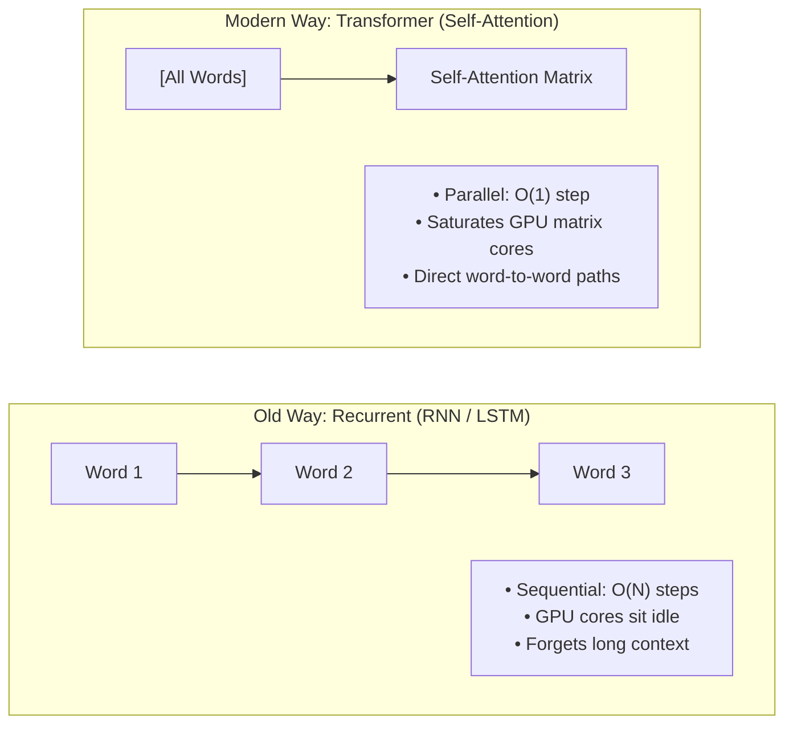

# Transformer Architecture: Direct-to-the-Point Master Blueprint

> **Direct • High-Signal • Zero Fluff • From Core Math to Frontier LLMs (GPT-4o, Llama 3, Claude 3.5, DeepSeek)**
>
> A precision architecture guide engineered for fast learning and interview mastery. Every concept is structured in a uniform 4-part micro-card:
> **1. What is it?** &nbsp;|&nbsp; **2. Why does it exist?** &nbsp;|&nbsp; **3. How it works (Step-by-Step)** &nbsp;|&nbsp; **4. Direct Interview Pitch**

---

## 🧭 Companion Guides in this Repository
- [EXPERIENCE_AND_BACKGROUND.md](EXPERIENCE_AND_BACKGROUND.md) — 🎙️ Rahul's Career Speaking Guide (WPP, Cognizant, Flagship Projects & Leadership)
- [ML_CORE_CONCEPTS.md](ML_CORE_CONCEPTS.md) — 🧠 Machine Learning Core Concepts, Math & Visuals (Bias-Variance, SVM, Trees, PCA)
- [FASTAPI_MASTER_GUIDE.md](FASTAPI_MASTER_GUIDE.md) — ⚡ FastAPI Serving Architecture, Async Lifecycles & Production Patterns
- [README_V2.md](README_V2.md) — ☁️ 8-Level Enterprise GenAI & Azure Architecture Master Guide
- [interview_questions.md](interview_questions.md) — Master Question Bank of 117 Principal & Lead Recruiter Inquiries
- [interview_explanations.md](interview_explanations.md) — Comprehensive Explanations & Deep-Dive Architecture Answers

---

# 1. The 30-Second Core Idea



* **The Core Job:** Modern LLMs play a single game: **Autoregressive Next-Token Prediction**. Given tokens $[x_1, x_2, \dots, x_t]$, compute probability distribution $P(x_{t+1} \mid x_1, \dots, x_t)$ over the vocabulary.
* **Why Transformers Won:** RNNs process text sequentially ($O(N)$ steps), leaving modern GPUs idle and forgetting past words. Transformers process **all tokens in parallel** via matrix multiplication, providing direct **$O(1)$ path lengths** between any two tokens regardless of distance.

---

# 2. End-to-End Pipeline: From Text to Next Word

Here is the exact dataflow tracing the prompt **"The cat sat on the"** to predict **"mat"**:

```text
RAW TEXT: "The cat sat on the"
  │
  ▼ [1. TOKENIZER (Byte-Pair Encoding)]
    Tokens:   ["The", " cat", " sat", " on", " the"]
    Token IDs: [ 464,   3797,   3372,   319,    262 ]   ──► Shape: [Batch=1, Seq_Len=5]
  │
  ▼ [2. EMBEDDING MATRIX (Lookup)]
    Token IDs ──► Dense Vectors in R^(d_model) (e.g., d_model = 4,096)
  │
  ▼ [3. POSITIONAL ENCODING (RoPE)]
    Inject position information (positions 0, 1, 2, 3, 4) into Query & Key vectors
  │
  ▼ [4. STACK OF N TRANSFORMER DECODER BLOCKS (e.g., 32 layers in Llama-3-8B)]
    ┌────────────────────────────────────────────────────────┐
    │  For each layer l = 1 .. N:                            │
    │    1. Input x                                          │
    │    2. RMSNorm(x)                                       │
    │    3. Causal Multi-Head Self-Attention (Q, K, V)       │
    │    4. Residual Add:  x = x + Attention(RMSNorm(x))     │
    │    5. RMSNorm(x)                                       │
    │    6. Feed-Forward Network (SwiGLU FFN)                │
    │    7. Residual Add:  x = x + FFN(RMSNorm(x))           │
    └────────────────────────────────────────────────────────┘
  │
  ▼ [5. FINAL RMSNORM]
    Normalize output vector of the final token (position 4)
  │
  ▼ [6. UN-EMBEDDING LINEAR HEAD (Output Projection)]
    Project vector (d_model = 4,096) ──► Vocabulary Logits (V = 128,256)
  │
  ▼ [7. SOFTMAX (+ TEMPERATURE)]
    Convert logits into probabilities:
    P("mat")   = 78.4%  <── TOP CANDIDATE
    P("rug")   = 12.1%
    P("floor") =  6.2%
  │
  ▼ [8. AUTOREGRESSIVE EMISSION]
    Emit "mat", append to prompt, repeat for next token!
```

---

# 3. Deep-Dive Micro-Cards: The 6 Core Modules

---

### Module 1: Tokenization & Embedding

```text
String: "learning"  ──[ BPE Tokenizer ]──►  Token ID: 4621  ──[ W_embed Lookup ]──►  Vector: [0.12, -0.85, ... 4,096 dims]
```

* 📌 **What it is:** The input layer that converts raw text into numerical vector matrices.
  - **Tokenizer (BPE):** Splits text into subword chunks based on frequency (e.g., `"unbelievable"` $\to$ `["un", "believ", "able"]`).
  - **Embedding Matrix ($W_e$):** A lookup table of shape $[V \times d_{\text{model}}]$ (e.g., $128,256 \times 4,096$). Token ID $i$ retrieves row $i$.
* 🎯 **Why it exists:** Neural networks cannot do matrix math on text strings; they require continuous, high-dimensional floating-point vectors.
* ⚙️ **How it works:**
  1. Subwords map to integer IDs: $0 \le \text{ID} < V$.
  2. Lookup retrieves embedding vector: $\mathbf{x} = W_e[\text{ID}] \in \mathbb{R}^{d_{\text{model}}}$.
  3. Vectors position similar words close to each other in vector space (e.g., cosine similarity of `"king"` and `"queen"` is high).
* 🎙️ **Direct Interview Pitch:** *"Tokenization splits text into subword units using Byte-Pair Encoding to handle rare words with a compact vocabulary, and the embedding matrix maps each token ID to a dense vector in $\mathbb{R}^{d_{\text{model}}}$ that encodes initial semantic meaning."*

---

### Module 2: Positional Encoding (RoPE - Rotary Position Embedding)

```text
Standard Embedding: Order-Blind!  ("Dog bites man" looks identical to "Man bites dog")
RoPE: Rotate 2D pairs of vector coordinates by angle (position * theta):
[ x1_rot ]   [ cos(m * theta)   -sin(m * theta) ] [ x1 ]
[ x2_rot ] = [ sin(m * theta)    cos(m * theta) ] [ x2 ]
```

* 📌 **What it is:** A mathematical operation that injects word order into the Transformer by **rotating vector dimensions by angles proportional to their token position**.
* 🎯 **Why it exists:** Self-Attention is **permutation-invariant** (order-blind). Without positional information, `"dog bites man"` and `"man bites dog"` produce identical outputs.
* ⚙️ **How it works:**
  1. Vector dimensions are grouped into 2D pairs: $(x_1, x_2), (x_3, x_4), \dots$.
  2. For token at position $m$, each pair is rotated by angle $m\theta_i$:
     $$R_{\Theta, m} = \begin{pmatrix} \cos(m\theta) & -\sin(m\theta) \\ \sin(m\theta) & \cos(m\theta) \end{pmatrix}$$
  3. **The Core Mathematical Property:** The dot product between Query at position $m$ and Key at position $n$ depends **strictly on their relative distance $(m - n)$**:
     $$\langle R_{\Theta, m} q, \; R_{\Theta, n} k \rangle = g(q, k, m - n)$$
  4. This allows modern LLMs to extrapolate cleanly to 128k+ token context windows.
* 🎙️ **Direct Interview Pitch:** *"RoPE encodes positional order by rotating Query and Key vector pairs in 2D planes by position-proportional angles. This ensures the attention dot product depends strictly on the relative distance $(m - n)$ between tokens, outperforming static additive encodings on long context lengths."*

---

### Module 3: Scaled Dot-Product Attention (The Core Engine)

<p align="center">
  
</p>

```text
Attention Formula:
Attention(Q, K, V) = Softmax( (Q * K^T) / sqrt(d_k) + Mask ) * V
```

$$
\text{Attention}(Q, K, V) = \text{Softmax}\left( \frac{Q K^T}{\sqrt{d_k}} + M \right) V
$$

* 📌 **What it is:** The mechanism by which every token computes an affinity score with every other token and aggregates a context-weighted representation.
* 🎯 **Why it exists:** Enables tokens to dynamically update their representations based on context (e.g., resolving whether *"it"* refers to the *"animal"* or the *"street"*).
* ⚙️ **How it works (The 4 Exact Steps):**
  1. **Linear Projections:** Input $X \in \mathbb{R}^{S \times d}$ is multiplied by projection weights to produce Queries, Keys, and Values:
     $$Q = X W_Q, \quad K = X W_K, \quad V = X W_V \quad (\text{each in } \mathbb{R}^{S \times d_k})$$
     - **Query ($Q$):** What the current token is looking for.
     - **Key ($K$):** What each token contains (its label/index).
     - **Value ($V$):** The actual semantic information to retrieve.
  2. **Raw Similarity Score ($Q K^T$):** Multiply Queries by transposed Keys to get an $[S \times S]$ matrix of dot products measuring token-to-token compatibility.
  3. **Scale Factor ($1 / \sqrt{d_k}$):** Divide scores by $\sqrt{d_k}$ (e.g., $\sqrt{64} = 8$).
     - *Why:* At high dimensions, dot products grow large in magnitude, pushing Softmax into saturated regions where gradients vanish to zero. Scaling preserves variance $= 1.0$.
  4. **Causal Mask ($M$):** Add $-\infty$ to upper-triangular positions so token $t$ cannot look ahead at future tokens $t+1 \dots S$.
  5. **Softmax & Weighted Sum:**
     $$\text{Weights} = \text{Softmax}\left( \frac{Q K^T}{\sqrt{d_k}} + M \right) \in [S \times S]$$
     Multiply weights by Values $V$ to produce the final output matrix $Z \in \mathbb{R}^{S \times d_k}$.
* 🎙️ **Direct Interview Pitch:** *"Scaled dot-product attention projects inputs into Query, Key, and Value matrices. It calculates token affinities via $Q K^T$, scales by $1/\sqrt{d_k}$ to prevent gradient vanishing in Softmax, applies a causal mask to prevent future-peeking, and multiplies the resulting probabilities by $V$ to produce context-aware representations."*

---

### Module 4: Multi-Head & Grouped-Query Attention (MHA vs. GQA)

<p align="center">
  
</p>

* 📌 **What it is:** Running multiple attention mechanisms in parallel over split subspace projections.
* 🎯 **Why it exists:** A single attention head averages all relationships together. Multi-Head Attention allows different heads to simultaneously focus on syntax, grammar, factual references, and entity tracking.
* ⚙️ **How it works:**
  1. The model dimension $d_{\text{model}}$ (e.g., 4,096) is split across $h$ heads (e.g., $h=32$, so $d_k = 4,096 / 32 = 128$).
  2. Each head computes attention independently: $\text{head}_i = \text{Attention}(Q_i, K_i, V_i)$.
  3. All 32 head outputs are concatenated and multiplied by an output projection matrix $W_O$:
     $$\text{MHA}(Q, K, V) = \text{Concat}(\text{head}_1, \dots, \text{head}_h) W_O$$

#### Multi-Head Attention (MHA) vs. Grouped-Query Attention (GQA):

| Metric | Multi-Head Attention (MHA) | Grouped-Query Attention (GQA) | Multi-Query Attention (MQA) |
| :--- | :--- | :--- | :--- |
| **Q : K : V Ratio** | $1 : 1 : 1$ (Each Q head has its own K, V) | $8 : 1 : 1$ (8 Q heads share 1 K, V) | $h : 1 : 1$ (All Q heads share 1 K, V) |
| **KV-Cache Size** | **100% (Baseline - Huge)** | **12.5% (87.5% memory reduction)** | **~3% (Max memory reduction)** |
| **Model Quality** | 100% Baseline | **99.8% (Matches MHA quality)** | Minor degradation on complex tasks |
| **Industry Adoption** | Original 2017 paper, GPT-3 | **Llama 3, Mistral, DeepSeek-V3** | Falcon, StarCoder |

* 🎙️ **Direct Interview Pitch:** *"While standard Multi-Head Attention assigns a unique Key and Value head to every Query head, Grouped-Query Attention groups multiple Query heads to share a single Key/Value head. In Llama 3, this slashes KV-cache VRAM consumption by up to 87.5% with virtually zero loss in quality."*

---

### Module 5: Inside the Transformer Block (Add & Norm + FFN)

<p align="center">
  
</p>

A modern decoder layer combines **Attention (communication)** with a **Feed-Forward Network (computation & memory)** wrapped in **Residual Connections** and **RMSNorm**:

#### 1. Residual Skip Connections ($x + \text{Sublayer}(x)$)
* **What:** Adds the input of a layer directly to its output.
* **Why:** In deep networks (32 to 80+ layers), signals attenuate. Skip connections create an **unimpeded gradient highway** from the final loss directly back to initial embeddings, preventing vanishing gradients.

#### 2. Pre-LN vs. RMSNorm (Modern Stabilization)
* **Post-LN (Original 2017):** $x = \text{LayerNorm}(x + \text{Sublayer}(x))$. Normalization happens *after* residual addition, causing gradients to explode/vanish in 100B+ models.
* **Pre-LN (Modern):** $x = x + \text{Sublayer}(\text{Norm}(x))$. Normalization happens *before* the sublayer, keeping the residual highway clean.
* **RMSNorm:** Replaces LayerNorm by removing the mean-centering step:
  $$\text{RMSNorm}(x) = \frac{x}{\sqrt{\frac{1}{d}\sum_{i=1}^d x_i^2 + \epsilon}} \odot \gamma$$
  Eliminates two GPU memory reduction passes, running **~20% faster** with identical stability.

#### 3. The Feed-Forward Network (SwiGLU FFN)
* **What:** A 2-layer neural network applied to each token independently.
* **Why:** Attention *moves* information between tokens; the FFN *stores and computes* factual knowledge.
* **Modern Standard (SwiGLU):** Replaces standard ReLU/GELU with a gated linear unit:
  $$\text{SwiGLU}(x) = \Big( \text{Swish}(x W_{\text{gate}}) \odot (x W_{\text{up}}) \Big) W_{\text{down}}$$
  Provides multiplicative gating that significantly improves parameter efficiency.

* 🎙️ **Direct Interview Pitch:** *"A modern transformer block uses Pre-LN with RMSNorm for training stability, self-attention for inter-token communication, and a SwiGLU Feed-Forward Network for factual knowledge retrieval, all wrapped in residual skip connections that prevent gradient vanishing across deep layers."*

---

### Module 6: Autoregressive Inference & The KV-Cache

<p align="center">
  
</p>

* 📌 **What it is:** A GPU memory buffer that caches the Key and Value projection tensors of previous tokens during autoregressive text generation.
* 🎯 **Why it exists:** Without KV-cache, generating token 500 requires recomputing Keys and Values for tokens $1 \dots 499$ from scratch. Per-token generation latency scales as $O(N^2)$ (quadratic slowdown).
* ⚙️ **How it works:**
  1. **Prefill Phase (Prompt Evaluation):** The model processes all prompt tokens in parallel ($GEMM$, compute-bound) and stores their Key and Value tensors in GPU VRAM.
  2. **Decode Phase (Token-by-Token Generation):** For each newly generated token:
     - Compute its $Q_{\text{new}}, K_{\text{new}}, V_{\text{new}}$.
     - Append $K_{\text{new}}$ and $V_{\text{new}}$ to the existing cache:
       $$K_{\text{all}} = [K_{\text{cache}} \,;\, K_{\text{new}}], \quad V_{\text{all}} = [V_{\text{cache}} \,;\, V_{\text{new}}]$$
     - Multiply $Q_{\text{new}}$ against $K_{\text{all}}$ and $V_{\text{all}}$.
  3. **Complexity Reduction:** Transforms generation from quadratic **$O(N^2)$** to constant **$O(1)$** compute per step.
  4. **The Tradeoff:** Turns generation into a **memory-bandwidth-bound ($GEMV$)** workload and consumes significant GPU VRAM:
     $$\text{KV Cache Size (Bytes)} = 2 \times 2 \times n_{\text{layers}} \times n_{\text{KV\_heads}} \times d_{\text{head}} \times \text{seq\_len} \times \text{batch\_size}$$
* 🎙️ **Direct Interview Pitch:** *"During autoregressive decode, recomputing attention for past tokens causes quadratic latency. The KV-Cache stores previous Key and Value tensors in GPU memory so each new token only requires computing its own Query against the cached KV tensors, reducing per-token complexity from $O(N^2)$ to $O(1)$."*

---

# 4. Master Architectural Comparison Tables

### Table 1: The 3 Transformer Archetypes

| Archetype | Attention Type | Landmark Models | Primary Use Case | Why It Did / Didn't Win Frontier LLMs |
| :--- | :--- | :--- | :--- | :--- |
| **Encoder-Only** | Bidirectional (Looks left & right) | BERT, RoBERTa, DeBERTa | Classification, NER, Embeddings, NLI | Cannot generate text efficiently; strictly an understanding model. |
| **Encoder-Decoder** | Bidirectional Enc + Causal Dec | Original 2017 Transformer, T5 | Language Translation, Text-to-Text | Redundant for general tasks; asymmetric KV-cache complicates distributed serving. |
| **Decoder-Only** | Causal (Looks only at past tokens) | **GPT-4o, Llama 3, Claude, DeepSeek** | **General Frontier Intelligence, Chat, Code** | **THE UNCONTESTED WINNER:** Unifies all NLP tasks as next-token prediction with the most predictable compute-scaling laws. |

---

### Table 2: Original 2017 Transformer vs. Modern Frontier LLM (Llama 3)

| Component | Original 2017 Transformer | Modern Frontier LLM (Llama-3-70B) | Engineering Rationale |
| :--- | :--- | :--- | :--- |
| **Macro Architecture** | Encoder-Decoder | **Decoder-Only** | Unifies all tasks as next-token completion; simpler serving. |
| **Positional Encoding** | Absolute Sinusoidal | **Rotary Position Embedding (RoPE)** | Preserves relative token distance $(m-n)$; enables 128k context. |
| **Normalization** | Post-LayerNorm | **Pre-RMSNorm** | Prevents gradient explosion; removes mean-centering for 20% speedup. |
| **Attention Topology** | Multi-Head Attention (MHA) | **Grouped-Query Attention (GQA)** | Slashes KV-cache VRAM by 87.5% via 8:1 Query-to-KV head sharing. |
| **FFN Activation** | ReLU ($x \cdot \max(0, x)$) | **SwiGLU** | Multiplicative gating boosts representational capacity per parameter. |
| **Attention Kernel** | Standard PyTorch Matmul | **FlashAttention-2 / FlashAttention-3** | Tiling in on-chip GPU SRAM eliminates $O(S^2)$ memory reads/writes. |

---

# 5. Top 8 Rapid-Fire Interview Questions & Direct Answers

| # | Interview Question | Direct 2-Sentence Verbatim Answer |
| :---: | :--- | :--- |
| **Q1** | **What is Self-Attention in one sentence?** | *"Self-Attention is a mechanism that allows every token in a sequence to dynamically compute compatibility scores with all other tokens, updating its own vector representation with weighted context from the entire sequence."* |
| **Q2** | **What are Queries, Keys, and Values?** | *"Queries represent what a token is searching for, Keys represent what each token contains to be matched against, and Values represent the actual semantic content that gets retrieved and weighted into the output vector."* |
| **Q3** | **Why do we scale by $\frac{1}{\sqrt{d_k}}$ in attention?** | *"At high dimensions, vector dot products grow large in magnitude, pushing the Softmax function into saturated regions with near-zero gradients; dividing by $\sqrt{d_k}$ stabilizes the variance to $1.0$ and prevents gradient vanishing."* |
| **Q4** | **Why did Decoder-Only win over Encoder-Decoder for frontier LLMs?** | *"Decoder-only models exhibit the cleanest empirical scaling laws, eliminate the architectural overhead of cross-attention and asymmetric KV-caches, and naturally subsume all NLP tasks simply as autoregressive sequence completion."* |
| **Q5** | **What is Causal Masking and where is it applied?** | *"Causal masking sets upper-triangular attention scores to $-\infty$ before Softmax, ensuring that during autoregressive training and inference, tokens can only attend to past and current positions, preventing them from peeking into future tokens."* |
| **Q6** | **What is RoPE and why is it superior to learned positional embeddings?** | *"Rotary Position Embedding rotates Query and Key vector pairs in 2D planes by position-proportional angles, making token dot products a direct function of relative distance $(m-n)$, which generalizes seamlessly to long context windows."* |
| **Q7** | **What is the KV-Cache and what bottleneck does it solve?** | *"The KV-Cache saves previously computed Key and Value tensors in GPU VRAM during autoregressive generation, eliminating redundant recalculation of past tokens and reducing per-token decode complexity from $O(N^2)$ to $O(1)$."* |
| **Q8** | **How does Grouped-Query Attention (GQA) reduce memory?** | *"GQA groups multiple Query heads to share a single Key and Value head (e.g., 8:1 ratio in Llama-3), cutting KV-cache VRAM consumption by up to 87.5% while retaining 99.8% of full Multi-Head Attention quality."* |

---

## 🎯 3 Golden Takeaways for Your Technical Interview
1. **The Core Mechanism:** Transformers process sequences in parallel on GPUs, using **Scaled Dot-Product Attention** to provide constant **$O(1)$ direct paths** between any two tokens.
2. **The Modern Recipe:** Modern frontier LLMs (Llama 3, Claude, GPT-4) use: **Decoder-Only + Pre-RMSNorm + RoPE + Grouped-Query Attention (GQA) + SwiGLU**.
3. **The Inference Reality:** Training is compute-bound ($GEMM$), but autoregressive inference is memory-bandwidth-bound ($GEMV$), making **KV-Caching, GQA, and FlashAttention** mandatory for production serving.
