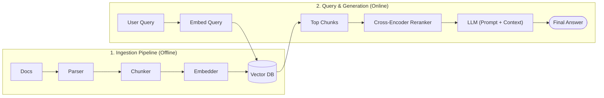
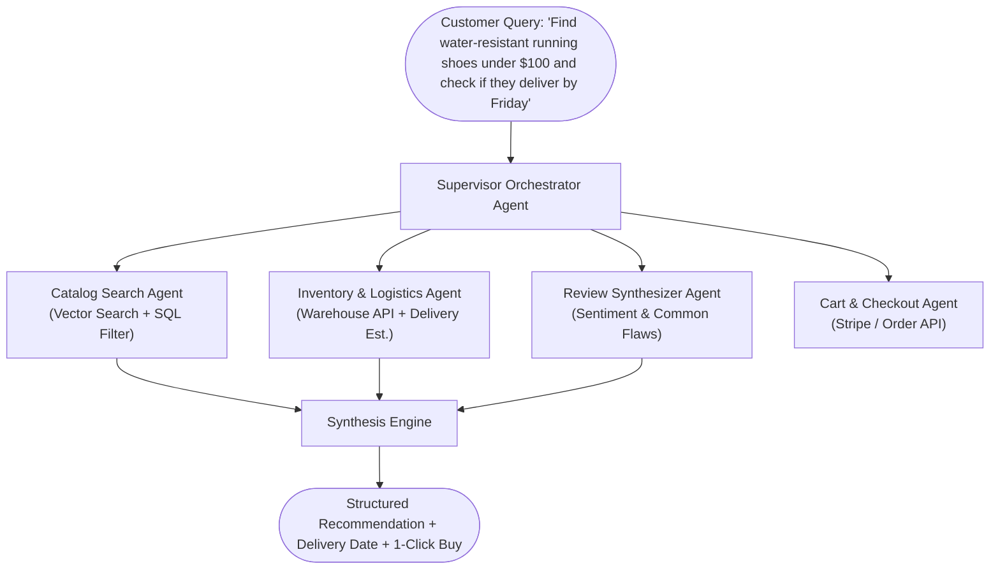
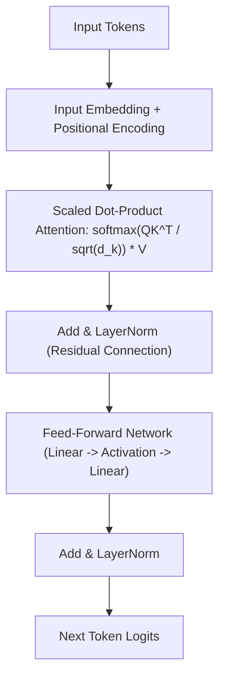
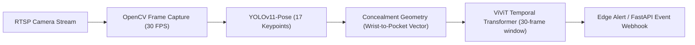
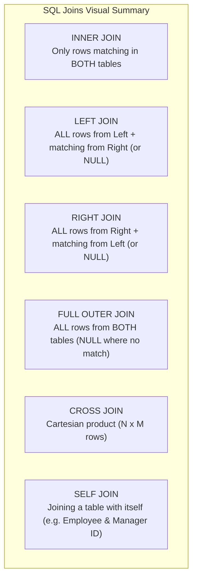

# Technical Interview Study & Revision Guide

> **117 Core Technical Questions Answered**
> Designed for quick revision, interview clarity, and conceptual depth. Every answer is structured with **Core Answer**, **Jargon Buster**, and **Diagrams** where relevant.

---

## Table of Contents
1. [Gen AI & Agentic AI (Q1 - Q30)](#1-gen-ai--agentic-ai)
2. [Deep Learning & Computer Vision (Q1 - Q22)](#2-deep-learning--computer-vision)
3. [Machine Learning (Q1 - Q6)](#3-machine-learning)
4. [Python, Data Structures & Libraries (Q1 - Q34)](#4-python-data-structures--libraries)
5. [FastAPI & REST APIs (Q1 - Q13)](#5-fastapi--rest-apis)
6. [SQL & Database Management (Q1 - Q11)](#6-sql--database-management)

---

# 1. Gen AI & Agentic AI

### Q1: Which orchestrator tool have you used?
* **Core Answer:** I have primarily used **LangGraph** for multi-agent state machines and cyclic workflows, and **LangChain** for sequential chains. In production, I deploy agent state graphs on Azure Container Apps / FastAPI.
* **Jargon Buster (Orchestrator):** A coordination framework that controls the control flow, memory, tool routing, and state transitions between the LLM and external tools.
* **Why LangGraph over standard LangChain?** LangChain is linear (DAG). Real-world agents require **cycles** (loops: try tool -> observe error -> retry). LangGraph supports cyclic graphs, persistence, and human-in-the-loop checkpoints natively.

---

### Q2: Explain the RAG (Retrieval-Augmented Generation) pipeline.
* **Core Answer:** RAG connects an LLM to external private data without retraining. It has two pipelines:



* **The 4 Core Steps:**
  1. **Ingest & Parse:** Extract text and tables from PDFs/SharePoint.
  2. **Chunk & Embed:** Break text into 300-token chunks; convert each into a vector.
  3. **Retrieve & Rerank:** Hybrid search (Dense + BM25) pulls top 50 chunks; Cross-Encoder prunes to top 5.
  4. **Generate:** Prompt LLM with context: *"Answer using ONLY the provided text."*

---

### Q3: How will you manage latency after deploying the model?
* **Core Answer:** By applying a **4-layer latency reduction strategy**:
  1. **Streaming (SSE):** Stream tokens to user using Server-Sent Events; drops perceived Time-To-First-Token (TTFT) to <400ms.
  2. **Multi-Tier Caching:** Exact hash cache (Redis ~2ms) + Semantic vector cache (Redis ~35ms) to absorb 40% of repetitive queries.
  3. **Model Right-Sizing:** Route simple queries to fine-tuned 8B models (Mistral/Llama-3, ~300ms) and reserve GPT-4o for complex multi-hop queries.
  4. **Dedicated Capacity (PTU):** Use Azure OpenAI Provisioned Throughput Units to eliminate multi-tenant queuing and 429 throttling.

---

### Q4: What are agents vs. agentic AI?
* **Core Answer:**
  - **AI Agent:** A specific software component consisting of an LLM brain, internal memory, and tool-calling capabilities that runs in a loop until a task is done.
  - **Agentic AI:** The broader architectural design pattern where autonomous loops, multi-agent collaboration, reflection, and self-correction replace hardcoded if-else business logic.
* **Summary:** An agent is the *actor*; Agentic AI is the *architectural philosophy*.

---

### Q5: Suppose you're building an agentic e-commerce system like Amazon: what would be the pipeline, and which agents will you integrate?
* **Core Answer:** A **Supervisor-Worker Multi-Agent Architecture**:



---

### Q6: How will you determine if an LLM is hallucinating or if the content retrieved is the best?
* **Core Answer:**
  1. **To check retrieval quality:** Measure **Context Relevance** (do chunks match the query semantics?) using MRR (Mean Reciprocal Rank) and Hit Rate.
  2. **To check hallucinations (Faithfulness):** Use a lightweight **Natural Language Inference (NLI) model** (e.g., DeBERTa). If generated sentences are classified as `Contradiction` or `Neutral` against the retrieved source chunk, flag as hallucinated.
  3. **Deterministic Citation Verification:** Regex extract citations and verify that the cited text actually exists as an exact substring in the retrieved document chunk.

---

### Q7: Where will you store embeddings for caching?
* **Core Answer:** In **Azure Cache for Redis Enterprise** (using RediSearch vector similarity module) or an in-memory **FAISS** index.
* **How it works:** When a user queries, generate query vector $\vec{q}$. If cosine similarity with an existing cached query vector $\ge 0.95$, return the cached response in ~35ms without hitting the vector database or LLM.

---

### Q8: What are AI tools?
* **Core Answer:** Predefined functions (APIs, databases, Python scripts, calculators) defined with a JSON Schema that an LLM can choose to call when it needs external data or actions.
* **Under the hood:** The LLM does not execute the tool directly. The LLM outputs a structured JSON: `{"name": "get_stock_price", "arguments": {"ticker": "MSFT"}}`. The application runs the code and feeds the output back to the LLM.

---

### Q9: What is MCP (Model Context Protocol)?
* **Core Answer:** An open-standard protocol created by Anthropic that standardizes how LLMs connect to external data sources, developer tools, and local environments.
* **Why it matters:** Before MCP, every developer wrote custom API integrations for GitHub, Postgres, Slack, etc. MCP provides a unified client-server architecture: any MCP-compliant model can plug into any MCP-compliant tool server out-of-the-box.

---

### Q10: What are different prompt engineering techniques?
* **Core Answer:**
  1. **Zero-Shot:** Ask model directly without examples (*"Classify sentiment: 'Great product'"*).
  2. **Few-Shot:** Provide 2–3 input/output demonstration pairs before the task.
  3. **Chain-of-Thought (CoT):** Force the model to think step-by-step (*"Let's think step by step"*).
  4. **ReAct (Reason + Act):** Interleave reasoning with tool execution (`Thought -> Action -> Observation -> Thought`).
  5. **Tree of Thoughts (ToT):** Explore multiple reasoning branches and backtrack if a branch fails.
  6. **System Grounding / Negative Prompting:** Explicit constraints (*"Do NOT use external knowledge. If unknown, say 'I don't know'"*).

---

### Q11: What is the range and effect of the temperature parameter?
* **Core Answer:**
  - **Range:** Typically `0.0` to `2.0` (practically `0.0` to `1.0`).
  - **Formula:** Modifies logits before softmax: $P(w_i) = \frac{e^{z_i / T}}{\sum e^{z_j / T}}$.
  - **Temperature = 0.0 (Argmax):** Deterministic. Always picks the highest-probability token. Essential for coding, math, RAG, and structured JSON output.
  - **Temperature = 0.7 - 1.0:** Flattens probability distribution. Allows less probable tokens to be picked. Used for creative writing and brainstorming.

---

### Q12: What are the different types of fine-tuning (e.g., Full, LoRA, QLoRA, PEFT)?
* **Core Answer:**
  - **Full Fine-Tuning:** Updates all 100% of model weights. Very expensive, requires massive VRAM, risks catastrophic forgetting.
  - **PEFT (Parameter-Efficient Fine-Tuning):** Umbrella term for techniques that freeze the base model and only train a small percentage (<1%) of parameters.
  - **LoRA (Low-Rank Adaptation):** Freezes base weights $W$. Injects two tiny trainable low-rank matrices $A$ and $B$ ($\Delta W = B \times A$). Cuts trainable parameters by 99%.
  - **QLoRA:** Quantizes the frozen base model to **4-bit NormalFloat (NF4)** before attaching LoRA adapters. Enables fine-tuning a 70B model on a single consumer GPU.

---

### Q13: What types of evaluation metrics are used in RAG / Agentic AI?
* **Core Answer (The RAG Triad via Ragas):**
  1. **Faithfulness / Groundedness:** Can every claim in the answer be traced back to the retrieved context? (Prevents hallucinations).
  2. **Answer Relevance:** Does the answer directly address the user's prompt without rambling?
  3. **Context Precision:** Are the top-ranked retrieved chunks actually relevant? (Checks reranker quality).
  4. **Context Recall:** Did retrieval pull all facts required to answer the question?

---

### Q14: Explain precision and recall in the context of RAG.
* **Core Answer:**
  - **RAG Precision (Quality):** $\frac{\text{Relevant Chunks Retrieved}}{\text{Total Chunks Retrieved}}$. High precision means minimal noise and distraction for the LLM.
  - **RAG Recall (Completeness):** $\frac{\text{Relevant Chunks Retrieved}}{\text{Total Relevant Chunks Existing in Knowledge Base}}$. High recall means the search engine didn't miss critical facts.

---

### Q15: Which multimodal models are currently available in the market?
* **Core Answer:**
  - **Proprietary:** GPT-4o / GPT-4o-mini (OpenAI), Claude 3.5 Sonnet (Anthropic), Gemini 1.5 Pro / Flash (Google).
  - **Open-Source:** Llama-3.2-Vision (Meta), Qwen2-VL (Alibaba), Pixtral 12B (Mistral), InternVL 2.5.

---

### Q16: What are the key fine-tuning hyperparameters?
* **Core Answer:**
  1. **Learning Rate:** Typically $1 \times 10^{-4}$ to $3 \times 10^{-4}$ for LoRA (higher than full fine-tuning).
  2. **LoRA Rank ($r$):** The dimension of adapter matrices (typically 8, 16, or 32).
  3. **LoRA Alpha ($\alpha$):** Scaling factor for adapter updates (conventionally set to $2 \times r$).
  4. **Batch Size & Gradient Accumulation:** Balances GPU memory vs. stable gradient steps.
  5. **Epochs:** Typically 1 to 3 epochs. Training longer causes severe overfitting and loss of general reasoning.
  6. **Warmup Ratio:** ~0.03 (gradually ramps up learning rate for the first 3% of steps).

---

### Q17: What is the architecture of LLaMA?
* **Core Answer:** LLaMA is an auto-regressive **decoder-only transformer**. Key architectural improvements over standard GPT:
  1. **Pre-normalization with RMSNorm:** Normalizes inputs using root-mean-square (faster and more numerically stable than LayerNorm).
  2. **SwiGLU Activation:** Replaces standard ReLU/GELU in feed-forward layers for better gradient flow.
  3. **RoPE (Rotary Position Embeddings):** Encodes relative token positions directly into query/key attention vectors instead of adding static absolute positional vectors.
  4. **Grouped-Query Attention (GQA):** Multiple query heads share a single key-value head, drastically shrinking KV-cache memory during inference.

---

### Q18: Which vector database have you used and why?
* **Core Answer:** I have used **Azure AI Search** for enterprise systems and **pgvector (PostgreSQL)** for transactional applications.
  - **Why Azure AI Search?** Native enterprise-grade hybrid search (combining dense vectors + BM25 keyword matching), integrated cross-encoder semantic reranker, and native Microsoft Entra ID Access Control List (ACL) security filtering.
  - **Why pgvector?** Keeps vectors and transactional relational data in the same ACID-compliant database without introducing extra cloud vendor dependencies.

---

### Q19: What is vector search, semantic search, cosine search, and similarity search?
* **Core Answer:**
  - **Similarity Search:** The broad mathematical concept of finding items closest to a query based on a distance metric.
  - **Vector Search:** The algorithmic implementation of similarity search on high-dimensional embeddings using algorithms like HNSW or Flat L2.
  - **Semantic Search:** A goal-oriented search based on *conceptual meaning* rather than exact keyword matches (e.g., "automobile" matches "car").
  - **Cosine Search:** A specific angular distance formula: $\cos(\theta) = \frac{A \cdot B}{\|A\| \|B\|}$ (ranges from -1.0 to 1.0; measures direction, ignoring vector magnitude).

---

### Q20: Explain different types of vector databases.
* **Core Answer:**
  1. **Dedicated Pure-Play Vector DBs:** Pinecone, Qdrant, Milvus, Weaviate. Built from the ground up for high-scale billions of vectors; blazing fast HNSW indexing.
  2. **Hybrid Search Engines:** Azure AI Search, Elasticsearch, OpenSearch. Combines BM25 inverted keyword indexes with vector indexes.
  3. **Relational / NoSQL Vector Extensions:** PostgreSQL (`pgvector`), Redis, MongoDB Atlas, SingleStore. Vector search integrated into existing operational databases.

---

### Q21: What is the difference between RAG and fine-tuning? When would you choose one over the other?
* **Core Answer:**
  - **RAG adds new knowledge:** Like an open-book exam. Best for dynamic, rapidly changing facts, private company data, and verifiable source citations.
  - **Fine-tuning alters behavior/style:** Like specialized training. Best for domain jargon, consistent response structure/tone, and reducing cost/latency by training smaller models.
  - **Rule of Thumb:** Use RAG for facts; use fine-tuning for style, tone, and efficiency.

---

### Q22: Why do LLMs hallucinate?
* **Core Answer:** Because LLMs are probabilistic next-token predictors, not knowledge retrieval engines. They predict sequences that *statistically look grammatically and syntactically correct*, even if factually false.
* **3 Major Triggers:** (1) Lack of context (retrieval failure), (2) Parametric conflict (pre-training memory overrides prompt), (3) Overconfidence caused by training on human text that rarely contains "I don't know".

---

### Q23: How do you improve chunking and content retrieval?
* **Core Answer:**
  1. **Parent-Child Chunking:** Index small 250-token child vectors for accurate search, but pass the 1,200-token parent document to the LLM for full contextual generation.
  2. **Layout-Aware Parsing:** Use Azure AI Document Intelligence to parse tables as markdown tables so columns and rows aren't scrambled.
  3. **Hybrid Search + RRF:** Combine Dense embeddings + BM25 keyword search using Reciprocal Rank Fusion.
  4. **Cross-Encoder Reranking:** Prune top 50 candidates to top 5 using a deep cross-attention model.

---

### Q24: Explain the architecture of a Transformer (encoder-decoder, self-attention, multi-head attention).
* **Core Answer:**



* **Scaled Dot-Product Attention Formula:**
  $$\text{Attention}(Q, K, V) = \text{softmax}\left(\frac{Q K^T}{\sqrt{d_k}}\right) V$$
  - $Q$ (Query): What am I looking for?
  - $K$ (Key): What content do I hold?
  - $V$ (Value): What is my actual information content?
  - $\sqrt{d_k}$: Scaling factor that prevents gradients from vanishing when vectors are large.
* **Multi-Head Attention:** Splits $Q, K, V$ into $h$ heads (e.g., 8 or 32 heads), allowing the model to simultaneously attend to syntax, semantics, and distant context.

---

### Q25: Explain the architecture of BERT and its practical uses.
* **Core Answer:** BERT (Bidirectional Encoder Representations from Transformers) is an **encoder-only transformer**.
  - **Key Feature:** Bidirectional self-attention (every token attends to both left and right tokens simultaneously).
  - **Pre-training:** Trained on Masked Language Modeling (MLM - guessing blanked-out words) and Next Sentence Prediction (NSP).
  - **Uses:** Text classification, Named Entity Recognition (NER), sentence similarity, and Cross-Encoder rerankers in RAG pipelines.

---

### Q26: Explain your Gen AI / Agentic AI project in detail.
* **Core Answer (From your resume):**
  - **Threadmark (AI Insurance Command Center):** Architected a multi-agent system (6 specialist agents) where financial eligibility and computations are deterministic code tools and citations are verified in code before display. Implemented a 5-layer retrieval pipeline (Dense vectors + BM25 hybrid with Reciprocal Rank Fusion + Cross-Encoder reranking) achieving **94.2% refusal accuracy** on an 86-case golden evaluation benchmark.
  - **Numera (Air-Gapped Tabular Intelligence):** DuckDB in-memory OLAP execution engine with LangGraph and local Ollama inference, reducing token overhead by 99.8% with sub-20ms SQL aggregations on 50,000+ row spreadsheets without data leaving the machine.

---

### Q27: Explain Named Entity Recognition (NER).
* **Core Answer:** An NLP task that locates and categorizes unstructured text tokens into predefined categories such as Person (`PER`), Organization (`ORG`), Location (`LOC`), Date (`DATE`), or Medical Disease (`DISEASE`). Used in data preprocessing to extract metadata filters for RAG.

---

### Q28: Which embedding model did you use and why?
* **Core Answer:** **`text-embedding-3-large`** (OpenAI / Azure).
  - **Why?** High MTEB retrieval benchmark score, strong multilingual performance, and native support for **Matryoshka Representation Learning (MRL)**—allowing us to truncate from 3,072 dimensions to 1,024 dimensions with <1.5% loss in accuracy, reducing vector database RAM costs by 66%.

---

### Q29: Which research paper did you last read about Gen AI / Agentic AI?
* **Core Answer:** **DeepSeek-R1 (2025):** Explored how large language models can develop complex reasoning, chain-of-thought, and self-verification capabilities through pure reinforcement learning using **GRPO (Group Relative Policy Optimization)** without needing human-annotated supervised fine-tuning data.

---

### Q30: Which is the latest RAG technique or framework you have heard of?
* **Core Answer:**
  1. **GraphRAG (Microsoft):** Extracts knowledge graphs (entities + relationships) from documents and builds community summaries, enabling the system to answer broad, global thematic questions that chunk-based RAG misses.
  2. **Corrective RAG (CRAG):** Evaluates retrieved document confidence using a lightweight evaluator model; if confidence is low, falls back to web search dynamically.

---

# 2. Deep Learning & Computer Vision

### Q1: What is a perceptron?
* **Core Answer:** The simplest artificial neuron. Computes a weighted sum of inputs plus a bias, and passes it through an activation function:
  $$y = f\left(\sum_{i=1}^{n} w_i x_i + b\right)$$

---

### Q2: How do you calculate the total number of trainable parameters in a neural network model?
* **Core Answer:**
  - **Dense (Fully Connected) Layer:**
    $$\text{Params} = (\text{Input Size} + 1) \times \text{Output Size}$$
    *(The $+1$ accounts for the bias term).*
  - **Convolutional Layer (Conv2D):**
    $$\text{Params} = [(\text{Kernel Width} \times \text{Kernel Height} \times \text{Input Channels}) + 1] \times \text{Output Channels}$$

---

### Q3: What is an activation function?
* **Core Answer:** A mathematical operation applied to a neuron's output that introduces **non-linearity**. Without it, stacking 100 neural network layers would mathematically collapse into a single linear equation ($y = Wx + b$), incapable of learning complex patterns. Examples: ReLU, Sigmoid, Tanh, GELU.

---

### Q4: What is the difference between max pooling and min pooling?
* **Core Answer:**
  - **Max Pooling:** Takes the maximum value in a window (e.g., $2 \times 2$). Captures the most prominent, active features (edges, textures) and provides spatial translation invariance.
  - **Min Pooling:** Takes the minimum value in a window. Captures dark background pixels (rarely used in vision, occasionally used in negative contrast imaging).

---

### Q5: What is forward propagation and backward propagation?
* **Core Answer:**
  - **Forward Propagation:** Input data travels through the layers to compute predictions $\hat{y}$ and calculate the loss $L(\hat{y}, y)$.
  - **Backward Propagation:** Uses the calculus **chain rule** to propagate the loss gradient backwards through all weights ($\frac{\partial L}{\partial w}$). The optimizer (e.g., Adam) adjusts the weights to minimize error.

---

### Q6: If all weights and biases are initialized to zero in a CNN, will the model learn? Why or why not?
* **Core Answer:** **No, it will not learn properly.**
  - **The Symmetry Problem:** If all weights are zero, every neuron in a hidden layer computes the exact same output ($0$) and receives the exact same gradient during backprop. All weights update identically, preventing the network from learning diverse features. (Biases can be 0, but weights must be randomly initialized using He or Xavier initialization).

---

### Q7: How does an activation function actually introduce non-linearity?
* **Core Answer:** By applying a non-linear mapping (such as bending at zero: $\text{ReLU}(z) = \max(0, z)$). Linear transformations only scale, rotate, and shift space. Non-linear activations warp and fold space, allowing decision boundaries to encircle complex, irregular data clusters.

---

### Q8: What is precision and recall? In cancer detection, which one is more critical and why?
* **Core Answer:**
  - **Precision:** $\frac{TP}{TP + FP}$ (Of all patients we diagnosed with cancer, how many actually had it?).
  - **Recall (Sensitivity):** $\frac{TP}{TP + FN}$ (Of all actual cancer patients, how many did we catch?).
  - **Critical Choice in Cancer:** **RECALL is vastly more critical.**
    - A False Positive means an anxious patient gets a harmless follow-up biopsy.
    - A False Negative means a cancer patient is told they are healthy and dies of untreated cancer. We must minimize False Negatives at all costs.

---

### Q9: If both precision and recall are equally important, which evaluation metric should you use?
* **Core Answer:** **F1-Score** (the harmonic mean of precision and recall):
  $$F_1 = 2 \times \frac{\text{Precision} \times \text{Recall}}{\text{Precision} + \text{Recall}}$$
  - *Why harmonic mean instead of arithmetic average?* Harmonic mean severely penalizes extreme imbalances (e.g., if Precision = 1.0 and Recall = 0.0, average is 0.5, but $F_1 = 0.0$).

---

### Q10: Why use YOLO instead of a standard CNN for object detection? What is the structure of a YOLO model?
* **Core Answer:**
  - **Standard CNN / Two-Stage (Faster R-CNN):** First proposes regions of interest, then classifies each box separately. High accuracy, but slow (~10–15 FPS).
  - **YOLO (You Only Look Once):** A **single-stage detector**. Divides the image into an $S \times S$ grid. In a single forward pass, it predicts bounding boxes $[x, y, w, h]$, objectness confidence, and class probabilities simultaneously. Real-time speed (30–120+ FPS).
  - **YOLO Structure:** Backbone (Feature extractor: CSPDarknet) ──► Neck (Multi-scale feature pyramid: PANet) ──► Head (Anchor-free detection & class prediction).

---

### Q11: Explain the architectural structure of a Convolutional Neural Network (CNN).
* **Core Answer:**
  1. **Convolutional Layer:** Small sliding filters (kernels) compute dot products to detect local spatial patterns (edges, corners, textures).
  2. **Activation (ReLU):** Applies non-linearity.
  3. **Pooling Layer (MaxPooling):** Downsamples spatial resolution ($H \times W$), reducing parameter count and conferring translation invariance.
  4. **Fully Connected (Dense) Head:** Flattens 2D feature maps into a 1D vector to produce final classification probabilities via Softmax.

---

### Q12: Why prefer a CNN over an Artificial Neural Network (ANN) for image processing tasks?
* **Core Answer:**
  1. **Spatial Correlation:** ANNs flatten images into 1D vectors, destroying 2D proximity between pixels. CNNs preserve spatial relationships.
  2. **Parameter Sharing:** A $3 \times 3$ CNN filter uses 9 weights across the entire image. An ANN connecting a $1000 \times 1000 \times 3$ image directly to 100 neurons requires **300 million parameters**, leading to immediate out-of-memory errors and extreme overfitting.
  3. **Translation Invariance:** A CNN recognizes a cat whether it appears in the top-left or bottom-right corner.

---

### Q13: What was the expected accuracy of your YOLO project and how did you iterate/move forward?
* **Core Answer (From RetailGuard AI project):**
  - **Target:** Mean Average Precision ($\text{mAP@0.5}$) $> 0.85$ at $>30\text{ FPS}$ on edge hardware.
  - **Iteration Path:** Started with YOLOv8-pose baseline. Added **anatomical concealment geometry** (dynamic pocket projection anchored to 17 skeletal keypoints). Iterated to **YOLOv11-Pose + Video Vision Transformers (ViViT)** to verify temporal occlusion over a 30-frame sliding window, eliminating false positives caused by customers putting hands in pockets without merchandise.

---

### Q14: If you have to detect multiple objects in an image, which model architecture would you use?
* **Core Answer:** **YOLOv11 / YOLOv8** for real-time edge processing (or **Faster R-CNN with Feature Pyramid Network** if latency is unconstrained and ultra-high resolution is required).

---

### Q15: Which models did you research or benchmark before switching to YOLO?
* **Core Answer:**
  - **Faster R-CNN:** Highly accurate, but capped at ~12 FPS on edge GPUs (failed real-time requirement).
  - **SSD (Single Shot MultiBox Detector):** Fast, but struggled with small object detection and overlapping boundaries.
  - **YOLOv8 / YOLOv11:** Struck the optimal Pareto frontier between speed (>35 FPS) and detection precision ($\text{mAP} \approx 0.88$).

---

### Q16: Which annotation software did you use for labeling images?
* **Core Answer:** **Roboflow** (for automated augmentation and team dataset versioning) and **CVAT (Computer Vision Annotation Tool)** (for bounding box and skeletal keypoint labeling).

---

### Q17: Explain your OCR (Optical Character Recognition) project.
* **Core Answer (From Cognizant / WPP experience):**
  - Built an automated multi-modal ingestion pipeline for creative marketing assets and financial records.
  - Paired **OpenCV preprocessing** (deskewing, adaptive thresholding, morphological noise removal) with **TrOCR (Transformer OCR)** and **Tesseract** to extract unstructured legal disclaimers, brand logos, and table cells from 10,000+ daily asset files.

---

### Q18: What specific problems and challenges did you face in your OCR project?
* **Core Answer:**
  1. **Skewed & Low-Contrast Text:** Solved using OpenCV Radon transform deskewing and CLAHE (Contrast Limited Adaptive Histogram Equalization).
  2. **Scrambled Tables:** Traditional OCR read across columns. Solved by integrating **Azure AI Document Intelligence** to detect bounding boxes and reconstruct tabular markdown directly.

---

### Q19: Explain your YOLO project end-to-end along with its complete pipeline.
* **Core Answer (RetailGuard AI):**



---

### Q20: If you are tasked with building a face detection model to detect faces in a school, explain the step-by-step process and the libraries you would use.
* **Core Answer:**
  1. **Video Ingestion:** Connect to school RTSP CCTV streams using `OpenCV` / `GStreamer`.
  2. **Face Detection:** Use **RetinaFace** or **MTCNN** to locate face bounding boxes and 5 facial landmarks.
  3. **Face Alignment & Embedding:** Align face horizontally; generate 512-dimensional facial embeddings using **InsightFace (ArcFace)** running on ONNX Runtime.
  4. **Vector Matching:** Query an enrolled student database in **Milvus / FAISS** using Cosine Similarity (threshold > 0.65).
  5. **Anti-Spoofing & Privacy:** Apply passive liveness detection to prevent photo spoofing; blur non-registered bystander faces to comply with privacy laws.

---

### Q21: What is a tensor?
* **Core Answer:** A mathematical generalization of matrices to $N$ dimensions.
  - $0\text{D} = \text{Scalar}$ (e.g., `5`)
  - $1\text{D} = \text{Vector}$ (e.g., `[1, 2, 3]`)
  - $2\text{D} = \text{Matrix}$ (e.g., rows & columns)
  - $4\text{D Tensor in Vision} = [\text{Batch Size}, \text{Channels}, \text{Height}, \text{Width}]$

---

### Q22: What are TensorFlow, OpenCV, PyTorch, and Scikit-learn, and what are their respective roles?
* **Core Answer:**
  - **PyTorch:** Industry-standard dynamic deep learning framework for research and production model training.
  - **TensorFlow:** Google's production DL ecosystem, optimized for mobile (TFLite) and enterprise distributed serving.
  - **OpenCV:** High-performance C++/Python computer vision library for image manipulation (filtering, resizing, contours, video streams).
  - **Scikit-learn:** Classical machine learning library for tabular modeling (Random Forests, SVM), feature preprocessing, and evaluation metrics.

---

# 3. Machine Learning

### Q1: What is L1 (Lasso) and L2 (Ridge) regularization? How do they differ in penalty and feature selection?
* **Core Answer:**
  - **L1 Regularization (Lasso):** Adds the sum of *absolute weights* to the loss function: $\lambda \sum |w_i|$. Drives less important feature weights to **strictly zero**, performing **automatic feature selection**.
  - **L2 Regularization (Ridge):** Adds the sum of *squared weights*: $\lambda \sum w_i^2$. Shrinks weights close to zero, but never exactly zero. Prevents multicollinearity and smooths model complexity.

---

### Q2: How do decision trees work?
* **Core Answer:** A non-parametric algorithm that splits data hierarchically based on feature threshold questions (e.g., *Is age > 30?*). At each node, it selects the feature split that maximizes **Information Gain** (minimizing impurity).

---

### Q3: What are the key hyperparameters used in Decision Trees?
* **Core Answer:**
  1. `max_depth`: Limits the depth of the tree (primary weapon against overfitting).
  2. `min_samples_split`: Minimum number of samples required to split an internal node.
  3. `min_samples_leaf`: Minimum samples required to be at a leaf node (smooths predictions).
  4. `criterion`: Impurity metric (`gini` for classification, `entropy` for information gain, `squared_error` for regression).

---

### Q4: Which evaluation metrics are used in Linear Regression vs. Logistic Regression?
* **Core Answer:**
  - **Linear Regression (Continuous values):** Mean Squared Error (MSE), Root Mean Squared Error (RMSE), Mean Absolute Error (MAE), $R^2$ Score (Coefficient of Determination).
  - **Logistic Regression (Classification probabilities):** Accuracy, Precision, Recall, F1-Score, ROC-AUC, Log-Loss (Binary Cross-Entropy).

---

### Q5: What is the sigmoid function? Can softmax be used in binary Logistic Regression?
* **Core Answer:**
  - **Sigmoid:** $\sigma(z) = \frac{1}{1 + e^{-z}}$. Maps any real-valued number into a probability between $0$ and $1$.
  - **Can Softmax be used?** **Yes.** A 2-class Softmax is mathematically identical to a Sigmoid. Softmax computes $P(y=1) = \frac{e^{z_1}}{e^{z_1} + e^{z_2}} = \frac{1}{1 + e^{-(z_1 - z_2)}} = \sigma(z_1 - z_2)$.

---

### Q6: What is the core difference between Linear Regression and Logistic Regression?
* **Core Answer:**
  - **Linear Regression:** Predicts a continuous numerical outcome ($y \in (-\infty, +\infty)$) by fitting a straight line/hyperplane.
  - **Logistic Regression:** Predicts the probability of a categorical class ($y \in [0, 1]$) by passing a linear equation through a non-linear Sigmoid curve.

---

# 4. Python, Data Structures & Libraries

### Q1: What is the difference between multithreading, multiprocessing, and asyncio?
* **Core Answer:**
  - **Multithreading:** Multiple threads within a *single process*. Share memory space. Subject to the Python GIL. Best for **I/O-bound tasks** (network calls, reading files).
  - **Multiprocessing:** Spawns multiple independent Python processes, each with its own memory and GIL. Bypasses the GIL entirely. Best for **CPU-bound tasks** (image preprocessing, model inference, matrix math).
  - **Asyncio:** Single-threaded, single-process cooperative multitasking using an **event loop**. Tasks voluntarily yield control via `await`. Extremely lightweight for handling 10,000+ concurrent network connections.

---

### Q2: What is the difference between a set and a tuple?
* **Core Answer:**
  - **Set:** Mutable, unordered, stores only unique elements, indexed via hash table ($O(1)$ lookup). Cannot contain mutable objects (like lists).
  - **Tuple:** Immutable, ordered, allows duplicates, indexed via position ($O(N)$ search). Memory-efficient.

---

### Q3: What are class methods, instance methods, and static methods?
* **Core Answer:**
  - **Instance Method:** Takes `self` as the first argument. Can access and modify object instance state.
  - **Class Method (`@classmethod`):** Takes `cls` as the first argument. Operates on the class level; used as alternative factory constructors.
  - **Static Method (`@staticmethod`):** Takes neither `self` nor `cls`. A plain utility function housed inside a class namespace for code organization.

---

### Q4: How do you make sets immutable?
* **Core Answer:** Using **`frozenset`**. Because it is immutable, a `frozenset` is hashable and can be used as a dictionary key or an element of another set.

---

### Q5: What is a decorator and what is a generator?
* **Core Answer:**
  - **Decorator:** A higher-order function that takes another function as input, wraps it, and extends its behavior without modifying the source code (e.g., `@auth_required`, `@timer`).
  - **Generator:** A function that uses the **`yield`** keyword instead of `return`. Produces values lazily on-the-fly, retaining execution state with $O(1)$ memory consumption.

---

### Q6: What is Method Resolution Order (MRO) and C3 linearization?
* **Core Answer:** The deterministic order in which Python searches for a method or attribute in a class hierarchy with multiple inheritance. Python uses the **C3 Linearization Algorithm** to guarantee that children precede parents and multiple inheritance order is preserved without circular ambiguity. (Viewable via `ClassName.__mro__`).

---

### Q7: What is a lambda function?
* **Core Answer:** An anonymous, inline, single-expression function defined with the `lambda` keyword: `f = lambda x, y: x + y`. Cannot contain complex statements or loops.

---

### Q8: How does Python allocate and manage its memory?
* **Core Answer:**
  1. **Python Private Heap:** All objects and data structures reside in a private heap managed by the Python Memory Manager (PyMalloc for small allocations).
  2. **Reference Counting:** Every object tracks how many variables reference it. When reference count drops to 0, memory is immediately freed.
  3. **Cyclic Garbage Collector (GC):** Periodically runs across 3 generations (`Gen 0, 1, 2`) to detect and break isolated circular references (e.g., Object A references B, and B references A).

---

### Q9: Explain inheritance, abstraction, encapsulation, and polymorphism in Python.
* **Core Answer:**
  - **Encapsulation:** Bundling data and methods inside a class; restricting access via conventions (`_protected`, `__private` name mangling).
  - **Abstraction:** Hiding complex internal logic and exposing a simple interface using Abstract Base Classes (`abc.ABC`).
  - **Inheritance:** Deriving a child class from a parent class to inherit attributes and methods.
  - **Polymorphism:** Allowing different classes to implement methods with the same name, enabling uniform interfaces (e.g., `len([1,2])` vs `len("hi")`).

---

### Q10: Explain the Global Interpreter Lock (GIL).
* **Core Answer:** A mutex in CPython that prevents multiple native threads from executing Python bytecode simultaneously.
  - *Why does it exist?* To protect CPython's internal reference count memory management from race conditions.
  - *Impact:* Multi-threading in Python cannot leverage multiple CPU cores for CPU-heavy tasks (use `multiprocessing` instead).

---

### Q11: What are `*args` and `**kwargs`?
* **Core Answer:**
  - `*args`: Captures arbitrary non-keyword positional arguments as a **tuple**.
  - `**kwargs`: Captures arbitrary keyword arguments as a **dictionary**.

---

### Q12: Which data types cannot be used as dictionary keys and why?
* **Core Answer:** **Mutable data types (lists, dictionaries, sets)** cannot be dictionary keys.
  - *Why?* Dictionary keys must be **hashable** (their hash value must remain constant across their lifetime). If a list were allowed as a key and you appended an element to it, its hash would change, and Python could never locate it in the hash table.

---

### Q13: Can you rename the `self` parameter in a class method?
* **Core Answer:** **Yes.** `self` is strictly an explicit convention, not a Python keyword. You could name it `this` or `obj`, but violating `self` breaks PEP 8 conventions.

---

### Q14: What is `__init__`? Is the `__init__` method compulsory in a class?
* **Core Answer:** `__init__` is an object initializer method automatically called after object creation. It is **not compulsory**; if omitted, the class inherits the default empty constructor of `object`.

---

### Q15: What does `if __name__ == '__main__':` do?
* **Core Answer:** It checks whether the Python file is being executed directly as the main program (`__name__ == '__main__'`) or imported as a module into another script (`__name__ == 'module_name'`). It prevents script code from automatically executing during imports.

---

### Q16: What is call by reference vs. call by value in Python?
* **Core Answer:** Python uses **Call by Object Reference (Call by Sharing)**:
  - If you pass an **immutable object** (int, string, tuple), modifying it inside the function creates a new local object (mimics call-by-value).
  - If you pass a **mutable object** (list, dict), in-place modifications (e.g., `.append()`) alter the caller's original object (mimics call-by-reference).

---

### Q17: What is the difference between shallow copy and deep copy?
* **Core Answer:**
  - **Shallow Copy (`copy.copy()`):** Creates a new container, but inserts references to the original nested child objects. Modifying a nested list in the copy modifies the original.
  - **Deep Copy (`copy.deepcopy()`):** Recursively clones the container and all nested objects completely. Changes to the copy never affect the original.

---

### Q18: What is an interface, and how is it implemented in Python?
* **Core Answer:** An interface defines method signatures that child classes must implement. In Python, it is implemented using the `abc` module:
  ```python
  from abc import ABC, abstractmethod
  class ModelInterface(ABC):
      @abstractmethod
      def predict(self, x): pass
  ```

---

### Q19: What will `bool(0)` and `bool('0')` print?
* **Core Answer:**
  - `bool(0)` prints **`False`** (integer `0` is falsy).
  - `bool('0')` prints **`True`** (any non-empty string in Python evaluates to truthy).

---

### Q20: Which is faster: a tuple or a list? Why?
* **Core Answer:** **Tuple is faster.**
  - Tuples are immutable and allocated as a single, contiguous, fixed block of memory.
  - Lists require dynamic over-allocation to accommodate future `.append()` calls, incurring pointer indirection and resizing overhead.

---

### Q21: Between `list.sort()` and `sorted()`, which behaves like call by value?
* **Core Answer:** **`sorted()`** behaves like call-by-value because it creates and returns a brand-new sorted list, leaving the original intact. `list.sort()` mutates the list in-place and returns `None`.

---

### Q22: Which built-in function is built on generator principles?
* **Core Answer:** **`range()`** (in Python 3). It does not generate a list of 1 million numbers in RAM; it returns an immutable sequence object that computes the next number on-the-fly in $O(1)$ memory.

---

### Q23: Why does `b = (1, 2, [3, 4]); b[2].append(5)` execute without error if tuples are immutable?
* **Core Answer:** Because a tuple's **references are immutable, not the referenced objects**. The tuple holds fixed memory pointers: Pointer 0 -> `1`, Pointer 1 -> `2`, Pointer 2 -> `list_address`. The memory address of the list never changed; only the internal contents of the list mutated.

---

### Q24: How are dictionaries internally stored in Python?
* **Core Answer:** In Python 3.7+, dictionaries use a **compact hash table**:
  - `indices = [None, 0, None, 1]` (Sparse array of hash bucket indices).
  - `entries = [[hash, key, value], [hash, key, value]]` (Dense array preserving insertion order).
  - Hash collisions are resolved using **Open Addressing with Quadratic Probing**.

---

### Q25: Explain the difference between `iloc` and `loc` in Pandas.
* **Core Answer:**
  - **`loc`:** **Label-based** indexing (e.g., `df.loc['row_name', 'col_name']`). Slices include the end index (`0:5` includes 5).
  - **`iloc`:** **Integer position-based** indexing (e.g., `df.iloc[0:5, 1:3]`). Slices exclude the end index (`0:5` stops at 4).

---

### Q26: Why are NumPy arrays faster than standard Python lists?
* **Core Answer:**
  1. **Contiguous Memory:** NumPy stores data in contiguous C-order memory blocks; Python lists store pointers scattered across memory.
  2. **Uniform Data Types:** No type checking overhead per element.
  3. **Vectorized SIMD:** Leverages CPU Single Instruction, Multiple Data (SIMD) hardware vectorization.

---

### Q27: Basic Git commands summary:
* `clone`: Copies remote repo to local.
* `status`: Shows working tree state.
* `add`: Stages changes.
* `commit`: Snapshots staged changes.
* `push`: Uploads local commits to remote.
* `pull`: Fetches and merges remote changes.
* `branch`: Creates/lists branches.
* `merge`: Combines branches (creates merge commit).
* `rebase`: Re-applies commits on top of another base branch (linear history).

---

# 5. FastAPI & REST APIs

### Q1: What is dependency injection, and how does FastAPI implement it via `Depends`?
* **Core Answer:** A design pattern where a function receives its dependencies (database sessions, authentication tokens) from an external injector rather than instantiating them internally.
  ```python
  def get_db():
      db = SessionLocal()
      try: yield db
      finally: db.close()

  @app.get("/items")
  def read_items(db: Session = Depends(get_db)): # Injected automatically!
      return db.query(Item).all()
  ```

---

### Q2: How do you respond fast to a user uploading 100 documents simultaneously?
* **Core Answer:**
  1. **Immediate HTTP 202 Accepted:** Return response in <50ms with a `job_id`: `{"status": "queued", "job_id": "abc-123"}`.
  2. **Asynchronous Background Processing:** Push document processing tasks to **FastAPI `BackgroundTasks`** or an external message broker (**Celery + Redis** or **Azure Service Bus**).
  3. **Polling / WebSockets:** User polls `/job/{job_id}/status` or listens to a WebSocket event when parsing completes.

---

### Q3: What is the role of the Pydantic library in FastAPI?
* **Core Answer:**
  1. **Data Validation:** Automatically validates request body types; returns HTTP 422 if malformed.
  2. **Serialization:** Serializes ORM database models to JSON responses.
  3. **Documentation:** Generates OpenAPI / Swagger interactive API docs automatically.

---

### Q4: What is the difference between PUT and POST?
* **Core Answer:**
  - **POST:** Non-idempotent. Creates a new resource. Calling POST 5 times creates 5 separate database records.
  - **PUT:** **Idempotent**. Replaces or updates the entire resource at a known URI. Calling PUT 5 times produces the exact same end state.

---

### Q5: What is the difference between authentication and authorization?
* **Core Answer:**
  - **Authentication (AuthN):** *Who are you?* (Verifying identity via password, API key, JWT token).
  - **Authorization (AuthZ):** *What permissions do you have?* (Checking if the authenticated user has access to read or delete a resource via RBAC).

---

### Q6: What are the key differences between Flask and FastAPI?
* **Core Answer:**
  - **Flask:** Synchronous (WSGI), manual data validation, requires third-party plugins for OpenAPI docs, single-threaded throughput bottlenecks.
  - **FastAPI:** Native asynchronous (ASGI), built-in Pydantic validation, automatic Swagger UI documentation, ~300% faster throughput.

---

### Q7: What is Uvicorn and what is ASGI?
* **Core Answer:**
  - **ASGI (Asynchronous Server Gateway Interface):** The modern Python specification standard for async web servers and applications.
  - **Uvicorn:** The lightning-fast ASGI web server implementation that runs FastAPI applications, powered by `uvloop` (an ultra-fast C implementation of the asyncio event loop).

---

### Q8: How does FastAPI process requests step-by-step internally?
* **Core Answer:**
  ```
  Incoming HTTP Request 
    ──► Uvicorn (Parses HTTP protocol into ASGI dictionary)
    ──► Starlette Middleware (CORS, Authentication, Gzip)
    ──► FastAPI Routing Matcher
    ──► Dependency Injection (Executes Depends functions)
    ──► Pydantic Validation (Validates incoming JSON payload)
    ──► Endpoint Function (Executes business logic: async await)
    ──► Pydantic Serialization (Formats output schema)
    ──► HTTP Response sent back to client
  ```

---

# 6. SQL & Database Management

### Q1: Write a SQL query to find duplicate `user_id` values based on email. Why do duplicate emails exist?
* **Core Answer:**
  ```sql
  SELECT email, COUNT(*) AS occurrences
  FROM employee
  GROUP BY email
  HAVING COUNT(*) > 1;
  ```
* **Why duplicates occur:** Lack of a `UNIQUE` database constraint, race conditions during simultaneous user registrations, or unmerged records during data migration across multiple platforms.

---

### Q2: Write a query to find the highest salary of employees in each department.
* **Core Answer:**
  ```sql
  SELECT department_id, MAX(salary) AS max_salary
  FROM employee
  GROUP BY department_id;
  ```
  *To also get employee names (using window functions):*
  ```sql
  WITH RankedSalaries AS (
      SELECT name, department_id, salary,
             DENSE_RANK() OVER(PARTITION BY department_id ORDER BY salary DESC) as rank_num
      FROM employee
  )
  SELECT name, department_id, salary 
  FROM RankedSalaries 
  WHERE rank_num = 1;
  ```

---

### Q3: Can you use `GROUP BY` with `SELECT *`?
* **Core Answer:** In standard SQL (SQL-92/99), **NO**. Every column in the `SELECT` clause must either appear in the `GROUP BY` clause or be wrapped inside an aggregate function (`SUM`, `MAX`, `AVG`). In dialects like SQLite or older MySQL, it returns arbitrary values from the group, which causes silent data corruption bugs.

---

### Q4: Write an example of a subquery.
* **Core Answer:** Find all employees who earn more than the company average:
  ```sql
  SELECT name, salary
  FROM employee
  WHERE salary > (SELECT AVG(salary) FROM employee);
  ```

---

### Q5: What is a primary key vs. foreign key?
* **Core Answer:**
  - **Primary Key (PK):** A column (or set of columns) that uniquely identifies each row in a table. Must be strictly `UNIQUE` and `NOT NULL`.
  - **Foreign Key (FK):** A column in Table A that references the Primary Key of Table B, establishing a relational link and enforcing **referential integrity**.

---

### Q6: Can we delete a primary key and a foreign key?
* **Core Answer:**
  - **Deleting a Primary Key:** If another table's Foreign Key points to it, the database will **block the deletion** by default (`RESTRICT`). To delete, you must either configure `ON DELETE CASCADE` (automatically deletes child rows) or `ON DELETE SET NULL`.
  - **Deleting a Foreign Key constraint:** Yes, using `ALTER TABLE table_name DROP CONSTRAINT fk_name;`.

---

### Q7: What is database indexing and how does it improve query performance?
* **Core Answer:**
  - An index is a specialized auxiliary data structure (typically a **B-Tree** or **B+Tree**) that stores sorted column values alongside row pointers.
  - **Performance Impact:** Turns an expensive **Full Table Scan ($O(N)$)** into a logarithmic **Index Seek ($O(\log N)$)**.
  - **Trade-off:** Speeds up `SELECT` reads, but slows down `INSERT`, `UPDATE`, and `DELETE` writes because the B-Tree must rebalance after every write.

---

### Q8: Explain all types of SQL Joins.
* **Core Answer:**



---

### Q9: What is the difference between the `WHERE` clause and the `HAVING` clause?
* **Core Answer:**
  - **`WHERE`:** Filters individual rows **before** any aggregation or `GROUP BY` grouping occurs. Cannot be used with aggregate functions (`WHERE salary > 50000`).
  - **`HAVING`:** Filters grouped summary rows **after** aggregation has taken place (`HAVING COUNT(*) > 5` or `HAVING AVG(salary) > 80000`).

---
